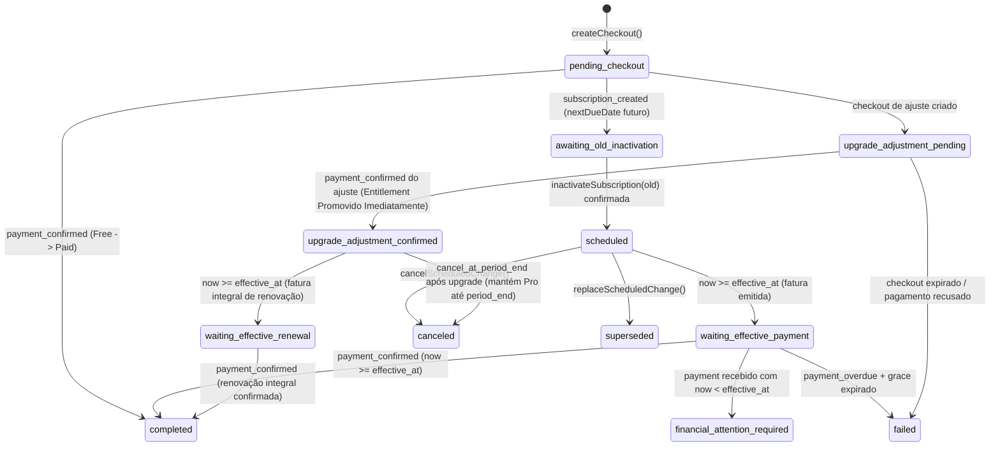

# LouvAIO — Design Técnico: Billing Transition Policy V1 (Revised)

- **Data de Criação**: 2026-09-01
- **Data de Revisão**: 2026-09-01 (Revisão: *Immediate Upgrade com Pró-rata e Especificação Progressiva da Phase 0B*)
- **Status**: Documento de Design Técnico Hardened (Phase 0A Validada / Phase 0B Progressive Provider Spike em Design)
- **Referência**: [`docs/decisions/2026-09-01-billing-transition-policy-v1.md`](../decisions/2026-09-01-billing-transition-policy-v1.md)

---

## A. Inventário do Modelo Atual

| Entidade | Arquivo / Coleção | Campos Relevantes Atuais | Avaliação para a Política V1 Revisada |
| :--- | :--- | :--- | :--- |
| **`BillingPlanChangeRecord`** | [`billing.types.ts`](../../backend/src/features/billing/billing.types.ts) / `billing_plan_changes` | `id`, `ministry_id`, `provider`, `checkout_intent_id`, `provider_checkout_id`, `requested_plan_id`, `requested_interval`, `requested_addon_blocks`, `expected_amount_cents`, `currency`, `checkout_url`, `previous_provider_subscription_id`, `previous_plan_id`, `previous_interval`, `new_provider_subscription_id`, `provider_customer_id`, `status`, `supersede_status`, `payment_cleanup_status`, `renewal_cutoff_date`, `created_at`, `expires_at`, `confirmed_at`, `completed_at`, `updated_at`. | **Reutilizar e Estender**: Adicionar `transition_mode` (`immediate_upgrade` vs `scheduled`), `effective_at`, `effective_billing_date`, `from_plan_id`, `from_interval`, `from_addon_blocks`, `current_cycle_source_price_cents`, `current_cycle_target_price_cents`, `prorated_adjustment_cents`, `target_recurring_price_cents`, `adjustment_provider_payment_id`, `superseded_by`, `price_locked_at`. |
| **`BillingSubscriptionRecord`** | [`billing.types.ts`](../../backend/src/features/billing/billing.types.ts) / `billing_subscriptions` | `id`, `ministry_id`, `provider`, `provider_subscription_id`, `provider_customer_id`, `plan_id`, `interval`, `member_addon_blocks`, `amount_cents`, `status`, `current_period_start`, `current_period_end`, `cancel_at_period_end`. | **Reutilizar Integralmente**: Representa a assinatura do ciclo financeiro atual no Asaas. Não requer novos campos estruturais. |
| **`BillingCustomerRecord`** | [`billing.types.ts`](../../backend/src/features/billing/billing.types.ts) / `billing_customers` | `id`, `ministry_id`, `provider`, `provider_customer_id`, `status` (`ready`, `creating`), `lease_locked_until`, `lease_locked_by`. | **Reutilizar Integralmente**: GAP-011 consolidou lock atômico e reuso canônico. Permanece intacto. |
| **`BillingTransactionRecord`** | [`billing.types.ts`](../../backend/src/features/billing/billing.types.ts) / `billing_transactions` | `id`, `ministry_id`, `provider`, `provider_payment_id`, `provider_subscription_id`, `amount_cents`, `currency`, `status`, `due_date`, `paid_at`, `payment_method`, `invoice_url`. | **Reutilizar Integralmente**: Armazena o histórico auditável de faturas e pagamentos de ajuste quitados. |
| **`MinistrySubscriptionRecord`** | [`subscription.types.ts`](../../backend/src/features/subscriptions/subscription.types.ts) / `subscriptions` | `id`, `ministry_id`, `plan_id`, `member_addon_blocks`, `billing_status`, `billing_interval`, `subscription_mode`, `grace_period_expires_at`, `current_period_start`, `current_period_end`, `cancel_at_period_end`. | **Reutilizar Integralmente**: Autoridade dos *entitlements* de produto. Controla limites de quotas ativos e modo de acesso (`accessMode`). |

---

## B. Modelo Persistido Proposto para `BillingPlanChangeRecord`

```typescript
export type BillingTransitionMode = 'immediate_upgrade' | 'scheduled';

export type BillingPlanChangeStatus =
  // Ciclo Comum de Checkout
  | 'pending_checkout'                  // Sessão de checkout aberta aguardando liquidação
  // Caminho 1: Scheduled Change (Downgrades, Trocas de Ciclo, Redução de Addons)
  | 'awaiting_old_inactivation'         // Assinatura futura criada no gateway; aguardando inativação da antiga
  | 'scheduled'                         // Assinatura futura criada e antiga comprovadamente INACTIVE
  | 'waiting_effective_payment'         // Data effective_at atingida; fatura futura emitida aguardando liquidação
  // Caminho 2: Immediate Entitlement Upgrade (Upgrades de Plano, Aumento de Addons)
  | 'upgrade_adjustment_pending'        // Ajuste proporcional gerado, aguardando liquidação imediata
  | 'upgrade_adjustment_confirmed'      // Ajuste pago; entitlement promovido imediatamente; aguardando virada em effective_at
  | 'waiting_effective_renewal'         // effective_at atingido; fatura de renovação integral emitida no Asaas
  // Estados Finais e Exceções
  | 'completed'                         // Transição finalizada integralmente e com sucesso
  | 'canceled'                          // Transição cancelada antes da efetivação
  | 'superseded'                        // Transição substituída por outra mais recente
  | 'failed'                            // Falha técnica irrecuperável
  | 'financial_attention_required';     // Inconsistência, pagamento antecipado inesperado ou conflito

export interface BillingPlanChangeRecord {
  id: string; // checkout_intent_id determinístico
  ministry_id: string;
  provider: BillingProviderName;
  checkout_intent_id: string;
  provider_checkout_id?: string | null;
  provider_customer_id?: string | null;

  // Modo e Classificação da Transição
  transition_mode: BillingTransitionMode;
  transition_category: 'free_to_paid' | 'plan_upgrade' | 'plan_downgrade' | 'interval_change' | 'addon_increase' | 'addon_decrease' | 'hybrid';

  // Snapshot de Origem
  from_plan_id: PlanId | null;
  from_interval: BillingInterval | null;
  from_addon_blocks: number;
  previous_provider_subscription_id?: string | null;

  // Alvo Solicitado
  requested_plan_id: PlanId;
  requested_interval: BillingInterval;
  requested_addon_blocks: number;
  new_provider_subscription_id?: string | null;
  adjustment_provider_payment_id?: string | null;

  // Price Lock & Decomposição Financeira na Solicitação
  current_cycle_source_price_cents: number;  // Preço total contratado na origem (base + addons atuais)
  current_cycle_target_price_cents: number;  // Preço total contratado no destino (base + novos addons) no ciclo vigente
  prorated_adjustment_cents: number;         // Valor cobrado imediatamente no upgrade (0 se scheduled)
  target_recurring_price_cents: number;      // Preço integral da renovação futura
  currency: 'BRL';
  price_locked_at: string;

  // Temporalidade & Timezone
  requested_at: string;
  effective_at: string | null;            // ISO 8601 instant para gating temporal no backend
  effective_billing_date: string | null;  // YYYY-MM-DD em BILLING_TIMEZONE para nextDueDate no Asaas

  // URLs & Checkout
  checkout_url?: string | null;
  expires_at: string | null;

  // Estado & Auditoria
  status: BillingPlanChangeStatus;
  superseded_by?: string | null;
  canceled_at?: string | null;
  completed_at?: string | null;
  failure_reason?: string | null;

  // Flags Operacionais & Concorrência
  financial_attention_required?: boolean;
  financial_attention_reason?: string | null;
  retry_count?: number;
  last_retry_at?: string | null;
  next_retry_at?: string | null;
  retry_locked_until?: string | null;
  retry_locked_by?: string | null;

  created_at: string;
  updated_at: string;
}
```

---

## C. Máquina de Estados e Deterministic Active Transition Slot

### C.1 Conjunto Explícito de `ACTIVE_TRANSITION_STATES` e Deterministic Slot
Uma Ministry **nunca** pode possuir mais de uma transição simultânea financeiramente viva.

```typescript
export const ACTIVE_TRANSITION_STATES: BillingPlanChangeStatus[] = [
  'pending_checkout',
  'awaiting_old_inactivation',
  'scheduled',
  'waiting_effective_payment',
  'upgrade_adjustment_pending',
  'upgrade_adjustment_confirmed',
  'waiting_effective_renewal',
];
```

> [!IMPORTANT]
> **Deterministic Active Transition Slot (`billing_active_transition_slots/${ministry_id}_${provider}`)**:
> Toda criação, alteração ou cancelamento adquire lock transacional no documento determinístico de slot no Firestore. O slot só é liberado quando a transição atinge um estado terminal seguro (`completed`, `canceled`, `superseded`).

### C.2 Diagrama da Máquina de Estados (Dual Path)



---

## D. Análise de Estratégias de Operação Segura para Upgrade Imediato

| Dimensão | Estratégia A (Prepara Futura $\to$ Cobra Ajuste) | Estratégia B (Cobra Ajuste $\to$ Prepara Futura) | Estratégia C (Sessão Única Híbrida) |
| :--- | :--- | :--- | :--- |
| **Sequência de Ações** | 1. Cria assinatura futura (`nextDueDate = period_end`).<br>2. Inativa assinatura antiga.<br>3. Cobra ajuste avulso imediato.<br>4. Após pago, promove entitlement. | 1. Cobra ajuste avulso imediato.<br>2. Após pago, **promove entitlement imediatamente**.<br>3. Cria assinatura futura (`nextDueDate = period_end`).<br>4. Inativa assinatura antiga. | 1. Hosted Checkout único com 1ª parcela = ajuste e demais = valor integral. |
| **Risco de Cobrança Antecipada Indevida** | Baixo. | **Mínimo**: Apenas o ajuste é cobrado inicialmente. | Mínimo (se suportado nativamente). |
| **Risco de Configuração da Renovação Futura** | Mínimo (já foi criada no início). | **Presente e Recuperável**: Se o passo 3 falhar após o cliente pagar o ajuste, o cliente tem direito garantido ao plano até `period_end`. O sistema marca `financial_attention_required` e o worker realiza retries em background, **sem jamais fazer rollback do entitlement pago**. | Nulo. |
| **Risco de Checkout Abandonado** | Alto: Exige cleanup de assinatura futura caso o cliente feche a aba sem pagar o ajuste. | **Nulo**: Se o cliente não pagar o ajuste, nada de futuro foi criado. | Nulo. |
| **Interações do Usuário** | 2 checkouts/sessões (se não houver tokenização). | 2 checkouts/sessões (ou 1 se houver tokenização). | 1 checkout único. |
| **Avaliação Arquitetural** | Viável, mas com alto custo de cleanup para checkouts não convertidos. | **RECOMENDADA COMO PADRÃO DE DOMÍNIO**. | **NOT DOCUMENTED / SANDBOX EXPERIMENTAL ONLY**. |

---

## E. Modelo de Classificação e Entitlements Efetivos

### E.1 Classificação por Capabilities Efetivas
- A classificação compara **quotas efetivas** (`effectiveMembers`, `effectiveSongs`) e não valores contratuais brutos ou contagem isolada de `addonBlocks`.
- No catálogo atual ([`plans.config.ts`](../../backend/src/config/plans.config.ts)), os planos são **monotônicos** em quotas e limites.
- *Exemplo*: `essential + 3 addons` (70 membros, 200 músicas) $\to$ `pro + 0 addons` (100 membros, 500 músicas) é um **UPGRADE integral de entitlement**.

### E.2 Entitlement Efetivo vs. Contrato Futuro
- `effective_entitlement_after_upgrade`: A capacidade efetiva imediatamente liberada para o usuário após a liquidação do ajuste.
- `contract_target_at_next_renewal`: A configuração contratual (`planId`, `addonBlocks`, `billingInterval`) que será faturada na renovação em `current_period_end`.

---

## F. Matriz de Capacidades do Provedor Asaas

| Capacidade no Gateway Asaas | Status de Classificação | Detalhes & Restrições Técnicas |
| :--- | :--- | :--- |
| **Hosted Checkout Recorrente com `subscription.nextDueDate` Futuro** | **ALREADY SANDBOX VALIDATED (Phase 0A)** | Suportado via `chargeTypes: ['RECURRENT']` e `subscription: { cycle, nextDueDate }`. Gera fatura `PENDING` futura sem captura antecipada. |
| **Hosted Checkout Avulso Imediato** | **DOCUMENTED** | Suportado via `POST /v3/checkouts` com `chargeTypes: ['DETACHED']` para cobrança de valor avulso pontual (ajuste pró-rata). |
| **Hosted Checkout $\to$ Token de Cartão Reutilizável** | **SANDBOX VALIDATION REQUIRED / NOT DOCUMENTED (Phase 0B)** | Não está documentado se a liquidação de um checkout `DETACHED` expõe ou disponibiliza um `creditCardToken` reutilizável para o backend criar a assinatura futura server-to-server. |
| **Cobrança/Assinatura via API com `creditCardToken`** | **DOCUMENTED** | A API `/v3/subscriptions` aceita `creditCardToken` quando este já estiver associado ao customer. |
| **Hosted Checkout Híbrido (`['DETACHED', 'RECURRENT']` combinados)** | **NOT DOCUMENTED / SANDBOX EXPERIMENTAL ONLY** | A documentação trata `DETACHED` e `RECURRENT` como fluxos separados. Não assumir combinação sem validação experimental prévia. |
| **Fronteira PCI-Safe** | **DOCUMENTED** | O LouvAIO nunca manipula dados sensíveis (número, CVV). Apenas tokens provider-safe gerados pelo gateway podem ser usados server-to-server. |

---

## G. Lições da Phase 0A/3B.1 & Autoridades de Descoberta do Provedor (Provider Contract Alignment)

1. **Comportamento Observado e Contrato Público Oficial do Asaas**:
   - `POST /v3/checkouts` cria a sessão de checkout hospedado e retorna `{ id, link }`.
   - O Asaas **NÃO** propaga `checkout.externalReference` para `subscription.externalReference`.
   - O Asaas **NÃO** documenta endpoints de consulta direta de checkouts (`GET /v3/checkouts/{id}` ou `GET /v3/checkouts?externalReference=...`).
   - O endpoint oficial documentado para consultar obrigações vinculadas ao checkout é:
     `GET /v3/payments?checkoutSession=<providerCheckoutId>`.
2. **Autoridades de Recuperação (*Recovery Authorities*)**:
   - **1ª Autoridade**: `provider_checkout_id` persistido *write-once* a partir do retorno de sucesso do `POST /v3/checkouts`.
   - **2ª Autoridade**: Evidência em webhook real (`CHECKOUT_CREATED`, `CHECKOUT_PAID`) contendo `checkout.id` e `checkout.externalReference` comprovando a intenção interna.
   - **3ª Autoridade**: Cobranças obtidas via filtro documentado `GET /v3/payments?checkoutSession=<checkoutId>`.
   - **4ª Autoridade**: Assinatura target descoberta a partir de `payment.subscription`.
3. **Tratamento de Criação Incerta Sem Checkout ID**:
   - Se a criação sofrer timeout/falha de rede e não retornar checkout ID:
     - O sistema registra a tentativa como incerta e ativa `financial_attention_required = true` com slot HELD;
     - Nenhum endpoint inventado/não-documentado é consultado;
     - Proibido *blind retry* automático (evitando múltiplas assinaturas concorrentes);
     - Proibida inferência de ausência de recurso apenas por decurso de tempo.
4. **Desacoplamento de `nextDueDate`**:
   - A autoridade do primeiro vencimento civil é `payment.dueDate == effective_billing_date`.
   - O avanço do campo `subscription.nextDueDate` pelo gateway para o ciclo subsequente (mensal ou anual) é legítimo e expressamente aceito no Target Ready Gate.

---

## H. Especificação Progressiva da Phase 0B (Immediate Upgrade Proration Spike)

A Phase 0B é estruturada em estágios progressivos para descobrir empiricamente o fluxo ideal:

### H.1 STAGE 0B.1 — Hosted Checkout DETACHED Adjustment Test
1. **Objetivo**: Criar e liquidar uma cobrança avulsa de ajuste via Hosted Checkout (`chargeTypes: ['DETACHED']`) com valor de teste (ex: R$ 27,50).
2. **Auditoria Pós-Liquidação**:
   - Confirmar liquidação exata do ajuste (`status: 'CONFIRMED'`);
   - Observar webhooks recebidos (`PAYMENT_CONFIRMED`);
   - Inspecionar na API do Asaas se algum `creditCardToken` ou método de pagamento seguro ficou vinculado ao customer para reuso.

### H.2 STAGE 0B.2A — Token Reuse Path (Se Token Disponível)
- Se o Stage 0B.1 fornecer um `creditCardToken` reutilizável:
  - Invocar `POST /v3/subscriptions` via API com `creditCardToken` e `nextDueDate = effective_billing_date` (D+7) no valor de R$ 89,90.
  - Após validar prontidão da futura $\to$ inativar assinatura antiga no gateway.
  - **Resultado de UX**: **1 Interação de Checkout**.

### H.3 PHASE 0B.2B — TWO-CHECKOUT FALLBACK REASSESSMENT (RECURRENCE-FIRST ARCHITECTURE)

Diante da constatação empírica da Phase 0B.1 de que o fluxo Hosted Checkout avulso (`DETACHED`) não disponibiliza token de cartão reutilizável para chamadas server-to-server sem manipular dados PCI sensíveis, a jornada de upgrade imediato exige duas interações caso mantida com ativação antecipada.

#### 1. Reavaliação Semântica das Estratégias (A vs B)

Ao reavaliar os fluxos sob a ótica de intenção do usuário e segurança financeira:

| Dimensão de Comparação | STRATEGY A — ADJUSTMENT FIRST | STRATEGY B — RECURRENCE FIRST (Recomendada) |
| :--- | :--- | :--- |
| **Passo 1 (Checkout 1)** | Hosted `DETACHED` (Ajuste proporcional imediato). | Hosted `RECURRENT` (Recorrência futura Pro com `nextDueDate = current_period_end`). |
| **Significado do Passo 1** | Compra acesso temporário antecipado. | **Autoriza legitimamente o Scheduled Upgrade para a próxima renovação**. |
| **Passo 2 (Checkout 2)** | Hosted `RECURRENT` (Autorização da renovação futura Pro). | Hosted `DETACHED` (**Opcional: Compra de Acesso Antecipado** ao Pro pelo restante do ciclo). |
| **Comportamento em Abandono do Checkout 2** | **Risco de Reversão Inesperada (UX Reversion Risk)**:<br>O usuário pagou pelo Pro temporário, mas não autorizou a renovação. Em `current_period_end`, o sistema reverte para o plano antigo (Essential), gerando surpresa comercial. | **Scheduled Upgrade Legítimo (Zero Risco Financeiro)**:<br>O usuário mantém o plano atual (Essential) até `current_period_end`. Na virada de ciclo, o Pro inicia normalmente conforme a renovação já autorizada no Passo 1. |
| **Assinatura Órfã no Gateway** | Nenhuma. | **Nenhuma**: A assinatura Pro futura **não é órfã**, mas sim o contrato oficial de renovação programada validado no Target Ready Gate. |
| **Risco de Cobrança Indevida** | Nulo. | **Nulo**: O Pro só renova em `current_period_end` conforme autorizado conscientemente no Checkout 1. |

#### 2. Fluxo Detalhado da Estratégia Recurrence-First (Strategy B)

```
[ STEP 1: AUTORIZAÇÃO DA RENOVAÇÃO FUTURA ]
1. Usuário seleciona Upgrade para Pro no frontend.
2. Hosted Checkout 1 (RECURRENT): Pro com nextDueDate = current_period_end.
3. Usuário conclui Checkout 1 no Asaas Sandbox.
4. Target Ready Gate: Valida nova assinatura Pro, customer, valor travado e dueDate do 1º vencimento.
5. Old Subscription Cutover:
   - Assinatura antiga colocada em INACTIVE no Asaas;
   - Consulta cobranças da assinatura antiga e remove SOMENTE cobranças PENDING com dueDate >= current_period_end;
   - Cobranças CONFIRMED/RECEIVED/OVERDUE nunca são removidas.
6. Estado no LouvAIO: scheduled_upgrade_ready (Essential ativo até period_end; Pro agendado para a virada).

[ STEP 2: ANTECIPAÇÃO OPCIONAL DE ENTITLEMENT (EARLY ACTIVATION) ]
7. UI exibe confirmação e oferta:
   "Seu plano Pro está programado para DD/MM. Deseja começar a usar o Pro hoje mesmo?
    Ajuste proporcional até DD/MM: R$ XX,XX"
8. Se Usuário aceitar:
   - Hosted Checkout 2 (DETACHED): Valor do ajuste proporcional travado.
   - PAYMENT_CONFIRMED recebido: Transição passa para upgrade_adjustment_confirmed.
   - Entitlement do Pro ativado imediatamente no SubscriptionService mantendo current_period_end.
9. Se Usuário ignorar/fechar a janela:
   - Essential permanece ativo até current_period_end.
   - Pro entra em vigor automaticamente na renovação em current_period_end.
```

#### 3. Cutover Seguro da Assinatura Antiga (*Old Renewal Cutover & Scheduling — Phase 3B.2 Hardened*)
Para garantir as invariantes **No Two Live Renewals**, **No Unsafe Zero Renewals** e **No Dual Financial Obligations**:
1. **Fronteira Comercial Estrita**: Exige-se estrita correspondência `effective_billing_date === current_period_end_billing_date`. Qualquer divergência ou ausência falha fechado (*fail closed*) com `COMMERCIAL_BOUNDARY_MISMATCH` antes de qualquer mutação de provedor.
2. **Revalidação Prévia**: O cutover da assinatura antiga só inicia após a assinatura futura atender plenamente ao **Target Ready Gate** com leituras frescas no provedor.
3. **Preservação != Segurança Financeira (Preserve != Safe)**: Faturas pré-existentes na source com `dueDate >= renewalCutoffDate` com status `CONFIRMED`, `RECEIVED` ou `OVERDUE` são estritamente preservadas para auditoria, mas **bloqueiam o avanço automático para `scheduled`** (`SOURCE_PAYMENT_ALREADY_SETTLED` ou `SOURCE_PAYMENT_OVERDUE`), mantendo o slot retido (*held*).
4. **Persistência da Intenção de Cutover**: O estado avança para `awaiting_old_inactivation` antes de qualquer mutação destrutiva no gateway.
5. **Inativação sem Deleção**: A assinatura antiga é marcada exclusivamente como `INACTIVE` na API do Asaas (`PUT /v3/subscriptions/{id}` com `status: "INACTIVE"` e sem `updatePendingPayments`). `DELETE /v3/subscriptions/{id}` é terminantemente proibido.
6. **Limpeza Cirúrgica de Pagamentos Futuros PENDING**: O LouvAIO lista os pagamentos vinculados estritamente à assinatura antiga e executa `DELETE /v3/payments/{id}` **exclusivamente nas cobranças com `status == 'PENDING'` e `dueDate >= renewalCutoffDate`**.
7. **Fresh Read Antes de Cada Exclusão**: Antes de excluir qualquer cobrança, o sistema faz leitura individual pelo ID. Cobranças com status `CONFIRMED` ou `RECEIVED` abortam a exclusão e acionam `SOURCE_PAYMENT_SETTLED_DURING_CUTOVER`.
8. **Tratamento de Deleção Incerta (Uncertain Delete)**: Em caso de falha de rede/timeout no DELETE, o sistema realiza recheck via `getPayment(paymentId)`. **Somente 404 / ausência explícita comprova exclusão**. Status `PENDING` falha fechado com `SOURCE_PAYMENT_DELETE_UNCERTAIN`; status liquidado aciona `SOURCE_PAYMENT_SETTLED_DURING_CUTOVER`; `non-PENDING` nunca é presumido genericamente como sucesso de remoção.
9. **Final Source Safety Gate (All-Status)**: Antes de persistir `scheduled`, o sistema realiza consulta completa de todas as cobranças da assinatura de origem via `GET /v3/subscriptions/{id}/payments` (sem filtro de status, com paginação) provando que zero obrigações conflitantes ativas persistem para `dueDate >= renewalCutoffDate`.
10. **Transição para `scheduled`**: A transição avança para `scheduled` com o **Active Transition Slot estritamente HELD**.
11. **Retenção de Entitlement**: Em `scheduled`, o runtime entitlement LouvAIO permanece inalterado no plano e quotas de origem até `current_period_end_billing_date`. Nenhuma ativação antecipada de entitlement ocorre nesta fase.

#### 4. Tratamento de Cancelamento e Reversão

- **Cancelamento antes do Checkout 2 (Ajuste não pago)**:
  - Usuário decide reverter o scheduled upgrade antes da virada de ciclo.
  - A assinatura Pro futura é inativada no Asaas (`INACTIVE`) e sua cobrança `PENDING` removida.
  - A assinatura antiga é reativada com `nextDueDate = current_period_end`.
  - Transição marcada como `canceled`.
- **Cancelamento após Checkout 2 (Ajuste pago)**:
  - O entitlement Pro vigora soberanamente até `current_period_end` (sem estorno do ajuste quitado).
  - A assinatura futura Pro é inativada no Asaas (`INACTIVE`).
  - Após `current_period_end`, a conta transita para Free / modo restrito conforme regras de cancelamento.

#### 5. Regras de Carência (*Grace Period*) Diferenciadas

- **Com Ajuste Pago**: O entitlement Pro já estava ativo antes de `current_period_end`. Se a cobrança de renovação em `current_period_end` atrasar/falhar, o Grace Period (7 dias) mantém temporariamente o plano **Pro**.
- **Sem Ajuste Pago (Apenas Scheduled Upgrade)**: O entitlement Essential estava ativo antes de `current_period_end`. Na virada, o Pro só é liberado mediante confirmação financeira da renovação. Se a renovação falhar, o Grace Period mantém o plano **Essential**.

#### 6. Proteção contra Corridas na Virada (*Period-End Race Guard*)
- A arquitetura não presume prazos arbitrários de geração de fatura. A validação consulta diretamente o estado real dos pagamentos no gateway.
- Se a solicitação de upgrade ocorrer quando `effective_billing_date <= commercial_today`, a transição de ciclo proporcional fecha-se como fail-closed e é tratada diretamente como fluxo de renovação regular.

#### 7. Máquina de Estados Refinada

```
[ pending_future_authorization ] (Checkout 1 aberto)
              │
              ▼ (Checkout 1 concluído no gateway)
[ future_target_prepared ]
              │ (Target Ready Gate validado)
              ▼
[ awaiting_old_inactivation ]
              │ (Assinatura antiga INACTIVE + PENDING antigo limpo)
              ▼
[ scheduled_upgrade_ready ] ◄────────────────────────────────────────┐
              │                                                      │ (Checkout 2 ignorado)
              ├──► [ pending_optional_adjustment ] (Checkout 2 aberto)│
              │                 │ (Checkout 2 pago)                  │
              │                 ▼                                    │
              │    [ upgrade_adjustment_confirmed ]                  │
              │    (Pro ativo agora até period_end)                  │
              │                 │                                    │
              ▼                 ▼                                    │
       [ scheduled_ready ] (Aguardando virada em current_period_end) ┘
              │ (now >= current_period_end + renovação liquidada)
              ▼
         [ completed ]
```

#### 8. Conclusão da Descoberta de Provedor (Spikes Finalizados)
- **Phase 0A**: Validou criação de assinatura futura via Hosted Checkout com `nextDueDate` posterior sem cobrança imediata (`PASS`).
- **Phase 0B.1**: Validou cobrança imediata de ajuste avulso via Hosted Checkout `DETACHED` com correlação inequívoca (`PASS`).
- **Sandbox Cleanup & Cutover**: Validou inativação de assinatura e remoção cirúrgica de pagamentos `PENDING` futuros (`PASS`).
- **Resultado**: Todas as capacidades do gateway Asaas necessárias para o LouvAIO estão empiricamente comprovadas. **Não há necessidade de novos spikes exploratórios de provedor**. O projeto está pronto para o design persistido e implementação da Phase 1.

---

## I. Critérios de Avaliação da Phase 0B (PASS / FAIL Multidimensional)

| Dimensão Avaliada | Resultado Esperado (PASS) | Condição de Reprovação (FAIL) |
| :--- | :--- | :--- |
| **Capacidade Financeira do Provedor** | Ajuste cobrado agora + Recorrência futura agendada para D+7 sem captura antecipada integral. | Cobrança integral antecipada de R$ 89,90 no momento do upgrade. |
| **Experiência de Checkout (1 vs 2)** | Classificada como `ONE_CHECKOUT_SUPPORTED` ou `TWO_CHECKOUT_FALLBACK_REQUIRED`. | Fluxo bloqueado ou sem suporte a agendamento futuro. |
| **Reuso de Token de Cartão** | Classificado como `TOKEN_REUSE_AVAILABLE` ou `TOKEN_NOT_EXPOSED_BY_HOSTED_CHECKOUT`. | N/A (resultado empírico do spike). |
| **Isolamento de Entitlements** | Nenhum plano de ministério real alterado no LouvAIO. | Quotas reais mutadas. |
| **Cleanup Financeiro** | Assinatura futura inativada (`INACTIVE`) e cobranças futuras pendentes removidas. | Assinatura permanece ativa gerando faturas no Sandbox. |

---

## J. Política para Ajustes Abaixo do Limite do Provedor

- **Restrição do Provedor**: O Asaas impõe valor mínimo transacionável por cobrança (`PROVIDER CONSTRAINT TO VALIDATE IN SANDBOX`).
- **Diretriz de Domínio**:
  - Se $\text{Ajuste} == 0$: Upgrade gratuito imediato para os dias restantes; renovação integral agendada para `current_period_end`.
  - Se $0 < \text{Ajuste} < \text{Mínimo Gateway}$: A Phase 0B validará empiricamente o limite mínimo de transação do Sandbox e orientará a política de piso ou agendamento direto.

---

## K. Roadmap Revisado de Execução

```
[ Phase 0A: Future Hosted Checkout Spike (PASS — Sandbox Validated) ]
                               │
                               ▼
[ Phase 0B.1: Hosted Detached Adjustment Spike (TOOLING READY — CHECK PASSED) ]
                               │
               ┌───────────────┴───────────────┐
               ▼                               ▼
 [ TOKEN_REUSE_AVAILABLE ]           [ TOKEN_NOT_EXPOSED ]
               │                               │
               ▼                               ▼
 [ Phase 0B.2A: Token Reuse ]        [ Phase 0B.2B: Two-Checkout Fallback ]
                               │
                               ▼
[ Phase 1: Tipos, Repositório e Deterministic Active Transition Slot ]
                               │
                               ▼
[ Phase 2: Serviço de Pró-rata e Agendamento ]
                               │
                               ▼
[ Phase 3: Webhooks Dual-Path (Ajuste Imediato vs Gate Temporal) ]
                               │
                               ▼
[ Phase 4: Cancelamento, Substituição e Carência ]
                               │
                               ▼
```

---

## L. Consolidação de Fronteiras do Modelo de Domínio V1 (Phase 1.2)

1. **`TRANSITION != LIVE ENTITLEMENT AUTHORITY`**:
   - `SubscriptionService` / `subscriptions` permanece como a única autoridade do direito de uso operacional (`plan_id`, `member_addon_blocks`, quotas, `accessMode`).
   - A transição persiste `source_entitlement_snapshot` e `early_activation_target_entitlement_snapshot` como snapshots imutáveis de intenção e auditoria, sem tentar espelhar o runtime.

2. **`SCHEDULED CONTRACT PRICE LOCK != EARLY ACTIVATION QUOTE LOCK`**:
   - O preço recorrente da renovação (`target_future_recurring_price_cents`) é travado imutavelmente em `price_locked_at` (`requested_at`).
   - Cotações de antecipação (`BillingEarlyActivationQuote`) possuem precificação dinâmica no momento da emissão (`priced_at`, `quote_effective_billing_date`, `expires_at`), permitindo orçamentos tardios com histórico de auditoria preservado em `early_activation_quotes_history`.

3. **`CHECKOUT IDENTITY != CHECKOUT ATTEMPT`**:
   - Referências de provedor permanentes (`provider_customer_id`, `old_provider_subscription_id`, `previous_provider_subscription_id`, confirmed payments/subscriptions) são estritamente `write-once` / idempotentes.
   - Sessões de checkout podem expirar e ser rotacionadas atômica e auditavelmente através de `recordNewCheckoutAttempt`, preservando `checkout_attempts`.

4. **`LIMITAÇÃO OPERACIONAL ATUAL`**:
   - `Firestore Emulator concurrency validation: pending` (testes atuais utilizam mocks transacionais em memória).

---

## M. Domínio de Classificação, Estratégia de Execução e Pró-rata (Phase 2 & 2.1)

1. **Separação Canônica: Entitlement Capabilities vs Configurações Comerciais**:
   - `Entitlement Capabilities`: Quotas operacionais de produto (`members`, `songs`, flags funcionais de uso). Participam estritamente da comparação de capacidade (`TARGET_STRICTLY_GREATER`, `TARGET_STRICTLY_LOWER`, `EQUAL`, `MIXED`).
   - `Commercial Configuration`: Metadados de compra e extensibilidade (`allowMemberAddons`, `maxMemberAddonBlocks`, precificação). **Excluídos** da comparação de entitlement (ex: `Pro -> Premium` é estritamente `upgrade`, sem ser distorcido por flags de add-on).

2. **Separação Canônica: Entitlement Classification vs Financial Execution Strategy**:
   - `immediate_initial_purchase` (Free -> Paid): Compra inicial imediata de ciclo integral. Pró-rata e early activation **não aplicáveis**. Não requer períodos correntes pagos prévios.
   - `scheduled_paid_transition` (Paid -> Paid): Transição agendada de renovação futura com preservação do ciclo pago vigente (`RECURRENCE_FIRST`). Early activation elegível exclusivamente sob aumento estrito de capacidades (`TARGET_STRICTLY_GREATER`).
   - `scheduled_cancel_to_free` (Paid -> Free): Não renovação agendada ao término do ciclo (`current_period_end`). Não gera assinatura target no gateway nem pró-rata.

3. **Elegibilidade de Early Activation & Fail-Closed para Entitlement Misto**:
   - Permitido apenas em `scheduled_paid_transition` com aumento estrito de capacidades.
   - Bloqueado para `immediate_initial_purchase`, `scheduled_cancel_to_free`, `downgrade`, `interval_change` e casos com capacidades mistas (`MIXED`).

4. **Semântica de Price Lock**:
   - `source_current_cycle_total_cents`: Preço integral contratado na origem (base + add-ons no ciclo vigente).
   - `target_future_recurring_price_cents`: Preço da renovação futura no ciclo de destino.
   - `target_current_cycle_total_cents`: Preço das capacidades de destino calculadas no ciclo da origem (base justa de pró-rata).
   - Todos travados imutavelmente em `requested_at`.

5. **Convenção de Dias Comerciais e Aritmética Inteira Segura (BigInt)**:
   - Fuso horário canônico: `BILLING_TIMEZONE` (`America/Sao_Paulo`).
   - Intervalo semi-aberto $[start, end)$ imune a DST e diferenças de fuso horário civil.
   - Fórmula: $\text{adjustment} = \text{roundHalfUp}(\text{deltaCents} \times \text{remainingDays} / \text{totalDays})$.
   - Implementação via `BigInt` com validação de `Number.isSafeInteger` e proteção contra overflow / divisão por zero.

6. **Ciclo de Vida da Cotação (Quote Expiry & Replacement)**:
   - A validade da cotação não ultrapassa a meia-noite do dia comercial de cálculo em `BILLING_TIMEZONE`.
   - Cotações expiradas não são modificadas; novas cotações recalculam apenas a fração temporal restante, preservando a base de preço contratada e o histórico auditável em `early_activation_quotes_history`.

---

## N. Alinhamento de Contrato Domínio / Persistência (Phase 2.2)

1. **Persistência Imutável da Estratégia de Execução**:
   - `execution_strategy` (`immediate_initial_purchase` | `scheduled_paid_transition` | `scheduled_cancel_to_free`) é gravada no momento da criação do registro V1 e incluída em `IMMUTABLE_TRANSITION_FIELDS`.

2. **Invariantes de Formato Específicas por Estratégia**:
   - `immediate_initial_purchase`: `source_plan_id === 'free'`, `current_period_start` e `current_period_end` são `null` (sem fabricação de ciclos pagos artificiais para Free). `early_activation_status === 'not_applicable'`.
   - `scheduled_paid_transition`: Exige `current_period_start`, `current_period_end` e `effective_billing_date` preenchidos.
   - `scheduled_cancel_to_free`: `target_plan_id === 'free'`, `target_future_recurring_price_cents === 0`, sem exigência de assinatura target de provedor.

3. **Matriz Status × Estratégia**:
   - `immediate_initial_purchase` transita exclusivamente em: `pending_initial_purchase`, `completed`, `canceled`, `superseded`, `failed`, `financial_attention_required`.
   - `scheduled_paid_transition` transita nos estados de autorização futura e agendamento.
   - `scheduled_cancel_to_free` inicia em `awaiting_old_inactivation` e avança para `scheduled` / `completed`.
   - Combinações impossíveis são rejeitadas em runtime via `validateBillingTransitionV1`.

4. **Separação Temporal: Data do Request vs Data Efetiva de Ativação**:
   - `requested_commercial_date`: Data comercial travada no instante da solicitação para auditoria de preço.
   - `effective_billing_date`: Para compras imediatas, a vigência real é atribuída no momento da confirmação financeira pelo webhook (Phase 3), sem retroagir entitlement para o dia da criação do checkout.

5. **Mapeador Puro Domínio -> Persistência**:
   - A função `buildBillingTransitionV1Record` centraliza a transformação determinística do snapshot comercial em um `BillingTransitionV1Record` válido, blindando a camada de aplicação de divergências de contrato.

---

## O. Orquestração de Compra Inicial V1 (Phase 3A: Free -> Paid)

1. **Saga de Criação e Aquisição de Slot Determinístico**:
   - Quando `source` é `Free` e `target` é `Paid`, o fluxo é classificado como `execution_strategy = immediate_initial_purchase`.
   - O contrato de destino é validado no catálogo e o snapshot comercial de price lock é construído via `buildTransitionCommercialSnapshot`.
   - **Antes de qualquer chamada externa ao gateway (Asaas)**, a transição V1 é construída e gravada com a reivindicação do slot ativo exclusivo via `createTransitionAndClaimSlot`.
   - Se o slot estiver ocupado (`409 ACTIVE_TRANSITION_EXISTS`), a requisição é rejeitada sem gerar clientes, cobranças ou assinaturas no gateway.
   - Em seguida, o checkout hospedado é gerado com `externalReference = initial_checkout_intent_id`, e a tentativa é registrada em `checkout_attempts` via `recordNewCheckoutAttempt` com `attempt_type: 'initial_purchase'`.
   - Se a criação falhar com `DEFINITE_NO_RESOURCE_CREATED` (ex: 400 Bad Request), a transição é marcada como `failed` e `safe_terminal`, liberando o slot.
   - Se a criação falhar com `OUTCOME_UNCERTAIN` (ex: Timeout de rede, 500 Server Error): o slot permanece retido, a tentativa é registrada como `uncertain`, e a transição entra em `financial_attention_required = true` com reason `UNCERTAIN_CHECKOUT_CREATE_UNRESOLVED`.

2. **Timeout Expiry != Financial Safety Proof (Remoção de Retry por Tempo)**:
   - O simples decurso de tempo (passagem de `uncertain_until` / TTL do checkout) **NÃO comprova** ausência de recurso financeiro criado no provedor.
   - Após `uncertain_until`, o sistema **NÃO cria** novo checkout automaticamente via POST `/v3/checkouts`.
   - Qualquer nova requisição do usuário sobre uma transição com criação incerta não resolvida é rejeitada com `409 Conflict: UNCERTAIN_CHECKOUT_UNRESOLVED`, mantendo o slot retido.
   - Um novo checkout só é permitido mediante resolução inequívoca:
     - Recepção de evento terminal do checkout da tentativa (`CHECKOUT_EXPIRED` / `CHECKOUT_CANCELED`) sem qualquer recurso financeiro associado.
     - Resolução manual/operacional via painel ou reconciliador com auditoria confirmada.

3. **Eventos de Checkout Escopados por Tentativa (Attempt-Scoped Events)**:
   - Todo evento de checkout (`CHECKOUT_CREATED`, `CHECKOUT_PAID`, `CHECKOUT_EXPIRED`, `CHECKOUT_CANCELED`) é correlacionado à tentativa específica em `checkout_attempts`.
   - **Current Attempt Guard**:
     - Se `CHECKOUT_EXPIRED` ou `CHECKOUT_CANCELED` pertencer a uma tentativa anterior/antiga (`attempt_id !== current_initial_purchase_checkout_attempt_id`), apenas o registro histórico daquela tentativa é atualizado para `expired`/`canceled`. A transição global **NÃO** é marcada como `failed`/`canceled`, **NÃO** entra em `safe_terminal`, e o slot **NÃO** é liberado.
   - **Stale Paid Event Guard**:
     - Se `CHECKOUT_PAID` for recebido para uma tentativa antiga enquanto outra tentativa já existe como corrente, o evento **NUNCA** é ignorado silenciosamente: a transição é marcada como `financial_attention_required = true` com motivo `STALE_ATTEMPT_CHECKOUT_PAID`, e o slot permanece retido para auditoria humana sem reembolso automático cego.
   - **Terminal Checkout Event Safety Guard**:
     - Um evento `CHECKOUT_EXPIRED` ou `CHECKOUT_CANCELED` só transita o estado global para `failed`/`canceled` com `safe_terminal` e libera o slot se:
       1. Pertencer à tentativa atual (`isCurrentAttempt === true`).
       2. Não existir pagamento liquidado registrado na transição (`!initial_provider_payment_id`).
       3. Não existir assinatura viva no provedor vinculada à transição.
       4. Não houver atenção financeira pendente (`!financial_attention_required`).
       5. A transição estiver em `pending_initial_purchase`.
     - Caso contrário, aciona fail-closed (`TERMINAL_EVENT_WITH_SETTLED_PAYMENT_OR_SUBSCRIPTION`) retendo o slot.

4. **Fronteiras Comerciais de Período de Faturamento & Calendário Civil Exato**:
   - **Separação Conceitual**:
     - `effective_at`: Instante ISO operacional em que a ativação de cotas/entitlements ocorreu no LouvAIO.
     - `effective_billing_date`: Data comercial financeira (`YYYY-MM-DD` em `America/Sao_Paulo`) confirmada pelo provedor como momento da liquidação financeira.
     - `current_period_start_billing_date`: Data comercial de início do ciclo (idêntica a `effective_billing_date`).
     - `current_period_end_billing_date`: Data comercial de renovação/término do ciclo.
     - `current_period_start` / `current_period_end`: Timestamps ISO de compatibilidade legada derivados da data comercial financeira.
   - **Resiliência a Webhook Atrasado**:
     - Pagamento confirmado no provedor em `2026-09-01T23:55:00Z`, webhook processado em `2026-09-02T08:00:00Z` -> `effective_billing_date: '2026-09-01'`, `current_period_start_billing_date: '2026-09-01'`, `current_period_end_billing_date: '2026-10-01'` (mensal).
   - **Clamping de Fim de Mês e Anos Bissextos**:
     - `2026-01-31` mensal -> `2026-02-28`.
     - `2024-02-29` anual -> `2025-02-28`.

5. **Política de Validação Cruzada Exata de Renovação (Exact Next Due Date Cross-Check)**:
   - A renovação comercial esperada é calculada estritamente via `expectedCommercialRenewalDate = addCommercialInterval(effective_billing_date, target_interval)`.
   - Quando o gateway fornece `nextDueDate` (no payload do evento ou via fresh read `getSubscription`):
     - `candidateNextDueDate` **DEVE corresponder EXATAMENTE** a `expectedCommercialRenewalDate`.
     - Não se aceita apenas `candidateNextDueDate > effective_billing_date`.
     - Qualquer divergência (ex: 3 meses para plano mensal, ou mesma data de liquidação) aciona **fail-closed imediato** com reason `RENEWAL_DATE_MISMATCH`, marcação de `financial_attention_required = true`, retenção do slot ativo e **bloqueio de ativação de cotas**.

6. **Modelagem de Idempotência em Duas Camadas (Dual-Layer Idempotency)**:
   - **Camada 1: Webhook Event Idempotency**:
     - Autoridade: `provider_event_id` persistido na coleção `billing_webhook_events` com ID `${provider}_${provider_event_id}`.
     - Registro em etapa síncrona pré-processamento.
     - Se o documento já existir, a entrega é imediatamente classificada como duplicada (`isDuplicate = true`), retornando HTTP 200 com flag de duplicata e sem executar qualquer mutação de negócio ou promoção de entitlement.
   - **Camada 2: Financial Transaction Idempotency**:
     - Autoridade: `provider + provider_payment_id` persistido na coleção `billing_transactions` com ID `${provider}_${provider_payment_id}`.
     - Múltiplos eventos ou retentativas associados ao mesmo pagamento do gateway (ex: `PAYMENT_CONFIRMED`, `PAYMENT_RECEIVED`) convergem deterministicamente para exatamente 1 registro lógico de transação financeira, preservando o `created_at` original.

7. **Proveniência Temporal da Transação Financeira (Temporal Provenance)**:
   - **Separação Explícita de Semântica**:
     - `paid_billing_date`: Data comercial financeira confirmada pelo gateway de pagamento (`YYYY-MM-DD` em `America/Sao_Paulo`). É a autoridade para relatórios fiscais, DRE e agrupamento por dia financeiro.
     - `paid_at`: Instante operacional em que o LouvAIO observou/processou o evento de pagamento (`ISO 8601`).
   - Não há fabricação de horários artificiais (ex: `T00:00:00Z` ou `T12:00:00Z`) sobre a data comercial date-only fornecida pelo gateway.

8. **Orquestração de Transição Paid -> Paid V1 (Phase 3B: Scheduled Paid Transition & Old Recurrence Cutover)**:
   - **Status**: **PHASE 3B.1 COMPLETE, PHASE 3B.2 COMPLETE, PAID -> PAID CLEAN END-TO-END SANDBOX HOMOLOGATED**.
   - **Regra Canônica de Transição**:
     `target recurrence -> Target Ready -> old recurrence cutover -> scheduled target`.
   - **Invariantes Consolidadas da Phase 3B**:
     1. **Commercial Dates Persistidas na Criação**: `current_period_start_billing_date`, `current_period_end_billing_date` e `effective_billing_date` são derivados da autoridade interna da assinatura de origem e persistidos diretamente no `INSERT` da transição (`effective_billing_date === current_period_end_billing_date`), sem reparos manuais subsequentes.
     2. **Recurrence-First**: A recorrência do plano alvo é criada e autorizada primeiro no provedor (`pending_future_authorization -> future_target_prepared`) via Hosted Checkout com `nextDueDate` alinhado à fronteira de corte.
     3. **Alinhamento com Contrato Público Asaas**: Descoberta de recursos target realizada estritamente via:
        `provider_checkout_id` persistido write-once -> `GET /v3/payments?checkoutSession={checkoutId}` -> `firstPayment` -> `targetSubscription`. Sem criação incerta e sem suposição de endpoints REST inventados (`GET /v3/checkouts/{id}` não suportado).
     4. **Cutover da Assinatura Antiga**:
        `future_target_prepared -> awaiting_old_inactivation -> scheduled`.
        Disparado de forma assíncrona/idempotente pelo `BillingReconcilerWorker.runCycle()`.
     5. **Inativação Segura da Origem**: Desarme da assinatura de origem exclusivamente via `PUT /v3/subscriptions/{id}` com payload `{ status: "INACTIVE" }` (sem flags destrutivas e nunca `DELETE`).
     6. **Limpeza Cirúrgica de Cobranças de Origem**: Leitura atualizada (*fresh read*) pós-inativação para identificar faturas `PENDING >= cutoff` remanescentes e remoção atômica via `DELETE /v3/payments/{id}`. Faturas target permanecem intocadas.
     7. **All-Status Safety Gate Final**: Reconciliação exaustiva de todas as faturas da assinatura de origem (`GET /v3/subscriptions/{id}/payments?status=ALL`) comprovando zero cobranças ativas ou pendentes `>= cutoff`.
     8. **Preservação de Entitlement da Aplicação**: O plano ativo no runtime do LouvAIO permanece estritamente no plano de origem (**Lite**) com as quotas originais até a data da fronteira de renovação. O plano alvo (**Essential**) não é ativado antecipadamente.
     9. **Slot Retido (Held)**: O slot de transição ativo (`billing_active_transition_slots`) permanece retido em posse da transição no estado `scheduled`, impedindo novas solicitações concorrentes sobre o mesmo ministério.
     10. **Target PENDING não gera receita**: Faturas target pendentes futuras não são contabilizadas como `BillingTransaction` e não geram receita contábil no momento do agendamento.
     11. **Semântica Canônica de Cancelamento de Checkout**: Cancelamento explícito e seguro de checkout antes da materialização de obrigação target avança a transição para `transition_status: canceled`, `financial_safety_status: safe_terminal`, `financial_attention_required: false` e libera o slot. Eventos atrasados ou duplicados são tratados com idempotência e proteção attempt-scoped.
   - **Status das Próximas Fases**:
     - **RENEWAL-BOUNDARY IMPLEMENTATION**: **NOT STARTED**.
     - **PHASE 3C EARLY ACTIVATION**: **NOT STARTED**.
     - *(O escopo concluído compreende a transição agendada Paid -> Paid até o estado `scheduled`)*.
