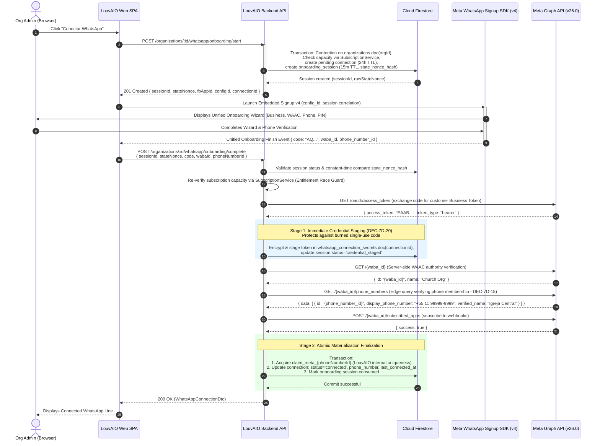

# LouvAIO WhatsApp Integration — Technical & Domain Architecture

> **Authoritative Business Reference:** *"Integração com WhatsApp — Regras de Negócio"*
> **Target Release:** Phase 7 (WhatsApp Integration)
> **Document Status:** Architectural Specification & Implementation Boundary Finalization (Phase 7A-R3 Finalized)
> **Author:** LouvAIO Product Architect
> **Authorities:** "Integração com WhatsApp — Regras de Negócio", AGENTS.md, MEMORY.md, docs/system-status.md, docs/product/system-overview.md

---

## 1. Executive Summary & Principles

This document establishes the canonical, reconciled technical and domain architecture for LouvAIO's WhatsApp integration. It freezes all topological, membership, governance, boundary, and phase-split contracts prior to any production implementation in Phase 7B.

### Non-Negotiable Locked Business Rules (BR-7A-01 .. BR-7A-13)
1. **Paid Plan Capacity:** Paid plans include 1 WhatsApp connection; additional connections are purchased as generic add-on blocks (`addons.additionalWhatsapps`).
2. **Organization Ownership:** The **Organization (Church)** is the exclusive owner of `WhatsAppConnection`. A Ministry *never* owns a connection.
3. **Default Connection:** An Organization defines at most one default WhatsApp connection. Ministries without an exclusive connection automatically inherit this default.
4. **Ministry Assignment:** An Organization may assign a connection exclusively to a Ministry if capacity permits. Ownership remains strictly with the Organization.
5. **Subscription Entitlement Authority:** The backend `SubscriptionService` is the sole authority for evaluating connection capacity. No frontend component may branch on plan names directly.
6. **Billing Model:** Subscriptions expose `includedConnections` and `additionalConnections`.
7. **Non-Destructive Preservation:** Plan downgrades, quota reductions, and billing lapses **never** delete connection documents or configuration. Excess connections transition into a deterministic `disabled_over_limit` state.
8. **Normalized Entity:** Connections are first-class entities storing provider metadata, phone number, and status without exposing credentials.
9. **Status Semantics:** Normalized state machine (`pending`, `connecting`, `connected`, `error`, `disabled_by_user`, `disabled_over_limit`, `disconnected`). Only `connected` sends messages.
10. **Role Separation:** Org Admin manages org connections, purchases, and assignments. Ministry leaders view and use assigned or default connections.
11. **Provider Abstraction:** Core logic interacts with `WhatsAppProvider` abstraction, isolating vendor-specific Meta Cloud API details.
12. **Official Platform Strategy:** Production strictly uses the official Meta WhatsApp Business Platform (Cloud API + Embedded Signup). Unofficial scraping or reverse-engineered APIs are prohibited.
13. **Customer Phone Ownership:** The customer organization supplies and owns its phone number. LouvAIO does not resell or provision carrier numbers.

---

## 2. Canonical Persistence Topology Resolution (DEC-7A-16-R1)

### The Topology Contradiction Resolved
Phase 7A contained a structural contradiction between nested subcollection path syntax (`organizations/:organizationId/whatsapp_connections`) and root collection references (`whatsapp_connections` with `organization_id`).

### Repository Audit & Architectural Evaluation
An audit of LouvAIO's existing 24 production Firestore collections confirms:
- **Zero Subcollections:** Every active domain aggregate (`ministries`, `ministry_members`, `schedules`, `songs`, `member_unavailabilities`, `ministry_announcements`, `ministry_subscriptions`, `billing_subscriptions`) is implemented as a **root collection** using tenant foreign keys (`ministry_id`, `user_id`).
- **Webhook Lookups:** Inbound Meta webhook events provide `provider_phone_number_id` or `provider_waba_id`. In a nested subcollection topology, resolving the connection document would require Firestore `collectionGroup` queries with collection-group index declarations and specialized security rules. In a root collection, it is a fast, direct query: `.where('provider_phone_number_id', '==', id).limit(1)`.
- **Composite Index Consistency:** Firestore composite indexes in `firestore.indexes.json` operate seamlessly on root collections with standard field scopes.
- **Tenant Isolation:** Invariant #4 requires server-side tenant filtering (`.where('organization_id', '==', organizationId)`). Root collections strictly satisfy this requirement.

### The Canonical Collection Map
All WhatsApp-related persistence is strictly structured as **Root Collections**:

| Collection Name | Scope / Hierarchy | Key Identifiers | Purpose |
| :--- | :--- | :--- | :--- |
| `organizations` | Root Collection | `id` (UUID / nanoid) | Institutional entity representing the Church. |
| `organization_members` | Root Collection | `id` (`${organization_id}_${user_id}`) | Membership and administrative RBAC for the Organization. |
| `whatsapp_connections` | Root Collection | `id` (`wac_*`), `organization_id` | Provisioned phone numbers and connection states (Phase 7C). |
| `whatsapp_provider_identity_claims` | Root Collection | `id` (`claim_${provider}_${provider_phone_number_id}`) | Atomic platform-wide provider identity uniqueness claims (Phase 7C). |
| `whatsapp_connection_secrets` | Restricted Root Collection | `id` (matches `connection_id`), `organization_id` | Encrypted access tokens and security metadata (Phase 7C). |
| `whatsapp_messages` | Root Collection | `id` (`wamsg_*`), `organization_id`, `ministry_id` | Transactional notification audit log and dispatch state (Phase 7G). |
| `whatsapp_webhook_events` | Root Collection | `id` (`wbh_*` or hash), `provider_event_id` | Sanitized webhook delivery log for deduplication (Phase 7E). |

*Subcollections are completely eliminated from the architecture.*

---

## 3. Organization Membership Model & RBAC (DEC-7A-14-R3, DEC-7A-20-R2)

### The `organization_members` Aggregate
To support multi-admin governance beyond a single `owner_user_id` without conflating institutional authority with ministry operations, LouvAIO introduces the `organization_members` root collection.

#### Schema
```typescript
export type OrganizationRole = 'owner' | 'admin';

export interface OrganizationMemberRecord {
  id: string; // Deterministic: `${organization_id}_${user_id}`
  organization_id: string; // Foreign key to organizations
  user_id: string; // Firebase Auth UID
  role: OrganizationRole; // 'owner' or 'admin'
  invited_by_user_id: string | null;
  created_at: string; // ISO 8601
  updated_at: string; // ISO 8601
}
```

#### Unique Invariants & Safety Rules
1. **Compound Uniqueness:** A user can have at most one role document per Organization (`id = `${organization_id}_${user_id}``).
2. **Owner Representation:** The user identified by `organizations.owner_user_id` MUST possess an `organization_members` record with `role: 'owner'`.
3. **Owner Cardinality:** Exactly one user holds `role: 'owner'` per Organization at any time.
4. **Owner Protection:** An owner membership can **never** be deleted through member management APIs (`DELETE /organizations/:id/members/:userId`). An owner cannot remove themselves without transfer.
5. **Ownership Transfer:** Transfer of institutional ownership is executed exclusively by `ORG_OWNER` and atomically:
   - Updates `organizations.owner_user_id = newOwnerUserId`;
   - Demotes the former owner in `organization_members` to `role: 'admin'`;
   - Promotes the new owner in `organization_members` to `role: 'owner'`.
6. **Least-Privilege Admin Delegation (DEC-7A-20-R2):**
   - **`ORG_OWNER`** exclusively manages Organization administrators (add, remove).
   - **`ORG_ADMIN`** CANNOT grant, promote, invite, or revoke other Organization admins or the Org Owner.
   - `ORG_ADMIN` authority is strictly focused on managing WhatsApp connections, assigning connections to child ministries, configuring the organization default connection, and reviewing billing/capacity summaries.

### Authoritative RBAC Matrix
Authority is strictly compartmentalized across domain boundaries:

| Permission / Action | `ORG_OWNER` | `ORG_ADMIN` | `MINISTRY_ADMIN` | `MINISTRY_MEMBER` |
| :--- | :---: | :---: | :---: | :---: |
| **Manage Organization Details & Transfer Ownership** | Yes | No | No | No |
| **Manage Billing Anchor Ministry** | Yes | No | No | No |
| **Add / Remove Organization Admins** | Yes | No | No | No |
| **Attach / Detach Ministries to Organization** | Yes | No | No | No |
| **Start WhatsApp Onboarding (Embedded Signup)** | Yes | Yes | No | No |
| **Configure Organization Default Connection** | Yes | Yes | No | No |
| **Assign Connection Exclusively to Ministry** | Yes | Yes | No | No |
| **Disconnect / Deactivate Connection** | Yes | Yes | No | No |
| **Purchase Add-on WhatsApp Capacity** | Yes | Yes* | No | No |
| **View Ministry Resolved WhatsApp Status** | Yes | Yes | Yes | No |
| **Trigger Schedule WhatsApp Notification** | Yes | Yes | Yes | No |
| **Receive Notification / Set Phone & Opt-Out** | Yes | Yes | Yes | Yes |

*\*Subject to commercial billing permissions on the billing anchor ministry.*

**Key Boundary Principle:** Being an Admin in a Ministry (`ministry_members.role === 'admin'`) gives administrative rights *only* inside that specific Ministry (repertoire, schedules, unavailabilities, team members). It does **not** grant Organization-level authority over WhatsApp connections or institutional governance.

---

## 4. Existing Ministries → Organization Association (DEC-7A-25-R2)

LouvAIO churches may operate multiple independent ministries in the system (e.g., *Louvor Geral*, *Louvor Jovens*, *Coral*). The association of these ministries into a unified Organization must be explicit, authorized, and non-destructive.

### Association Invariants & Authority
1. **Zero Heuristic Association:** The backend **NEVER** automatically groups ministries based on name similarity, email domain, shared members, or billing customer IDs. All associations must be explicitly authorized.
2. **Single Organization Boundary:** A Ministry belongs to **exactly one** Organization (`ministries.organization_id`).
3. **Strict Null-Organization Requirement (DEC-7A-25-R2):** Attaching a Ministry to Organization X succeeds **ONLY** if:
   ```text
   ministry.organization_id === null
   ```
   If the Ministry already belongs to ANY Organization (including an auto-provisioned standalone Organization), the request is strictly rejected with:
   ```text
   HTTP 409 Conflict (MINISTRY_ALREADY_HAS_ORGANIZATION)
   ```
4. **Organization Merge / Transfer Deferral:** LouvAIO does **NOT** support automatic or implicit merging of existing Organizations in Phase 7B. Merging a standalone Organization into another requires an explicit multi-tenant migration protocol (transferring members, resolving billing anchors, merging paid subscriptions, re-pointing WhatsApp connections, and archiving donor organizations). This capability is explicitly **DEFERRED**.
5. **Attach Authority (Dual-Authorization Handshake):** Attaching a Ministry to Organization X requires proof of authority in **both** contexts:
   - The executing actor must be the **`ORG_OWNER`** of Organization X; **AND**
   - The executing actor must be the **`owner`** or **`admin`** of the target Ministry.
6. **Preservation of Ministry Data:** Attaching a ministry causes **zero** changes to its songs, schedules, members, roles, unavailabilities, or subscriptions.
7. **Detach Authority & Safeguards:** A Ministry can be detached from an Organization **ONLY by the `ORG_OWNER`**, provided that the Ministry is **not** the `billing_anchor_ministry_id`.
   - Detaching the billing anchor ministry is strictly prohibited with `400 CANNOT_DETACH_BILLING_ANCHOR`.
   - Upon detachment:
     - `ministry.organization_id` is reset to `null`;
     - Any WhatsApp connection exclusively assigned to that ministry has its assignment cleared;
     - The detached Ministry operates independently without an Organization until explicitly provisioned;
     - Former Organization membership records are NOT copied to the ministry;
     - Ministry operational data and independent subscriptions remain 100% untouched.
8. **Empty-Organization Invariant:** An active Organization MUST always contain at least one Ministry (its billing anchor). Phase 7B operations can never produce an orphaned Organization with zero ministries.

---

## 5. Organization Provisioning & Concurrency Invariants (DEC-7A-27-R1)

### Invariants
1. **One-to-Many Cardinality:** An Organization contains 1 to N Ministries.
2. **Anchor Invariant:** An Organization must always have exactly one `billing_anchor_ministry_id`, and that ministry must belong to the Organization (`ministry.organization_id === organization.id`).
3. **Immutable Tenant ID:** The `organization.id` is immutable once created.

### Initial Owner Derivation & No Implicit Escalation (DEC-7A-27-R1)
In LouvAIO, every ministry document in Firestore maintains a canonical owner field: `ministries.owner_user_id: string`.
- **Authoritative Owner Source:**
  ```text
  INITIAL_ORG_OWNER_SOURCE: ministry.owner_user_id
  organizations.owner_user_id = ministry.owner_user_id
  ```
- **Strict Provisioning Authority:** Organization provisioning establishes institutional governance and is restricted strictly to the **Ministry Owner** (`ministry.owner_user_id`).
  - If a non-owner Ministry Admin attempts to invoke provisioning, the request is rejected with:
    ```text
    HTTP 403 Forbidden (ONLY_MINISTRY_OWNER_CAN_PROVISION_ORGANIZATION)
    ```
- **Zero Implicit Privilege Escalation:** Executing provisioning creates **exactly one** initial membership record:
  - `organization_members.doc(`${orgId}_${ministry.owner_user_id}`)` with `role: 'owner'`.
  - It does **NOT** grant Organization Admin (`role: 'admin'`) to any other Ministry Admin or member.
  - Any additional Organization Admins must be explicitly added post-creation by the `ORG_OWNER` via `POST /api/v1/organizations/:organizationId/members`.
  - This strictly preserves the boundary: **Ministry Authority != Organization Authority**.

### Explicit Provisioning Trigger (Command Pattern)
Creating an Organization establishes institutional tenant identity, legal owner authority, and billing anchors.
- **Strict Non-Mutating GET Behavior:** Ordinary authenticated `GET` requests (e.g., `GET /api/v1/ministries/:ministryId/whatsapp/status` or viewing a dashboard) **NEVER** implicitly create or provision an Organization. If no Organization exists, GET endpoints return `hasOrganization: false` or `404 Not Found`.
- **Explicit Provisioning Command:** Provisioning occurs strictly via an intentional `POST` command:
  ```text
  POST /api/v1/ministries/:ministryId/organization/provision
  ```

### Concurrency & Race Condition Resolution
When multiple provisioning requests are submitted concurrently:
- The backend executes inside an atomic Firestore transaction (`db.runTransaction`):
  1. Transaction reads `ministries.doc(ministryId)`.
  2. If `ministry.organization_id != null` (set by a concurrent transaction), the transaction commits nothing, aborts creation, and returns the existing Organization.
  3. If `ministry.organization_id == null`, the first transaction to commit creates:
     - `organizations.doc(orgId)` with `owner_user_id = ministry.owner_user_id`;
     - `organization_members.doc(`${orgId}_${ministry.owner_user_id}`)` with `role: 'owner'`;
     - Updates `ministries.doc(ministryId)` with `{ organization_id: orgId }`.
- **Resolution Invariant:** The first transaction to commit wins. The losing transaction retries, reads the newly set `organization_id`, and returns the existing Organization without overwriting `owner_user_id`, `role`, or `billing_anchor_ministry_id`.

---

## 6. Complete Billing Anchor Semantics (DEC-7A-15-R1, DEC-7A-28)

### Commercial Subscription Anchoring
Commercial billing in LouvAIO is currently anchored to individual ministries in `ministry_subscriptions`, integrated with Asaas recurring subscriptions.

To avoid breaking live payment gateway webhooks, customer IDs, and the `BillingReconcilerWorker`:
- The Organization inherits commercial capacity from its designated **Billing Anchor Ministry** (`organizations.billing_anchor_ministry_id`).

### Multi-Subscription & Transition Rules
1. **Initial Selection:** The billing anchor is automatically set to the initial ministry provisioned with the Organization.
2. **Phase 7B Foundation Immutability (DEC-7A-28):** Arbitrary mutation of `billing_anchor_ministry_id` is **NOT** exposed through public REST APIs in Phase 7B. Modifying commercial anchors during active billing transitions is commercially sensitive and is deferred to specialized billing phases with `billing-engineer`.
3. **Multiple Paid Subscriptions in One Organization:**
   - If an Organization contains Ministry A (on *Pro*) and Ministry B (on *Essential*):
     - **Safety Invariant:** LouvAIO executes **NO automatic cancellation, NO automatic migration, and NO automatic merging of existing subscriptions.**
     - **WhatsApp Entitlement Rule:** Exclusively the subscription of the **`billing_anchor_ministry_id`** governs the Organization's WhatsApp capacity.
     - **Other Ministry Subscriptions:** Ministry B's subscription remains fully active and independent, governing Ministry B's operational quotas (members, songs, smart chords, liturgy storage).
     - **Future Commercial Merging:** Unified multi-ministry institutional billing is deferred to specialized billing phases with `billing-engineer`.

---

## 7. Authoritative WhatsApp Entitlement Contract & Boundary Split (DEC-7A-29)

To ensure clean implementation boundaries and avoid coupling subsystems prematurely:
- **Phase 7B (Commercial Capacity Entitlement):** `SubscriptionService` evaluates commercial capacity derived exclusively from plan definitions and billing states.
- **Phase 7C (Connection Usage Composition & Enforcement):** A connection facade service combines commercial capacity with actual Firestore connection usage (`configuredConnectionsCount`, `capacityConsumingCount`, `remainingCapacity`, `isOverLimit`).
- **Phase 7H (Add-on Billing Integration):** Asaas recurring checkout and payment webhooks for additional WhatsApp connection blocks (`addons.additionalWhatsapps`).

### Phase 7B Method Signature
```typescript
SubscriptionService.getOrganizationWhatsAppCapacity(organizationId: string): Promise<OrganizationWhatsAppCapacity>
```

### Phase 7B Schema
```typescript
export interface OrganizationWhatsAppCapacity {
  organizationId: string;
  billingAnchorMinistryId: string;
  enabled: boolean; // True if subscription plan is active or in grace
  includedConnections: number; // 1 for paid plans (lite, lite_plus, essential, pro, premium), 0 for free
  additionalConnections: number; // Strictly 0 in Phase 7B runtime (extension seam for Phase 7H)
  totalAllowedConnections: number; // includedConnections + additionalConnections
  billingAccessMode: 'normal' | 'grace' | 'suspended';
}
```

### Additional Connection Policy for Phase 7B
- An audit of the production subscription engine confirms that member add-ons (`member_addon_blocks`) exist, but **no WhatsApp add-on schema (`addons.additionalWhatsapps`) exists in production code**.
- Phase 7B does **NOT** invent a premature add-on persistence schema.
- In Phase 7B runtime, `additionalConnections` evaluates to `0`. Phase 7B provides the clean extension seam for Phase 7H where `billing-engineer` will introduce Asaas recurring add-on blocks.

---

## 8. Billing Grace, Over-Limit & Non-Destructive Restrictions (DEC-7A-18-R1)

LouvAIO strictly enforces non-destructive data preservation.

### Operational Grace Period (`billingAccessMode === 'grace'`)
When a subscription payment is overdue but within the commercial grace window:
- **Sending Messages:** **Permitted**. Existing active connections continue dispatching operational schedule notifications without interruption.
- **New Onboarding:** **Blocked**. The system disallows starting new Embedded Signup sessions (`canCreateConnection: false` in 7C).
- **Configuration Modifications:** **Blocked**. Assigning or switching connections is locked.

### Restricted Over Limit (Phase 7C Operational Enforcement)
When commercial capacity drops below configured connections (e.g., plan downgrade from *Pro* to *Free*):
1. **Separation of Concerns:** Phase 7B establishes commercial capacity. Phase 7C introduces connection documents and evaluates whether `configuredConnectionsCount > totalAllowedConnections`.
2. **Zero Automatic Disabling / Zero Deletion:** The system **NEVER automatically picks a phone number to disable or disconnect.** Automatic selection risks shutting off the church's primary pastoral or administrative line.
3. **Operational Status:** In Phase 7C, when connections exceed capacity:
   - The Organization enters `restricted_over_limit`;
   - Creation of new connections is **BLOCKED**;
   - Outbound dispatch through all connections is **BLOCKED** with error code `RESTRICTED_OVER_LIMIT`;
   - The Org Admin must resolve the over-limit state by purchasing capacity (Phase 7H) or explicitly clicking **"Desconectar"** on specific connections.

---

## 9. Capacity Accounting & Loophole Elimination (Phase 7C Implementation)

### Status Definitions & Capacity Consumption (DEC-7C-04, DEC-7C-06)

| Connection Status | Consumes Quota Slot? | Can Send Messages? | Definition |
| :--- | :---: | :---: | :--- |
| `pending` | **Yes** | No | Reserved onboarding slot during Embedded Signup (expires via `pending_expires_at` 24h TTL). |
| `connecting` | **Yes** | No | Code exchanged, awaiting phone registration & webhook validation. |
| `connected` | **Yes** | **Yes** | Verified, active, and authorized to send template messages. |
| `error` | **Yes** | No | Transient technical fault, certificate mismatch, token expired, or health check failure. |
| `disabled_by_user` | **Yes** | No | Manually paused by Org Admin. Still occupies an allocated capacity slot. |
| `disconnected` | **No** | No | Soft-deleted / unlinked. Does NOT consume capacity. Permanent terminal state in V1. |

*(Note on `disabled_over_limit`: Removed per DEC-7C-04. Non-destructive quota over-limit is evaluated dynamically as an aggregate Organization mode `connectionAccessMode = 'restricted_over_limit'` rather than mutating individual connection documents.)*

### Elimination of the Accumulation Loophole (Phase 7C Enforced)
- In Phase 7C, new connection onboarding (`POST /whatsapp/onboarding/start`) strictly enforces:
  ```text
  configuredConnectionsCount < totalAllowedConnections
  ```
  where `configuredConnectionsCount` counts **ALL non-disconnected connections** (`status !== 'disconnected'`).
- The configured status set is strictly:
  ```typescript
  export const CONFIG_CONSUMING_STATUSES: WhatsAppConnectionStatus[] = [
    'pending',
    'connecting',
    'connected',
    'error',
    'disabled_by_user',
  ];
  ```
- To onboard a new connection when at quota, an administrator must explicitly **disconnect** an existing connection, moving it to `disconnected`.

---

## 10. Re-Upgrade Behavior & Sender Stability (DEC-7A-20-R1, DEC-7C-04)

When an Organization purchases additional add-on capacity or upgrades its plan:
1. **Explicit Reactivation Required:** Connections paused in `disabled_by_user` do **NOT** automatically resume sending messages.
2. **No Silent Sender Switching:** Automatic reactivation could cause recipients to unexpectedly receive messages from a different number than the one used during the restriction.
3. **Aggregate Over-Limit Lift:** When commercial capacity increases so that `configuredConnectionsCount <= totalAllowedConnections`, `connectionAccessMode` returns to `'normal'`. Existing `connected` lines immediately resume operational sending without individual document mutations.
4. **Administrative Flow:** The Org Admin dashboard indicates that newly purchased slots are available. If an Admin previously paused a line (`disabled_by_user`), the Admin explicitly clicks **"Reativar Conexão"**. The system validates that `configuredConnectionsCount <= totalAllowedConnections` and transitions the status to `connected`.

---

## 11. Default vs Exclusive Connection Invariants (DEC-7A-21-R1, DEC-7C-02, DEC-7C-03)

To eliminate routing ambiguity and ensure predictable messaging:

### 1. Default Connection Single Source of Truth (DEC-7C-02)
- **Canonical Authority:** `organizations.default_whatsapp_connection_id: string | null` is the **sole source of truth** for the Organization's default connection.
- **Elimination of Dual-Persistence Drift:** `whatsapp_connections.is_organization_default` is **REMOVED from the Firestore persistence schema**. It does NOT exist as a document field in `whatsapp_connections`.
- **Derived in API DTOs:** In API responses and DTOs (`WhatsAppConnectionDto`), `isOrganizationDefault: boolean` is derived dynamically on the server:
  ```typescript
  isOrganizationDefault = organization.default_whatsapp_connection_id === connection.id;
  ```
- **Atomic Mutation:** Setting or changing the default connection is an atomic update on the `organizations` document (`default_whatsapp_connection_id = connectionId`). Clearing the default sets `default_whatsapp_connection_id = null`. There is zero boolean dual-write drift or multi-connection boolean race.

### 2. Mutual Exclusivity Invariant
A connection **CANNOT** simultaneously be an Organization Default and an Exclusive Ministry Assignment:
- Setting a connection as the Organization default requires `connection.assigned_ministry_id === null`.
- Assigning a connection exclusively to a Ministry requires `organization.default_whatsapp_connection_id !== connection.id` (must clear or switch default first).

### 3. Assignment Cardinality (1:1)
- One connection is assigned to at most **one** Ministry (`assigned_ministry_id`).
- Each Ministry has at most **one** exclusively assigned connection.
- Shared usage occurs **exclusively** through the Organization default fallback.

### 4. Exclusive Unusable Fallback Prevention (DEC-7C-03)
A critical routing safety invariant:
- If Ministry M has an exclusive connection assigned, but that connection is currently **unusable** (`error`, `disabled_by_user`, `disconnected`):
  → The resolver **STRICTLY REFUSES** to send and fails with `CONNECTION_NOT_ACTIVE`.
  → The resolver **NEVER silently falls back** to the Organization default number.
- **Rationale:** If a youth ministry (*Louvor Jovens*) configured a dedicated number, and that line experiences a transient fault, dispatching messages from the church's senior pastoral line (*Atendimento Geral*) would violate recipient expectations, context, and privacy. Fallback to Organization default occurs **ONLY** when Ministry M has **NO explicit exclusive assignment** (`assigned_ministry_id === null`).

### 5. Connection Resolution Algorithm (`resolveWhatsAppConnection`)
When Ministry M requests message dispatch (Phase 7G):
1. **Commercial / Access Verification:**
   - Verify `ministry.organization_id !== null` (otherwise fail with `NO_ORGANIZATION`).
   - Evaluate `SubscriptionService.getOrganizationWhatsAppCapacity(org.id)`.
   - If `billingAccessMode === 'suspended'`, fail with `WHATSAPP_SUSPENDED`.
   - If `configuredConnectionsCount > totalAllowedConnections`, fail with `RESTRICTED_OVER_LIMIT`.
   - If `totalAllowedConnections === 0` (Free plan), fail with `RESTRICTED_OVER_LIMIT`.
2. **Step 1: Check Exclusive Ministry Assignment:**
   - Query: `whatsapp_connections.where('organization_id', '==', orgId).where('assigned_ministry_id', '==', M.id).limit(1)`.
   - If an exclusive connection is found:
     - If `status === 'connected'`: **Dispatch via Exclusive Connection**.
     - If `status !== 'connected'`: **Fail Closed with `CONNECTION_NOT_ACTIVE`** (do NOT fall back per DEC-7C-03).
3. **Step 2: Fallback to Organization Default (Only if No Exclusive Assignment):**
   - Read `org.default_whatsapp_connection_id`.
   - If `default_whatsapp_connection_id === null`: **Fail Closed with `NO_CONNECTION_AVAILABLE`**.
   - Load connection: `whatsapp_connections.doc(default_whatsapp_connection_id)`.
   - If not found or `connection.organization_id !== orgId`: **Fail Closed with `NO_CONNECTION_AVAILABLE`**.
   - If `connection.status === 'connected'`: **Dispatch via Organization Default Connection**.
   - If `connection.status !== 'connected'`: **Fail Closed with `CONNECTION_NOT_ACTIVE`**.

### 6. Lifecycle Transitions: Default & Assignment Preservation Rules (DEC-7C-11)
Across connection status transitions, pointers and assignments adhere to strict preservation vs cleanup invariants:

| Transition | Organization Default Pointer (`default_whatsapp_connection_id`) | Exclusive Ministry Assignment (`assigned_ministry_id`) | Routing / Dispatch Outcome |
| :--- | :--- | :--- | :--- |
| **`connected → error`** | **PRESERVED** | **PRESERVED** | Resolver returns `CONNECTION_NOT_ACTIVE`; zero fallback to default; resumes automatically once error cleared. |
| **`connected → disabled_by_user`** | **PRESERVED** | **PRESERVED** | Resolver returns `CONNECTION_NOT_ACTIVE`; zero fallback to default; resumes automatically once unpaused. |
| **`connected → disconnected`** (terminal) | **CLEARED ATOMICALLY** (`null`) | **CLEARED ATOMICALLY** (`null`) | Organization retains NO dead default pointer; Ministry assignment is freed, returning Ministry to unassigned state. |
| **`error → disconnected`** (terminal) | **CLEARED ATOMICALLY** (`null`) | **CLEARED ATOMICALLY** (`null`) | Organization retains NO dead default pointer; Ministry assignment is freed, returning Ministry to unassigned state. |
| **`disabled_by_user → disconnected`** (terminal)| **CLEARED ATOMICALLY** (`null`) | **CLEARED ATOMICALLY** (`null`) | Organization retains NO dead default pointer; Ministry assignment is freed, returning Ministry to unassigned state. |
| **`pending → disconnected`** (cancelled/expired)| **NO ACTION** (never set during pending) | **NO ACTION** (never set during pending) | Pending slot released; zero pointer/assignment mutations. |

- **Invariant: No Stale Pointers:** An Organization must NEVER retain `default_whatsapp_connection_id` pointing to a connection with status `disconnected`.
- **Invariant: No Dead Assignment Locks:** A Ministry must NEVER remain indefinitely locked to a `disconnected` connection. Clearing `assigned_ministry_id` on terminal disconnect releases the 1:1 constraint and permits immediate fallback to the Organization default or assignment to a newly provisioned connection.

### 7. Initial Configuration Eligibility vs Transient Failure Preservation (DEC-7C-15)

#### A. Initial Configuration Eligibility Gate (`status === 'connected'`)
- **Strict Precondition for New Configuration:**
  A connection can be newly set as the Organization Default (`organizations.default_whatsapp_connection_id`) or newly assigned to a Ministry (`whatsapp_connections.assigned_ministry_id`) **ONLY IF** its current lifecycle status is `'connected'`.
- **Rejection of Non-Operational States:**
  Attempting to configure a connection as default or assign it to a Ministry when its status is `'pending'`, `'connecting'`, `'error'`, `'disabled_by_user'`, or `'disconnected'` is strictly rejected with HTTP `400 CONNECTION_NOT_ACTIVE_FOR_CONFIGURATION`.
- **Materialization & Claim Preconditions:**
  Because `status === 'connected'` strictly requires non-null provider fields (`phone_number`, `provider_waba_id`, `provider_phone_number_id`) and active claim ownership in `whatsapp_provider_identity_claims`, no unverified or unmaterialized line can ever be bound as a traffic sender.

#### B. Configuration Preservation Across Transient Failures
- **Preservation During Non-Operational States:**
  If an *already configured* sender (Organization default or exclusively assigned) subsequently enters a transient degraded state (`connected → error` or `connected → disabled_by_user`), its pointer and assignment are **STRICTLY PRESERVED**. The system does not clear `default_whatsapp_connection_id` or `assigned_ministry_id`.
- **Fail-Closed Dispatch Behavior:**
  While degraded, any outbound message dispatch routed to that connection fails closed with `CONNECTION_NOT_ACTIVE`. Per DEC-7C-03, exclusively assigned lines never silently fall back to the Organization default.
- **Seamless Recovery:**
  When the line is restored (`error → connected` or `disabled_by_user → connected`), normal message dispatch resumes automatically without administrative intervention or re-binding.

#### C. Configured Sender Historical Invariant
- **Architectural Guarantee:**
  Because entry into configured sender status requires `status === 'connected'`, and subsequent degradation retains the configuration, **any connection that is currently configured as an Organization default or assigned to a Ministry necessarily satisfies**:
  ```typescript
  connection.last_connected_at !== null &&
  isProviderIdentityMaterialized(connection) === true &&
  hasValidProviderClaim(connection) === true
  ```
- **Terminal Disconnect Invariant:**
  Terminal disconnect (`→ disconnected`) is the sole lifecycle event that unconditionally and atomically clears both the Organization default pointer and the Ministry assignment lock (per DEC-7C-11).

---

## 12. Recipient Phone Normalization & Validation (DEC-7A-22-R1)

### Canonical Storage: Strict E.164
- Phone numbers in `users` and `ministry_members` are stored strictly in **E.164** format:
  ```text
  ^\+[1-9]\d{1,14}$
  ```
  Example: `+5511999998888`, `+14155552671`.

### Elimination of Backend Regional Bias
- The backend API **NEVER** silently assumes `+55` or any country code. Any phone payload missing a leading `+` or country code is rejected with HTTP `400 INVALID_PHONE_E164`.
- **Frontend Localization:** The web application provides country code selection defaulting to `+55` (Brazil) for Brazilian locales, performing client-side normalization into E.164 before transmission.

---

## 13. Secret Storage & Envelope Encryption Hardening (DEC-7A-19-R1, DEC-7C-08)

Meta Cloud API System User Tokens must be secured against data breaches and cross-tenant transplantation (implemented in Phase 7C).

### Cryptographic Specification
- **Algorithm:** AES-256-GCM (Authenticated Encryption with Associated Data).
- **Master Key:** `WHATSAPP_TOKEN_ENCRYPTION_KEY` configured in backend `unifiedConfig` (32-byte cryptographically random key, Base64-encoded). Server-only secret, never exposed to clients or build artifacts.
- **Nonce / IV:** Cryptographically secure unique 12-byte initialization vector generated per encryption operation (`crypto.randomBytes(12)`). IV reuse is strictly prohibited.
- **Authentication Tag:** 16-byte GCM authentication tag verifying ciphertext integrity (`cipher.getAuthTag()`).
- **Associated Authenticated Data (AAD):** The AAD binds the ciphertext to the exact tenant context:
  ```text
  AAD = `${organization_id}:${connection_id}`
  ```
  This prevents ciphertext transplantation attacks between connections or organizations.
- **Key Versioning:** Each secret record contains `key_version: number` (initial version: `1`) to enable zero-downtime key rotation in future phases.
- **Storage Encodings (DEC-7C-08):**
  - `encrypted_access_token`: Base64 string
  - `iv`: Base64 string (12 decoded bytes)
  - `auth_tag`: Base64 string (16 decoded bytes)
- **Fail-Closed Decryption:** Decryption failures throw `AppError(500, 'SECRET_DECRYPTION_FAILED')` and halt execution immediately.
- **Zero Logging:** Decrypted tokens are strictly prohibited from application logs, error traces, and diagnostic payloads.

### Boot-Safe Configuration Loading (DEC-7C-08)
- In `backend/src/config/unifiedConfig.ts`, the encryption key is defined as optional:
  ```typescript
  whatsappTokenEncryptionKey: z.string().optional()
  ```
- **Application Boot Safety:** Absence of `WHATSAPP_TOKEN_ENCRYPTION_KEY` in development or staging environments does **NOT** cause application boot failure while WhatsApp crypto operations remain uninvoked.
- **Runtime Fail-Closed Guard:** The crypto service (`WhatsAppEncryptionService`) evaluates the key upon construction or crypto invocation:
  - If the key is absent, empty, not valid Base64, or decodes to length !== 32 bytes (`Buffer.from(key, 'base64').length !== 32`):
    The service throws a typed internal configuration error `AppError(500, 'WHATSAPP_ENCRYPTION_KEY_INVALID_OR_MISSING')`.
- **Production Release Requirement:** Provisioning `WHATSAPP_TOKEN_ENCRYPTION_KEY` in Vercel Production is a mandatory prerequisite prior to deploying Phase 7C backend code.

#### `whatsapp_connection_secrets` Schema (Phase 7C)
```typescript
export interface WhatsAppConnectionSecretRecord {
  id: string; // matches connection_id
  connection_id: string; // foreign key to whatsapp_connections
  organization_id: string; // tenant boundary for cumulative anti-IDOR
  key_version: number; // encryption key version for rotation (1 initially)
  encrypted_access_token: string; // Base64 ciphertext
  iv: string; // Base64 IV (12 bytes)
  auth_tag: string; // Base64 GCM Tag (16 bytes)
  token_type: 'system_user' | 'user_token'; // [EXTERNAL META VALIDATION REQUIRED for token lifespan]
  expires_at: string | null; // ISO 8601 or null if permanent
  created_at: string; // ISO 8601 UTC
  updated_at: string; // ISO 8601 UTC
}
```

---

## 14. Webhook Event Retention, Privacy & Sanitization (DEC-7A-23-R1)

Inbound Meta webhook payloads may contain sensitive PII, participant phone numbers, and message bodies (Phase 7E).

### Minimization & Sanitization Policy
1. **No Indefinite Raw Payload Storage:** Storing unredacted raw webhook JSON payloads indefinitely violates data minimization principles.
2. **Sanitized Persistence Schema:**
   ```typescript
   export interface WhatsAppWebhookEventRecord {
     id: string; // sha256(provider_event_id) or wbh_*
     provider_event_id: string; // Meta event identifier for deduplication
     connection_id: string | null; // Resolved connection
     event_type: string; // e.g. 'messages.status_update'
     processing_status: 'received' | 'processed' | 'ignored' | 'failed';
     error_code: string | null;
     sanitized_metadata: {
       message_id?: string;
       recipient_phone_hash?: string; // Hashed phone for tracing without PII
       status?: 'sent' | 'delivered' | 'read' | 'failed';
       timestamp?: string;
     };
     processed_at: string | null;
     created_at: string; // ISO 8601
   }
   ```
3. **Retention TTL:** Webhook event records are retained for **30 days** for operational deduplication and delivery troubleshooting, after which they are purged by a background sweeper.

---

## 15. Disconnect vs Delete Semantics (DEC-7A-24-R1)

To balance user control with auditability and relational integrity (Phase 7C):

### Disconnect (Operational Deactivation)
- **Action:** `POST /api/v1/organizations/:organizationId/whatsapp/connections/:connectionId/disconnect`
- **Semantics:**
  - Deregisters webhook subscriptions from Meta;
  - Sets `status: 'disconnected'`;
  - Clears `is_organization_default` and `assigned_ministry_id`;
  - Releases the capacity slot (`configuredConnectionsCount` decreases);
  - **Preserves** the connection record and historical `whatsapp_messages` audit trail.

### Delete (Hard Record Purge)
- **Action:** `DELETE /api/v1/organizations/:organizationId/whatsapp/connections/:connectionId`
- **Semantics:**
  - Allowed **ONLY** if `whatsapp_messages` has 0 messages linked to this connection, OR if the Org Owner provides explicit multi-step confirmation (`force=true`);
  - Permanently purges the secret from `whatsapp_connection_secrets`;
  - Permanently removes the `whatsapp_connections` document.

---

## 16. First Messaging Use Case: Schedule Call-Up Notifications (DEC-7A-26)

### Functional Flow (Phase 7G)
1. **Explicit Admin Trigger:** Notifications are triggered **only** when a Ministry Admin explicitly clicks **"Notificar Escala via WhatsApp"** in `ScheduleDetailsView`. No automated background dispatch on schedule creation in V1.
2. **Audience Filtering:**
   - Evaluates schedule participants;
   - Skips participants with `opt_out_whatsapp === true`;
   - Skips participants with no valid E.164 `phone`, flagging them in the dispatch report.
3. **Idempotency Key:**
   ```text
   idempotencyKey = sha256(`${scheduleId}_${memberId}_${scheduleUpdatedAt}`)
   ```
   Repeated clicks within a 10-minute window detect the existing dispatch record in `whatsapp_messages` and prevent duplicate WhatsApp delivery.
4. **Template Concept:** `escala_convocacao_v1`
   - Parameter 1: Member First Name
   - Parameter 2: Event / Service Name
   - Parameter 3: Service Date
   - Parameter 4: Service Time
   - Parameter 5: Musical / Ministry Role
   - Parameter 6: Confirmation Link URL
5. **Audit Record:** Persisted in `whatsapp_messages` with initial status `queued`, updated via webhooks to `sent`, `delivered`, `read`, or `failed`.

---

## 17. Provider-Dependent Assumptions Register

The following items are external dependencies on Meta's WhatsApp Cloud API platform and are explicitly cataloged as **`[EXTERNAL META VALIDATION REQUIRED]`**:

1. **`[EXTERNAL META VALIDATION REQUIRED]` Embedded Signup SDK Response:** Verification of the exact JSON payload returned by Meta's Embedded Signup JavaScript SDK and the exact System User Token exchange handshake on Graph API v21.0.
2. **`[EXTERNAL META VALIDATION REQUIRED]` Mobile Coexistence:** Official confirmation of Meta's policy regarding whether a phone number currently active on the mobile WhatsApp Business App can simultaneously receive Cloud API messages without full account migration.
3. **`[EXTERNAL META VALIDATION REQUIRED]` Utility Template Pre-Approval:** Confirmation of whether operational utility templates (`escala_convocacao_v1`) can be programmatically submitted via Graph API or must be pre-approved in the Meta Business Manager UI.
4. **`[EXTERNAL META VALIDATION REQUIRED]` System User Token Expiration:** Validation of the lifespan of Meta System User Tokens (permanent vs 60-day refresh requirement).
5. **`[EXTERNAL META VALIDATION REQUIRED]` Webhook Signature Verification:** Validation of Meta's exact HMAC-SHA256 signature header format (`X-Hub-Signature-256`) and payload digest calculation.

---

## 18. Updated Decision Register (DEC-7A-01 .. DEC-7A-29, DEC-7C-01 .. DEC-7C-15, DEC-7D-01 .. DEC-7D-22)

| Decision ID | Status | Subject | Summary |
| :--- | :--- | :--- | :--- |
| **DEC-7A-01** | Locked | Plan Capacity Model | Paid plans include 1 connection; extra via generic add-on blocks. |
| **DEC-7A-02** | Locked | Connection Ownership | Organization is the sole owner. Ministry never owns. |
| **DEC-7A-03** | Locked | Organization Default | Max 1 default per Organization; inherited by unassigned ministries. |
| **DEC-7A-04** | Locked | Ministry Assignment | Organization may assign connection exclusively to 1 Ministry. |
| **DEC-7A-05** | Locked | Entitlement Authority | `SubscriptionService` authorizes creation; no client plan logic. |
| **DEC-7A-06** | Locked | Billing Contract | Exposes included and additional connection capacities. |
| **DEC-7A-07** | Locked | Data Preservation | Plan lapses never delete connection documents. |
| **DEC-7A-08** | Locked | Entity Normalization | First-class entity without exposed secrets. |
| **DEC-7A-09** | Locked | Status Semantics | State machine defined; only `CONNECTED` dispatches. |
| **DEC-7A-10** | Locked | Security Roles | Org Admin manages; Ministry Admin uses. |
| **DEC-7A-11** | Locked | Provider Abstraction | `WhatsAppProvider` isolates vendor details. |
| **DEC-7A-12** | Locked | Official Strategy | Meta Cloud API + Embedded Signup; scraping prohibited. |
| **DEC-7A-13** | Locked | Phone Ownership | Customer owns phone number; LouvAIO does not resell lines. |
| **DEC-7A-14-R3**| **Finalized** | Organization Membership & No Escalation | Introduces `organization_members`; provisioning creates owner record only (no implicit Org Admin grant). |
| **DEC-7A-15-R1**| **Remediated** | Billing Anchor Semantics | Subscriptions remain on `ministry_subscriptions`; zero auto-merging of multi-ministry subscriptions. |
| **DEC-7A-16-R1**| **Remediated** | Canonical Root Topology | Rejects subcollections; mandates root collections for all 6 entities. |
| **DEC-7A-17-R1**| **Remediated** | Capacity Accounting | Counts all non-disconnected connections; closes rotation loophole (Phase 7C). |
| **DEC-7A-18-R1**| **Remediated** | Non-Destructive Over-Limit | Replaces automatic phone disabling with `restricted_over_limit` mode & manual admin resolution (Phase 7C). |
| **DEC-7A-19-R1**| **Remediated** | Secret Storage Hardening | AES-256-GCM envelope encryption with key versioning and AAD tenant binding (Phase 7C). |
| **DEC-7A-20-R2**| **Finalized** | Least-Privilege Org Governance | `ORG_OWNER` manages admins and ministries; `ORG_ADMIN` manages connections only. |
| **DEC-7A-21-R1**| **Remediated** | Default vs Exclusive Invariant | Mutually exclusive; connection cannot be both default and assigned. 1:1 cardinality. |
| **DEC-7A-22-R1**| **Remediated** | Strict E.164 Backend | Backend rejects non-E.164; regional +55 defaults isolated to frontend. |
| **DEC-7A-23-R1**| **Remediated** | Webhook Privacy & Retention | Sanitized metadata persistence; 30-day retention TTL; no raw payload storage (Phase 7E). |
| **DEC-7A-24-R1**| **Remediated** | Disconnect vs Delete | Disconnect preserves audit; Delete purges record (restricted; Phase 7C). |
| **DEC-7A-25-R2**| **Finalized** | Strict Null-Org Attach & Merge Deferral | Attaching requires `ministry.organization_id === null`; already-provisioned ministries rejected (409); merge deferred. |
| **DEC-7A-26** | **New** | First Messaging Use Case | Explicit manual schedule call-up with idempotency and audit trail (Phase 7G). |
| **DEC-7A-27-R1**| **Finalized** | Owner Derivation & Provisioning Authority | `INITIAL_ORG_OWNER_SOURCE: ministry.owner_user_id`; provisioning restricted strictly to Ministry Owner. |
| **DEC-7A-28** | **New** | Billing Anchor Immutability in 7B | Public REST API does not mutate billing anchor in Phase 7B foundation. |
| **DEC-7A-29** | **New** | Commercial Entitlement Phase Split | 7B evaluates commercial capacity; 7C evaluates connection usage/over-limit; 7H evaluates add-on checkout. |
| **DEC-7C-01** | **Frozen** | Canonical Schema & Materialization Boundary | Defines `WhatsAppConnectionRecord` with explicit materialization boundary; provider IDs null allowed in `pending`, `connecting`, `error`, and unmaterialized `disconnected`. |
| **DEC-7C-02** | **Frozen** | Default Connection Single Source of Truth | `organizations.default_whatsapp_connection_id` is sole canonical authority; `is_organization_default` removed from persistence, derived in DTO. |
| **DEC-7C-03** | **Frozen** | Exclusive Unusable Fallback Prevention | Unusable exclusive connection fails with `CONNECTION_NOT_ACTIVE`; zero silent fallback to Organization default. |
| **DEC-7C-04** | **Frozen** | Status Model & State Machine Compatibility | 6 states; complete 6x6 transition matrix; `error → disabled_by_user` allowed only if previously connected (`last_connected_at !== null`) and materialized; `disconnected` is strictly terminal. |
| **DEC-7C-05** | **Frozen** | Atomic Terminal Disconnect Transaction | Disconnect runs in atomic transaction: clears default pointer, clears ministry assignment, deletes provider claim, purges secret; public endpoint deferred to 7D. |
| **DEC-7C-06** | **Frozen** | Capacity-Consuming Status Set | Configured count evaluates `['pending', 'connecting', 'connected', 'error', 'disabled_by_user']`; `disconnected` is excluded. |
| **DEC-7C-07** | **Frozen** | Atomic Provider Identity Claim & Acquisition | Transactional claim acquired when `provider_phone_number_id` becomes known; `connected` requires claim ownership; held through `error`/`disabled_by_user`; released on disconnect. |
| **DEC-7C-08** | **Frozen** | Crypto Storage Encoding & Config Loading | Base64 encoding for ciphertext, IV, auth tag; optional config at boot, fail-closed runtime validation upon crypto invocation. |
| **DEC-7C-09** | **Frozen** | Composite Index & Exact Query Mapping | Declares 3 composite indexes for `whatsapp_connections` mapped to exact runtime queries; claim collection uses deterministic PKs requiring zero composite indexes. |
| **DEC-7C-10** | **Frozen** | Pending TTL Ownership | Schema includes `pending_expires_at` (24h); automated cleanup sweeper deferred to Phase 7D onboarding. |
| **DEC-7C-11** | **Frozen** | Terminal Disconnect Cleanup Invariants | Disconnect atomically clears `default_whatsapp_connection_id` and `assigned_ministry_id`; assignments strictly preserved across transient `error` and `disabled_by_user`. |
| **DEC-7C-12** | **Frozen** | Disconnected Nullability Reconciliation | Schema permits null provider identifiers in `disconnected` specifically for unmaterialized onboarding reservations cancelled or expired. |
| **DEC-7C-13** | **Frozen** | Provider Identity Materialization Invariant | Materialization (`provider_waba_id`, `provider_phone_number_id`, `phone_number` non-null) is mandatory for `connected` and `disabled_by_user`; pre-materialization errors allowed in `connecting` and `error`. |
| **DEC-7C-14** | **Frozen** | Bounded Cursor Pagination & Lookahead Contract | Connection listing enforces compound ordering (`created_at DESC, __name__ DESC`), default 25, max 50, opaque cursor `{ createdAt, id }`; repository queries `pageSize + 1` to determine `hasMore` without ghost cursors; no offset pagination. |
| **DEC-7C-15** | **New** | Initial Configuration Eligibility & Transient Preservation | New default selection and exclusive assignment require `status === 'connected'`; transient degradation (`error`, `disabled_by_user`) preserves existing configuration; configured connections maintain invariant `last_connected_at !== null`. |
| **DEC-7D-01** | **Superseded** | Embedded Signup v4 (Unified Onboarding) Handshake | Web client implements Embedded Signup v4 unified completion handler with legacy v2/v3 fallback; single-use OAuth code exchange remains mandatory server-to-server. |
| **DEC-7D-02** | **Hardened** | WhatsApp Business App Coexistence & Disconnect Safety | Supports WhatsApp Business App (SMB) coexistence where dynamically eligible by Meta; strictly prohibits phone deregistration on disconnect to preserve physical mobile app continuity. Consumer WhatsApp Messenger is incompatible. |
| **DEC-7D-03** | **Hardened** | Customer WABA/WAAC Ownership & Account Model Evolution | Customer organization owns WhatsApp Account (WAAC / WABA) in Meta Business Portfolio; LouvAIO operates as Tech Provider via delegated permissions; historical WABA ID compatible with WAAC. |
| **DEC-7D-04** | **Hardened** | Three-Tier Permission & Scope Governance | Formally distinguishes App Review requirements (`whatsapp_business_management`, `business_management`), Login for Business config scopes, and Runtime API token scopes. |
| **DEC-7D-05** | **Hardened** | Server-Side Business Token Exchange, Staging & Secret Encryption | Backend exchanges OAuth code for customer Business Token; recognizes gap in Phase 7C secret type union; encrypted immediately with AES-256-GCM + AAD; zero plaintext exposure. |
| **DEC-7D-06** | **Hardened** | Ephemeral Onboarding Sessions & CSRF Request Nonce | Allocates `whatsapp_onboarding_sessions` with 15-minute TTL; stores SHA-256 hash `state_nonce_hash` for constant-time CSRF request verification; marks session `consumed` on finalization. |
| **DEC-7D-07** | **Hardened** | Concurrency-Safe Capacity Reservation & SubscriptionService Authority | Transactional pre-allocation on `organizations.doc(orgId)` serializes admissions; delegates entitlement checks exclusively to `SubscriptionService.evaluateOrganizationWhatsAppCapacity`. |
| **DEC-7D-08** | **Hardened** | Atomic Materialization & Provider Identity Acquisition Saga | Onboarding completion validates session, exchanges token, stages encrypted credential, verifies assets, registers provider claim, and transitions to `connected` via a resilient distributed saga. |
| **DEC-7D-09** | **Hardened** | Global Webhook Verification & HMAC-SHA256 Validation | Public webhook endpoint echoes `hub.challenge` on GET and validates `X-Hub-Signature-256` HMAC-SHA256 against raw payload Buffer using `META_APP_SECRET`. |
| **DEC-7D-10** | **Hardened** | Two-Tier Error Normalization Strategy | Classifies Meta Graph errors via canonical numeric codes (`190`, `100`), Graph API error `type`/subcode, with deterministic HTTP status fallback. |
| **DEC-7D-11** | **Hardened** | Two-Tier Disconnect with Retryable Failure Resilience & Multi-Level Offboarding | Non-retryable provider errors proceed to local finalization; retryable provider failures (timeout, 429, 5xx) preserve local state and secrets for retry; separates webhook unsubscription from token revocation; skips unsubscription if other connections share account. |
| **DEC-7D-12** | **Hardened** | Phase 7D Implementation Decomposition & Frontend Boundary | Partitions backend delivery into 7D1 (Onboarding & Credentials), 7D2 (Webhooks & Sync), and 7D3 (Disconnect & Revocation). All UI screen implementations remain strictly assigned to Phase 7F. |
| **DEC-7D-13** | **Hardened** | Configurable Meta Graph API Version Policy (Pinned v26.0 Validated) | Mandates `META_GRAPH_API_VERSION` server config (validated on v26.0, default `v26.0`); strictly prohibits unversioned Graph API calls; establishes quarterly version review aligned with Meta's 2-year lifespan. |
| **DEC-7D-14** | **Hardened** | Multi-Connection WABA/WAAC Shared Webhook Subscription Lifecycle | Explicitly permits multiple connection records under a single `provider_waba_id`. Webhook subscription is shared infrastructure governed by platform-wide dependent connection count. |
| **DEC-7D-15** | **New** | Ephemeral Registration PIN Handling & Security | Six-digit Cloud API registration PIN is handled strictly in-memory during onboarding; never logged, never persisted in Firestore database records. |
| **DEC-7D-16** | **Hardened** | Entitlement Downgrade Race & Verification Gate | `onboarding/complete` re-verifies subscription capacity and access mode via `SubscriptionService` prior to claim acquisition; permits completion during grace access mode for already-reserved slots. |
| **DEC-7D-17** | **New** | Lazy Organization-Scoped Pending Expiry & Zero-Index Sweeper | Expired `pending` connections (`pending_expires_at <= now`) are evaluated and cleaned lazily during organization-scoped operations using existing index (`organization_id ASC, status ASC`). Zero new composite indexes declared for 7D. |
| **DEC-7D-18** | **Hardened** | Untrusted Browser Hints & Edge Asset Relationship Verification Gate | Webhook/postMessage `waba_id` and `phone_number_id` are treated as untrusted hints; backend validates server-to-server via Graph API edge query (`GET /{waba_id}/phone_numbers`) that the phone is a direct child of the verified account before claiming. |
| **DEC-7D-19** | **Hardened** | Platform-Wide Dependent Query for Shared WABA/WAAC Lifecycle | Evaluates dependent connections across the entire platform before calling `DELETE /{waba_id}/subscribed_apps`, ensuring sibling lines across ministries/organizations retain webhook delivery. |
| **DEC-7D-20** | **New** | Credential Staging Saga & Single-Use Code Retry Safety | Immediately encrypts and stages the Business Token in `whatsapp_connection_secrets` upon code exchange; downstream failures in asset verification or webhook subscription preserve the staged credential for retry without re-exchanging burned codes. |
| **DEC-7D-21** | **New** | Multi-Partner Phone Sharing & Internal Uniqueness Scope | Acknowledges Meta's multi-partner phone sharing model; `claim_meta_${phoneNumberId}` strictly enforces LouvAIO-internal tenant isolation and uniqueness, not Meta global exclusivity. |
| **DEC-7D-22** | **New** | Read-Only Listing Contract & Strictly Isolated Expiry Evaluation | `GET /connections` is strictly read-only with in-memory expired pending exclusion; database cleanup mutations occur exclusively within write transactions (`onboarding/start`) or scheduled maintenance. |

---

## 19. Phase 7B Concrete Implementation Contract

The following technical specification defines the exact scope for **Phase 7B (Organization Foundation & Commercial Entitlements)**:

### 1. Data Contract & Collections
- **`organizations` (Root Collection):**
  - `id`: string (UUID v4 or nanoid)
  - `name`: string (e.g. "Igreja Batista Central")
  - `slug`: string | null
  - `owner_user_id`: string (Firebase Auth UID)
  - `billing_anchor_ministry_id`: string (Ministry holding the active commercial subscription)
  - `default_whatsapp_connection_id`: string | null (*strictly null in 7B; populated in Phase 7C*)
  - `created_at`: string (ISO 8601)
  - `updated_at`: string (ISO 8601)
- **`organization_members` (Root Collection):**
  - `id`: string (`${organization_id}_${user_id}`)
  - `organization_id`: string
  - `user_id`: string
  - `role`: `'owner' | 'admin'`
  - `invited_by_user_id`: string | null
  - `created_at`: string (ISO 8601)
  - `updated_at`: string (ISO 8601)
- **`ministries` (Root Collection Schema Extension):**
  - `organization_id`: string | null (optional foreign key)

### 2. Repositories to Implement in Phase 7B
- **`backend/src/repositories/OrganizationRepository.ts`:**
  - `getOrganizationById(orgId: string): Promise<OrganizationRecord | null>`
  - `getOrganizationByMinistryId(ministryId: string): Promise<OrganizationRecord | null>`
  - `getUserOrganizations(userId: string): Promise<OrganizationRecord[]>`
  - `getOrganizationMember(orgId: string, userId: string): Promise<OrganizationMemberRecord | null>`
  - `listOrganizationMembers(orgId: string): Promise<OrganizationMemberRecord[]>`
  - `addOrganizationMember(orgId: string, userId: string, actorUserId: string): Promise<OrganizationMemberRecord>` (Org Owner only, role strictly 'admin')
  - `removeOrganizationMember(orgId: string, userId: string, actorUserId: string): Promise<void>` (Org Owner only, rejects deleting owner)
  - `lazyProvisionForMinistry(ministryId: string, actorUserId: string): Promise<OrganizationRecord>` (atomic transaction, restricted strictly to `ministries.owner_user_id`)
  - `linkMinistryToOrganization(orgId: string, ministryId: string, actorUserId: string): Promise<void>` (dual-authorized transaction, requires `ministry.organization_id === null`)
  - `detachMinistryFromOrganization(orgId: string, ministryId: string, actorUserId: string): Promise<void>` (Org Owner only, rejects detaching billing anchor)

### 3. Services to Extend in Phase 7B
- **`backend/src/features/subscriptions/subscription.service.ts`:**
  - Add method `getOrganizationWhatsAppCapacity(organizationId: string): Promise<OrganizationWhatsAppCapacity>`.
  - Resolves `organizations.billing_anchor_ministry_id`, evaluates commercial plan definition (0 for Free, 1 for Paid plans), sets `additionalConnections = 0` (extension seam for 7H), and returns `billingAccessMode` (`normal`, `grace`, `suspended`).
  - *Does not reference connections or calculate over-limit states.*

### 4. Canonical REST API Endpoints Matrix for Phase 7B

| Method | Endpoint Path | Authority Required | Status in Phase 7B | Description & Preconditions |
| :--- | :--- | :--- | :--- | :--- |
| **GET** | `/api/v1/organizations/:organizationId` | `ORG_OWNER` or `ORG_ADMIN` | **IMPLEMENT IN 7B** | Retrieve Organization details. Returns 404 if not found or unauthorized. |
| **GET** | `/api/v1/organizations/:organizationId/members` | `ORG_OWNER` or `ORG_ADMIN` | **IMPLEMENT IN 7B** | List Organization members and roles. |
| **POST** | `/api/v1/organizations/:organizationId/members` | `ORG_OWNER` only | **IMPLEMENT IN 7B** | Add Organization Admin (`{ userId, role: 'admin' }`). Rejects `role: 'owner'`. |
| **DELETE** | `/api/v1/organizations/:organizationId/members/:userId` | `ORG_OWNER` only | **IMPLEMENT IN 7B** | Remove Organization Admin. Rejects deleting current `owner_user_id`. |
| **GET** | `/api/v1/organizations/:organizationId/entitlements/whatsapp` | `ORG_OWNER` or `ORG_ADMIN` | **IMPLEMENT IN 7B** | Return commercial capacity via `SubscriptionService.getOrganizationWhatsAppCapacity`. |
| **POST** | `/api/v1/ministries/:ministryId/organization/provision` | Ministry Owner only (`ministry.owner_user_id`) | **IMPLEMENT IN 7B** | Explicit command to provision Organization. Rejects non-owners with 403. |
| **POST** | `/api/v1/organizations/:organizationId/ministries/:ministryId` | `ORG_OWNER` of Organization AND (owner OR admin) of target Ministry | **IMPLEMENT IN 7B** | Attach existing Ministry. Rejects already-attached ministries with 409. |
| **DELETE** | `/api/v1/organizations/:organizationId/ministries/:ministryId` | `ORG_OWNER` only | **IMPLEMENT IN 7B** | Detach Ministry from Organization. Rejects detaching billing anchor with 400. |
| **PATCH** | `/api/v1/organizations/:organizationId/billing-anchor` | `ORG_OWNER` only | **DEFER** | Defer to specialized billing phases to avoid unvalidated commercial transitions. |

### 5. Composite Index Contract
- **Evaluation:** Firestore automatically builds single-field indexes in ascending and descending orders for every field on every document.
- **Phase 7B Queries:**
  - `organizations.doc(id)`: Direct primary key lookup.
  - `organization_members.doc("${orgId}_${userId}")`: Direct primary key lookup.
  - `organization_members.where('organization_id', '==', orgId)`: Single-field equality filter.
  - `organization_members.where('user_id', '==', userId)`: Single-field equality filter.
  - `ministries.where('organization_id', '==', orgId)`: Single-field equality filter.
- **Verdict:** **NO NEW COMPOSITE INDEXES REQUIRED FOR PHASE 7B.** Standard single-field automatic indexes fully satisfy all Phase 7B query patterns without extra index declarations.

### 6. Phase 7B Concrete Test Matrix (22 Frozen Tests)
1. **Ministry Owner Provisioning Authority:** `POST /api/v1/ministries/:id/organization/provision` succeeds for authenticated Ministry Owner (`ministry.owner_user_id`).
2. **Ministry Admin Provisioning Block:** `POST /api/v1/ministries/:id/organization/provision` invoked by a non-owner Ministry Admin is strictly rejected with `403 ONLY_MINISTRY_OWNER_CAN_PROVISION_ORGANIZATION`.
3. **No Implicit Privilege Escalation:** Executing provisioning does not grant Org Admin to any other ministry members; creates exactly one owner record for `ministry.owner_user_id`.
4. **Non-Mutating GET Behavior:** Authenticated GET requests on unprovisioned ministries return `hasOrganization: false` without creating database records.
5. **Provisioning Idempotency:** Sequential provisioning calls for the same ministry return the identical Organization record without duplicating state.
6. **Concurrency Safety:** Two concurrent provisioning requests for the same ministry produce exactly one Organization document in Firestore.
7. **Deterministic Initial Owner:** Initial `organizations.owner_user_id` strictly matches `ministry.owner_user_id`.
8. **Concurrent Owner Stability:** A concurrent request cannot overwrite or replace `organizations.owner_user_id` or `billing_anchor_ministry_id`.
9. **Owner Membership Invariant:** An `organization_members` document exists with `role: 'owner'` matching `owner_user_id`.
10. **Single Owner Invariant:** Exactly one member document holds `role: 'owner'` per Organization.
11. **Least-Privilege Org Admin:** An `ORG_ADMIN` attempting member management or ministry attach/detach endpoints is rejected with `403 Forbidden`.
12. **Attach Dual-Authorization:** Attaching a ministry requires caller to be `ORG_OWNER` of the organization AND `(owner OR admin)` of the target ministry.
13. **Attach Requires Null Organization:** Attaching a ministry succeeds only when `ministry.organization_id == null`.
14. **Already-Attached Ministry Rejection (409):** Attaching a ministry that already has `organization_id != null` (even a standalone organization) is rejected with `409 MINISTRY_ALREADY_HAS_ORGANIZATION`.
15. **Anchor Detachment Block:** Attempting to detach the `billing_anchor_ministry_id` is rejected with `400 CANNOT_DETACH_BILLING_ANCHOR`.
16. **Valid Detach Behavior:** Detaching a non-anchor ministry resets its `organization_id` to `null` while preserving ministry operational data.
17. **Generic Member Owner Prohibition:** `POST /organizations/:id/members` with `{ role: 'owner' }` is rejected with `400 Bad Request`.
18. **Owner Deletion Prohibition:** `DELETE /organizations/:id/members/:ownerUserId` is rejected with `400 OWNER_CANNOT_BE_REMOVED`.
19. **Billing Anchor Subscription Scope:** Capacity calculation strictly inspects the subscription of `billing_anchor_ministry_id`.
20. **Free Plan Quota:** Standalone free plan returns `includedConnections: 0, additionalConnections: 0, totalAllowedConnections: 0`.
21. **Paid Plan Quota:** Paid plan (e.g. Pro) returns `includedConnections: 1, additionalConnections: 0, totalAllowedConnections: 1, billingAccessMode: 'normal'`.
22. **Anti-IDOR & Fail-Closed Security:** Callers without organization membership querying organization endpoints receive indistinguishable `404 Not Found`.

---

## 20. Phase 7C Concrete Implementation Contract (WhatsApp Connection Domain & Secret Encryption)

The following technical specification defines the exact scope for **Phase 7C (WhatsApp Connection Domain & Secret Encryption)**:

### 1. Data Contracts & Persistence Schemas

#### A. `WhatsAppConnectionStatus` & Transition Matrix (DEC-7C-04)
The lifecycle status is restricted to exactly 6 frozen states:
```typescript
export type WhatsAppConnectionStatus =
  | 'pending'
  | 'connecting'
  | 'connected'
  | 'error'
  | 'disabled_by_user'
  | 'disconnected';
```
*(Note: `disabled_over_limit` is explicitly eliminated per DEC-7C-04. Quota violations do not mutate individual connection statuses; they are evaluated dynamically as an aggregate Organization mode `connectionAccessMode = 'restricted_over_limit'`.)*

##### Complete Allowed State Transition Matrix
Every lifecycle transition is explicitly defined as **ALLOWED** or **FORBIDDEN**:

| From \ To | `pending` | `connecting` | `connected` | `error` | `disabled_by_user` | `disconnected` |
| :--- | :---: | :---: | :---: | :---: | :---: | :---: |
| **`pending`** | - | **ALLOWED** (Meta OAuth code received, exchanging token) | FORBIDDEN (Must pass connecting) | FORBIDDEN (Token errors route via connecting or expire) | FORBIDDEN (Cannot pause incomplete signup) | **ALLOWED** (Admin cancels onboarding or 24h TTL expires) |
| **`connecting`** | FORBIDDEN | - | **ALLOWED** (Token verified, phone registered, webhook active) | **ALLOWED** (Token exchange failed, registration rejected, webhook failed) | FORBIDDEN (Cannot pause during handshake) | **ALLOWED** (Admin aborts onboarding attempt) |
| **`connected`** | FORBIDDEN | FORBIDDEN | - | **ALLOWED** (Health check failure, token revoked, WABA banned) | **ALLOWED** (Org Admin manually pauses line) | **ALLOWED** (Org Admin disconnects line; triggers terminal cleanup) |
| **`error`** | FORBIDDEN | **ALLOWED** (Re-auth / token refresh / reconnect initiated) | **ALLOWED** (Health check succeeds / transient error cleared; requires materialization & claim) | - | **ALLOWED ONLY IF PREVIOUSLY CONNECTED** (Admin pauses active line; requires `last_connected_at !== null` and materialization; FORBIDDEN if never connected) | **ALLOWED** (Admin unlinks problematic line) |
| **`disabled_by_user`**| FORBIDDEN | FORBIDDEN | **ALLOWED** (Org Admin resumes line) | FORBIDDEN (Paused line is not active/health checked) | - | **ALLOWED** (Org Admin disconnects line) |
| **`disconnected`** | FORBIDDEN | FORBIDDEN | FORBIDDEN | FORBIDDEN | FORBIDDEN | - (TERMINAL: All outbound transitions FORBIDDEN) |

- **Terminality Rule:** `disconnected` is strictly terminal. Re-onboarding the same phone number in Phase 7D initiates a brand new connection aggregate (`wac_*`) and acquires a fresh provider identity claim.

#### B. Provider Identity Materialization Invariant (DEC-7C-13)
A connection's provider identity is defined as **Materialized** when all three external provider identity fields are non-null:
```typescript
export const isProviderIdentityMaterialized = (conn: WhatsAppConnectionRecord): boolean =>
  conn.provider_waba_id !== null &&
  conn.provider_phone_number_id !== null &&
  conn.phone_number !== null;
```
- **Pre-Materialization Lifecycle (`pending`, `connecting`, pre-materialization `error`):** The record represents an onboarding intent or an in-flight token exchange. Provider identity fields may legitimately be `null` if Meta SDK / Graph API exchange has not yet yielded credentials or failed mid-handshake.
- **Materialization Point:** The exact instant `provider_phone_number_id`, `provider_waba_id`, and `phone_number` become known, a single atomic Firestore transaction acquires the deterministic claim in `whatsapp_provider_identity_claims` and writes the provider fields to `whatsapp_connections`.
- **Materialization Invariants:**
  - `status === 'connected'` **STRICTLY REQUIRES** materialization and claim ownership.
  - `status === 'disabled_by_user'` **STRICTLY REQUIRES** materialization AND prior operational connection (`last_connected_at !== null`). A connection that failed prior to ever reaching 'connected' can never enter 'disabled_by_user'.
  - `status === 'disconnected'` retains provider identity fields if previously materialized, or leaves them `null` if disconnected prior to materialization.

#### C. `whatsapp_connections` (Root Collection Schema — DEC-7C-01, DEC-7C-02)
```typescript
export interface WhatsAppConnectionRecord {
  id: string; // Document ID: `wac_${nanoid(20)}` or uuid
  organization_id: string; // Foreign key to organizations (tenant authority)
  display_name: string; // LouvAIO-local administrative label (1..100 chars)
  phone_number: string | null; // Canonical E.164 string; null prior to materialization
  provider: 'meta_cloud_api'; // Vendor platform identifier
  provider_waba_id: string | null; // Meta WABA ID; null prior to materialization
  provider_phone_number_id: string | null; // Meta Phone Number ID; null prior to materialization
  status: WhatsAppConnectionStatus; // Current lifecycle status
  status_reason: string | null; // Sanitized internal status reason code (max 255 chars)
  assigned_ministry_id: string | null; // Foreign key to ministries (exclusive assignment); null if unassigned or disconnected
  created_by_user_id: string; // Firebase Auth UID of creating Org Admin
  pending_expires_at: string | null; // ISO 8601 UTC; 24h TTL for 'pending'; null for all other statuses
  last_connected_at: string | null; // ISO 8601 UTC timestamp of last active connection
  last_health_check_at: string | null; // ISO 8601 UTC timestamp of last health evaluation
  created_at: string; // ISO 8601 UTC timestamp
  updated_at: string; // ISO 8601 UTC timestamp
}
```

#### D. Field-by-Field Authority, Lifecycle & Mutability Matrix
| Field Name | Type | Nullable? | Who Writes | When Known | Client Editable via PATCH? |
| :--- | :--- | :---: | :--- | :--- | :---: |
| `id` | `string` | No | Server | Creation (`wac_*`) | No |
| `organization_id` | `string` | No | Server | Creation (derived from route) | No |
| `display_name` | `string` | No | Org Admin / Server | Creation (user-supplied) | **Yes** (1..100 chars) |
| `phone_number` | `string` | Yes (pre-materialized) | Server (via Provider) | Populated on registration | No |
| `provider` | `'meta_cloud_api'` | No | Server | Creation (`'meta_cloud_api'`) | No |
| `provider_waba_id` | `string` | Yes (pre-materialized) | Server (via Provider) | Populated on token exchange | No |
| `provider_phone_number_id`| `string` | Yes (pre-materialized) | Server (via Provider) | Populated on registration | No |
| `status` | `WhatsAppConnectionStatus` | No | Server | Initial `'pending'` / transitions | No |
| `status_reason` | `string` | Yes | Server | Populated on error/timeout | No |
| `assigned_ministry_id` | `string` | Yes | Org Admin / Server | Assigned or null (cleared on disconnect) | **Yes** (via dedicated assign) |
| `created_by_user_id` | `string` | No | Server | Creation (`req.user.id`) | No |
| `pending_expires_at` | `string` | Yes | Server | Creation (now + 24h for pending)| No |
| `last_connected_at` | `string` | Yes | Server | On entering `connected` | No |
| `last_health_check_at` | `string` | Yes | Server | On health check run | No |
| `created_at` | `string` | No | Server | Creation (ISO 8601 UTC) | No |
| `updated_at` | `string` | No | Server | Mutation (ISO 8601 UTC) | No |

#### E. Authoritative Lifecycle State vs Nullability Matrix (DEC-7C-01, DEC-7C-12, DEC-7C-13)
| Field | `pending` | `connecting` | `connected` | `error` | `disabled_by_user` | `disconnected` |
| :--- | :---: | :---: | :---: | :---: | :---: | :---: |
| `id` | REQUIRED | REQUIRED | REQUIRED | REQUIRED | REQUIRED | REQUIRED |
| `organization_id` | REQUIRED | REQUIRED | REQUIRED | REQUIRED | REQUIRED | REQUIRED |
| `display_name` | REQUIRED | REQUIRED | REQUIRED | REQUIRED | REQUIRED | REQUIRED |
| `provider` | REQUIRED | REQUIRED | REQUIRED | REQUIRED | REQUIRED | REQUIRED |
| `status` | REQUIRED | REQUIRED | REQUIRED | REQUIRED | REQUIRED | REQUIRED |
| `created_by_user_id` | REQUIRED | REQUIRED | REQUIRED | REQUIRED | REQUIRED | REQUIRED |
| `created_at` | REQUIRED | REQUIRED | REQUIRED | REQUIRED | REQUIRED | REQUIRED |
| `updated_at` | REQUIRED | REQUIRED | REQUIRED | REQUIRED | REQUIRED | REQUIRED |
| `phone_number` | **NULL ALLOWED** | **NULL ALLOWED** | **REQUIRED** | **NULL ALLOWED** (null if failed before materialization; retained if materialized) | **REQUIRED** | **NULL ALLOWED** (null if disconnected before materialization; retained if materialized) |
| `provider_waba_id` | **NULL ALLOWED** | **NULL ALLOWED** | **REQUIRED** | **NULL ALLOWED** (null if failed before materialization; retained if materialized) | **REQUIRED** | **NULL ALLOWED** (null if disconnected before materialization; retained if materialized) |
| `provider_phone_number_id`| **NULL ALLOWED** | **NULL ALLOWED** | **REQUIRED** | **NULL ALLOWED** (null if failed before materialization; retained if materialized) | **REQUIRED** | **NULL ALLOWED** (null if disconnected before materialization; retained if materialized) |
| `pending_expires_at` | **REQUIRED** (24h) | **MUST BE NULL** | **MUST BE NULL** | **MUST BE NULL** | **MUST BE NULL** | **MUST BE NULL** (cleared upon disconnect) |
| `assigned_ministry_id` | NULL ALLOWED | NULL ALLOWED | NULL ALLOWED | NULL ALLOWED | NULL ALLOWED | **MUST BE NULL** (cleared on terminal disconnect per DEC-7C-11) |
| `status_reason` | NULL ALLOWED | NULL ALLOWED | NULL ALLOWED | NULL ALLOWED | NULL ALLOWED | NULL ALLOWED |
| `last_connected_at` | **MUST BE NULL** | NULL ALLOWED (retains prior) | **REQUIRED** | NULL ALLOWED (null if pre-materialization; retains prior if connected) | **REQUIRED** (retains prior) | NULL ALLOWED (retains timestamp if ever connected) |
| `last_health_check_at` | NULL ALLOWED | NULL ALLOWED | NULL ALLOWED | NULL ALLOWED | NULL ALLOWED | NULL ALLOWED |

*Timing & Reliability Note:* By classifying provider identity fields as `NULL ALLOWED` in `connecting` and `error`, the system natively tolerates early OAuth and network handshake failures without inventing placeholder identifiers or violating database schema invariants.

#### F. `whatsapp_connection_secrets` (Restricted Root Collection Schema — DEC-7C-08)
```typescript
export interface WhatsAppConnectionSecretRecord {
  id: string; // matches connection_id
  connection_id: string; // foreign key to whatsapp_connections
  organization_id: string; // tenant boundary for cumulative anti-IDOR
  key_version: number; // encryption key version for rotation (1 initially)
  encrypted_access_token: string; // Base64 ciphertext
  iv: string; // Base64 IV (12 decoded bytes)
  auth_tag: string; // Base64 GCM Tag (16 decoded bytes)
  token_type: 'system_user' | 'user_token'; // [EXTERNAL META VALIDATION REQUIRED for token lifespan]
  expires_at: string | null; // ISO 8601 or null if permanent
  created_at: string; // ISO 8601 UTC
  updated_at: string; // ISO 8601 UTC
}
```

#### G. `whatsapp_provider_identity_claims` (Root Collection Schema — DEC-7C-07)
```typescript
export interface WhatsAppProviderIdentityClaimRecord {
  id: string; // Deterministic claim ID: `claim_${provider}_${provider_phone_number_id}`
  provider: 'meta_cloud_api'; // Provider identifier
  provider_phone_number_id: string; // Meta Phone Number ID (foreign uniqueness key)
  organization_id: string; // Tenant context
  connection_id: string; // Foreign key to claiming whatsapp_connections record
  created_at: string; // ISO 8601 UTC
  updated_at: string; // ISO 8601 UTC
}
```
*Purpose & Atomic Concurrency Guarantees:* Guarantees platform-wide uniqueness of `provider_phone_number_id` without check-then-write race conditions. The document ID is deterministically derived (`claim_meta_cloud_api_${phoneId}`). Concurrent registration attempts collide transactionally on this document. On terminal disconnect, the claim is deleted in the disconnect transaction, releasing the number for future re-onboarding.

---

### 2. Repositories to Implement in Phase 7C

#### A. `backend/src/repositories/WhatsAppConnectionRepository.ts`
- `getConnectionById(connectionId: string): Promise<WhatsAppConnectionRecord | null>`
- `listConnectionsByOrganization(orgId: string, options?: { limit?: number; cursor?: string }): Promise<{ items: WhatsAppConnectionRecord[]; nextCursor: string | null }>` (deterministic compound query ordering `created_at DESC, __name__ DESC`, default limit 25, max limit 50; executes Firestore query with `.limit(pageSize + 1)` lookahead; if returned documents exceed `pageSize`, sets `hasMore = true`, slices `items = docs.slice(0, pageSize)`, and derives `nextCursor` from the last item in `items`; if returned documents <= `pageSize`, sets `hasMore = false` and `nextCursor = null`, guaranteeing no ghost cursors)
- `findAssignedConnectionForMinistry(orgId: string, ministryId: string): Promise<WhatsAppConnectionRecord | null>`
- `countConfiguredConnections(orgId: string): Promise<number>` (counts statuses in `CONFIG_CONSUMING_STATUSES`)
- `findByProviderPhoneNumberId(phoneId: string): Promise<WhatsAppConnectionRecord | null>` (diagnostic / webhook lookup; uniqueness enforced via claims)
- `createConnection(data: CreateWhatsAppConnectionData): Promise<WhatsAppConnectionRecord>` (internal only)
- `updateConnection(orgId: string, connectionId: string, data: Partial<WhatsAppConnectionRecord>): Promise<void>`
- `setConnectionStatus(orgId: string, connectionId: string, status: WhatsAppConnectionStatus, reason?: string | null): Promise<void>`
- `disconnectConnection(orgId: string, connectionId: string): Promise<void>` (internal atomic domain disconnect transaction):
  - In a single Firestore transaction:
    1. Reads target connection and owning organization;
    2. If `org.default_whatsapp_connection_id === connectionId`, sets `default_whatsapp_connection_id = null`;
    3. Sets `connection.assigned_ministry_id = null`;
    4. Sets `connection.status = 'disconnected'`, `connection.pending_expires_at = null`, `connection.updated_at = now`;
    5. If `connection.provider_phone_number_id !== null`, deletes claim in `whatsapp_provider_identity_claims`;
    6. Deletes secret document in `whatsapp_connection_secrets`.

#### B. `backend/src/repositories/WhatsAppConnectionSecretRepository.ts`
- `getSecret(orgId: string, connectionId: string): Promise<WhatsAppConnectionSecretRecord | null>` (enforces cumulative `organization_id` + `connection_id`)
- `setSecret(secret: WhatsAppConnectionSecretRecord): Promise<void>`
- `deleteSecret(orgId: string, connectionId: string): Promise<void>` (internal cleanup)

#### C. `backend/src/repositories/WhatsAppProviderIdentityClaimRepository.ts`
- `getClaim(claimId: string): Promise<WhatsAppProviderIdentityClaimRecord | null>`
- `acquireClaimInTransaction(tx: FirebaseFirestore.Transaction, claim: WhatsAppProviderIdentityClaimRecord): Promise<void>` (rejects if held by another active connection)
- `releaseClaimInTransaction(tx: FirebaseFirestore.Transaction, claimId: string): Promise<void>` (deletes claim document on terminal disconnect)

---

### 3. Services to Implement in Phase 7C

#### A. `backend/src/features/whatsapp/whatsapp-encryption.service.ts`
- `encryptToken(token: string, orgId: string, connectionId: string): { encryptedAccessToken: string; iv: string; authTag: string; keyVersion: number }`
- `decryptToken(record: WhatsAppConnectionSecretRecord): string`
- Enforces:
  - AES-256-GCM authenticated encryption.
  - AAD: `${organization_id}:${connection_id}`.
  - Storage encoding: Base64 for ciphertext, IV, auth tag.
  - Fail-closed error: `AppError(500, 'SECRET_DECRYPTION_FAILED')` on tampered ciphertext, bad tag, or mismatched AAD.
  - Boot-safe config loading: Throws `AppError(500, 'WHATSAPP_ENCRYPTION_KEY_INVALID_OR_MISSING')` at runtime if `WHATSAPP_TOKEN_ENCRYPTION_KEY` is missing, not valid Base64, or length !== 32 bytes.
  - Decrypted token zero logging guarantee.

#### B. `backend/src/features/whatsapp/whatsapp-connection.service.ts`
- `listConnections(orgId: string, options: { limit?: number; cursor?: string }, actorUserId: string): Promise<PaginatedWhatsAppConnectionsResponseDto>` (enforces Organization membership, validates limit 1..50 defaulting to 25, calls `listConnectionsByOrganization` with `pageSize + 1` query lookahead, maps to safe DTOs, and returns `{ items, nextCursor }` where `nextCursor` is `null` when no further items exist)
- `updateConnection(orgId: string, connectionId: string, input: UpdateWhatsAppConnectionInput, actorUserId: string): Promise<WhatsAppConnectionDto>`
- `setOrganizationDefault(orgId: string, connectionId: string, actorUserId: string): Promise<void>`
- `clearOrganizationDefault(orgId: string, actorUserId: string): Promise<void>`
- `assignMinistry(orgId: string, connectionId: string, ministryId: string, actorUserId: string): Promise<void>`
- `unassignMinistry(orgId: string, connectionId: string, actorUserId: string): Promise<void>`
- `getOrganizationCapacityUsage(orgId: string): Promise<OrganizationWhatsAppCapacityUsageDto>`
- `resolveWhatsAppConnection(ministryId: string): Promise<ResolvedWhatsAppConnectionResult>`

---

### 4. Canonical REST API Endpoints Matrix for Phase 7C

| Method | Endpoint Path | Authority Required | Status in Phase 7C | Description & Preconditions |
| :--- | :--- | :--- | :--- | :--- |
| **GET** | `/api/v1/organizations/:organizationId/whatsapp/connections` | `ORG_OWNER` or `ORG_ADMIN` | **IMPLEMENT IN 7C** | List Organization connections with bounded cursor pagination (`limit`: 1..50, default 25; `cursor`: opaque string). Returns `PaginatedWhatsAppConnectionsResponseDto`. |
| **PATCH** | `/api/v1/organizations/:organizationId/whatsapp/connections/:connectionId` | `ORG_OWNER` or `ORG_ADMIN` | **IMPLEMENT IN 7C** | Update connection configuration (`displayName`, `isOrganizationDefault`, `assignedMinistryId`). |
| **GET** | `/api/v1/ministries/:ministryId/whatsapp/status` | `MINISTRY_ADMIN` or `MINISTRY_MEMBER` | **IMPLEMENT IN 7C** | Ministry resolved WhatsApp status DTO (`MinistryWhatsAppStatusDto`). Omit secrets and foreign org data. |
| **POST** | `/api/v1/organizations/:organizationId/whatsapp/connections` | None | **PROHIBITED IN 7C** | **NO public connection creation.** Connection onboarding belongs strictly to Phase 7D (Meta Embedded Signup). |
| **POST** | `/api/v1/organizations/:organizationId/whatsapp/connections/:connectionId/disconnect` | None | **DEFER TO 7D** | Public disconnect requires Meta webhook deregistration. Phase 7C implements internal domain method only. |
| **DELETE** | `/api/v1/organizations/:organizationId/whatsapp/connections/:connectionId` | None | **PROHIBITED IN 7C** | No public hard-delete connection endpoint in Phase 7C. Data preservation strictly enforced. |

---

### 5. Invariants & Business Logic Specifications

#### A. Default Connection Authority (DEC-7C-02, DEC-7C-11, DEC-7C-15)
- Canonical pointer: `organizations.default_whatsapp_connection_id: string | null`.
- `whatsapp_connections.is_organization_default` is **NOT** a persistent Firestore field.
- Setting default (`PATCH ...` with `{ isOrganizationDefault: true }`):
  1. Load target connection: verify `connection.organization_id === orgId`.
  2. Invariant (Eligibility Gate - DEC-7C-15): `connection.status === 'connected'`. Attempting to set a connection in `'pending'`, `'connecting'`, `'error'`, `'disabled_by_user'`, or `'disconnected'` is rejected with HTTP `400 CONNECTION_NOT_ACTIVE_FOR_CONFIGURATION`.
  3. Invariant (Mutual Exclusivity): `connection.assigned_ministry_id === null` (cannot be exclusively assigned). Rejects with `400 CANNOT_SET_ASSIGNED_CONNECTION_AS_DEFAULT`.
  4. Invariant (Materialization & Claim): `isProviderIdentityMaterialized(connection) === true` with active claim in `whatsapp_provider_identity_claims`.
  5. Atomically update `organizations.doc(orgId)` with `{ default_whatsapp_connection_id: connectionId, updated_at: now }`.
- Clearing default (`PATCH ...` with `{ isOrganizationDefault: false }`):
  1. If `org.default_whatsapp_connection_id === connectionId`, atomically set `default_whatsapp_connection_id = null`.
- **Transient Preservation Invariant (DEC-7C-15):** If an active default connection subsequently transitions `connected → error` or `connected → disabled_by_user`, `organizations.default_whatsapp_connection_id` is strictly PRESERVED. Resolver fails closed with `CONNECTION_NOT_ACTIVE`.
- **Terminal Disconnect Invariant (DEC-7C-11):** When a connection is unlinked, `disconnectConnection` atomically clears `organizations.default_whatsapp_connection_id = null` if it matches the disconnected connection. An Organization NEVER retains a pointer to a `disconnected` connection.

#### B. Exclusive Ministry Assignment Invariants (DEC-7C-03, DEC-7C-11, DEC-7C-15)
- Setting exclusive assignment (`PATCH ...` with `{ assignedMinistryId: ministryId }`):
  1. Load target connection: verify `connection.organization_id === orgId`.
  2. Invariant (Eligibility Gate - DEC-7C-15): `connection.status === 'connected'`. Attempting to assign a connection in `'pending'`, `'connecting'`, `'error'`, `'disabled_by_user'`, or `'disconnected'` is rejected with HTTP `400 CONNECTION_NOT_ACTIVE_FOR_CONFIGURATION`.
  3. Invariant (Mutual Exclusivity): `org.default_whatsapp_connection_id !== connectionId` (cannot be current Organization default). Rejects with `400 CANNOT_ASSIGN_DEFAULT_CONNECTION`.
  4. Load target ministry: verify `ministry.organization_id === orgId` (rejects with `404 Not Found` if cross-tenant).
  5. Invariant: Target Ministry cannot already have another exclusive connection assigned (`findAssignedConnectionForMinistry` must return null or the same connection). Rejects with `409 MINISTRY_ALREADY_HAS_EXCLUSIVE_CONNECTION`.
  6. Invariant (Materialization & Claim): `isProviderIdentityMaterialized(connection) === true` with active claim in `whatsapp_provider_identity_claims`.
  7. Atomically update `whatsapp_connections.doc(connectionId)` with `{ assigned_ministry_id: ministryId, updated_at: now }`.
- Clearing assignment (`PATCH ...` with `{ assignedMinistryId: null }`):
  - Atomically update `whatsapp_connections.doc(connectionId)` with `{ assigned_ministry_id: null, updated_at: now }`.
- **Terminal Disconnect Invariant (DEC-7C-11):** When a connection reaches `disconnected`, `disconnectConnection` atomically sets `assigned_ministry_id = null`, releasing the 1:1 assignment lock so the Ministry can fall back to the Organization default or receive a new assignment.
- **Transient Preservation Invariant (DEC-7C-11, DEC-7C-15):** For non-terminal statuses (`error`, `disabled_by_user`), `assigned_ministry_id` is strictly PRESERVED, and resolver returns `CONNECTION_NOT_ACTIVE` (zero fallback).

#### C. Unusable Exclusive Fallback Prevention (DEC-7C-03)
- If Ministry M has an assigned connection, but `connection.status !== 'connected'`:
  `resolveWhatsAppConnection(M.id)` returns `{ success: false, code: 'CONNECTION_NOT_ACTIVE' }`.
- **Zero silent fallback:** The resolver NEVER falls back to the Organization default when an exclusive assignment is configured on the Ministry.

#### D. Non-Destructive Over-Limit & Capacity Composition (DEC-7C-04, DEC-7C-06)
- Evaluated dynamically:
  ```typescript
  const configured = await connectionRepo.countConfiguredConnections(orgId);
  const capacity = await subscriptionService.getOrganizationWhatsAppCapacity(orgId);
  const isOverLimit = configured > capacity.totalAllowedConnections;
  const connectionAccessMode = capacity.billingAccessMode === 'suspended'
    ? 'suspended'
    : isOverLimit
      ? 'restricted_over_limit'
      : capacity.billingAccessMode; // 'normal' or 'grace'
  ```
- If `connectionAccessMode === 'restricted_over_limit'`:
  - `canCreateConnection: false`
  - `canSendMessages: false`
  - Outbound dispatch blocked with `RESTRICTED_OVER_LIMIT`.
  - **Zero documents mutated or deleted.**

#### E. Atomic Provider Identity Claims & Materialization Point (DEC-7C-07, DEC-7C-13)
- **Elimination of Check-Then-Write Races:** Querying `where('provider_phone_number_id', '==', id)` before write does not guarantee uniqueness under concurrency. Platform-wide uniqueness of `provider_phone_number_id` is enforced exclusively via atomic transactions on deterministic claim documents in `whatsapp_provider_identity_claims`.
- **Deterministic Claim ID:** `claim_${provider}_${provider_phone_number_id}` (e.g. `claim_meta_cloud_api_1092837465`).
- **Claim Acquisition Point:**
  - In `pending` status: `provider_phone_number_id` is null; **NO claim exists**.
  - In `connecting` status prior to receiving phone ID from Meta: **NO claim exists**.
  - At the exact instant `provider_phone_number_id` is yielded by Meta (in Phase 7D callback/registration):
    Inside a single Firestore transaction:
    1. Read `whatsapp_provider_identity_claims.doc(claimId)`.
    2. If claim document exists and `claim.connection_id !== targetConnectionId`:
       Read connection referenced by claim: `whatsapp_connections.doc(claim.connection_id)`.
       If referenced connection exists and `connection.status !== 'disconnected'`:
         Reject transaction with `409 PROVIDER_PHONE_ALREADY_REGISTERED`.
    3. Create/update claim document:
       `tx.set(claimRef, { id: claimId, provider, provider_phone_number_id, organization_id, connection_id, created_at: now, updated_at: now })`.
    4. Write connection provider fields (`provider_waba_id`, `provider_phone_number_id`, `phone_number`) atomically.
- **Connected Status Invariant:**
  A connection **CANNOT enter or persist in `connected` status** unless:
  1. `phone_number !== null`;
  2. `provider_waba_id !== null`;
  3. `provider_phone_number_id !== null`;
  4. The deterministic claim document exists in `whatsapp_provider_identity_claims`;
  5. `claim.connection_id === connection.id`;
  6. `claim.organization_id === connection.organization_id`.
- **Error State Claim Semantics:**
  - *Pre-materialization error:* If onboarding/OAuth fails before `provider_phone_number_id` is known, the connection enters `error` with `provider_phone_number_id === null`. **No claim exists.**
  - *Post-materialization error:* If a health check fails or a token is revoked on an active connection, the connection enters `error`. **The claim remains strictly owned.** Moving to `error` does NOT release the claim.
- **Disabled_By_User Claim Semantics:**
  - Can only be entered from materialized connections. **The claim remains strictly owned.**
- **Claim Release on Terminal Disconnect:**
  When `disconnectConnection` executes, if `connection.provider_phone_number_id !== null`, `tx.delete(claimRef)` is called in the same transaction, releasing the claim so the phone number can legitimately be re-onboarded in the future without stale blocking.
- **Diagnostics vs Uniqueness Primitive:**
  Any query `where('provider_phone_number_id', '==', phoneId)` is retained strictly as a diagnostic or inbound webhook lookup utility and is NEVER treated as the uniqueness concurrency primitive.

---

### 6. Safe Public DTOs (DEC-7C-01, DEC-7C-02, DEC-7C-14)

#### A. `PaginatedWhatsAppConnectionsResponseDto` (Bounded List Response)
```typescript
export interface PaginatedWhatsAppConnectionsResponseDto {
  items: WhatsAppConnectionDto[];
  nextCursor: string | null; // Opaque cursor derived from last item's createdAt and documentId
}
```

#### B. `WhatsAppConnectionDto` (Organization Connection List / Detail)
```typescript
export interface WhatsAppConnectionDto {
  id: string;
  organizationId: string;
  displayName: string;
  phoneNumber: string | null;
  provider: 'meta_cloud_api';
  status: WhatsAppConnectionStatus;
  statusReason: string | null;
  isOrganizationDefault: boolean; // Derived from organization.default_whatsapp_connection_id === connection.id
  assignedMinistryId: string | null;
  createdAt: string;
  updatedAt: string;
}
```
*(Category rule: `encrypted_access_token`, `iv`, `auth_tag`, `key_version`, and raw credentials are NEVER exposed in DTOs.)*

#### C. `MinistryWhatsAppStatusDto` (Ministry-Facing Resolved Status)
```typescript
export interface MinistryWhatsAppStatusDto {
  hasOrganization: boolean;
  organizationId: string | null;
  isConfigured: boolean; // True if exclusive or default connection is found
  isConnected: boolean; // True if resolved connection has status === 'connected'
  source: 'exclusive' | 'default' | 'none';
  connectionId: string | null;
  displayName: string | null;
  phoneNumber: string | null;
  connectionAccessMode: 'normal' | 'grace' | 'restricted_over_limit' | 'suspended';
  canSendMessages: boolean;
}
```

#### D. `OrganizationWhatsAppCapacityUsageDto` (Capacity & Usage Summary)
```typescript
export interface OrganizationWhatsAppCapacityUsageDto {
  organizationId: string;
  billingAnchorMinistryId: string;
  totalAllowedConnections: number;
  includedConnections: number;
  additionalConnections: number;
  configuredConnectionsCount: number;
  remainingCapacity: number;
  billingAccessMode: 'normal' | 'grace' | 'suspended';
  connectionAccessMode: 'normal' | 'grace' | 'restricted_over_limit' | 'suspended';
  canCreateConnection: boolean;
  canSendMessages: boolean;
}
```

---

### 7. Firestore Composite Index Contract & Terminology (DEC-7C-09)

#### Exact Index Declarations (`backend/firestore.indexes.json`)
```json
{
  "collectionGroup": "whatsapp_connections",
  "queryScope": "COLLECTION",
  "fields": [
    { "fieldPath": "organization_id", "order": "ASCENDING" },
    { "fieldPath": "created_at", "order": "DESCENDING" },
    { "fieldPath": "__name__", "order": "DESCENDING" }
  ]
},
{
  "collectionGroup": "whatsapp_connections",
  "queryScope": "COLLECTION",
  "fields": [
    { "fieldPath": "organization_id", "order": "ASCENDING" },
    { "fieldPath": "assigned_ministry_id", "order": "ASCENDING" }
  ]
},
{
  "collectionGroup": "whatsapp_connections",
  "queryScope": "COLLECTION",
  "fields": [
    { "fieldPath": "organization_id", "order": "ASCENDING" },
    { "fieldPath": "status", "order": "ASCENDING" }
  ]
}
```

#### Exact Consuming Query Mapping
| Composite Index | Query Pattern / Method | Target Repository Method | Purpose |
| :--- | :--- | :--- | :--- |
| `organization_id` ASC, `created_at` DESC, `__name__` DESC | `.where('organization_id', '==', orgId).orderBy('created_at', 'desc').orderBy('__name__', 'desc').limit(pageSize + 1)` | `WhatsAppConnectionRepository.listConnectionsByOrganization` | Deterministic bounded cursor pagination with lookahead. |
| `organization_id` ASC, `assigned_ministry_id` ASC | `.where('organization_id', '==', orgId).where('assigned_ministry_id', '==', ministryId).limit(1)` | `WhatsAppConnectionRepository.findAssignedConnectionForMinistry` | Resolution of exclusive ministry line. |
| `organization_id` ASC, `status` ASC | `.where('organization_id', '==', orgId).where('status', 'in', CONFIG_CONSUMING_STATUSES)` | `WhatsAppConnectionRepository.countConfiguredConnections` | Dynamic capacity slot usage calculation. |

#### Authoritative Deployment Terminology
- **`FIRESTORE_INDEX_DECLARATION_REQUIRED: YES`**: The 3 composite indexes above MUST be declared in `backend/firestore.indexes.json` as part of Phase 7C implementation.
- **`FIRESTORE_INDEX_DEPLOYMENT_REQUIRED_BEFORE_PRODUCTION_RELEASE: YES`**: These composite indexes MUST be deployed to Google Cloud Firestore before Phase 7C code runs in production.
- **`FIRESTORE_INDEX_DEPLOYMENT_DURING_7C_IMPLEMENTATION: NO`**: No deployment commands (`firebase deploy --only firestore:indexes`) are authorized during Phase 7C local execution.
- **`PRODUCTION_ENV_CHANGE_REQUIRED_BEFORE_7C_RELEASE: YES`**: `WHATSAPP_TOKEN_ENCRYPTION_KEY` must be configured in Vercel Production before Phase 7C release.
- **`FIRESTORE_RULES_CHANGE_REQUIRED: NO`**: Collections are consumed strictly by the backend Firebase Admin SDK; no direct client Firestore access exists.
- **`CLAIMS_COLLECTION_COMPOSITE_INDEXES: NONE`**: `whatsapp_provider_identity_claims` uses deterministic primary keys (`.doc(id)`). Zero composite indexes required.
- **`DIAGNOSTIC_QUERY_INDEXES: NONE`**: `findByProviderPhoneNumberId` uses a single-field equality filter, satisfied by automatic single-field indexing.

---

### 8. Phase 7C Concrete Test Matrix (Frozen Scenarios)

1. **AES-256-GCM Crypto Round-Trip:** Encrypt and decrypt access token produces identical plaintext.
2. **IV Uniqueness:** Encrypting identical plaintext twice produces distinct ciphertexts and IVs.
3. **AAD Tenant Binding Security:** Decryption with incorrect `organization_id` fails with `SECRET_DECRYPTION_FAILED`.
4. **AAD Connection Binding Security:** Decryption with incorrect `connection_id` fails with `SECRET_DECRYPTION_FAILED`.
5. **Ciphertext Tamper Resistance:** Mutating ciphertext bytes causes decryption failure (fail-closed).
6. **Auth Tag Tamper Resistance:** Mutating authentication tag causes decryption failure (fail-closed).
7. **Key Validation Fail-Closed:** Missing, non-Base64, or length !== 32 byte master key throws `WHATSAPP_ENCRYPTION_KEY_INVALID_OR_MISSING`.
8. **Secret Non-Exposure:** Decrypted tokens and secret records NEVER appear in `WhatsAppConnectionDto` or HTTP responses.
9. **Single Default Authority:** Setting default updates `organizations.default_whatsapp_connection_id`; derived `isOrganizationDefault` is true for that connection only.
10. **Default Replacement Atomicity:** Setting a second connection as default updates Organization pointer and reflects correctly in derived DTOs without boolean dual-write races.
11. **Default Mutual Exclusivity:** Setting a connection with `assigned_ministry_id !== null` as default is rejected with `400 CANNOT_SET_ASSIGNED_CONNECTION_AS_DEFAULT`.
12. **Exclusive Assignment Mutual Exclusivity:** Assigning the current Organization default connection to a Ministry is rejected with `400 CANNOT_ASSIGN_DEFAULT_CONNECTION`.
13. **Exclusive Assignment Cross-Tenant Rejection:** Assigning a connection to a Ministry belonging to a different Organization is rejected with `404 Not Found`.
14. **Single Exclusive Assignment per Ministry:** Attempting to assign a second connection to a Ministry that already has one is rejected with `409 MINISTRY_ALREADY_HAS_EXCLUSIVE_CONNECTION`.
15. **Unusable Exclusive Fallback Prevention (DEC-7C-03):** When a Ministry has an exclusive connection in `error` status, `resolveWhatsAppConnection` returns `CONNECTION_NOT_ACTIVE`; does NOT fall back to default.
16. **Usable Exclusive Resolution:** When a Ministry has an exclusive connection in `connected` status, resolver selects it over the Organization default.
17. **Default Fallback Resolution:** When a Ministry has no exclusive assignment, resolver successfully selects the Organization default in `connected` status.
18. **Unconfigured Ministry Resolution:** Ministry with no exclusive assignment and no Organization default returns `NO_CONNECTION_AVAILABLE`.
19. **Unprovisioned Ministry Resolution:** Ministry with `organization_id === null` returns `NO_ORGANIZATION`.
20. **Capacity Accounting Composition:** Configured count counts `['pending', 'connecting', 'connected', 'error', 'disabled_by_user']`; excludes `disconnected`.
21. **Non-Destructive Over-Limit Evaluation:** When configured > allowed, `connectionAccessMode` evaluates to `restricted_over_limit`; resolver fails with `RESTRICTED_OVER_LIMIT`; zero documents mutated.
22. **Operational Grace Resolution:** Subscription in `grace` mode allows existing `connected` lines to send messages (`canSendMessages: true`), but blocks creation (`canCreateConnection: false`).
23. **Suspended Resolution:** Subscription in `suspended` mode blocks dispatch (`canSendMessages: false`) with `WHATSAPP_SUSPENDED`.
24. **Atomic Provider Identity Uniqueness (DEC-7C-07):** Attempting to claim a `provider_phone_number_id` already held by an active connection in `whatsapp_provider_identity_claims` fails transactionally with `409 PROVIDER_PHONE_ALREADY_REGISTERED`.
25. **Org Admin vs Ministry Admin RBAC:** Org Admin can manage connections via PATCH; Ministry Admin is rejected with `403 Forbidden` on Organization endpoints.
26. **Anti-IDOR Security:** Callers querying connections of an Organization they do not belong to receive indistinguishable `404 Not Found`.
27. **Query Limit Bounding:** Connection listing enforces maximum limit of 50 and deterministic ordering (`created_at DESC, __name__ DESC`).
28. **State Transition Validation (DEC-7C-04):** Prohibits invalid state transitions (e.g. `disconnected → connected`, `pending → connected`, `disabled_by_user → error`, `connecting → disabled_by_user`).
29. **Terminal Disconnect Atomic Cleanup (DEC-7C-05, DEC-7C-11):** Disconnecting an active connection atomically clears `default_whatsapp_connection_id` if matched, sets `assigned_ministry_id = null`, deletes the provider claim in `whatsapp_provider_identity_claims`, and deletes secrets in `whatsapp_connection_secrets`.
30. **Claim Release on Terminal Disconnect:** Once a connection is disconnected, its claim document in `whatsapp_provider_identity_claims` is deleted, allowing that phone number to be claimed by a future onboarding session.
31. **Pending Cancellation/Expiry to Disconnected (DEC-7C-12):** Transitioning an unmaterialized reservation from `pending → disconnected` succeeds with null provider identifiers and clears `pending_expires_at = null`.
32. **Transient Error/Pause Assignment Retention (DEC-7C-11):** Transitioning `connected → error` or `connected → disabled_by_user` strictly preserves `assigned_ministry_id`; resolver fails with `CONNECTION_NOT_ACTIVE` without silent fallback to default.
33. **Bounded Cursor Pagination Ordering (DEC-7C-14):** `GET /organizations/:id/whatsapp/connections` returns items ordered strictly by `created_at DESC, __name__ DESC`.
34. **Cursor Continuity (DEC-7C-14):** Passing `nextCursor` from page 1 returns page 2 starting strictly after the previous page without item duplication or omission.
35. **Default & Max Page Limits (DEC-7C-14):** Query parameter `limit` defaults to 25 and clamps at 50; invalid limits (>50 or <1) are rejected with `400 Bad Request`.
36. **Pre-Materialization Error Transition (DEC-7C-13):** Transitioning `connecting → error` when token exchange fails succeeds with null provider identity fields and records `status_reason: 'TOKEN_EXCHANGE_FAILED'`.
37. **Pre-Materialization Disabled Prohibition (DEC-7C-04, DEC-7C-13):** Attempting to transition a connection in `error` to `disabled_by_user` when `last_connected_at === null` is strictly rejected with `400 INVALID_WHATSAPP_CONNECTION_TRANSITION` (paused status strictly represents previously operational lines).
38. **Connected Transition Materialization Enforcement (DEC-7C-13):** Attempting to transition a connection to `connected` without non-null `phone_number`, `provider_waba_id`, `provider_phone_number_id`, and valid identity claim ownership is rejected with `400 CONNECTION_NOT_MATERIALIZED`.
39. **Previously Operational Error to Disabled Transition (DEC-7C-04):** Transitioning a connection in `error` to `disabled_by_user` succeeds when `last_connected_at !== null` and provider identity is materialized.
40. **Default Configuration Eligibility Gate (DEC-7C-15):** Attempting to set an Organization default connection when connection status is `connecting`, `error`, `disabled_by_user`, or `pending` is rejected with `400 CONNECTION_NOT_ACTIVE_FOR_CONFIGURATION`.
41. **Exclusive Assignment Eligibility Gate (DEC-7C-15):** Attempting to assign a connection to a Ministry when connection status is `connecting`, `error`, `disabled_by_user`, or `pending` is rejected with `400 CONNECTION_NOT_ACTIVE_FOR_CONFIGURATION`.
42. **Configured Connection Transient Degradation Preservation (DEC-7C-15):** When an active default or assigned connection transitions `connected → error` or `connected → disabled_by_user`, `default_whatsapp_connection_id` and `assigned_ministry_id` remain intact, and `last_connected_at` is preserved non-null.
43. **Pagination Lookahead Exact Page Limit (DEC-7C-14):** When total matching connections in the Organization exactly equals `pageSize` (e.g., 25), the `pageSize + 1` query fetches 25 documents, `hasMore` evaluates to `false`, and `nextCursor` returns `null` (zero ghost cursors).
44. **Pagination Lookahead HasMore Cursor Emission (DEC-7C-14):** When total matching connections exceeds `pageSize` (e.g., 26 for limit 25), the `pageSize + 1` query fetches 26 documents, `hasMore` evaluates to `true`, `items` contains exactly 25 records, and `nextCursor` encodes the 25th record's `{ createdAt, id }`.

---

## 21. Phase 7D Concrete Implementation Contract (Meta Provider Integration Contract & Runtime Architecture)

The following technical specification defines the canonical, frozen contract for **Phase 7D (Official Meta WhatsApp Provider Integration)**, validating current Meta Cloud API and Embedded Signup behavior against official Meta specifications.

### 1. Architectural Role & Provider Model (DEC-7D-03, DEC-7D-04, DEC-7D-15, DEC-7D-18, DEC-7D-21)
- **Tech Provider Ecosystem Architecture:** LouvAIO operates strictly as a Meta Tech Provider (Solution Partner). The customer Organization (Church) creates or links its own Meta Business Portfolio and WhatsApp Account Container.
- **WhatsApp Account Model Evolution (WAAC & Messaging Account / PMA):**
  - **WhatsApp Account (WAAC):** Top-level business account container in Meta Business Portfolio. Represents business identity, verification, and high-level portfolio ownership.
  - **Messaging Account (PMA - Partner Managed Account / Portfolio Messaging Account):** Dedicated messaging operations container within the account model. Facilitates multi-partner delegation and integration scoping.
  - **Phone Number Container:** Telephony identity registered under the account container.
  - **Historical WABA Compatibility:** Meta preserves 100% backward compatibility for the Graph API root identifier (`waba_id` / `whatsapp_account_id`). LouvAIO's `provider_waba_id` field in Firestore maps directly to this canonical account container identifier (`PHASE_7C_PROVIDER_IDENTITY_COMPATIBILITY: COMPATIBLE`).
- **Multi-Partner Phone Sharing & Claim Scope (DEC-7D-21):** Meta's evolving account model permits telephone numbers to be associated with multiple partner integrations. LouvAIO's provider claim (`claim_meta_${phoneNumberId}`) strictly enforces **LouvAIO-internal tenant isolation and uniqueness** (preventing multiple LouvAIO organizations from registering the same phone), without asserting global exclusivity over external Meta platforms.
- **Three-Tier Permission Governance (DEC-7D-04, DEC-7D-15):**
  1. **Category A: App Review / Advanced Access Requirements** (Meta Developer Dashboard permissions to go live for external accounts):
     - `whatsapp_business_management`: Advanced Access required for Tech Providers to manage customer WhatsApp accounts and configure webhooks.
     - `business_management`: Advanced Access required for Tech Providers to access customer Meta Business Portfolios via Login for Business.
  2. **Category B: Login for Business Configuration Permissions** (Configured in Embedded Signup `config_id` asset):
     - `whatsapp_business_management`: Read/manage account, phone numbers, certificates, and webhooks.
     - `whatsapp_business_messaging`: Send/receive WhatsApp messages and message templates.
  3. **Category C: Runtime Graph API Token Permissions** (Required on the active access token for specific backend calls):
     - `whatsapp_business_management`: `GET /{phone_number_id}`, `POST /{phone_number_id}/register`, `POST /{waba_id}/subscribed_apps`, `DELETE /{waba_id}/subscribed_apps`, `GET /{waba_id}`, `GET /{waba_id}/phone_numbers`.
     - `whatsapp_business_messaging`: `POST /{phone_number_id}/messages` (Transactional messaging in Phase 7G).
- **Zero Client-Side Credentials:** Meta App Secret, encryption master key, and system access tokens NEVER enter client-side code, browser bundles, or frontend local storage.

### 2. Configurable Meta Graph API Version Policy (DEC-7D-13)
- **Current Validated Graph API Version:** Meta officially released **Graph API v26.0 on July 29, 2026**. All planned Phase 7D endpoints are verified and stable on v26.0.
- **Server Configuration Authority:** Backend resolves Graph API version via `META_GRAPH_API_VERSION` in `unifiedConfig.ts` (validated and default: `v26.0`). In production environments, `META_GRAPH_API_VERSION` is a required configuration variable.
- **Graph API Lifespan & Deprecation Policy:** Meta releases Graph API versions on a quarterly cadence. Each version is guaranteed active for 2 years from release.
- **Unversioned Calls Prohibited:** All backend Meta Graph API calls must construct versioned URLs: `https://graph.facebook.com/${config.META_GRAPH_API_VERSION}/...`. Unversioned Graph calls are strictly rejected.
- **Controlled Upgrade Cadence:** Upgrades to newer Graph API versions are governed by environment configuration testing and documentation of changelog impacts, without requiring production code rewrites for compatible schema versions.

### 3. Embedded Signup v4 (Unified Onboarding) & Browser Trust Boundary (DEC-7D-01, DEC-7D-06, DEC-7D-18)
- **Embedded Signup v4 (Unified Onboarding on WhatsApp) Architecture:**
  - Meta's primary onboarding standard is **Embedded Signup v4** (Unified Onboarding).
  - While legacy v2/v3 relied on two loosely coordinated asynchronous channels (`FB.login` callback and `window.addEventListener('message')`), v4 unifies the completion event.
  - The completion event directly supplies the OAuth authorization `code` along with the selected `waba_id` and `phone_number_id`.
  - For maximum production resilience, LouvAIO's web client implements a **Unified Completion Handler with Legacy Fallback**: it captures the completion event and single-use OAuth `code` regardless of whether the browser executes under native v4 or legacy wrapper mode.
  - **Single-Use Code Exchange Mandatory:** Regardless of SDK wrapper version, Meta NEVER returns permanent tokens to the browser. The frontend receives a single-use authorization code that must be exchanged server-to-server.
- **Event Handling Matrix:**
  - `event: 'FINISH'`: User completed onboarding wizard. Payload provides `{ code, waba_id, phone_number_id, current_step }`. Frontend posts combined payload to `POST /api/v1/organizations/:organizationId/whatsapp/onboarding/complete`.
  - `event: 'CANCEL'`: User dismissed the modal without finishing. Frontend cleans up local state, displays informational notification, and avoids calling `onboarding/complete`. Ephemeral session expires naturally.
  - `event: 'ERROR'`: Modal encountered an error. Frontend captures error details, displays user-friendly toast, and aborts completion call.
- **Untrusted Browser Hints & Edge Asset Relationship Verification Gate (DEC-7D-18):**
  - Identifiers received from the browser (`waba_id`, `phone_number_id`) are **untrusted correlation hints**.
  - Merely verifying that the token has access to `waba_id` and separately to `phone_number_id` is insufficient. An attacker could attempt to correlate an authorized phone from a different WABA.
  - The backend MUST verify parent-child asset membership via Meta Graph API edge query using the newly exchanged `business_token`:
    `GET https://graph.facebook.com/${config.META_GRAPH_API_VERSION}/${wabaId}/phone_numbers?fields=id,display_phone_number,verified_name`
    The backend asserts that `phoneNumberId` exists within the collection of phone numbers owned by `wabaId`. Any discrepancy fails closed immediately (HTTP 400 `PHONE_NOT_IN_WABA`) before identity claims or status mutations occur.
- **Onboarding Variations (Plain Cloud API vs Coexistence):**
  - *Plain Cloud API Onboarding:* Customer adds a clean phone number or provisions a new number. Meta Embedded Signup executes OTP verification and guides 2FA PIN creation.
  - *WhatsApp Business App Coexistence Onboarding:* Customer enters a phone number already active on the WhatsApp Business mobile app in an eligible region. Meta prompts the user to enter their existing 2-step verification PIN to authorize Cloud API dual registration.



### 4. Coexistence Behavior & Multi-Device Semantics (DEC-7D-02, DEC-7D-11)
- **WhatsApp Business App Coexistence Status:** Meta officially supports coexistence between the WhatsApp Business mobile app (SMB app on Android/iOS) and Cloud API for telephone numbers where dynamically permitted by Meta.
- **Regional Eligibility:** `COEXISTENCE_REGIONAL_ELIGIBILITY: META-DYNAMIC / LIMITED AVAILABILITY`. Meta dynamically determines eligibility during the Embedded Signup phone verification step. LouvAIO does not assume static unconditional worldwide availability.
- **Coexistence Capabilities:**
  - Inbound messages are delivered to both the WhatsApp Business mobile app and Cloud API webhooks.
  - Outbound messages sent from the mobile app generate webhook delivery notifications to Cloud API.
  - Outbound transactional messages sent by LouvAIO via Cloud API appear in the mobile app chat history.
- **Consumer WhatsApp App Incompatibility:** Standard consumer WhatsApp (WhatsApp Messenger) CANNOT coexist with Cloud API. A number currently on consumer WhatsApp MUST be converted to WhatsApp Business App or migrated fully to Cloud API.
- **Coexistence-Aware Disconnect Semantics:**
  - Calling `POST /{phone_number_id}/deregister` deactivates the telephone number on the mobile app, causing operational disruption for the church.
  - LouvAIO's disconnect protocol **strictly prohibits calling deregister**.
  - Disconnect severs LouvAIO's access without deregistering the phone number, preserving continuous physical mobile app operation for the church.

### 5. Token Exchange, Credential Model & Envelope Encryption (DEC-7D-05)
- **Meta Token Exchange Contract:**
  - Endpoint: `GET https://graph.facebook.com/${config.META_GRAPH_API_VERSION}/oauth/access_token`
  - Parameters:
    - `client_id`: `process.env.META_APP_ID`
    - `client_secret`: `process.env.META_APP_SECRET`
    - `code`: Authorization code from Channel A
  - Response: `{ access_token: string, token_type: "bearer", expires_in?: number }`
- **Credential Lifetimes & Current Meta Architecture:**
  - In Meta Tech Provider Embedded Signup, exchanging the OAuth code yields a customer-scoped **Business Token** (`token_type: 'business_token'`).
  - This token represents delegated administrative and messaging authority over the customer's WABA and phone assets.
  - Perpetual validity applies while the Tech Provider link remains authorized; revocation occurs if the customer unlinks the app in Meta Business Manager.
- **Phase 7C Secret Schema Compatibility Analysis:**
  The Phase 7C executable TypeScript type in `backend/src/features/whatsapp/whatsapp.types.ts` defines:
  ```typescript
  export interface WhatsAppConnectionSecretRecord {
    id: string; // matches connection_id
    organization_id: string;
    encrypted_access_token: string;
    iv: string;
    auth_tag: string;
    key_version: number;
    token_type: 'system_user' | 'user_token';
    expires_at: string | null; // ISO 8601 string or null for perpetual system tokens
    created_at: string;
    updated_at: string;
  }
  ```
  **Compatibility Gap Evaluation:**
  | Dimension | Phase 7C Executable Source | Phase 7D Target Architecture | Gap Classification |
  | :--- | :--- | :--- | :--- |
  | `token_type` Union | `'system_user' \| 'user_token'` | `'business_token' \| 'system_user' \| 'user_token'` | **`PHASE_7D_SECRET_CONTRACT_COMPATIBILITY_GAP: PRESENT`** |
  | Envelope Encryption | AES-256-GCM + AAD (`${orgId}:${connectionId}`) | AES-256-GCM + AAD (`${orgId}:${connectionId}`) | Compatible |
  | Storage Collection | `whatsapp_connection_secrets` | `whatsapp_connection_secrets` | Compatible |

  > [!IMPORTANT]
  > **Remediation Assignment:** The addition of `'business_token'` to `WhatsAppConnectionSecretRecord.token_type` is formally assigned to **Phase 7D1 source implementation**. In Phase 7D-A-R2, the architectural contract documents and freezes this requirement.
- **Envelope Encryption & Staging Binding (DEC-7D-05, DEC-7D-20):** Plaintext access token is encrypted immediately via `WhatsAppCryptoService.encryptSecret(accessToken, { organizationId, connectionId })` and staged into `whatsapp_connection_secrets.doc(connectionId)` upon code exchange (Stage 1). Plaintext token is never logged, cached, or emitted in responses. If downstream calls fail, subsequent retries load and decrypt the staged credential without attempting to re-exchange the single-use OAuth code.


### 6. Ephemeral Onboarding Sessions & CSRF Security (DEC-7D-06, DEC-7D-20)
- **Root Collection:** `whatsapp_onboarding_sessions`
- **Schema:**
  ```typescript
  export interface WhatsAppOnboardingSessionRecord {
    id: string; // "wabs_" + 24-char nanoid
    organization_id: string;
    connection_id: string; // FK to whatsapp_connections
    actor_user_id: string; // Initiating Org Admin / Owner UID
    state_nonce_hash: string; // SHA-256 hex of 32-byte random state nonce
    status: 'active' | 'credential_staged' | 'consumed' | 'expired' | 'failed';
    expires_at: string; // ISO 8601, now + 15 minutes
    consumed_at: string | null;
    created_at: string;
    updated_at: string;
  }
  ```
- **State Nonce Hashing & Validation:**
  - On `onboarding/start`, the server generates `rawNonce = crypto.randomBytes(32).toString('hex')`.
  - The server stores `state_nonce_hash = crypto.createHash('sha256').update(rawNonce).digest('hex')` and returns `rawNonce` to the client.
  - On `onboarding/complete`, the client submits `rawNonce`. The server hashes it and compares it in constant time via `crypto.timingSafeEqual` against `session.state_nonce_hash`.
  - Staging progression: Upon successful token exchange, the session atomically updates to `status = 'credential_staged'`.
  - Replay protection: Upon successful completion, the session is atomically updated to `status = 'consumed'`, `consumed_at = now`. Replay attempts fail with `409 ONBOARDING_SESSION_ALREADY_CONSUMED`.

### 7. Concurrency-Safe Atomic Capacity Reservation & Entitlement Authority (DEC-7D-07, DEC-7D-16)
- **SubscriptionService Commercial Authority & Zero Plan Duplication:**
  `SubscriptionService` is the sole domain authority for evaluating commercial capacity and plan quotas. The WhatsApp domain NEVER duplicates subscription rules, pricing tiers, or plan limits.
  To support transaction isolation, `SubscriptionService` provides transaction-aware helpers:
  - Pure evaluation helper `evaluateOrganizationWhatsAppCapacity(orgRecord, subscriptionSummary)`;
  - Or transactional method `getOrganizationWhatsAppCapacityInTransaction(tx, organizationId)`.
  This ensures that all commercial rules remain strictly encapsulated within the billing domain boundary.
- **Admission Algorithm for `POST /onboarding/start`:**
  Executed within a single Firestore transaction:
  1. Read `organizations.doc(orgId)`: verifies organization existence and derives `billing_anchor_ministry_id`.
  2. Read `ministry_subscriptions.doc(billingAnchorMinistryId)`: resolves `totalAllowedConnections` via `SubscriptionService`.
  3. Query `whatsapp_connections` where `organization_id == orgId` and `status in ['pending', 'connecting', 'connected', 'error', 'disabled_by_user']`.
  4. Lazy Expiry Filter: Connections with `status === 'pending'` and `pending_expires_at <= now` are treated as expired and do NOT consume capacity.
  5. Capacity Gate: If `activeConfiguredCount >= totalAllowedConnections`, aborts with HTTP 403 `WHATSAPP_CAPACITY_LIMIT_REACHED`.
  6. Shared Write Contention: Updates `organizations.doc(orgId)` with `whatsapp_reservation_sequence: FieldValue.increment(1)` and `updated_at: now`.
  7. Creates new `whatsapp_connections` document in `pending` status (`pending_expires_at = now + 24h`).
  8. Creates new `whatsapp_onboarding_sessions` document (`status = 'active'`, `expires_at = now + 15m`).
- **Proof of Atomic Contention (OCC Boundary):** Any concurrent transaction attempting to reserve the last slot also touches `organizations.doc(orgId)`. Firestore Optimistic Concurrency Control (OCC) serializes the writes, causing the losing transaction to retry, observe the new `pending` connection, and fail closed with HTTP 403.
- **Entitlement Grace Period & Downgrade Race (DEC-7D-16):** During `POST .../onboarding/complete`, before acquiring identity claims or persisting secrets, LouvAIO re-evaluates `SubscriptionService.getOrganizationWhatsAppCapacity(orgId)`:
  - **Grace Mode Policy:** If the organization is in billing `grace` mode, completing an already-reserved connection is **PERMITTED** because the capacity slot was already allocated during `onboarding/start` and does not consume incremental quota.
  - **Suspended / Canceled Policy:** If the subscription has transitioned to `suspended`, `canceled`, or restricted, completion is rejected with HTTP 403 `WHATSAPP_SUBSCRIPTION_SUSPENDED`. The `pending` connection transitions to `error` (`status_reason: 'SUBSCRIPTION_RESTRICTED'`) without deleting data destructively.

### 8. Canonical 13-Step Credential Staging Saga & Partial Failure Recovery (DEC-7D-08, DEC-7D-15, DEC-7D-16, DEC-7D-18, DEC-7D-20, DEC-7D-21)
The onboarding completion endpoint (`POST /organizations/:orgId/whatsapp/onboarding/complete`) executes the following strictly ordered 13-step Credential Staging Saga:

#### Stage 1: Session Verification & Credential Staging (DEC-7D-20)
1. **Session Lookup & Verification:** Retrieve `whatsapp_onboarding_sessions.doc(sessionId)`. Assert `session.organization_id === orgId`, `session.status in ['active', 'credential_staged']`, and `session.expires_at > now`.
2. **Constant-Time Nonce Check:** Compute SHA-256 of incoming `stateNonce` and compare against `session.state_nonce_hash` via `crypto.timingSafeEqual`.
3. **Entitlement Downgrade Gate:** Re-evaluate `SubscriptionService.getOrganizationWhatsAppCapacity(orgId)`. Assert capacity access mode is active (`normal` or `grace`). If `suspended` or `canceled`, reject with HTTP 403.
4. **Credential Staging / Reuse (DEC-7D-20):**
   - **If session is `active`:** Call Meta Graph API `GET /oauth/access_token` to exchange single-use OAuth `code` for customer `business_token`. Immediately encrypt via `WhatsAppCryptoService.encryptSecret` and persist in `whatsapp_connection_secrets.doc(connectionId)` with `token_type: 'business_token'`. Update `whatsapp_onboarding_sessions.doc(sessionId)` with `status = 'credential_staged'`.
   - **If session is `credential_staged`:** Decrypt existing staged token from `whatsapp_connection_secrets.doc(connectionId)`. Skip Meta OAuth exchange to prevent burned-code failure.

#### Stage 2: Meta Asset & Configuration Execution
5. **Server-Side WAAC Asset Verification (DEC-7D-18):** Call `GET /{waba_id}` using `business_token` to confirm that the token has administrative authority over the untrusted browser hint `wabaId`.
6. **Edge Asset Relationship Verification (DEC-7D-18):** Query the WABA phone numbers edge `GET /{waba_id}/phone_numbers` using `business_token`. Confirm that `phoneNumberId` belongs to the verified WAAC container. Retrieve `display_phone_number` and `verified_name`.
7. **Phone Normalization:** Parse `display_phone_number` and normalize to canonical E.164 format.
8. **Ephemeral Two-Step PIN Registration (DEC-7D-15):** If phone requires registration, call `POST /{phone_number_id}/register` with the 6-digit PIN in-memory. Zero persistence, zero logging.
9. **WABA Webhook Subscription:** Call `POST /{waba_id}/subscribed_apps` to subscribe LouvAIO to WABA webhook notifications.

#### Stage 3: Atomic Materialization Finalization
10. **Atomic Materialization Transaction (Inside Firestore Transaction):**
    - 10a. Read `whatsapp_connections.doc(connectionId)`. Assert `status in ['pending', 'connecting']` and `organization_id === orgId`.
    - 10b. Read and claim `whatsapp_provider_identity_claims.doc("claim_meta_" + phoneNumberId)`. Enforces LouvAIO-internal tenant uniqueness (DEC-7D-21). If already claimed by another connection, fail with HTTP 409 `PROVIDER_PHONE_ALREADY_REGISTERED`.
    - 10c. Update connection `whatsapp_connections.doc(connectionId)`:
      - `status = 'connected'`
      - `phone_number = normalizedPhoneNumber`
      - `provider_waba_id = wabaId`
      - `provider_phone_number_id = phoneNumberId`
      - `last_connected_at = now`
      - `status_reason = null`
      - `pending_expires_at = null`
      - `updated_at = now`
    - 10d. Update session `whatsapp_onboarding_sessions.doc(sessionId)` with `status = 'consumed'`, `consumed_at = now`.
11. **Firestore Transaction Commit:** Guarantee claim acquisition, connection status, and session consumption commit atomically.
12. **Ephemeral Memory Wipe:** Clear plaintext tokens and PIN buffers from memory.
13. **Audit Log & Return:** Return HTTP 200 with sanitized `WhatsAppConnectionDto`.

#### 10-Case Partial Failure Recovery Matrix
| Scenario ID | Failure Point | Immediate Server Action | Local Persistence State | Meta Platform State | Client Response / Recovery Path |
| :--- | :--- | :--- | :--- | :--- | :--- |
| **Case 1** | Session expired / not found | Abort before Meta calls | Unchanged; session marked `expired` | Untouched | `400 ONBOARDING_SESSION_EXPIRED` (Restart flow) |
| **Case 2** | State nonce mismatch (CSRF) | Abort before Meta calls | Session marked `failed` | Untouched | `403 INVALID_ONBOARDING_STATE` (Restart flow) |
| **Case 3** | Subscription downgrade race | Abort before Meta calls | Connection transitions `error` (`SUBSCRIPTION_RESTRICTED`); session `failed` | Untouched | `403 WHATSAPP_SUBSCRIPTION_SUSPENDED` (Upgrade plan) |
| **Case 4** | OAuth code exchange fails | Abort after Meta call | Connection remains `pending`; session marked `failed` | Token unissued | `400 WHATSAPP_OAUTH_EXCHANGE_FAILED` (Restart flow) |
| **Case 5** | WABA asset check fails (DEC-7D-18) | Abort after Meta call | Secret staged; connection transitions `error` (`UNAUTHORIZED_WABA_ACCESS`); session `failed` | Token active in WABA | `403 UNAUTHORIZED_WABA_ACCESS` |
| **Case 6** | Phone not in WABA edge check (DEC-7D-18) | Abort after Meta call | Secret staged; connection transitions `error` (`PHONE_NOT_IN_WABA`); session `failed` | Token active in WABA | `400 PHONE_NOT_IN_WABA` |
| **Case 7** | Registration PIN failure (DEC-7D-15, DEC-7D-20) | Abort after Meta call | Secret STAGED in `whatsapp_connection_secrets`; session is `credential_staged` | Phone unverified | `502 PROVIDER_REGISTRATION_FAILED` (Safe retry: next attempt decrypts staged token; no burned code re-exchange) |
| **Case 8** | Webhook app subscription fails (DEC-7D-20) | Abort after Meta call | Secret STAGED in `whatsapp_connection_secrets`; session is `credential_staged` | Phone verified; app unsubscribed | `502 PROVIDER_SUBSCRIPTION_FAILED` (Safe retry: next attempt uses staged token to retry webhook subscription) |
| **Case 9** | Identity claim conflict in Tx (DEC-7D-21) | Firestore Tx rollback | Secret STAGED; claim NOT acquired; connection remains `pending`; session `credential_staged` | WABA subscribed; phone claimed internally | `409 PROVIDER_PHONE_ALREADY_REGISTERED` (Admin resolves conflict; secret can be reused or purged on session expiry) |
| **Case 10** | Client network drop after commit | Commit succeeded | Connection is `connected`, secret saved, claim active, session `consumed` | Fully configured & subscribed | Success; client rediscovers connection on next load (`GET /connections`) |


### 9. Webhook Infrastructure & Signature Verification (DEC-7D-09)
- **Public Endpoints:**
  - `GET /api/v1/webhooks/whatsapp`: Webhook verification challenge.
  - `POST /api/v1/webhooks/whatsapp`: Inbound event notifications.
- **GET Verification Challenge Protocol:**
  ```typescript
  // GET /api/v1/webhooks/whatsapp
  const mode = req.query['hub.mode'];
  const token = req.query['hub.verify_token'];
  const challenge = req.query['hub.challenge'];

  if (mode === 'subscribe' && token === process.env.META_WEBHOOK_VERIFY_TOKEN) {
    return res.status(200).send(challenge);
  }
  return res.status(403).json({ error: { message: 'Verification token mismatch' } });
  ```
- **POST Signature Verification Protocol (HMAC-SHA256):**
  - Meta transmits `X-Hub-Signature-256: sha256={hash}` in the HTTP header.
  - Verification requires the raw unparsed request body (`Buffer`):
    ```typescript
    export const verifyMetaWebhookSignature = (
      rawBody: Buffer,
      signatureHeader: string | undefined,
      appSecret: string
    ): boolean => {
      if (!signatureHeader || !signatureHeader.startsWith('sha256=')) return false;
      const signature = signatureHeader.substring(7);
      const expectedSignature = crypto
        .createHmac('sha256', appSecret)
        .update(rawBody)
        .digest('hex');
      return crypto.timingSafeEqual(
        Buffer.from(signature, 'hex'),
        Buffer.from(expectedSignature, 'hex')
      );
    };
    ```
  - If signature verification fails: returns HTTP 401 `UNAUTHORIZED_WEBHOOK_SIGNATURE`.
- **Raw-Body Buffer Requirement:** Express body parser MUST preserve `req.rawBody` for `/api/v1/webhooks/whatsapp` without corrupting JSON bytes.

#### 10. Multi-Connection Shared WABA Lifecycle & Multi-Level Disconnect Offboarding (DEC-7D-02, DEC-7D-11, DEC-7D-14, DEC-7D-19)
- **Multi-Phone Shared WABA Policy (DEC-7D-14):** LouvAIO explicitly permits multiple `WhatsAppConnectionRecord` documents under the same `provider_waba_id` (e.g. main church office line and youth ministry line sharing a single WABA).
- **Multi-Level Disconnect Offboarding Sequence:**
  When disconnecting a connection with `provider_waba_id`:
  1. **Platform-Wide Dependent Query for Webhook Unsubscription (DEC-7D-19):**
     - Backend queries `whatsapp_connections` across the **entire platform** for documents where `provider_waba_id == connection.provider_waba_id` and `status in ['pending', 'connecting', 'connected', 'error', 'disabled_by_user']` excluding the target connection ID.
     - **If surviving count > 0:** LouvAIO **STRICTLY SKIPS** `DELETE /{waba_id}/subscribed_apps`, ensuring webhook notifications continue uninterrupted for surviving lines.
     - **If surviving count === 0:** LouvAIO calls `DELETE /{waba_id}/subscribed_apps` to cleanly unsubscribe from Meta webhooks.
  2. **Provider App Authorization Revocation (DEC-7D-11):**
     - If this is the last active line for the WABA/customer, LouvAIO calls Meta Graph API `DELETE /me/permissions` using the connection's decrypted customer Business Token.
     - This formally revokes the Tech Provider app authorization at Meta, completing clean external offboarding.
  3. **Coexistence Continuity Preservation (DEC-7D-02):**
     - `POST /{phone_number_id}/deregister` is **STRICTLY PROHIBITED**.
     - LouvAIO severs its own provider authorization without deregistering the telephone number, preserving continuous physical mobile app operation for the church on the WhatsApp Business mobile app.
  4. **Atomic Local Finalization Transaction:**
     - Inside a Firestore transaction:
       - Update connection: `status = 'disconnected'`, `status_reason = 'USER_DISCONNECTED'`, `last_disconnected_at = now`, `updated_at = now`.
       - If `is_default === true`, clear default pointer or promote eligible sibling.
       - Clear ministry assignment (`assigned_ministry_id = null`).
       - Delete identity claim `whatsapp_provider_identity_claims.doc("claim_meta_" + phoneNumberId)`.
       - Purge encrypted secret document from `whatsapp_connection_secrets.doc(connectionId)`.
- **Two-Tier Disconnect Failure Semantics (DEC-7D-11):**
  - **Non-retryable / Terminal Provider Errors:**
    If Meta Graph API returns a terminal error (HTTP 400, 401, 403, 404, or Meta error code `190` / revoked token), the external provider connection is already invalid. LouvAIO proceeds to execute the local terminal finalization transaction.
  - **Retryable Provider Failures (State & Credential Protection):**
    If Meta Graph API returns a retryable failure (Network timeout, HTTP 429 rate limit, HTTP 500/502/503/504 server error), LouvAIO **STRICTLY ABORTS** local terminal finalization:
    - Connection status remains unchanged (`connected`, `error`, etc.);
    - Encrypted secret in `whatsapp_connection_secrets` is **retained**;
    - Provider claim in `whatsapp_provider_identity_claims` is **retained**;
    - Default pointer and ministry assignment are **preserved**;
    - Server returns HTTP 502/504 (`PROVIDER_UNAVAILABLE` or `PROVIDER_RATE_LIMITED`).
    *Rationale:* If local credentials and claims were deleted during a retryable unsubscription failure, the WABA webhook subscription would remain active at Meta, delivering events for an orphaned, untracked line that LouvAIO could no longer manage or retry.

### 11. Two-Tier Error Normalization Strategy (DEC-7D-10)
All Meta Graph API errors are normalized through a two-tier strategy:
1. **Tier 1: Canonical Error Code & Subcode Matching:**
   - Code `190` (Token Expired / Revoked) -> `WHATSAPP_TOKEN_INVALID` (transitions `connected → error`, `status_reason: 'TOKEN_EXPIRED'`).
   - Code `100` (Invalid Parameter) -> `WHATSAPP_INVALID_PARAMETER` (transitions `connecting → error`, `status_reason: 'INVALID_PARAMETER'`).
   - Code `131031` (Account not registered) -> `WHATSAPP_PHONE_NOT_REGISTERED` (`connecting → error`).
   - Code `131042` (Business eligibility / payment issue) -> `WHATSAPP_WABA_INELIGIBLE` (`connected → error`).
   - Code `131053` (Spam rate limit) -> `WHATSAPP_RATE_LIMITED` (transient; no status change).
   - Code `132000` (Template not found) -> `WHATSAPP_TEMPLATE_NOT_FOUND` (operational; no status change).
   - Code `133010` (Phone attached to other WABA) -> `WHATSAPP_PHONE_ATTACHED_TO_OTHER_WABA` (`connecting → error`).
2. **Tier 2: Graph Error Type & HTTP Class Fallback:**
   - Graph `OAuthException` with subcode `463` or `467` -> Token expired.
   - HTTP 401/403 -> `WHATSAPP_AUTH_ERROR`.
   - HTTP 429 -> `WHATSAPP_RATE_LIMITED`.
   - HTTP 5xx -> `WHATSAPP_PROVIDER_UNAVAILABLE` (transient backoff).
   - Unknown error payloads -> `WHATSAPP_PROVIDER_ERROR` with sanitized internal logging.

### 12. Provider Abstraction Contract (`WhatsAppProvider` Interface)
```typescript
export interface WhatsAppOAuthResult {
  accessToken: string;
  tokenType: 'business_token' | 'system_user' | 'user_token';
  expiresAt: string | null; // ISO 8601 string or null
}

export interface WhatsAppPhoneNumberDetails {
  displayPhoneNumber: string;
  verifiedName: string;
  qualityRating: string;
}

export interface WhatsAppProvider {
  exchangeOAuthCode(code: string): Promise<WhatsAppOAuthResult>;
  verifyWabaAccess(accessToken: string, wabaId: string): Promise<boolean>;
  verifyPhoneInWaba(accessToken: string, wabaId: string, phoneNumberId: string): Promise<WhatsAppPhoneNumberDetails | null>;
  getPhoneNumberDetails(accessToken: string, phoneNumberId: string): Promise<WhatsAppPhoneNumberDetails>;
  registerPhoneNumber(accessToken: string, phoneNumberId: string, pin: string): Promise<void>;
  subscribeWabaApps(accessToken: string, wabaId: string): Promise<void>;
  unsubscribeWabaApps(accessToken: string, wabaId: string): Promise<void>;
  revokeAuthorization(accessToken: string): Promise<void>;
  verifyWebhookSignature(rawBody: Buffer, signatureHeader: string): boolean;
  getWabaStatus(accessToken: string, wabaId: string): Promise<{ status: string; eligible: boolean }>;
}
```

### 13. Expiry, Sweeper Strategy, Read-Only Listing & Firestore Index Contract (DEC-7D-17, DEC-7D-22)
- **Separation of TTLs:**
  - Browser/OAuth Onboarding Session: 15 minutes (`expires_at = now + 15m`).
  - Pending Capacity Reservation: 24 hours (`pending_expires_at = now + 24h`).
- **Read-Only Listing Contract (DEC-7D-22):**
  - The connection listing endpoint `GET /organizations/:id/whatsapp/connections` is **STRICTLY READ-ONLY**.
  - It performs **ZERO Firestore write mutations** during read execution.
  - Expired pending connections (`status === 'pending'` and `pending_expires_at <= now`) are evaluated in-memory: they are marked as expired/inactive in the DTO or excluded from available capacity without modifying Firestore documents.
- **Primary Cleanup Mechanism (Phase 7D): Lazy Evaluation During Mutations:**
  - During mutating operations such as `POST /onboarding/start`, expired `pending` connections within the organization are lazily evaluated and excluded from active capacity counts.
  - This query relies strictly on the existing composite index declared in Phase 7C:
    `whatsapp_connections`: `{ organization_id: ASC, status: ASC }`.
- **Global Sweeper Query (Future Operational Seam):**
  - A global scheduled background sweeper would execute:
    `.collection('whatsapp_connections').where('status', '==', 'pending').where('pending_expires_at', '<=', now).limit(50)`.
  - That query requires declaring `{ status: ASC, pending_expires_at: ASC }` in `firestore.indexes.json`.
  - Because no index edits are permitted during Phase 7D, the global sweeper is cataloged as a future operational extension, while lazy cleanup safely governs runtime behavior.
- **Index Declaration Verdict:** `FIRESTORE_INDEX_DECLARATION_REQUIRED_FOR_7D: NO`. Existing Phase 7C declared composite indexes and automatic single-field indexes fully cover Phase 7D queries.

### 14. Phase 7D Milestone Decomposition & Frontend Separation (DEC-7D-12)
- **Phase 7D1: Onboarding, Ephemeral Sessions, Credential Staging Saga & Identity Acquisition**
  - Backend `POST .../onboarding/start` with transactional capacity reservation on `organizations.doc(orgId)` (OCC boundary).
  - Ephemeral collection `whatsapp_onboarding_sessions` with SHA-256 hashed state nonce and `credential_staged` progression.
  - Backend `MetaWhatsAppProvider` OAuth exchange and phone metadata retrieval.
  - Expand `WhatsAppConnectionSecretRecord.token_type` union to include `'business_token'`.
  - Backend `POST .../onboarding/complete` with 13-step Credential Staging Saga: Stage 1 immediate credential staging, Stage 2 WAAC/edge asset verification, Stage 3 atomic materialization.
  - Entitlement downgrade race guard and grace period completion permission.
- **Phase 7D2: Inbound Webhooks & Status Synchronization**
  - Express raw-body buffering middleware.
  - `GET /api/v1/webhooks/whatsapp` challenge verification.
  - `POST /api/v1/webhooks/whatsapp` HMAC-SHA256 signature verification.
  - Inbound status event routing to connection status (`connected` vs `error`).
- **Phase 7D3: Disconnect Multi-Level Offboarding, Revocation & Line Health Management**
  - `POST .../connections/:id/disconnect` with multi-level offboarding (platform-wide dependent webhook check, `DELETE /me/permissions` revocation, no deregister coexistence continuity, atomic local cleanup).
  - Two-tier disconnect failure semantics (retryable error preserves state & secret, returns 502/504).
  - `POST .../connections/:id/sync-status` on-demand health check.
  - Read-only connection listing with in-memory expired reservation evaluation (DEC-7D-22).
  - Lazy organization-scoped sweeper during start mutation.
- **Phase 7F Roadmap Boundary:** All frontend screens, UI cards, modals, and user settings for WhatsApp belong to **Phase 7F**. Phase 7D provides the backend endpoints, DTO contracts, and client methods in `web/src/api.ts` without prematurely modifying UI components.

### 15. Concrete Test Matrix for Phase 7D (Frozen Scenarios)
1. **Onboarding Start Capacity Gate:** `POST .../onboarding/start` fails with 403 when active connections equal or exceed subscription capacity.
2. **Onboarding Start Capacity Reservation:** `POST .../onboarding/start` allocates `pending` connection (24h TTL) and session (15m TTL).
3. **Onboarding Start OCC Contention Lockout:** Two concurrent start requests with 1 slot remaining serialize on `organizations.doc(orgId)`; exactly 1 succeeds, second fails with 403.
4. **Onboarding Session Expiry:** `POST .../onboarding/complete` with expired session (>15m) is rejected with 400 `ONBOARDING_SESSION_EXPIRED`.
5. **Onboarding State Nonce Tamper Block:** `POST .../onboarding/complete` with mismatched `stateNonce` is rejected with 403 constant-time comparison failure.
6. **Onboarding Session Replay Block:** Submitting completion for a session with `status === 'consumed'` fails with 409.
7. **Credential Staging Saga Stage 1 Persistence (DEC-7D-20):** OAuth code exchange immediately encrypts Business Token via AES-256-GCM, stores in `whatsapp_connection_secrets`, and updates session to `credential_staged`.
8. **Credential Staging Saga Retry Safety (DEC-7D-20):** Subsequent completion attempt on `credential_staged` session loads and decrypts staged secret; does not re-exchange burned single-use OAuth code.
9. **Server-Side WAAC Asset Verification (DEC-7D-18):** Untrusted browser hint `wabaId` not authorized by Business Token is rejected with 403 `UNAUTHORIZED_WABA_ACCESS`.
10. **Edge Asset Relationship Verification (DEC-7D-18):** `GET /{waba_id}/phone_numbers` confirms `phoneNumberId` belongs to verified WAAC; unassociated phone rejected with 400 `PHONE_NOT_IN_WABA`.
11. **Phone Normalization:** `display_phone_number` parsed and normalized to canonical E.164.
12. **Ephemeral Registration PIN Handling (DEC-7D-15):** PIN passed in-memory to `POST /{phone_number_id}/register`; never logged, never persisted.
13. **WABA Webhook Subscription:** Successful onboarding calls `POST /{waba_id}/subscribed_apps` before materialization commit.
14. **Identity Claim Acquisition & Tenant Scope (DEC-7D-21):** Acquires `claim_meta_${phoneNumberId}`; duplicate registration of same number within LouvAIO fails with 409.
15. **Entitlement Grace Period Completion Allowed:** Completing an already-reserved connection during subscription `grace` mode succeeds.
16. **Entitlement Downgrade Block:** Subscription downgraded to `suspended` or `canceled` rejects completion with 403 without data destruction.
17. **Webhook Signature Verification Success:** Inbound POST with valid `X-Hub-Signature-256` succeeds with 200 OK.
18. **Webhook Signature Verification Tamper Block:** Inbound POST with invalid or mutated payload fails with 401 Unauthorized.
19. **Webhook Challenge Echo:** Inbound GET with matching verify token returns challenge string; mismatch returns 403.
20. **Disconnect Platform-Wide Shared WABA Guard (DEC-7D-19):** Surviving sibling line anywhere on platform skips `DELETE /{waba_id}/subscribed_apps`.
21. **Disconnect Sole Dependent Unsubscribe:** Sole dependent line across platform calls `DELETE /{waba_id}/subscribed_apps`.
22. **Disconnect Provider Authorization Revocation (DEC-7D-11):** Disconnect calls `DELETE /me/permissions` using decrypted Business Token to revoke app access at Meta.
23. **Disconnect Preserves Coexistence:** Phone deregistration is never invoked; WhatsApp Business mobile app remains functional.
24. **Disconnect Local Terminal Cleanup:** Purges secret document and deletes identity claim document upon successful or terminal provider response.
25. **Disconnect Retryable Provider Failure Preserves State & Secret (DEC-7D-11):** Transient provider failure (timeout, 429, 5xx) aborts local cleanup, preserving status, secret, and claim; returns 502/504.
26. **Read-Only Listing Immutability (DEC-7D-22):** `GET /organizations/:id/whatsapp/connections` performs zero Firestore writes; expired pending connections evaluated in-memory.
27. **Token Expiry Webhook Sync:** Meta error code 190 transitions connection `connected → error` (`TOKEN_EXPIRED`).
28. **Configurable Graph API Version:** Graph calls use configured `META_GRAPH_API_VERSION` (default `v26.0`).

---

## 22. Meta Cloud API Official Evidence & Source Validation Appendix

The architectural decisions in Phase 7D are grounded in official Meta WhatsApp Business Platform documentation and validated API contracts:

| Topic | First-Party Source | Source Date / Currentness | Exact Supported Claim | What is Not Proven | LouvAIO Decision | Confidence |
| :--- | :--- | :--- | :--- | :--- | :--- | :--- |
| **Graph API Version** | Meta Developers: *Graph API Changelog* | Current Version Cycle (v26.0 released July 29, 2026; supported through July 2028) | Meta releases quarterly versions supported for 2 years. Graph API v26.0 is the active GA version. | Compatibility of unreleased future versions | Introduce configurable `META_GRAPH_API_VERSION` (default `v26.0`). Forbid unversioned calls (`DEC-7D-13`). | High (First-Party Docs) |
| **Embedded Signup v4** | Meta Developers: *Embedded Signup for WhatsApp Business Platform (v4)* | 2026 Unified Onboarding Standard | Embedded Signup v4 (Unified Onboarding on WhatsApp) is GA. Dual-channel: `FB.login` returns OAuth `code`; `window.addEventListener('message')` returns `WA_EMBEDDED_SIGNUP` with container metadata. | Fixed schema across unversioned legacy SDK wrappers | Handshake merges Channel A code with Channel B data; supports unified v4 with v2/v3 fallback (`DEC-7D-01`). | High (First-Party Docs) |
| **Account Model Evolution (WAAC / PMA)** | Meta Developers: *WhatsApp Business Account Architecture & Partner Managed Accounts* | Current 2026 Platform Documentation | WAAC is the root WhatsApp Account container; PMA is the Partner Managed Account container for delegated messaging scopes. Existing WABA IDs map 100% backward-compatibly to WAAC container IDs in Graph API v26.0. | Automatic migration of custom partner webhooks without App Dashboard configuration | Store WAAC container ID in `provider_waba_id`. Maintain 100% Phase 7C identity compatibility (`DEC-7D-01`, `DEC-7D-14`). | High (First-Party Docs) |
| **Browser Trust Boundary & Edge Verification** | Meta Developers: *Security Best Practices & Embedded Signup* | Current Platform Documentation | Client-side `postMessage` data originate in the user's browser runtime and cannot be trusted as authoritative claims of asset ownership. `GET /{waba_id}/phone_numbers` edge verifies phone membership. | Implicit backend trust in browser payloads | Browser hints (`waba_id`, `phone_number_id`) are untrusted; server validates WAAC authority and verifies phone membership via edge query before claiming (`DEC-7D-18`). | High (First-Party Docs) |
| **Token Type & Business Tokens** | Meta Developers: *Access Tokens & System Users / Embedded Signup for Tech Providers* | Current Platform Documentation | In Tech Provider Embedded Signup, exchanging OAuth code yields a customer-scoped Business Token (`token_type: 'business_token'`) with perpetual validity while app permissions remain granted. | Pure System User token direct generation without Embedded Signup handshake | Identify `PHASE_7D_SECRET_CONTRACT_COMPATIBILITY_GAP: PRESENT`; expand secret union in Phase 7D1 (`DEC-7D-05`). | High (First-Party Docs) |
| **Single-Use Code Retry Safety / Staging Saga** | Meta Developers: *OAuth 2.0 Authorization Codes* | Current Platform Documentation | Meta authorization codes are strictly single-use and expire within minutes. Re-exchanging a used code returns OAuthException. | Automatic idempotent code replay by Meta | Credential Staging Saga: Stage 1 encrypts and persists token in secrets immediately, allowing retries of downstream steps without code re-exchange (`DEC-7D-20`). | High (First-Party Docs) |
| **Coexistence Support** | Meta Developers: *WhatsApp Business App and Cloud API Coexistence* | Current Documentation | Coexistence between WhatsApp Business mobile app and Cloud API on same number is supported where eligible. Consumer WhatsApp Messenger is NOT supported. | Static worldwide availability across all carriers | `COEXISTENCE_REGIONAL_ELIGIBILITY: META-DYNAMIC`. Disconnect never deregisters phone number (`DEC-7D-02`). | High (First-Party Docs) |
| **Consumer App Incompatibility** | Meta Developers: *About WhatsApp Business Platform Phone Numbers* | Current Documentation | Number currently on WhatsApp Messenger must be deleted/converted before Cloud API registration. | Simultaneous Messenger + Cloud API | Preflight guidance instructs conversion to WhatsApp Business App first. | High (First-Party Docs) |
| **Phone Registration & PIN** | Meta Developers: *Two-Step Verification & Registration API* | Current Documentation | `POST /{phone_number_id}/register` with 6-digit PIN activates messaging. In Embedded Signup, wizard handles PIN creation. | Static PIN default | Ephemeral in-memory handling; zero persistence, zero logging (`DEC-7D-15`). | High (First-Party Docs) |
| **WABA Webhook Subscription** | Meta Developers: *Subscribed Apps API* | Current Documentation | `POST /{waba_id}/subscribed_apps` subscribes app to WABA webhooks; `DELETE` unsubscribes. Scoped to WABA, not phone. | Phone-level webhook unsubscription | Shared subscription lifecycle; platform-wide dependent check skips unsubscribe if sibling connections exist (`DEC-7D-11`, `DEC-7D-14`, `DEC-7D-19`). | High (First-Party Docs) |
| **Multi-Partner Phone Sharing** | Meta Developers: *WhatsApp Business Platform Asset Sharing* | Current Documentation | Meta permits telephone numbers to be shared across multiple Tech Provider apps if authorized by the business. | Global uniqueness across independent SaaS providers | LouvAIO identity claim (`claim_meta_${phoneNumberId}`) enforces LouvAIO-internal tenant uniqueness without restricting Meta external multi-partner capabilities (`DEC-7D-21`). | High (First-Party Docs) |
| **Disconnect Multi-Level Offboarding** | Meta Developers: *Permissions API & App Deauthorization* | Current Documentation | `DELETE /me/permissions` formally revokes app access for customer. Unsubscribing apps removes webhooks. Phone deregister stops mobile app. | Safe coexistence after phone deregistration | LouvAIO offboarding combines platform-wide webhook unsubscription + `DELETE /me/permissions`, while strictly prohibiting phone deregistration (`DEC-7D-02`, `DEC-7D-11`). | High (First-Party Docs) |
| **Disconnect Retryable Failures** | Meta Developers: *Graph API Error Handling & Reliability* | Current Documentation | Network timeouts, rate limits (429), and server errors (5xx) are transient failures where unsubscription cannot be verified. | Permanent failure assumption on transient errors | Retryable disconnect failures preserve local credentials and state; returns 502/504 to allow clean retry (`DEC-7D-11`). | High (First-Party Docs) |
| **Read-Only Listing Contract** | Cloud Firestore / REST Architecture Guidelines | Standard Architecture | Read endpoints (`GET`) must be side-effect free and idempotent. Executing database writes during listing violates HTTP semantics and causes write contention. | Feasibility of transactional mutations during high-concurrency listing | `GET /organizations/:id/whatsapp/connections` evaluates expired pending reservations in-memory with zero Firestore write mutations (`DEC-7D-22`). | High (Verified Architecture) |
| **Webhook Signature** | Meta Developers: *Webhooks Validation* | Current Documentation | `GET` challenge echoes `hub.challenge`. `POST` sends `X-Hub-Signature-256: sha256={hmac}` computed over raw body with app secret. | Post-parse JSON body hashing | Express raw-body buffer preserved for verification (`DEC-7D-09`). | High (First-Party Docs) |
| **Error Codes** | Meta Developers: *Cloud API Error Codes* | Current Documentation | `190` = invalid/expired token; `100` = invalid parameter. Cloud API returns structured error envelope. | Static immutable numeric subcode catalog | Two-tier error normalization with Graph error type fallback (`DEC-7D-10`). | High (First-Party Docs) |

---

## 23. Release, Operations & Production Secret Prerequisites

The following operational prerequisites MUST be configured in the deployment environment before Phase 7D runs in production:

### 1. Environment Secrets & Configuration Checklist (Vercel / Production)
| Environment Variable | Authority | Classification | Scope | Required in Phase | Purpose |
| :--- | :--- | :--- | :---: | :---: | :--- |
| `META_APP_ID` | Meta App Dashboard | Non-Secret | Backend & Frontend | Phase 7D1 | Public App ID for Facebook JS SDK and OAuth exchange. |
| `META_APP_SECRET` | Meta App Dashboard | **CRITICAL SECRET** | Backend Only | Phase 7D1 | Server-to-server OAuth code exchange and webhook HMAC verification. |
| `META_CONFIG_ID` | Meta App Dashboard | Non-Secret | Backend & Frontend | Phase 7D1 | Embedded Signup configuration ID defining requested scopes. |
| `META_WEBHOOK_VERIFY_TOKEN`| LouvAIO Ops (Random) | **SECRET** | Backend Only | Phase 7D2 | Shared secret echoed in Meta Webhook GET challenge verification. |
| `META_GRAPH_API_VERSION` | LouvAIO Config | Non-Secret | Backend Only | Phase 7D1 | Graph API version string (default `v26.0`). Required in production. |
| `WHATSAPP_TOKEN_ENCRYPTION_KEY`| LouvAIO Ops (32B Base64) | **CRITICAL SECRET** | Backend Only | Phase 7C / 7D1 | AES-256-GCM master key for access token envelope encryption. |

### 2. Firestore Deployment Terminology
- **`FIRESTORE_INDEX_DECLARATION_REQUIRED_FOR_7D: NO`**: No new composite indexes are required. Phase 7D relies on Phase 7C's 3 declared composite indexes and lazy organization-scoped cleanup.
- **`FIRESTORE_RULES_MODIFICATION_REQUIRED: NO`**: All operations are backend-authoritative via Firebase Admin SDK.
- **`DIRECT_CLIENT_FIRESTORE_ACCESS: PROHIBITED`**: Frontend communicates exclusively via REST API (`api.ts`).
