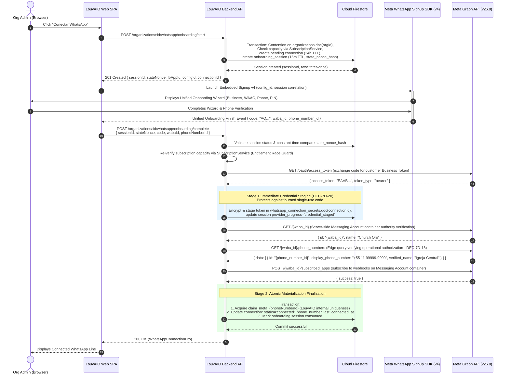

# LouvAIO WhatsApp Integration — Technical & Domain Architecture

> **Authoritative Business Reference:** *"Integração com WhatsApp — Regras de Negócio"*
> **Target Release:** Phase 7 (WhatsApp Integration)
> **Document Status:** Architectural Specification & Implementation Boundary Finalization (Phase 7A-R3 Finalized)
> **Author:** LouvAIO Product Architect
> **Authorities:** "Integração com WhatsApp — Regras de Negócio", AGENTS.md, MEMORY.md, docs/system-status.md, docs/product/system-overview.md

---

## 1. Executive Summary & Principles

This document establishes the canonical, reconciled technical and domain architecture for LouvAIO's WhatsApp integration. It freezes all topological, membership, governance, boundary, and phase-split contracts prior to any production implementation in Phase 7B.

### Non-Negotiable Locked Business Rules (BR-7A-01 .. BR-7A-13)
1. **Paid Plan Capacity:** Paid plans include 1 WhatsApp connection; additional connections are purchased as generic add-on blocks (`addons.additionalWhatsapps`).
2. **Organization Ownership:** The **Organization (Church)** is the exclusive owner of `WhatsAppConnection`. A Ministry *never* owns a connection.
3. **Default Connection:** An Organization defines at most one default WhatsApp connection. Ministries without an exclusive connection automatically inherit this default.
4. **Ministry Assignment:** An Organization may assign a connection exclusively to a Ministry if capacity permits. Ownership remains strictly with the Organization.
5. **Subscription Entitlement Authority:** The backend `SubscriptionService` is the sole authority for evaluating connection capacity. No frontend component may branch on plan names directly.
6. **Billing Model:** Subscriptions expose `includedConnections` and `additionalConnections`.
7. **Non-Destructive Preservation:** Plan downgrades, quota reductions, and billing lapses **never** delete connection documents or configuration. Excess connections transition into a deterministic `disabled_over_limit` state.
8. **Normalized Entity:** Connections are first-class entities storing provider metadata, phone number, and status without exposing credentials.
9. **Status Semantics:** Normalized state machine (`pending`, `connecting`, `connected`, `error`, `disabled_by_user`, `disabled_over_limit`, `disconnected`). Only `connected` sends messages.
10. **Role Separation:** Org Admin manages org connections, purchases, and assignments. Ministry leaders view and use assigned or default connections.
11. **Provider Abstraction:** Core logic interacts with `WhatsAppProvider` abstraction, isolating vendor-specific Meta Cloud API details.
12. **Official Platform Strategy:** Production strictly uses the official Meta WhatsApp Business Platform (Cloud API + Embedded Signup). Unofficial scraping or reverse-engineered APIs are prohibited.
13. **Customer Phone Ownership:** The customer organization supplies and owns its phone number. LouvAIO does not resell or provision carrier numbers.

---

## 2. Canonical Persistence Topology Resolution (DEC-7A-16-R1)

### The Topology Contradiction Resolved
Phase 7A contained a structural contradiction between nested subcollection path syntax (`organizations/:organizationId/whatsapp_connections`) and root collection references (`whatsapp_connections` with `organization_id`).

### Repository Audit & Architectural Evaluation
An audit of LouvAIO's existing 24 production Firestore collections confirms:
- **Zero Subcollections:** Every active domain aggregate (`ministries`, `ministry_members`, `schedules`, `songs`, `member_unavailabilities`, `ministry_announcements`, `ministry_subscriptions`, `billing_subscriptions`) is implemented as a **root collection** using tenant foreign keys (`ministry_id`, `user_id`).
- **Webhook Lookups:** Inbound Meta webhook events provide `provider_phone_number_id` or `provider_waba_id`. In a nested subcollection topology, resolving the connection document would require Firestore `collectionGroup` queries with collection-group index declarations and specialized security rules. In a root collection, it is a fast, direct query: `.where('provider_phone_number_id', '==', id).limit(1)`.
- **Composite Index Consistency:** Firestore composite indexes in `firestore.indexes.json` operate seamlessly on root collections with standard field scopes.
- **Tenant Isolation:** Invariant #4 requires server-side tenant filtering (`.where('organization_id', '==', organizationId)`). Root collections strictly satisfy this requirement.

### The Canonical Collection Map
All WhatsApp-related persistence is strictly structured as **Root Collections**:

| Collection Name | Scope / Hierarchy | Key Identifiers | Purpose |
| :--- | :--- | :--- | :--- |
| `organizations` | Root Collection | `id` (UUID / nanoid) | Institutional entity representing the Church. |
| `organization_members` | Root Collection | `id` (`${organization_id}_${user_id}`) | Membership and administrative RBAC for the Organization. |
| `whatsapp_connections` | Root Collection | `id` (`wac_*`), `organization_id` | Provisioned phone numbers and connection states (Phase 7C). |
| `whatsapp_provider_identity_claims` | Root Collection | `id` (`claim_${provider}_${provider_phone_number_id}`) | Atomic platform-wide provider identity uniqueness claims (Phase 7C). |
| `whatsapp_connection_secrets` | Restricted Root Collection | `id` (matches `connection_id`), `organization_id` | Encrypted access tokens and security metadata (Phase 7C). |
| `whatsapp_messages` | Root Collection | `id` (`wamsg_*`), `organization_id`, `ministry_id` | Transactional notification audit log and dispatch state (Phase 7G). |
| `whatsapp_webhook_events` | Root Collection | `id` (`wbh_*` or hash), `provider_event_id` | Sanitized webhook delivery log for deduplication (Phase 7E). |

*Subcollections are completely eliminated from the architecture.*

---

## 3. Organization Membership Model & RBAC (DEC-7A-14-R3, DEC-7A-20-R2)

### The `organization_members` Aggregate
To support multi-admin governance beyond a single `owner_user_id` without conflating institutional authority with ministry operations, LouvAIO introduces the `organization_members` root collection.

#### Schema
```typescript
export type OrganizationRole = 'owner' | 'admin';

export interface OrganizationMemberRecord {
  id: string; // Deterministic: `${organization_id}_${user_id}`
  organization_id: string; // Foreign key to organizations
  user_id: string; // Firebase Auth UID
  role: OrganizationRole; // 'owner' or 'admin'
  invited_by_user_id: string | null;
  created_at: string; // ISO 8601
  updated_at: string; // ISO 8601
}
```

#### Unique Invariants & Safety Rules
1. **Compound Uniqueness:** A user can have at most one role document per Organization (`id = `${organization_id}_${user_id}``).
2. **Owner Representation:** The user identified by `organizations.owner_user_id` MUST possess an `organization_members` record with `role: 'owner'`.
3. **Owner Cardinality:** Exactly one user holds `role: 'owner'` per Organization at any time.
4. **Owner Protection:** An owner membership can **never** be deleted through member management APIs (`DELETE /organizations/:id/members/:userId`). An owner cannot remove themselves without transfer.
5. **Ownership Transfer:** Transfer of institutional ownership is executed exclusively by `ORG_OWNER` and atomically:
   - Updates `organizations.owner_user_id = newOwnerUserId`;
   - Demotes the former owner in `organization_members` to `role: 'admin'`;
   - Promotes the new owner in `organization_members` to `role: 'owner'`.
6. **Least-Privilege Admin Delegation (DEC-7A-20-R2):**
   - **`ORG_OWNER`** exclusively manages Organization administrators (add, remove).
   - **`ORG_ADMIN`** CANNOT grant, promote, invite, or revoke other Organization admins or the Org Owner.
   - `ORG_ADMIN` authority is strictly focused on managing WhatsApp connections, assigning connections to child ministries, configuring the organization default connection, and reviewing billing/capacity summaries.

### Authoritative RBAC Matrix
Authority is strictly compartmentalized across domain boundaries:

| Permission / Action | `ORG_OWNER` | `ORG_ADMIN` | `MINISTRY_ADMIN` | `MINISTRY_MEMBER` |
| :--- | :---: | :---: | :---: | :---: |
| **Manage Organization Details & Transfer Ownership** | Yes | No | No | No |
| **Manage Billing Anchor Ministry** | Yes | No | No | No |
| **Add / Remove Organization Admins** | Yes | No | No | No |
| **Attach / Detach Ministries to Organization** | Yes | No | No | No |
| **Start WhatsApp Onboarding (Embedded Signup)** | Yes | Yes | No | No |
| **Configure Organization Default Connection** | Yes | Yes | No | No |
| **Assign Connection Exclusively to Ministry** | Yes | Yes | No | No |
| **Disconnect / Deactivate Connection** | Yes | Yes | No | No |
| **Purchase Add-on WhatsApp Capacity** | Yes | Yes* | No | No |
| **View Ministry Resolved WhatsApp Status** | Yes | Yes | Yes | No |
| **Trigger Schedule WhatsApp Notification** | Yes | Yes | Yes | No |
| **Receive Notification / Set Phone & Opt-Out** | Yes | Yes | Yes | Yes |

*\*Subject to commercial billing permissions on the billing anchor ministry.*

**Key Boundary Principle:** Being an Admin in a Ministry (`ministry_members.role === 'admin'`) gives administrative rights *only* inside that specific Ministry (repertoire, schedules, unavailabilities, team members). It does **not** grant Organization-level authority over WhatsApp connections or institutional governance.

---

## 4. Existing Ministries → Organization Association (DEC-7A-25-R2)

LouvAIO churches may operate multiple independent ministries in the system (e.g., *Louvor Geral*, *Louvor Jovens*, *Coral*). The association of these ministries into a unified Organization must be explicit, authorized, and non-destructive.

### Association Invariants & Authority
1. **Zero Heuristic Association:** The backend **NEVER** automatically groups ministries based on name similarity, email domain, shared members, or billing customer IDs. All associations must be explicitly authorized.
2. **Single Organization Boundary:** A Ministry belongs to **exactly one** Organization (`ministries.organization_id`).
3. **Strict Null-Organization Requirement (DEC-7A-25-R2):** Attaching a Ministry to Organization X succeeds **ONLY** if:
   ```text
   ministry.organization_id === null
   ```
   If the Ministry already belongs to ANY Organization (including an auto-provisioned standalone Organization), the request is strictly rejected with:
   ```text
   HTTP 409 Conflict (MINISTRY_ALREADY_HAS_ORGANIZATION)
   ```
4. **Organization Merge / Transfer Deferral:** LouvAIO does **NOT** support automatic or implicit merging of existing Organizations in Phase 7B. Merging a standalone Organization into another requires an explicit multi-tenant migration protocol (transferring members, resolving billing anchors, merging paid subscriptions, re-pointing WhatsApp connections, and archiving donor organizations). This capability is explicitly **DEFERRED**.
5. **Attach Authority (Dual-Authorization Handshake):** Attaching a Ministry to Organization X requires proof of authority in **both** contexts:
   - The executing actor must be the **`ORG_OWNER`** of Organization X; **AND**
   - The executing actor must be the **`owner`** or **`admin`** of the target Ministry.
6. **Preservation of Ministry Data:** Attaching a ministry causes **zero** changes to its songs, schedules, members, roles, unavailabilities, or subscriptions.
7. **Detach Authority & Safeguards:** A Ministry can be detached from an Organization **ONLY by the `ORG_OWNER`**, provided that the Ministry is **not** the `billing_anchor_ministry_id`.
   - Detaching the billing anchor ministry is strictly prohibited with `400 CANNOT_DETACH_BILLING_ANCHOR`.
   - Upon detachment:
     - `ministry.organization_id` is reset to `null`;
     - Any WhatsApp connection exclusively assigned to that ministry has its assignment cleared;
     - The detached Ministry operates independently without an Organization until explicitly provisioned;
     - Former Organization membership records are NOT copied to the ministry;
     - Ministry operational data and independent subscriptions remain 100% untouched.
8. **Empty-Organization Invariant:** An active Organization MUST always contain at least one Ministry (its billing anchor). Phase 7B operations can never produce an orphaned Organization with zero ministries.

---

## 5. Organization Provisioning & Concurrency Invariants (DEC-7A-27-R1)

### Invariants
1. **One-to-Many Cardinality:** An Organization contains 1 to N Ministries.
2. **Anchor Invariant:** An Organization must always have exactly one `billing_anchor_ministry_id`, and that ministry must belong to the Organization (`ministry.organization_id === organization.id`).
3. **Immutable Tenant ID:** The `organization.id` is immutable once created.

### Initial Owner Derivation & No Implicit Escalation (DEC-7A-27-R1)
In LouvAIO, every ministry document in Firestore maintains a canonical owner field: `ministries.owner_user_id: string`.
- **Authoritative Owner Source:**
  ```text
  INITIAL_ORG_OWNER_SOURCE: ministry.owner_user_id
  organizations.owner_user_id = ministry.owner_user_id
  ```
- **Strict Provisioning Authority:** Organization provisioning establishes institutional governance and is restricted strictly to the **Ministry Owner** (`ministry.owner_user_id`).
  - If a non-owner Ministry Admin attempts to invoke provisioning, the request is rejected with:
    ```text
    HTTP 403 Forbidden (ONLY_MINISTRY_OWNER_CAN_PROVISION_ORGANIZATION)
    ```
- **Zero Implicit Privilege Escalation:** Executing provisioning creates **exactly one** initial membership record:
  - `organization_members.doc(`${orgId}_${ministry.owner_user_id}`)` with `role: 'owner'`.
  - It does **NOT** grant Organization Admin (`role: 'admin'`) to any other Ministry Admin or member.
  - Any additional Organization Admins must be explicitly added post-creation by the `ORG_OWNER` via `POST /api/v1/organizations/:organizationId/members`.
  - This strictly preserves the boundary: **Ministry Authority != Organization Authority**.

### Explicit Provisioning Trigger (Command Pattern)
Creating an Organization establishes institutional tenant identity, legal owner authority, and billing anchors.
- **Strict Non-Mutating GET Behavior:** Ordinary authenticated `GET` requests (e.g., `GET /api/v1/ministries/:ministryId/whatsapp/status` or viewing a dashboard) **NEVER** implicitly create or provision an Organization. If no Organization exists, GET endpoints return `hasOrganization: false` or `404 Not Found`.
- **Explicit Provisioning Command:** Provisioning occurs strictly via an intentional `POST` command:
  ```text
  POST /api/v1/ministries/:ministryId/organization/provision
  ```

### Concurrency & Race Condition Resolution
When multiple provisioning requests are submitted concurrently:
- The backend executes inside an atomic Firestore transaction (`db.runTransaction`):
  1. Transaction reads `ministries.doc(ministryId)`.
  2. If `ministry.organization_id != null` (set by a concurrent transaction), the transaction commits nothing, aborts creation, and returns the existing Organization.
  3. If `ministry.organization_id == null`, the first transaction to commit creates:
     - `organizations.doc(orgId)` with `owner_user_id = ministry.owner_user_id`;
     - `organization_members.doc(`${orgId}_${ministry.owner_user_id}`)` with `role: 'owner'`;
     - Updates `ministries.doc(ministryId)` with `{ organization_id: orgId }`.
- **Resolution Invariant:** The first transaction to commit wins. The losing transaction retries, reads the newly set `organization_id`, and returns the existing Organization without overwriting `owner_user_id`, `role`, or `billing_anchor_ministry_id`.

---

## 6. Complete Billing Anchor Semantics (DEC-7A-15-R1, DEC-7A-28)

### Commercial Subscription Anchoring
Commercial billing in LouvAIO is currently anchored to individual ministries in `ministry_subscriptions`, integrated with Asaas recurring subscriptions.

To avoid breaking live payment gateway webhooks, customer IDs, and the `BillingReconcilerWorker`:
- The Organization inherits commercial capacity from its designated **Billing Anchor Ministry** (`organizations.billing_anchor_ministry_id`).

### Multi-Subscription & Transition Rules
1. **Initial Selection:** The billing anchor is automatically set to the initial ministry provisioned with the Organization.
2. **Phase 7B Foundation Immutability (DEC-7A-28):** Arbitrary mutation of `billing_anchor_ministry_id` is **NOT** exposed through public REST APIs in Phase 7B. Modifying commercial anchors during active billing transitions is commercially sensitive and is deferred to specialized billing phases with `billing-engineer`.
3. **Multiple Paid Subscriptions in One Organization:**
   - If an Organization contains Ministry A (on *Pro*) and Ministry B (on *Essential*):
     - **Safety Invariant:** LouvAIO executes **NO automatic cancellation, NO automatic migration, and NO automatic merging of existing subscriptions.**
     - **WhatsApp Entitlement Rule:** Exclusively the subscription of the **`billing_anchor_ministry_id`** governs the Organization's WhatsApp capacity.
     - **Other Ministry Subscriptions:** Ministry B's subscription remains fully active and independent, governing Ministry B's operational quotas (members, songs, smart chords, liturgy storage).
     - **Future Commercial Merging:** Unified multi-ministry institutional billing is deferred to specialized billing phases with `billing-engineer`.

---

## 7. Authoritative WhatsApp Entitlement Contract & Boundary Split (DEC-7A-29)

To ensure clean implementation boundaries and avoid coupling subsystems prematurely:
- **Phase 7B (Commercial Capacity Entitlement):** `SubscriptionService` evaluates commercial capacity derived exclusively from plan definitions and billing states.
- **Phase 7C (Connection Usage Composition & Enforcement):** A connection facade service combines commercial capacity with actual Firestore connection usage (`configuredConnectionsCount`, `capacityConsumingCount`, `remainingCapacity`, `isOverLimit`).
- **Phase 7H (Add-on Billing Integration):** Asaas recurring checkout and payment webhooks for additional WhatsApp connection blocks (`addons.additionalWhatsapps`).

### Phase 7B Method Signature
```typescript
SubscriptionService.getOrganizationWhatsAppCapacity(organizationId: string): Promise<OrganizationWhatsAppCapacity>
```

### Phase 7B Schema
```typescript
export interface OrganizationWhatsAppCapacity {
  organizationId: string;
  billingAnchorMinistryId: string;
  enabled: boolean; // True if subscription plan is active or in grace
  includedConnections: number; // 1 for paid plans (lite, lite_plus, essential, pro, premium), 0 for free
  additionalConnections: number; // Strictly 0 in Phase 7B runtime (extension seam for Phase 7H)
  totalAllowedConnections: number; // includedConnections + additionalConnections
  billingAccessMode: 'normal' | 'grace' | 'suspended';
}
```

### Additional Connection Policy for Phase 7B
- An audit of the production subscription engine confirms that member add-ons (`member_addon_blocks`) exist, but **no WhatsApp add-on schema (`addons.additionalWhatsapps`) exists in production code**.
- Phase 7B does **NOT** invent a premature add-on persistence schema.
- In Phase 7B runtime, `additionalConnections` evaluates to `0`. Phase 7B provides the clean extension seam for Phase 7H where `billing-engineer` will introduce Asaas recurring add-on blocks.

---

## 8. Billing Grace, Over-Limit & Non-Destructive Restrictions (DEC-7A-18-R1)

LouvAIO strictly enforces non-destructive data preservation.

### Operational Grace Period (`billingAccessMode === 'grace'`)
When a subscription payment is overdue but within the commercial grace window:
- **Sending Messages:** **Permitted**. Existing active connections continue dispatching operational schedule notifications without interruption.
- **New Onboarding:** **Blocked**. The system disallows starting new Embedded Signup sessions (`canCreateConnection: false` in 7C).
- **Configuration Modifications:** **Blocked**. Assigning or switching connections is locked.

### Restricted Over Limit (Phase 7C Operational Enforcement)
When commercial capacity drops below configured connections (e.g., plan downgrade from *Pro* to *Free*):
1. **Separation of Concerns:** Phase 7B establishes commercial capacity. Phase 7C introduces connection documents and evaluates whether `configuredConnectionsCount > totalAllowedConnections`.
2. **Zero Automatic Disabling / Zero Deletion:** The system **NEVER automatically picks a phone number to disable or disconnect.** Automatic selection risks shutting off the church's primary pastoral or administrative line.
3. **Operational Status:** In Phase 7C, when connections exceed capacity:
   - The Organization enters `restricted_over_limit`;
   - Creation of new connections is **BLOCKED**;
   - Outbound dispatch through all connections is **BLOCKED** with error code `RESTRICTED_OVER_LIMIT`;
   - The Org Admin must resolve the over-limit state by purchasing capacity (Phase 7H) or explicitly clicking **"Desconectar"** on specific connections.

---

## 9. Capacity Accounting & Loophole Elimination (Phase 7C Implementation)

### Status Definitions & Capacity Consumption (DEC-7C-04, DEC-7C-06)

| Connection Status | Consumes Quota Slot? | Can Send Messages? | Definition |
| :--- | :---: | :---: | :--- |
| `pending` | **Yes** | No | Reserved onboarding slot during Embedded Signup (expires via `pending_expires_at` 24h TTL). |
| `connecting` | **Yes** | No | Code exchanged, awaiting phone registration & webhook validation. |
| `connected` | **Yes** | **Yes** | Verified, active, and authorized to send template messages. |
| `error` | **Yes** | No | Transient technical fault, certificate mismatch, token expired, or health check failure. |
| `disabled_by_user` | **Yes** | No | Manually paused by Org Admin. Still occupies an allocated capacity slot. |
| `disconnected` | **No** | No | Soft-deleted / unlinked. Does NOT consume capacity. Permanent terminal state in V1. |

*(Note on `disabled_over_limit`: Removed per DEC-7C-04. Non-destructive quota over-limit is evaluated dynamically as an aggregate Organization mode `connectionAccessMode = 'restricted_over_limit'` rather than mutating individual connection documents.)*

### Elimination of the Accumulation Loophole (Phase 7C Enforced)
- In Phase 7C, new connection onboarding (`POST /whatsapp/onboarding/start`) strictly enforces:
  ```text
  configuredConnectionsCount < totalAllowedConnections
  ```
  where `configuredConnectionsCount` counts **ALL non-disconnected connections** (`status !== 'disconnected'`).
- The configured status set is strictly:
  ```typescript
  export const CONFIG_CONSUMING_STATUSES: WhatsAppConnectionStatus[] = [
    'pending',
    'connecting',
    'connected',
    'error',
    'disabled_by_user',
  ];
  ```
- To onboard a new connection when at quota, an administrator must explicitly **disconnect** an existing connection, moving it to `disconnected`.

---

## 10. Re-Upgrade Behavior & Sender Stability (DEC-7A-20-R1, DEC-7C-04)

When an Organization purchases additional add-on capacity or upgrades its plan:
1. **Explicit Reactivation Required:** Connections paused in `disabled_by_user` do **NOT** automatically resume sending messages.
2. **No Silent Sender Switching:** Automatic reactivation could cause recipients to unexpectedly receive messages from a different number than the one used during the restriction.
3. **Aggregate Over-Limit Lift:** When commercial capacity increases so that `configuredConnectionsCount <= totalAllowedConnections`, `connectionAccessMode` returns to `'normal'`. Existing `connected` lines immediately resume operational sending without individual document mutations.
4. **Administrative Flow:** The Org Admin dashboard indicates that newly purchased slots are available. If an Admin previously paused a line (`disabled_by_user`), the Admin explicitly clicks **"Reativar Conexão"**. The system validates that `configuredConnectionsCount <= totalAllowedConnections` and transitions the status to `connected`.

---

## 11. Default vs Exclusive Connection Invariants (DEC-7A-21-R1, DEC-7C-02, DEC-7C-03)

To eliminate routing ambiguity and ensure predictable messaging:

### 1. Default Connection Single Source of Truth (DEC-7C-02)
- **Canonical Authority:** `organizations.default_whatsapp_connection_id: string | null` is the **sole source of truth** for the Organization's default connection.
- **Elimination of Dual-Persistence Drift:** `whatsapp_connections.is_organization_default` is **REMOVED from the Firestore persistence schema**. It does NOT exist as a document field in `whatsapp_connections`.
- **Derived in API DTOs:** In API responses and DTOs (`WhatsAppConnectionDto`), `isOrganizationDefault: boolean` is derived dynamically on the server:
  ```typescript
  isOrganizationDefault = organization.default_whatsapp_connection_id === connection.id;
  ```
- **Atomic Mutation:** Setting or changing the default connection is an atomic update on the `organizations` document (`default_whatsapp_connection_id = connectionId`). Clearing the default sets `default_whatsapp_connection_id = null`. There is zero boolean dual-write drift or multi-connection boolean race.

### 2. Mutual Exclusivity Invariant
A connection **CANNOT** simultaneously be an Organization Default and an Exclusive Ministry Assignment:
- Setting a connection as the Organization default requires `connection.assigned_ministry_id === null`.
- Assigning a connection exclusively to a Ministry requires `organization.default_whatsapp_connection_id !== connection.id` (must clear or switch default first).

### 3. Assignment Cardinality (1:1)
- One connection is assigned to at most **one** Ministry (`assigned_ministry_id`).
- Each Ministry has at most **one** exclusively assigned connection.
- Shared usage occurs **exclusively** through the Organization default fallback.

### 4. Exclusive Unusable Fallback Prevention (DEC-7C-03)
A critical routing safety invariant:
- If Ministry M has an exclusive connection assigned, but that connection is currently **unusable** (`error`, `disabled_by_user`, `disconnected`):
  → The resolver **STRICTLY REFUSES** to send and fails with `CONNECTION_NOT_ACTIVE`.
  → The resolver **NEVER silently falls back** to the Organization default number.
- **Rationale:** If a youth ministry (*Louvor Jovens*) configured a dedicated number, and that line experiences a transient fault, dispatching messages from the church's senior pastoral line (*Atendimento Geral*) would violate recipient expectations, context, and privacy. Fallback to Organization default occurs **ONLY** when Ministry M has **NO explicit exclusive assignment** (`assigned_ministry_id === null`).

### 5. Connection Resolution Algorithm (`resolveWhatsAppConnection`)
When Ministry M requests message dispatch (Phase 7G):
1. **Commercial / Access Verification:**
   - Verify `ministry.organization_id !== null` (otherwise fail with `NO_ORGANIZATION`).
   - Evaluate `SubscriptionService.getOrganizationWhatsAppCapacity(org.id)`.
   - If `billingAccessMode === 'suspended'`, fail with `WHATSAPP_SUSPENDED`.
   - If `configuredConnectionsCount > totalAllowedConnections`, fail with `RESTRICTED_OVER_LIMIT`.
   - If `totalAllowedConnections === 0` (Free plan), fail with `RESTRICTED_OVER_LIMIT`.
2. **Step 1: Check Exclusive Ministry Assignment:**
   - Query: `whatsapp_connections.where('organization_id', '==', orgId).where('assigned_ministry_id', '==', M.id).limit(1)`.
   - If an exclusive connection is found:
     - If `status === 'connected'`: **Dispatch via Exclusive Connection**.
     - If `status !== 'connected'`: **Fail Closed with `CONNECTION_NOT_ACTIVE`** (do NOT fall back per DEC-7C-03).
3. **Step 2: Fallback to Organization Default (Only if No Exclusive Assignment):**
   - Read `org.default_whatsapp_connection_id`.
   - If `default_whatsapp_connection_id === null`: **Fail Closed with `NO_CONNECTION_AVAILABLE`**.
   - Load connection: `whatsapp_connections.doc(default_whatsapp_connection_id)`.
   - If not found or `connection.organization_id !== orgId`: **Fail Closed with `NO_CONNECTION_AVAILABLE`**.
   - If `connection.status === 'connected'`: **Dispatch via Organization Default Connection**.
   - If `connection.status !== 'connected'`: **Fail Closed with `CONNECTION_NOT_ACTIVE`**.

### 6. Lifecycle Transitions: Default & Assignment Preservation Rules (DEC-7C-11)
Across connection status transitions, pointers and assignments adhere to strict preservation vs cleanup invariants:

| Transition | Organization Default Pointer (`default_whatsapp_connection_id`) | Exclusive Ministry Assignment (`assigned_ministry_id`) | Routing / Dispatch Outcome |
| :--- | :--- | :--- | :--- |
| **`connected → error`** | **PRESERVED** | **PRESERVED** | Resolver returns `CONNECTION_NOT_ACTIVE`; zero fallback to default; resumes automatically once error cleared. |
| **`connected → disabled_by_user`** | **PRESERVED** | **PRESERVED** | Resolver returns `CONNECTION_NOT_ACTIVE`; zero fallback to default; resumes automatically once unpaused. |
| **`connected → disconnected`** (terminal) | **CLEARED ATOMICALLY** (`null`) | **CLEARED ATOMICALLY** (`null`) | Organization retains NO dead default pointer; Ministry assignment is freed, returning Ministry to unassigned state. |
| **`error → disconnected`** (terminal) | **CLEARED ATOMICALLY** (`null`) | **CLEARED ATOMICALLY** (`null`) | Organization retains NO dead default pointer; Ministry assignment is freed, returning Ministry to unassigned state. |
| **`disabled_by_user → disconnected`** (terminal)| **CLEARED ATOMICALLY** (`null`) | **CLEARED ATOMICALLY** (`null`) | Organization retains NO dead default pointer; Ministry assignment is freed, returning Ministry to unassigned state. |
| **`pending → disconnected`** (cancelled/expired)| **NO ACTION** (never set during pending) | **NO ACTION** (never set during pending) | Pending slot released; zero pointer/assignment mutations. |

- **Invariant: No Stale Pointers:** An Organization must NEVER retain `default_whatsapp_connection_id` pointing to a connection with status `disconnected`.
- **Invariant: No Dead Assignment Locks:** A Ministry must NEVER remain indefinitely locked to a `disconnected` connection. Clearing `assigned_ministry_id` on terminal disconnect releases the 1:1 constraint and permits immediate fallback to the Organization default or assignment to a newly provisioned connection.

### 7. Initial Configuration Eligibility vs Transient Failure Preservation (DEC-7C-15)

#### A. Initial Configuration Eligibility Gate (`status === 'connected'`)
- **Strict Precondition for New Configuration:**
  A connection can be newly set as the Organization Default (`organizations.default_whatsapp_connection_id`) or newly assigned to a Ministry (`whatsapp_connections.assigned_ministry_id`) **ONLY IF** its current lifecycle status is `'connected'`.
- **Rejection of Non-Operational States:**
  Attempting to configure a connection as default or assign it to a Ministry when its status is `'pending'`, `'connecting'`, `'error'`, `'disabled_by_user'`, or `'disconnected'` is strictly rejected with HTTP `400 CONNECTION_NOT_ACTIVE_FOR_CONFIGURATION`.
- **Materialization & Claim Preconditions:**
  Because `status === 'connected'` strictly requires non-null provider fields (`phone_number`, `provider_waba_id`, `provider_phone_number_id`) and active claim ownership in `whatsapp_provider_identity_claims`, no unverified or unmaterialized line can ever be bound as a traffic sender.

#### B. Configuration Preservation Across Transient Failures
- **Preservation During Non-Operational States:**
  If an *already configured* sender (Organization default or exclusively assigned) subsequently enters a transient degraded state (`connected → error` or `connected → disabled_by_user`), its pointer and assignment are **STRICTLY PRESERVED**. The system does not clear `default_whatsapp_connection_id` or `assigned_ministry_id`.
- **Fail-Closed Dispatch Behavior:**
  While degraded, any outbound message dispatch routed to that connection fails closed with `CONNECTION_NOT_ACTIVE`. Per DEC-7C-03, exclusively assigned lines never silently fall back to the Organization default.
- **Seamless Recovery:**
  When the line is restored (`error → connected` or `disabled_by_user → connected`), normal message dispatch resumes automatically without administrative intervention or re-binding.

#### C. Configured Sender Historical Invariant
- **Architectural Guarantee:**
  Because entry into configured sender status requires `status === 'connected'`, and subsequent degradation retains the configuration, **any connection that is currently configured as an Organization default or assigned to a Ministry necessarily satisfies**:
  ```typescript
  connection.last_connected_at !== null &&
  isProviderIdentityMaterialized(connection) === true &&
  hasValidProviderClaim(connection) === true
  ```
- **Terminal Disconnect Invariant:**
  Terminal disconnect (`→ disconnected`) is the sole lifecycle event that unconditionally and atomically clears both the Organization default pointer and the Ministry assignment lock (per DEC-7C-11).

---

## 12. Recipient Phone Normalization & Validation (DEC-7A-22-R1)

### Canonical Storage: Strict E.164
- Phone numbers in `users` and `ministry_members` are stored strictly in **E.164** format:
  ```text
  ^\+[1-9]\d{1,14}$
  ```
  Example: `+5511999998888`, `+14155552671`.

### Elimination of Backend Regional Bias
- The backend API **NEVER** silently assumes `+55` or any country code. Any phone payload missing a leading `+` or country code is rejected with HTTP `400 INVALID_PHONE_E164`.
- **Frontend Localization:** The web application provides country code selection defaulting to `+55` (Brazil) for Brazilian locales, performing client-side normalization into E.164 before transmission.

---

## 13. Secret Storage & Envelope Encryption Hardening (DEC-7A-19-R1, DEC-7C-08)

Meta Cloud API System User Tokens must be secured against data breaches and cross-tenant transplantation (implemented in Phase 7C).

### Cryptographic Specification
- **Algorithm:** AES-256-GCM (Authenticated Encryption with Associated Data).
- **Master Key:** `WHATSAPP_TOKEN_ENCRYPTION_KEY` configured in backend `unifiedConfig` (32-byte cryptographically random key, Base64-encoded). Server-only secret, never exposed to clients or build artifacts.
- **Nonce / IV:** Cryptographically secure unique 12-byte initialization vector generated per encryption operation (`crypto.randomBytes(12)`). IV reuse is strictly prohibited.
- **Authentication Tag:** 16-byte GCM authentication tag verifying ciphertext integrity (`cipher.getAuthTag()`).
- **Associated Authenticated Data (AAD):** The AAD binds the ciphertext to the exact tenant context:
  ```text
  AAD = `${organization_id}:${connection_id}`
  ```
  This prevents ciphertext transplantation attacks between connections or organizations.
- **Key Versioning:** Each secret record contains `key_version: number` (initial version: `1`) to enable zero-downtime key rotation in future phases.
- **Storage Encodings (DEC-7C-08):**
  - `encrypted_access_token`: Base64 string
  - `iv`: Base64 string (12 decoded bytes)
  - `auth_tag`: Base64 string (16 decoded bytes)
- **Fail-Closed Decryption:** Decryption failures throw `AppError(500, 'SECRET_DECRYPTION_FAILED')` and halt execution immediately.
- **Zero Logging:** Decrypted tokens are strictly prohibited from application logs, error traces, and diagnostic payloads.

### Boot-Safe Configuration Loading (DEC-7C-08)
- In `backend/src/config/unifiedConfig.ts`, the encryption key is defined as optional:
  ```typescript
  whatsappTokenEncryptionKey: z.string().optional()
  ```
- **Application Boot Safety:** Absence of `WHATSAPP_TOKEN_ENCRYPTION_KEY` in development or staging environments does **NOT** cause application boot failure while WhatsApp crypto operations remain uninvoked.
- **Runtime Fail-Closed Guard:** The crypto service (`WhatsAppEncryptionService`) evaluates the key upon construction or crypto invocation:
  - If the key is absent, empty, not valid Base64, or decodes to length !== 32 bytes (`Buffer.from(key, 'base64').length !== 32`):
    The service throws a typed internal configuration error `AppError(500, 'WHATSAPP_ENCRYPTION_KEY_INVALID_OR_MISSING')`.
- **Production Release Requirement:** Provisioning `WHATSAPP_TOKEN_ENCRYPTION_KEY` in Vercel Production is a mandatory prerequisite prior to deploying Phase 7C backend code.

#### `whatsapp_connection_secrets` Schema (Phase 7C)
```typescript
export interface WhatsAppConnectionSecretRecord {
  id: string; // matches connection_id
  connection_id: string; // foreign key to whatsapp_connections
  organization_id: string; // tenant boundary for cumulative anti-IDOR
  key_version: number; // encryption key version for rotation (1 initially)
  encrypted_access_token: string; // Base64 ciphertext
  iv: string; // Base64 IV (12 bytes)
  auth_tag: string; // Base64 GCM Tag (16 bytes)
  token_type: 'system_user' | 'user_token'; // [EXTERNAL META VALIDATION REQUIRED for token lifespan]
  expires_at: string | null; // ISO 8601 or null if permanent
  created_at: string; // ISO 8601 UTC
  updated_at: string; // ISO 8601 UTC
}
```

---

## 14. Webhook Event Retention, Privacy & Sanitization (DEC-7A-23-R1)

Inbound Meta webhook payloads may contain sensitive PII, participant phone numbers, and message bodies (Phase 7E).

### Minimization & Sanitization Policy
1. **No Indefinite Raw Payload Storage:** Storing unredacted raw webhook JSON payloads indefinitely violates data minimization principles.
2. **Sanitized Persistence Schema:**
   ```typescript
   export interface WhatsAppWebhookEventRecord {
     id: string; // sha256(provider_event_id) or wbh_*
     provider_event_id: string; // Meta event identifier for deduplication
     connection_id: string | null; // Resolved connection
     event_type: string; // e.g. 'messages.status_update'
     processing_status: 'received' | 'processed' | 'ignored' | 'failed';
     error_code: string | null;
     sanitized_metadata: {
       message_id?: string;
       recipient_phone_hash?: string; // Hashed phone for tracing without PII
       status?: 'sent' | 'delivered' | 'read' | 'failed';
       timestamp?: string;
     };
     processed_at: string | null;
     created_at: string; // ISO 8601
   }
   ```
3. **Retention TTL:** Webhook event records are retained for **30 days** for operational deduplication and delivery troubleshooting, after which they are purged by a background sweeper.

---

## 15. Disconnect vs Delete Semantics (DEC-7A-24-R1)

To balance user control with auditability and relational integrity (Phase 7C):

### Disconnect (Operational Deactivation)
- **Action:** `POST /api/v1/organizations/:organizationId/whatsapp/connections/:connectionId/disconnect`
- **Semantics:**
  - Deregisters webhook subscriptions from Meta;
  - Sets `status: 'disconnected'`;
  - Clears `is_organization_default` and `assigned_ministry_id`;
  - Releases the capacity slot (`configuredConnectionsCount` decreases);
  - **Preserves** the connection record and historical `whatsapp_messages` audit trail.

### Delete (Hard Record Purge)
- **Action:** `DELETE /api/v1/organizations/:organizationId/whatsapp/connections/:connectionId`
- **Semantics:**
  - Allowed **ONLY** if `whatsapp_messages` has 0 messages linked to this connection, OR if the Org Owner provides explicit multi-step confirmation (`force=true`);
  - Permanently purges the secret from `whatsapp_connection_secrets`;
  - Permanently removes the `whatsapp_connections` document.

---

## 16. First Messaging Use Case: Schedule Call-Up Notifications (DEC-7A-26)

### Functional Flow (Phase 7G)
1. **Explicit Admin Trigger:** Notifications are triggered **only** when a Ministry Admin explicitly clicks **"Notificar Escala via WhatsApp"** in `ScheduleDetailsView`. No automated background dispatch on schedule creation in V1.
2. **Audience Filtering:**
   - Evaluates schedule participants;
   - Skips participants with `opt_out_whatsapp === true`;
   - Skips participants with no valid E.164 `phone`, flagging them in the dispatch report.
3. **Idempotency Key:**
   ```text
   idempotencyKey = sha256(`${scheduleId}_${memberId}_${scheduleUpdatedAt}`)
   ```
   Repeated clicks within a 10-minute window detect the existing dispatch record in `whatsapp_messages` and prevent duplicate WhatsApp delivery.
4. **Template Concept:** `escala_convocacao_v1`
   - Parameter 1: Member First Name
   - Parameter 2: Event / Service Name
   - Parameter 3: Service Date
   - Parameter 4: Service Time
   - Parameter 5: Musical / Ministry Role
   - Parameter 6: Confirmation Link URL
5. **Audit Record:** Persisted in `whatsapp_messages` with initial status `queued`, updated via webhooks to `sent`, `delivered`, `read`, or `failed`.

---

## 17. Provider-Dependent Assumptions Register

The following items are external dependencies on Meta's WhatsApp Cloud API platform and are explicitly cataloged as **`[EXTERNAL META VALIDATION REQUIRED]`**:

1. **`[EXTERNAL META VALIDATION REQUIRED]` Embedded Signup SDK Response:** Verification of the exact JSON payload returned by Meta's Embedded Signup JavaScript SDK and the exact System User Token exchange handshake on Graph API v21.0.
2. **`[EXTERNAL META VALIDATION REQUIRED]` Mobile Coexistence:** Official confirmation of Meta's policy regarding whether a phone number currently active on the mobile WhatsApp Business App can simultaneously receive Cloud API messages without full account migration.
3. **`[EXTERNAL META VALIDATION REQUIRED]` Utility Template Pre-Approval:** Confirmation of whether operational utility templates (`escala_convocacao_v1`) can be programmatically submitted via Graph API or must be pre-approved in the Meta Business Manager UI.
4. **`[EXTERNAL META VALIDATION REQUIRED]` System User Token Expiration:** Validation of the lifespan of Meta System User Tokens (permanent vs 60-day refresh requirement).
5. **`[EXTERNAL META VALIDATION REQUIRED]` Webhook Signature Verification:** Validation of Meta's exact HMAC-SHA256 signature header format (`X-Hub-Signature-256`) and payload digest calculation.

---

## 18. Updated Decision Register (DEC-7A-01 .. DEC-7A-29, DEC-7C-01 .. DEC-7C-15, DEC-7D-01 .. DEC-7D-62)

| Decision ID | Status | Subject | Summary |
| :--- | :--- | :--- | :--- |
| **DEC-7A-01** | Locked | Plan Capacity Model | Paid plans include 1 connection; extra via generic add-on blocks. |
| **DEC-7A-02** | Locked | Connection Ownership | Organization is the sole owner. Ministry never owns. |
| **DEC-7A-03** | Locked | Organization Default | Max 1 default per Organization; inherited by unassigned ministries. |
| **DEC-7A-04** | Locked | Ministry Assignment | Organization may assign connection exclusively to 1 Ministry. |
| **DEC-7A-05** | Locked | Entitlement Authority | `SubscriptionService` authorizes creation; no client plan logic. |
| **DEC-7A-06** | Locked | Billing Contract | Exposes included and additional connection capacities. |
| **DEC-7A-07** | Locked | Data Preservation | Plan lapses never delete connection documents. |
| **DEC-7A-08** | Locked | Entity Normalization | First-class entity without exposed secrets. |
| **DEC-7A-09** | Locked | Status Semantics | State machine defined; only `CONNECTED` dispatches. |
| **DEC-7A-10** | Locked | Security Roles | Org Admin manages; Ministry Admin uses. |
| **DEC-7A-11** | Locked | Provider Abstraction | `WhatsAppProvider` isolates vendor details. |
| **DEC-7A-12** | Locked | Official Strategy | Meta Cloud API + Embedded Signup; scraping prohibited. |
| **DEC-7A-13** | Locked | Phone Ownership | Customer owns phone number; LouvAIO does not resell lines. |
| **DEC-7A-14-R3**| **Finalized** | Organization Membership & No Escalation | Introduces `organization_members`; provisioning creates owner record only (no implicit Org Admin grant). |
| **DEC-7A-15-R1**| **Remediated** | Billing Anchor Semantics | Subscriptions remain on `ministry_subscriptions`; zero auto-merging of multi-ministry subscriptions. |
| **DEC-7A-16-R1**| **Remediated** | Canonical Root Topology | Rejects subcollections; mandates root collections for all 6 entities. |
| **DEC-7A-17-R1**| **Remediated** | Capacity Accounting | Counts all non-disconnected connections; closes rotation loophole (Phase 7C). |
| **DEC-7A-18-R1**| **Remediated** | Non-Destructive Over-Limit | Replaces automatic phone disabling with `restricted_over_limit` mode & manual admin resolution (Phase 7C). |
| **DEC-7A-19-R1**| **Remediated** | Secret Storage Hardening | AES-256-GCM envelope encryption with key versioning and AAD tenant binding (Phase 7C). |
| **DEC-7A-20-R2**| **Finalized** | Least-Privilege Org Governance | `ORG_OWNER` manages admins and ministries; `ORG_ADMIN` manages connections only. |
| **DEC-7A-21-R1**| **Remediated** | Default vs Exclusive Invariant | Mutually exclusive; connection cannot be both default and assigned. 1:1 cardinality. |
| **DEC-7A-22-R1**| **Remediated** | Strict E.164 Backend | Backend rejects non-E.164; regional +55 defaults isolated to frontend. |
| **DEC-7A-23-R1**| **Remediated** | Webhook Privacy & Retention | Sanitized metadata persistence; 30-day retention TTL; no raw payload storage (Phase 7E). |
| **DEC-7A-24-R1**| **Remediated** | Disconnect vs Delete | Disconnect preserves audit; Delete purges record (restricted; Phase 7C). |
| **DEC-7A-25-R2**| **Finalized** | Strict Null-Org Attach & Merge Deferral | Attaching requires `ministry.organization_id === null`; already-provisioned ministries rejected (409); merge deferred. |
| **DEC-7A-26** | **New** | First Messaging Use Case | Explicit manual schedule call-up with idempotency and audit trail (Phase 7G). |
| **DEC-7A-27-R1**| **Finalized** | Owner Derivation & Provisioning Authority | `INITIAL_ORG_OWNER_SOURCE: ministry.owner_user_id`; provisioning restricted strictly to Ministry Owner. |
| **DEC-7A-28** | **New** | Billing Anchor Immutability in 7B | Public REST API does not mutate billing anchor in Phase 7B foundation. |
| **DEC-7A-29** | **New** | Commercial Entitlement Phase Split | 7B evaluates commercial capacity; 7C evaluates connection usage/over-limit; 7H evaluates add-on checkout. |
| **DEC-7C-01** | **Frozen** | Canonical Schema & Materialization Boundary | Defines `WhatsAppConnectionRecord` with explicit materialization boundary; provider IDs null allowed in `pending`, `connecting`, `error`, and unmaterialized `disconnected`. |
| **DEC-7C-02** | **Frozen** | Default Connection Single Source of Truth | `organizations.default_whatsapp_connection_id` is sole canonical authority; `is_organization_default` removed from persistence, derived in DTO. |
| **DEC-7C-03** | **Frozen** | Exclusive Unusable Fallback Prevention | Unusable exclusive connection fails with `CONNECTION_NOT_ACTIVE`; zero silent fallback to Organization default. |
| **DEC-7C-04** | **Frozen** | Status Model & State Machine Compatibility | 6 states; complete 6x6 transition matrix; `error → disabled_by_user` allowed only if previously connected (`last_connected_at !== null`) and materialized; `disconnected` is strictly terminal. |
| **DEC-7C-05** | **Frozen** | Atomic Terminal Disconnect Transaction | Disconnect runs in atomic transaction: clears default pointer, clears ministry assignment, deletes provider claim, purges secret; public endpoint deferred to 7D. |
| **DEC-7C-06** | **Frozen** | Capacity-Consuming Status Set | Configured count evaluates `['pending', 'connecting', 'connected', 'error', 'disabled_by_user']`; `disconnected` is excluded. |
| **DEC-7C-07** | **Frozen** | Atomic Provider Identity Claim & Acquisition | Transactional claim acquired when `provider_phone_number_id` becomes known; `connected` requires claim ownership; held through `error`/`disabled_by_user`; released on disconnect. |
| **DEC-7C-08** | **Frozen** | Crypto Storage Encoding & Config Loading | Base64 encoding for ciphertext, IV, auth tag; optional config at boot, fail-closed runtime validation upon crypto invocation. |
| **DEC-7C-09** | **Frozen** | Composite Index & Exact Query Mapping | Declares 3 composite indexes for `whatsapp_connections` mapped to exact runtime queries; claim collection uses deterministic PKs requiring zero composite indexes. |
| **DEC-7C-10** | **Frozen** | Pending TTL Ownership | Schema includes `pending_expires_at` (24h); automated cleanup sweeper deferred to Phase 7D onboarding. |
| **DEC-7C-11** | **Frozen** | Terminal Disconnect Cleanup Invariants | Disconnect atomically clears `default_whatsapp_connection_id` and `assigned_ministry_id`; assignments strictly preserved across transient `error` and `disabled_by_user`. |
| **DEC-7C-12** | **Frozen** | Disconnected Nullability Reconciliation | Schema permits null provider identifiers in `disconnected` specifically for unmaterialized onboarding reservations cancelled or expired. |
| **DEC-7C-13** | **Frozen** | Provider Identity Materialization Invariant | Materialization (`provider_waba_id`, `provider_phone_number_id`, `phone_number` non-null) is mandatory for `connected` and `disabled_by_user`; pre-materialization errors allowed in `connecting` and `error`. |
| **DEC-7C-14** | **Frozen** | Bounded Cursor Pagination & Lookahead Contract | Connection listing enforces compound ordering (`created_at DESC, __name__ DESC`), default 25, max 50, opaque cursor `{ createdAt, id }`; repository queries `pageSize + 1` to determine `hasMore` without ghost cursors; no offset pagination. |
| **DEC-7C-15** | **New** | Initial Configuration Eligibility & Transient Preservation | New default selection and exclusive assignment require `status === 'connected'`; transient degradation (`error`, `disabled_by_user`) preserves existing configuration; configured connections maintain invariant `last_connected_at !== null`. |
| **DEC-7D-01** | **Superseded** | Embedded Signup v4 Unified Handshake | Web client implements Embedded Signup v4 completion handler with legacy v2/v3 fallback; single-use OAuth code exchange remains mandatory server-to-server. |
| **DEC-7D-02** | **Hardened** | WhatsApp Business App Coexistence & Disconnect Continuity | Supports WhatsApp Business App (SMB) coexistence where dynamically eligible by Meta; strictly prohibits phone deregistration on disconnect to preserve physical mobile app continuity. Consumer WhatsApp Messenger is incompatible. |
| **DEC-7D-03** | **Hardened** | Customer Account Ownership & Legacy WABA Transition | Customer organization owns WhatsApp Account (WAAC) and Messaging Account in Meta Business Portfolio; historical WABA IDs act as or alias to Messaging Account containers in Graph API v26.0; Embedded Signup v4 yields `waba_id` as this container. |
| **DEC-7D-04** | **Hardened** | Three-Tier Permission & Scope Governance | Formally distinguishes App Review requirements (`whatsapp_business_management`, `business_management`), Login for Business config scopes, and Runtime API token scopes. |
| **DEC-7D-05** | **Hardened** | Server-Side Business Token Exchange, Staging & Secret Encryption | Backend exchanges OAuth code for customer Business Token; recognizes gap in Phase 7C secret type union; encrypted immediately with AES-256-GCM + AAD; zero plaintext exposure. |
| **DEC-7D-06** | **Hardened** | Ephemeral Onboarding Sessions & CSRF Request Nonce | Allocates `whatsapp_onboarding_sessions` with 15-minute TTL; stores SHA-256 hash `state_nonce_hash` for constant-time CSRF request verification; marks session `consumed` on finalization. |
| **DEC-7D-07** | **Hardened** | Concurrency-Safe Capacity Reservation & SubscriptionService Authority | Transactional pre-allocation on `organizations.doc(orgId)` serializes admissions; delegates entitlement checks exclusively to `SubscriptionService.evaluateOrganizationWhatsAppCapacity`. |
| **DEC-7D-08** | **Hardened** | Atomic Materialization & Credential Staging Saga | Onboarding completion validates session, exchanges token, stages encrypted credential, verifies assets, registers provider claim, and transitions to `connected` via a resilient distributed saga. |
| **DEC-7D-09** | **Hardened** | Global Webhook Verification & HMAC-SHA256 Validation | Public webhook endpoint echoes `hub.challenge` on GET and validates `X-Hub-Signature-256` HMAC-SHA256 against raw payload Buffer using `META_APP_SECRET`. |
| **DEC-7D-10** | **Hardened** | Two-Tier Error Normalization Strategy | Classifies Meta Graph errors via canonical numeric codes (`190`, `100`), Graph API error `type`/subcode, with deterministic HTTP status fallback. |
| **DEC-7D-11** | **Hardened** | Line Disconnect Offboarding & Revocation Scope Safety | Line disconnect strictly omits `DELETE /me/permissions` because authorization revocation is customer-portfolio-scoped and unsafe per-connection; evaluates webhook unsubscription via platform-wide dependent check; prohibits phone deregistration; retryable errors preserve local state. |
| **DEC-7D-12** | **Hardened** | Phase 7D Implementation Decomposition & Frontend Boundary | Partitions backend delivery into 7D1 (Onboarding & Credentials), 7D2 (Webhooks & Sync), and 7D3 (Disconnect & Revocation). All UI screen implementations remain strictly assigned to Phase 7F. |
| **DEC-7D-13** | **Hardened** | Configurable Meta Graph API Version Policy (Pinned v26.0 Validated) | Mandates `META_GRAPH_API_VERSION` server config (validated on v26.0, default `v26.0`); strictly prohibits unversioned Graph API calls; expiration date classified as TBD. |
| **DEC-7D-14** | **Hardened** | Multi-Connection Shared Messaging Account & Webhook Lifecycle | Explicitly permits multiple connection records under a single `provider_waba_id`. Webhook subscription is shared infrastructure governed by platform-wide dependent connection count. |
| **DEC-7D-15** | **New** | Ephemeral Registration PIN Handling & Security | Six-digit Cloud API registration PIN is handled strictly in-memory during onboarding; never logged, never persisted in Firestore database records. |
| **DEC-7D-16** | **Hardened** | Entitlement Downgrade Race & Verification Gate | `onboarding/complete` re-verifies subscription capacity and access mode via `SubscriptionService` prior to claim acquisition; permits completion during grace access mode for already-reserved slots. |
| **DEC-7D-17** | **New** | Lazy Organization-Scoped Pending Expiry & Zero-Index Sweeper | Expired `pending` connections (`pending_expires_at <= now`) are evaluated and cleaned lazily during organization-scoped operations using existing index (`organization_id ASC, status ASC`). Zero new composite indexes declared for 7D. |
| **DEC-7D-18** | **Hardened** | Untrusted Browser Hints & Operational Authorization Verification Gate | Webhook/postMessage `waba_id` and `phone_number_id` are treated as untrusted hints; backend validates operational authorization via Graph edge query (`GET /{waba_id}/phone_numbers`) and direct phone attributes (`GET /{phone_number_id}`) before claiming. |
| **DEC-7D-19** | **Hardened** | Platform-Wide Dependent Query for Shared Messaging Container | Evaluates dependent connections across the entire platform before calling `DELETE /{waba_id}/subscribed_apps`, ensuring sibling lines across ministries/organizations retain webhook delivery. |
| **DEC-7D-20** | **Hardened** | Credential Staging Saga, Progressive Provider Progress & Partial Failure Lifecycle | Immediately encrypts and stages Business Token in `whatsapp_connection_secrets` upon code exchange; tracks server-derived `provider_progress` across progressive staging steps; permanent pre-materialization failures immediately purge staged secret and execute atomic terminal release to `disconnected` (zero stranded capacity); transient provider errors retain staged secret for safe retry; unrecoverable session expiry on staged pending connections permits session rotation via `POST /start` without repeating Meta Embedded Signup; `error` status is strictly banned for unrecoverable pre-materialization states. |
| **DEC-7D-21** | **Hardened** | Multi-Partner Phone Sharing & Internal Uniqueness Scope | Acknowledges Meta's multi-partner phone sharing model; `claim_meta_${phoneNumberId}` strictly enforces LouvAIO-internal tenant isolation and uniqueness, not Meta global exclusivity. |
| **DEC-7D-22** | **New** | Read-Only Listing Contract & Strictly Isolated Expiry Evaluation | `GET /connections` is strictly read-only with in-memory expired pending exclusion; database cleanup mutations occur exclusively within write transactions (`onboarding/start`) or scheduled maintenance. |
| **DEC-7D-23** | **New** | 2026 Account Model, Quality Scope & Limits Decomposition | Formally distinguishes WAAC (phone numbers, identity) from Messaging Account (templates, billing, webhooks); assigns Quality Rating to Phone Number (`phone_number_id`); decomposes limits into 6 distinct scopes (templates, throughput, messaging tier, API/BUC, quality, billing). |
| **DEC-7D-24** | **New** | LouvAIO `provider_waba_id` Semantic Freeze & Compatibility | Freezes `provider_waba_id` strictly as Transitional Graph Messaging Account Container Identifier; confirms `PHASE_7C_PROVIDER_ID_COMPATIBILITY: COMPATIBLE_WITH_TRANSITION_ADAPTER`; WAAC ID discoverable via phone edge if needed in future. |
| **DEC-7D-25** | **New** | Webhook Subscription Container Authority & Offboarding Key | Confirms `SUBSCRIBED_APPS_SEMANTIC_OWNER = Messaging Account` and `SUBSCRIBED_APPS_CURRENT_GRAPH_ID = provider_waba_id`; offboarding dependency grouping key is `provider_waba_id`. |
| **DEC-7D-26** | **New** | Provider Authorization Revocation Scope & Safety Boundary | `DELETE /me/permissions` operates at customer portfolio scope; `SAFE_PER_CONNECTION: NO`; strictly excluded from standard per-line disconnect to protect sibling lines. |
| **DEC-7D-27** | **Hardened** | Onboarding Capacity Liveness Invariant & Zero-Stranded-Capacity Rule | A WhatsApp onboarding flow must NEVER enter a state where the onboarding session cannot be resumed/completed, no public/admin recovery operation exists, and the associated connection remains in a capacity-consuming state (`pending`, `connecting`, `error`). Governed by a strict 3-tier hierarchy: (1) Immediate terminal release to `disconnected` for unrecoverable pre-materialization failures; (2) Active supported retry/resume for transient provider errors, browser abandonment, and staged billing pauses; (3) Eventual 24-hour TTL lazy terminal cleanup as ultimate safety boundary. |
| **DEC-7D-28** | **Hardened** | Terminal Pre-Materialization Release Semantics & Predicate Guard | Enforces canonical predicate `isTerminalPreMaterializationReservation(connection)` requiring null provider IDs, null phone number, absence of identity claims, absence of default/exclusive assignments, and staged secret purge. Qualified connections transition atomically to `disconnected` (`pending_expires_at: null`, `assigned_ministry_id: null`), immediately releasing configured capacity. |
| **DEC-7D-29** | **Hardened** | Ephemeral Session Expiry, Browser Abandonment & Model B Dual-Branch Reservation Reuse | Selects Model B for abandoned or retried flows: `startOnboarding` evaluates existing `pending` reservations via explicit `resumeConnectionId` target; if pre-materialization, branches into Clean Pending (`hasStagedSecret === false`: rotates fresh session, requires normal billing, user re-launches Embedded Signup) or Staged Pending (`hasStagedSecret === true`: rotates recovery session in `credential_staged` mode, permits normal or grace billing, carries forward `provider_progress`, skips OAuth exchange). Preserves original hard reservation deadline (`pending_expires_at`) without extension. Consumes zero additional capacity slots, eliminating capacity deadlocks for single-slot organizations. |
| **DEC-7D-30** | **Hardened** | Late Subscription Restriction Non-Destructive Staged Retention & Billing Regularization Resume | Step 10 commercial capacity/suspension failure retains staged secret and connection in `pending` (`status_reason: 'SUBSCRIPTION_RESTRICTED'`), allowing completion retry upon billing regularization without burning single-use OAuth codes. If regularized after session expiry (>15m) but before the hard 24h deadline, `POST /start` with `resumeConnectionId` rotates a fresh recovery session (`mode = 'resume_staged'`) allowing immediate completion. |
| **DEC-7D-31** | **Hardened** | Strict Error Status Ban for Unrecoverable Pre-Materialization States | `status === 'error'` is capacity-consuming and strictly prohibited for pre-materialization failures with no recovery path; permanent failures (`UNAUTHORIZED_WABA_ACCESS`, `PHONE_NOT_IN_WABA`, `PHONE_ALREADY_REGISTERED`, `STAGED_SECRET_LOST`) must transition to `disconnected`. |
| **DEC-7D-32** | **Hardened** | Ephemeral Session State Machine, Progressive Provider Progress Authority, 30-Day Bounded Retention & Replay Idempotency | Formalizes authoritative orthogonalization between `WhatsAppOnboardingSessionStatus` (`'active' | 'consumed' | 'expired' | 'failed'`) and server-derived `provider_progress` (`'none' | 'credential_staged' | 'assets_verified' | 'phone_registered' | 'waba_subscribed'`). The session remains `status = 'active'` during credential staging and intermediate provider steps, advancing to `'consumed'` strictly upon Step 10 transactional materialization commit. The 15-minute TTL denotes logical expiry (`expires_at <= now`). Bounded physical retention is 30 days (`retention_expires_at = created_at + 30 days`); automated physical Firestore TTL deletion at 15 minutes is strictly prohibited so that staged recovery can copy forward progress and replayed completions can be resolved idempotently. On staged resume, the new session atomically copies forward `provider_progress` and verified IDs from the prior current session; if secret exists but prior progress is missing or inconsistent, rotation fails closed (`500 ONBOARDING_RECOVERY_STATE_CORRUPTED`). Single-use code exchange and secret staging commit atomically in one Firestore transaction. Restricts PIN registration retry to in-memory re-prompt without persistence. |
| **DEC-7D-33** | **New** | Single-Current-Session Pointer, Compare-Current Clearing & Stale Completion Guard | A pending connection possesses 0 or 1 current onboarding session at any time (`connection.current_onboarding_session_id`). Rotating a session marks the prior session `expired` and atomically updates the pointer. `POST /onboarding/complete` MUST verify that `session.connection_id === connection.id` AND `connection.current_onboarding_session_id === session.id` before executing OAuth code exchange, secret access, Graph API calls, or claim acquisition; if mismatched, it aborts immediately with `409 ONBOARDING_SESSION_SUPERSEDED` with zero provider side-effects. Pointer clearing uses compare-current semantics: an old session never clears a newer session pointer. |
| **DEC-7D-34** | **New** | Hard Reservation Deadline & Non-Sliding Connection TTL | `pending_expires_at` represents the non-sliding commercial capacity reservation deadline set strictly once at initial allocation (`createdAt + 24h`). Session rotation in Branch B1 or B2 MUST NOT extend this deadline. Lapsing of a 15-minute session does not reset commercial reservation age. If `now >= pending_expires_at`, resume is strictly prohibited and the connection enters terminal cleanup. |
| **DEC-7D-35** | **New** | Deterministic Resume Target via Explicit `resumeConnectionId` Request Schema & Multi-Admin Tenancy | `POST /onboarding/start` request schema defines optional `resumeConnectionId?: string`. Omission deterministically requests a NEW reservation (Branch A). Presence deterministically requests RESUME of that exact connection (Branch B), failing closed with 404 if connection does not exist or does not belong to the route organization, 409 if already connected, or 410 if reservation deadline has passed. Multi-admin resume is organization-owned: any Org Owner or Admin may resume onboarding, recording the new admin's UID as `actor_user_id` while superseding previous sessions. |
| **DEC-7D-36** | **Hardened** | Hard 24-Hour Commercial Expiry, Immediate Capacity Release & Decoupled Durable Provider Cleanup | When the 24-hour hard reservation deadline expires on an unmaterialized pending connection (`pending_expires_at <= now`), commercial capacity is liberated immediately: the connection transitions to `disconnected` (`PENDING_EXPIRED`), clearing `pending_expires_at = null` and `current_onboarding_session_id = null` within an atomic local Firestore transaction. Capacity release NEVER blocks on external Meta Graph API calls or network latency. External provider cleanup obligations (webhook unsubscription) are decoupled into durable asynchronous jobs in `whatsapp_provider_cleanup_jobs` (`job_id = cleanup_conn_${connId}`) with exponential backoff (5 retries over 24h), operation-specific outcome classification (200 SUCCESS, 404 IDEMPOTENT_SUCCESS), and phased secret purge. |
| **DEC-7D-37** | **Hardened** | Concurrency Serialization Boundaries, Transactional Revalidation & Idempotent Replay Contract | Firestore OCC deterministically serializes concurrent resume vs lazy cleanup: resume wins before deadline, cleanup wins after deadline. `/complete` validates the current session pointer in pre-check and re-validates `connection.status === 'pending'` and `connection.current_onboarding_session_id === session.id` inside the Step 10 transaction, preventing split-brain execution against concurrent `/start` rotations or expiry transitions. Replaying `/complete` on an already-consumed session and connected connection returns HTTP 200 with sanitized `WhatsAppConnectionDto` idempotently without duplicate provider calls or secret re-encryption. |
| **DEC-7D-38** | **New** | Session Status vs Provider Progress Orthogonality | Formally separates HTTP onboarding session lifecycle (`status`: `'active' | 'consumed' | 'expired' | 'failed'`) from upstream Meta configuration lifecycle (`provider_progress`: `'none' | 'credential_staged' | 'assets_verified' | 'phone_registered' | 'waba_subscribed'`). The session status reflects client handshake liveness, while provider progress tracks acquired assets and upstream registrations. Session status remains strictly `'active'` during staging Steps 4 through 9; it never takes the value `'credential_staged'`. |
| **DEC-7D-39** | **Hardened** | Hard Commercial Reservation Expiry vs Durable Provider Cleanup Lifecycle & Scheduled Execution | Decouples local commercial quota accounting from distributed external provider cleanup. Organization capacity is an internal business invariant governed by immediate local state transitions; external Meta unsubscription is an eventual consistency cleanup obligation. Durable cleanup jobs in `whatsapp_provider_cleanup_jobs` are executed via protected internal route `GET /api/v1/internal/whatsapp/cleanup-jobs/execute` (triggered by Vercel Cron with `CRON_SECRET` or interval worker in dev), with `Cache-Control: no-store`, using transactional leases (`lease_token`, `lease_expires_at`) to guarantee at most one active execution per job and crash recovery. |
| **DEC-7D-40** | **Hardened** | Platform-Wide WABA Subscription Lifecycle Coordination (`whatsapp_waba_subscription_claims`) & Lease Heartbeat | Eliminates lost-subscription race conditions between concurrent onboarding additions and line disconnections across organizations sharing a WABA. Centralizes shared container state in root collection `whatsapp_waba_subscription_claims` with deterministic document key `claim_waba_${providerWabaId}`. Tracks `status` (`'unsubscribed' | 'subscribing' | 'subscribed' | 'unsubscribing'`), monotonic `generation`, `active_dependency_count`, and `lease_expires_at` to prevent permanent stuck states. Step 10 re-verifies subscription state before materialization. |
| **DEC-7D-41** | **Hardened** | Provider Cleanup Retry Durability, Phased Secret Purge & Terminal Exhaustion Policy | Reconciles Phase 7C immediate secret purge with retryable provider cleanup requirements. When a connection transitions to `disconnected` (`PENDING_EXPIRED` or unmaterialized expiry) and unsubscription from Meta webhooks is required, the encrypted secret in `whatsapp_connection_secrets.doc(connectionId)` is retained under cleanup job ownership (`cleanup_conn_${connId}`) during the retry backoff window. The secret is purged upon successful unsubscription (`succeeded`) or upon reaching max retry exhaustion (5 retries over 24h) or permanent authorization revocation (401/190). Exhausted jobs are flagged for operational audit without indefinitely retaining credentials. |
| **DEC-7D-42** | **Hardened** | Cleanup Job Executor Contract, Scheduled Route, Leases & Soft Execution Budget | Durable cleanup jobs are processed via machine-authenticated endpoint `GET /api/v1/internal/whatsapp/cleanup-jobs/execute`. Authenticated via `CRON_SECRET` using fixed-length SHA-256 timing-safe comparison (`crypto.timingSafeEqual`) for well-formed bearer tokens, failing closed with 401 on unauthorized or malformed requests. Disables response caching via `Cache-Control: no-store`. Discovers candidates via two-query model (Query A: ready jobs; Query B: abandoned processing jobs with expired leases). Workers acquire a 5-minute transactional lease (`lease_token`, `lease_expires_at`). Governed by a 45-second soft internal execution budget (`LOUVAIO_INTERNAL_EXECUTION_BUDGET`) with job acquisition cutoff at 35s, leaving ample margin for provider calls and writebacks within Vercel function durations. Declares `VERCEL_CRON_CONFIGURATION_REQUIRED_BEFORE_PRODUCTION: YES`. |
| **DEC-7D-43** | **Hardened** | Provider Cleanup Operation-Specific Outcome Semantics (Proven-Clean vs Unproven-Clean) | Freezes exact outcome matrix for `DELETE /{waba_id}/subscribed_apps`: documented HTTP 200 (`{ success: true }`) is `PROVEN_CLEAN`. Generic HTTP 404 and numeric error code 100 alone are classified as ambiguous (`UNPROVEN`) and trigger an authoritative post-condition check via `GET /{waba_id}/subscribed_apps`; if LouvAIO App ID is absent, state is verified `PROVEN_CLEAN` (job `succeeded`, secret purged immediately, 30d TTL). `HTTP 429`, `HTTP 5xx`, and network timeouts transition to `retry_wait`. Upon exhausting 5 attempts or on authorization loss (401/190, 403), the job transitions to `exhausted` representing `UNPROVEN_CLEAN`: the encrypted secret in `whatsapp_connection_secrets` is strictly RETAINED to preserve recovery capability, `retention_expires_at` is set to null to prevent premature Firestore TTL deletion, and a high-severity operational audit alert is logged. |
| **DEC-7D-44** | **New** | WABA Subscription/Unsubscription Generation Convergence & Lease Recovery Protocol | Resolves concurrent subscribe vs unsubscribe races. If a cleanup job's stored `waba_claim_generation` differs from current claim generation or `active_dependency_count > 0`, unsubscription is aborted and the job transitions to `cancelled`. If onboarding arrives while `unsubscribing` is in flight, onboarding increments dependency count, bumps generation, sets `subscribing`, and issues `POST /{waba_id}/subscribed_apps`. Step 10 re-validates that claim `status === 'subscribed'` before committing `connected`. If worker crashes mid-operation, claims in `subscribing`/`unsubscribing` with expired leases (`lease_expires_at <= now`) are recovered safely. |
| **DEC-7D-45** | **Hardened** | Ephemeral Session & Cleanup Job Bounded Logical Retention vs Physical Purge | Application logic strictly enforces 30-day logical boundary (`retention_expires_at <= now` returns `400 ONBOARDING_SESSION_NOT_FOUND`), independent of physical deletion timing. Bounded physical deletion uses Google Cloud Firestore TTL on field `retention_expires_at` for `whatsapp_onboarding_sessions` (created_at + 30d) and resolved `whatsapp_provider_cleanup_jobs` (completed_at + 30d). Crucial Invariant: Unresolved `exhausted` jobs have `retention_expires_at = null` to prevent Firestore background TTL from silently deleting unconfirmed incident records while credentials remain. Prohibits Firestore TTL on the 15-minute `expires_at` field. Declares `FIRESTORE_TTL_CONFIGURATION_REQUIRED_BEFORE_PRODUCTION: YES`. |
| **DEC-7D-46** | **New** | V8/Node Sensitive Memory Hygiene & Secret Access Boundary | Formally specifies that Node/TypeScript runtimes on V8 cannot guarantee cryptographic zeroization of immutable JavaScript string primitives in heap memory. Mandates that plaintext tokens and PINs are never persisted in databases, session documents, or logs; lifetimes and variable scopes are strictly minimized; mutable Buffers allocated for cryptographic operations are overwritten (`buf.fill(0)`) best-effort; and secrets are decrypted strictly within the authorized tenant context using Phase 7C AAD binding. |
| **DEC-7D-47** | **Hardened** | Vercel Cron Transport (`GET`), Runtime Budget Safety & Standardized `CRON_SECRET` Auth | Vercel Cron natively invokes scheduled endpoints using HTTP `GET`. Cleanup executor route is frozen as `GET /api/v1/internal/whatsapp/cleanup-jobs/execute` with non-cacheability headers (`Cache-Control: no-store, no-cache, must-revalidate, proxy-revalidate`, `Pragma: no-cache`). Injected automatically as `Authorization: Bearer ${CRON_SECRET}`. For well-formed bearer tokens, verification uses fixed-length SHA-256 digest comparison (`crypto.timingSafeEqual`) to prevent `RangeError` exceptions and timing leaks, while missing/malformed auth fails closed with 401. Reconciles LouvAIO's soft 45s execution target with Vercel runtime models: declares release prerequisite `CLEANUP_EXECUTOR_MIN_EFFECTIVE_FUNCTION_DURATION_SECONDS >= 60` requiring explicit function `maxDuration: 60` in `backend/vercel.json` for non-Fluid environments. Minute-level cron (`*/5 * * * *`) declares `VERCEL_PLAN_SUPPORTING_MINUTE_LEVEL_CRON_REQUIRED_BEFORE_PRODUCTION: YES` with status `OPERATIONS_PREREQUISITE_UNVERIFIED` and external scheduler fallback. |
| **DEC-7D-48** | **New** | Expired Processing Lease Discovery (Two-Query Model) & Stale Worker Fencing | Resolves liveness and crash recovery for in-flight jobs. Discovery executes two parallel bounded queries: Query A for ready jobs (`status in ['pending', 'retry_wait']` and `next_attempt_at <= now`) and Query B for abandoned processing jobs (`status == 'processing'` and `lease_expires_at <= now`), merging and deduplicating in memory. Lease reclamation in Firestore transaction re-verifies reclaimability, issues a fresh `lease_token`, and sets a new 5-minute lease deadline. To prevent a slow worker from overwriting a newer worker's state upon delayed provider response, all post-provider state mutations (`succeeded`, `retry_wait`, `exhausted`, `cancelled`) and secret purges must verify `job.lease_token === workerLeaseToken` inside a transaction. If token differs, the stale worker discards its result with zero modifications. |
| **DEC-7D-49** | **New** | Phase 7C AAD Compatibility Lock (`${organization_id}:${connection_id}`) | Freezes the exact canonical Associated Authenticated Data (AAD) format for all WhatsApp credential encryption and decryption as `${organization_id}:${connection_id}` (or `${orgId}:${connectionId}`), preserving exact binary compatibility with Phase 7C (`whatsapp-encryption.service.ts`). Prohibits any prefix (e.g. `whatsapp_secret:` is strictly invalid and classified as an explanatory documentation typo). Prohibits dual AAD fallback or silent migration logic. Cleanup jobs access secrets exclusively through `WhatsAppEncryptionService` and `whatsapp_connection_secrets`, with zero plaintext retention in job documents or responses. |
| **DEC-7D-50** | **New** | Bounded Pre-Call Attempt Reservation Semantics & Fail-Safe Counter | Formally defines `attempt_count` as the number of provider cleanup attempts reserved by a worker. Prior to dispatching `DELETE /{waba_id}/subscribed_apps` to Meta, the worker executes a fenced Firestore transaction checking `status === 'processing'`, `lease_token === workerLeaseToken`, and `attempt_count < max_attempts`, incrementing `attempt_count += 1` and recording `last_attempt_started_at = now`. Only after this transaction commits does the worker issue the external HTTP request. Enforces invariant that no provider call may be initiated when `attempt_count >= max_attempts`. Acknowledges that distributed external HTTP calls and Firestore writes cannot atomically commit together; pre-call reservation guarantees that provider calls to Meta are strictly bounded by `max_attempts` across any combination of crashes. |
| **DEC-7D-51** | **New** | Unconfirmed Cleanup Exhaustion, Credential Retention & Operational Incident Lifecycle | Semantically differentiates terminal cleanup outcomes: `PROVEN_CLEAN` (Meta returned 200 or 404: job `succeeded`, secret purged immediately, `retention_expires_at = completed_at + 30d`), `NO_PROVIDER_CLEANUP_NEEDED` (WABA claim generation or active dependencies require preserving webhook: job `cancelled`, secret purged, `retention_expires_at = completed_at + 30d`), and `UNPROVEN_CLEAN` (retries exhausted after 5 attempts across 24h: job `exhausted`, secret RETAINED encrypted in `whatsapp_connection_secrets`, `retention_expires_at = null` to prevent premature TTL deletion, and high-severity `WHATSAPP_PROVIDER_CLEANUP_EXHAUSTED` alert emitted). Prohibits destroying the only recovery credential while Meta webhook status remains unconfirmed. |
| **DEC-7D-52** | **Hardened** | Meta Cleanup Proof, Ambiguous Response Handling & Authoritative Post-Condition Traversal | Prohibits classifying generic HTTP 404 or numeric error code 100 on `DELETE /{waba_id}/subscribed_apps` as `PROVEN_CLEAN` without authoritative evidence. Documented HTTP 200 (`{ success: true }`) is `PROVEN_CLEAN`. Generic HTTP 404 and numeric error code 100 are strictly ambiguous: neither proves already-unsubscribed nor still-subscribed. When received, the worker executes an authoritative post-condition check: `GET /{waba_id}/subscribed_apps`. Validating absence requires complete, exhaustive collection traversal across all pages via safe cursor-based navigation (`after`), verifying that `entry.whatsapp_business_api_data.id !== unifiedConfig.metaAppId` across the entire collection; a single-page check is strictly insufficient. If confirmed absent across all pages, state is `PROVEN_CLEAN` (job `succeeded`, secret purged, 30d TTL). If app is found, state is `NOT_CLEAN / RETRYABLE_FAILURE` (`retry_wait`). Incomplete pagination, timeout, or malformed responses fail closed as `UNPROVEN_CLEAN` (`retry_wait`, secret retained). Authorization revocation (401/190, 403) transitions to `AUTHORIZATION_LOST` (`exhausted`, secret retained, `retention_expires_at = null`). |
| **DEC-7D-53** | **Hardened** | Current Vercel Compute Duration Model & Runtime Safety Prerequisite | Reconciles LouvAIO's soft 45s execution target with current Vercel runtime facts (September 2026: Fluid Compute defaults to 300s across all plans, with 300s Hobby max and 800s/1800s Pro/Enterprise max; legacy non-Fluid defaults to 10s Hobby and 15s Pro). Status: `LOUVAIO_VERCEL_FLUID_COMPUTE_STATE: UNVERIFIED`. Establishes mandatory release prerequisite `CLEANUP_EXECUTOR_MIN_EFFECTIVE_FUNCTION_DURATION_SECONDS >= 60` requiring explicit function `maxDuration: 60` in `backend/vercel.json` for `src/app.ts` prior to production deployment, guaranteeing that the runtime envelope never truncates batch execution regardless of compute architecture or default plan ceilings. |
| **DEC-7D-54** | **New** | Subscribed Apps Exhaustive Pagination Protocol & SSRF Protection | Freezes exact response structure for `GET /{waba_id}/subscribed_apps` where App ID is extracted strictly from `data[].whatsapp_business_api_data.id` and compared against `unifiedConfig.metaAppId`. Traversal advances across pages using safe cursor navigation (`?after=${paging.cursors.after}&limit=100`) on the canonical Meta Graph origin, strictly prohibiting unvalidated navigation to arbitrary `paging.next` URLs (Anti-SSRF). Traversal is bounded to at most 3 pages (up to 300 apps) at 5 seconds per request. Any failure, timeout, malformed payload, or incomplete traversal fails closed as `UNPROVEN_CLEAN`, strictly retaining the encrypted secret. |
| **DEC-7D-55** | **New** | Canonical Internal Route Family & Operator Administrative Seam | Freezes canonical `/api/v1/internal/whatsapp/cleanup-jobs/...` route family for all machine and operator endpoints: scheduled executor (`GET .../execute`, authenticated via `CRON_SECRET`), administrative retry (`POST .../:jobId/retry`, resets attempt count and schedules attempt), and administrative abandonment (`POST .../:jobId/abandon`, confirms manual deauthorization, purges secret, sets 30d TTL). Eliminates competing route prefix variations. All internal routes enforce `Cache-Control: no-store` and require machine/admin authentication. |
| **DEC-7D-56** | **Hardened** | Shared WABA Desired-State Coordinator & Remote Reconciliation (`whatsapp_waba_lifecycle_locks`) | Replaces isolated command locks with an authoritative desired-state coordinator in root collection `whatsapp_waba_lifecycle_locks` (`lock_${provider}_${provider_waba_id}`). Tracks `desired_subscription_state` (`'subscribed' | 'unsubscribed'`), `provider_observed_state` (`'subscribed' | 'unsubscribed' | 'unknown'`), strictly monotonic `operation_generation`, `operation_status`, and a 120-second operational lease (`lease_token`, `lease_expires_at`). All mutations (`POST` and `DELETE /subscribed_apps`) must participate in this coordinator protocol. Enforces a 120-second lease window providing a 60-second safety margin over the 60-second max function runtime (`CLEANUP_EXECUTOR_MIN_EFFECTIVE_FUNCTION_DURATION_SECONDS = 60`). Contention returns HTTP 409 `WABA_LIFECYCLE_CONTENTION` with `Retry-After: 5`. |
| **DEC-7D-57** | **New** | Configured Meta Graph Version Enforcement & Path Injection Protection | Mandates that all Meta Cloud API requests (OAuth, WABA verification, registration, `subscribed_apps` subscribe/unsubscribe/GET) construct target URLs dynamically using `unifiedConfig.metaGraphApiVersion` (`META_GRAPH_API_VERSION` env var, defaulting to `'v26.0'`). Prohibits hardcoded version strings in cleanup executor. Requires strict Zod regex validation (`^v[0-9]+(\.[0-9]+)?$`) at startup to prevent endpoint tampering or URL path injection. Documentation cites `v26.0` as authoritative platform evidence baseline as of September 2026 without freezing runtime configurability. |
| **DEC-7D-58** | **New** | Internal Cleanup Operator Authorization & Machine-vs-Operator Credential Separation | Establishes explicit authorization boundaries for `/api/v1/internal/whatsapp/cleanup-jobs/...`. Decouples machine scheduling (`GET .../execute`, authenticated strictly via `Authorization: Bearer <CRON_SECRET>` with SHA-256 constant-time check) from privileged human operator remediation (`POST .../:jobId/retry` and `POST .../:jobId/abandon`, requiring dedicated platform operator credential `Authorization: Bearer <INTERNAL_OPERATOR_SECRET>`). Ordinary tenant roles (`org_owner`, `org_admin`, `ministry_admin`, `member`) are strictly rejected with HTTP 401/403. Nonexistent jobs fail closed with HTTP 404. Responses strictly omit cryptographic material. |
| **DEC-7D-59** | **New** | Manual Remediation Semantics, State Guards & Operational Audit Trail (`retry` and `abandon`) | Freezes state transitions, prerequisites, and audit logging for operator interventions. `POST .../:jobId/abandon` is permitted strictly when `job.status === 'exhausted'`; requests on active `processing` jobs fail closed with HTTP 409 `JOB_CURRENTLY_PROCESSING`, and non-exhausted jobs reject with HTTP 409 `JOB_NOT_EXHAUSTED`. Purges the retained secret from `whatsapp_connection_secrets` using Phase 7C AAD `${organization_id}:${connection_id}`, sets `retention_expires_at = now + 30d`, transitions to `status = 'abandoned'`, and records audit fields. `POST .../:jobId/retry` resets `attempt_count = 0`, transitions to `status = 'pending'`, schedules immediate attempt (`next_attempt_at = now`), clears active lease pointers, rejects active processing leases with HTTP 409, and records audit fields. |
| **DEC-7D-60** | **New** | Remote Provider Side-Effect Uncertainty & Desired-State Convergence | Formally acknowledges that local Firestore fencing cannot revoke or cancel in-flight HTTP requests dispatched to Meta. Distinguishes mutation outcomes: `NOT_STARTED`, `IN_FLIGHT`, `CONFIRMED_SUCCESS`, `CONFIRMED_FAILURE`, and `UNKNOWN_OUTCOME`. Timeouts, crashes, or lease lapses after request dispatch are strictly classified as `UNKNOWN_OUTCOME`, where secrets must be retained. Stale operation generations cannot determine final desired state. Taking over an expired lease requires querying observed state via `GET /subscribed_apps` and reconciling toward the current generation's desired state. A connection may transition to `connected` strictly when `provider_observed_state === 'subscribed'` is authoritatively verified under the current generation. |
| **DEC-7D-61** | **New** | Authoritative Subscribed Apps Full Exhaustion Proof & Truncation Semantics | Mandates that absence of LouvAIO's App ID (`entry.whatsapp_business_api_data.id === unifiedConfig.metaAppId`) is proven ONLY when pagination of `GET /{waba_id}/subscribed_apps` is completely exhausted (no `paging.cursors.after` or next cursor remaining). Reaching any defensive operational page budget or timeout cap before complete collection exhaustion MUST be classified as `UNPROVEN_CLEAN`, strictly retaining credentials in `whatsapp_connection_secrets`. Prohibits treating unexhausted partial scans as proof of unsubscription. |
| **DEC-7D-62** | **New** | Operator Principal Attribution, Proof Verification & Force-Abandon Semantics | Replaces client-asserted request body `operator_id` with strictly server-derived identity: `manual_action_by` derives exclusively from the authenticated security principal (`'internal_operator'` under `INTERNAL_OPERATOR_SECRET`), preventing audit log forgery. Reframes `POST .../abandon` to distinguish verified provider proof from manual override: if credentials remain usable, the endpoint verifies unsubscription via `GET /subscribed_apps` (`provider_cleanup_proof = 'proven'`). If credentials are lost (e.g. 401/190), abandon requires explicit `force_abandon: true` and `override_reason: string` (min 10 chars), persisting `provider_cleanup_proof = 'overridden'`. Prohibits labeling unverified human assertions as proven clean. |

---

## 19. Phase 7B Concrete Implementation Contract

The following technical specification defines the exact scope for **Phase 7B (Organization Foundation & Commercial Entitlements)**:

### 1. Data Contract & Collections
- **`organizations` (Root Collection):**
  - `id`: string (UUID v4 or nanoid)
  - `name`: string (e.g. "Igreja Batista Central")
  - `slug`: string | null
  - `owner_user_id`: string (Firebase Auth UID)
  - `billing_anchor_ministry_id`: string (Ministry holding the active commercial subscription)
  - `default_whatsapp_connection_id`: string | null (*strictly null in 7B; populated in Phase 7C*)
  - `created_at`: string (ISO 8601)
  - `updated_at`: string (ISO 8601)
- **`organization_members` (Root Collection):**
  - `id`: string (`${organization_id}_${user_id}`)
  - `organization_id`: string
  - `user_id`: string
  - `role`: `'owner' | 'admin'`
  - `invited_by_user_id`: string | null
  - `created_at`: string (ISO 8601)
  - `updated_at`: string (ISO 8601)
- **`ministries` (Root Collection Schema Extension):**
  - `organization_id`: string | null (optional foreign key)

### 2. Repositories to Implement in Phase 7B
- **`backend/src/repositories/OrganizationRepository.ts`:**
  - `getOrganizationById(orgId: string): Promise<OrganizationRecord | null>`
  - `getOrganizationByMinistryId(ministryId: string): Promise<OrganizationRecord | null>`
  - `getUserOrganizations(userId: string): Promise<OrganizationRecord[]>`
  - `getOrganizationMember(orgId: string, userId: string): Promise<OrganizationMemberRecord | null>`
  - `listOrganizationMembers(orgId: string): Promise<OrganizationMemberRecord[]>`
  - `addOrganizationMember(orgId: string, userId: string, actorUserId: string): Promise<OrganizationMemberRecord>` (Org Owner only, role strictly 'admin')
  - `removeOrganizationMember(orgId: string, userId: string, actorUserId: string): Promise<void>` (Org Owner only, rejects deleting owner)
  - `lazyProvisionForMinistry(ministryId: string, actorUserId: string): Promise<OrganizationRecord>` (atomic transaction, restricted strictly to `ministries.owner_user_id`)
  - `linkMinistryToOrganization(orgId: string, ministryId: string, actorUserId: string): Promise<void>` (dual-authorized transaction, requires `ministry.organization_id === null`)
  - `detachMinistryFromOrganization(orgId: string, ministryId: string, actorUserId: string): Promise<void>` (Org Owner only, rejects detaching billing anchor)

### 3. Services to Extend in Phase 7B
- **`backend/src/features/subscriptions/subscription.service.ts`:**
  - Add method `getOrganizationWhatsAppCapacity(organizationId: string): Promise<OrganizationWhatsAppCapacity>`.
  - Resolves `organizations.billing_anchor_ministry_id`, evaluates commercial plan definition (0 for Free, 1 for Paid plans), sets `additionalConnections = 0` (extension seam for 7H), and returns `billingAccessMode` (`normal`, `grace`, `suspended`).
  - *Does not reference connections or calculate over-limit states.*

### 4. Canonical REST API Endpoints Matrix for Phase 7B

| Method | Endpoint Path | Authority Required | Status in Phase 7B | Description & Preconditions |
| :--- | :--- | :--- | :--- | :--- |
| **GET** | `/api/v1/organizations/:organizationId` | `ORG_OWNER` or `ORG_ADMIN` | **IMPLEMENT IN 7B** | Retrieve Organization details. Returns 404 if not found or unauthorized. |
| **GET** | `/api/v1/organizations/:organizationId/members` | `ORG_OWNER` or `ORG_ADMIN` | **IMPLEMENT IN 7B** | List Organization members and roles. |
| **POST** | `/api/v1/organizations/:organizationId/members` | `ORG_OWNER` only | **IMPLEMENT IN 7B** | Add Organization Admin (`{ userId, role: 'admin' }`). Rejects `role: 'owner'`. |
| **DELETE** | `/api/v1/organizations/:organizationId/members/:userId` | `ORG_OWNER` only | **IMPLEMENT IN 7B** | Remove Organization Admin. Rejects deleting current `owner_user_id`. |
| **GET** | `/api/v1/organizations/:organizationId/entitlements/whatsapp` | `ORG_OWNER` or `ORG_ADMIN` | **IMPLEMENT IN 7B** | Return commercial capacity via `SubscriptionService.getOrganizationWhatsAppCapacity`. |
| **POST** | `/api/v1/ministries/:ministryId/organization/provision` | Ministry Owner only (`ministry.owner_user_id`) | **IMPLEMENT IN 7B** | Explicit command to provision Organization. Rejects non-owners with 403. |
| **POST** | `/api/v1/organizations/:organizationId/ministries/:ministryId` | `ORG_OWNER` of Organization AND (owner OR admin) of target Ministry | **IMPLEMENT IN 7B** | Attach existing Ministry. Rejects already-attached ministries with 409. |
| **DELETE** | `/api/v1/organizations/:organizationId/ministries/:ministryId` | `ORG_OWNER` only | **IMPLEMENT IN 7B** | Detach Ministry from Organization. Rejects detaching billing anchor with 400. |
| **PATCH** | `/api/v1/organizations/:organizationId/billing-anchor` | `ORG_OWNER` only | **DEFER** | Defer to specialized billing phases to avoid unvalidated commercial transitions. |

### 5. Composite Index Contract
- **Evaluation:** Firestore automatically builds single-field indexes in ascending and descending orders for every field on every document.
- **Phase 7B Queries:**
  - `organizations.doc(id)`: Direct primary key lookup.
  - `organization_members.doc("${orgId}_${userId}")`: Direct primary key lookup.
  - `organization_members.where('organization_id', '==', orgId)`: Single-field equality filter.
  - `organization_members.where('user_id', '==', userId)`: Single-field equality filter.
  - `ministries.where('organization_id', '==', orgId)`: Single-field equality filter.
- **Verdict:** **NO NEW COMPOSITE INDEXES REQUIRED FOR PHASE 7B.** Standard single-field automatic indexes fully satisfy all Phase 7B query patterns without extra index declarations.

### 6. Phase 7B Concrete Test Matrix (22 Frozen Tests)
1. **Ministry Owner Provisioning Authority:** `POST /api/v1/ministries/:id/organization/provision` succeeds for authenticated Ministry Owner (`ministry.owner_user_id`).
2. **Ministry Admin Provisioning Block:** `POST /api/v1/ministries/:id/organization/provision` invoked by a non-owner Ministry Admin is strictly rejected with `403 ONLY_MINISTRY_OWNER_CAN_PROVISION_ORGANIZATION`.
3. **No Implicit Privilege Escalation:** Executing provisioning does not grant Org Admin to any other ministry members; creates exactly one owner record for `ministry.owner_user_id`.
4. **Non-Mutating GET Behavior:** Authenticated GET requests on unprovisioned ministries return `hasOrganization: false` without creating database records.
5. **Provisioning Idempotency:** Sequential provisioning calls for the same ministry return the identical Organization record without duplicating state.
6. **Concurrency Safety:** Two concurrent provisioning requests for the same ministry produce exactly one Organization document in Firestore.
7. **Deterministic Initial Owner:** Initial `organizations.owner_user_id` strictly matches `ministry.owner_user_id`.
8. **Concurrent Owner Stability:** A concurrent request cannot overwrite or replace `organizations.owner_user_id` or `billing_anchor_ministry_id`.
9. **Owner Membership Invariant:** An `organization_members` document exists with `role: 'owner'` matching `owner_user_id`.
10. **Single Owner Invariant:** Exactly one member document holds `role: 'owner'` per Organization.
11. **Least-Privilege Org Admin:** An `ORG_ADMIN` attempting member management or ministry attach/detach endpoints is rejected with `403 Forbidden`.
12. **Attach Dual-Authorization:** Attaching a ministry requires caller to be `ORG_OWNER` of the organization AND `(owner OR admin)` of the target ministry.
13. **Attach Requires Null Organization:** Attaching a ministry succeeds only when `ministry.organization_id == null`.
14. **Already-Attached Ministry Rejection (409):** Attaching a ministry that already has `organization_id != null` (even a standalone organization) is rejected with `409 MINISTRY_ALREADY_HAS_ORGANIZATION`.
15. **Anchor Detachment Block:** Attempting to detach the `billing_anchor_ministry_id` is rejected with `400 CANNOT_DETACH_BILLING_ANCHOR`.
16. **Valid Detach Behavior:** Detaching a non-anchor ministry resets its `organization_id` to `null` while preserving ministry operational data.
17. **Generic Member Owner Prohibition:** `POST /organizations/:id/members` with `{ role: 'owner' }` is rejected with `400 Bad Request`.
18. **Owner Deletion Prohibition:** `DELETE /organizations/:id/members/:ownerUserId` is rejected with `400 OWNER_CANNOT_BE_REMOVED`.
19. **Billing Anchor Subscription Scope:** Capacity calculation strictly inspects the subscription of `billing_anchor_ministry_id`.
20. **Free Plan Quota:** Standalone free plan returns `includedConnections: 0, additionalConnections: 0, totalAllowedConnections: 0`.
21. **Paid Plan Quota:** Paid plan (e.g. Pro) returns `includedConnections: 1, additionalConnections: 0, totalAllowedConnections: 1, billingAccessMode: 'normal'`.
22. **Anti-IDOR & Fail-Closed Security:** Callers without organization membership querying organization endpoints receive indistinguishable `404 Not Found`.

---

## 20. Phase 7C Concrete Implementation Contract (WhatsApp Connection Domain & Secret Encryption)

The following technical specification defines the exact scope for **Phase 7C (WhatsApp Connection Domain & Secret Encryption)**:

### 1. Data Contracts & Persistence Schemas

#### A. `WhatsAppConnectionStatus` & Transition Matrix (DEC-7C-04)
The lifecycle status is restricted to exactly 6 frozen states:
```typescript
export type WhatsAppConnectionStatus =
  | 'pending'
  | 'connecting'
  | 'connected'
  | 'error'
  | 'disabled_by_user'
  | 'disconnected';
```
*(Note: `disabled_over_limit` is explicitly eliminated per DEC-7C-04. Quota violations do not mutate individual connection statuses; they are evaluated dynamically as an aggregate Organization mode `connectionAccessMode = 'restricted_over_limit'`.)*

##### Complete Allowed State Transition Matrix
Every lifecycle transition is explicitly defined as **ALLOWED** or **FORBIDDEN**:

| From \ To | `pending` | `connecting` | `connected` | `error` | `disabled_by_user` | `disconnected` |
| :--- | :---: | :---: | :---: | :---: | :---: | :---: |
| **`pending`** | - | **ALLOWED** (Meta OAuth code received, exchanging token) | FORBIDDEN (Must pass connecting) | FORBIDDEN (Token errors route via connecting or expire) | FORBIDDEN (Cannot pause incomplete signup) | **ALLOWED** (Admin cancels onboarding or 24h TTL expires) |
| **`connecting`** | FORBIDDEN | - | **ALLOWED** (Token verified, phone registered, webhook active) | **ALLOWED** (Token exchange failed, registration rejected, webhook failed) | FORBIDDEN (Cannot pause during handshake) | **ALLOWED** (Admin aborts onboarding attempt) |
| **`connected`** | FORBIDDEN | FORBIDDEN | - | **ALLOWED** (Health check failure, token revoked, WABA banned) | **ALLOWED** (Org Admin manually pauses line) | **ALLOWED** (Org Admin disconnects line; triggers terminal cleanup) |
| **`error`** | FORBIDDEN | **ALLOWED** (Re-auth / token refresh / reconnect initiated) | **ALLOWED** (Health check succeeds / transient error cleared; requires materialization & claim) | - | **ALLOWED ONLY IF PREVIOUSLY CONNECTED** (Admin pauses active line; requires `last_connected_at !== null` and materialization; FORBIDDEN if never connected) | **ALLOWED** (Admin unlinks problematic line) |
| **`disabled_by_user`**| FORBIDDEN | FORBIDDEN | **ALLOWED** (Org Admin resumes line) | FORBIDDEN (Paused line is not active/health checked) | - | **ALLOWED** (Org Admin disconnects line) |
| **`disconnected`** | FORBIDDEN | FORBIDDEN | FORBIDDEN | FORBIDDEN | FORBIDDEN | - (TERMINAL: All outbound transitions FORBIDDEN) |

- **Terminality Rule:** `disconnected` is strictly terminal. Re-onboarding the same phone number in Phase 7D initiates a brand new connection aggregate (`wac_*`) and acquires a fresh provider identity claim.

#### B. Provider Identity Materialization Invariant (DEC-7C-13)
A connection's provider identity is defined as **Materialized** when all three external provider identity fields are non-null:
```typescript
export const isProviderIdentityMaterialized = (conn: WhatsAppConnectionRecord): boolean =>
  conn.provider_waba_id !== null &&
  conn.provider_phone_number_id !== null &&
  conn.phone_number !== null;
```
- **Pre-Materialization Lifecycle (`pending`, `connecting`, pre-materialization `error`):** The record represents an onboarding intent or an in-flight token exchange. Provider identity fields may legitimately be `null` if Meta SDK / Graph API exchange has not yet yielded credentials or failed mid-handshake.
- **Materialization Point:** The exact instant `provider_phone_number_id`, `provider_waba_id`, and `phone_number` become known, a single atomic Firestore transaction acquires the deterministic claim in `whatsapp_provider_identity_claims` and writes the provider fields to `whatsapp_connections`.
- **Materialization Invariants:**
  - `status === 'connected'` **STRICTLY REQUIRES** materialization and claim ownership.
  - `status === 'disabled_by_user'` **STRICTLY REQUIRES** materialization AND prior operational connection (`last_connected_at !== null`). A connection that failed prior to ever reaching 'connected' can never enter 'disabled_by_user'.
  - `status === 'disconnected'` retains provider identity fields if previously materialized, or leaves them `null` if disconnected prior to materialization.

#### C. `whatsapp_connections` (Root Collection Schema — DEC-7C-01, DEC-7C-02)
```typescript
export interface WhatsAppConnectionRecord {
  id: string; // Document ID: `wac_${nanoid(20)}` or uuid
  organization_id: string; // Foreign key to organizations (tenant authority)
  display_name: string; // LouvAIO-local administrative label (1..100 chars)
  phone_number: string | null; // Canonical E.164 string; null prior to materialization
  provider: 'meta_cloud_api'; // Vendor platform identifier
  provider_waba_id: string | null; // Meta WABA ID; null prior to materialization
  provider_phone_number_id: string | null; // Meta Phone Number ID; null prior to materialization
  status: WhatsAppConnectionStatus; // Current lifecycle status
  status_reason: string | null; // Sanitized internal status reason code (max 255 chars)
  assigned_ministry_id: string | null; // Foreign key to ministries (exclusive assignment); null if unassigned or disconnected
  created_by_user_id: string; // Firebase Auth UID of creating Org Admin
  pending_expires_at: string | null; // ISO 8601 UTC; 24h TTL for 'pending'; null for all other statuses
  last_connected_at: string | null; // ISO 8601 UTC timestamp of last active connection
  last_health_check_at: string | null; // ISO 8601 UTC timestamp of last health evaluation
  created_at: string; // ISO 8601 UTC timestamp
  updated_at: string; // ISO 8601 UTC timestamp
}
```

#### D. Field-by-Field Authority, Lifecycle & Mutability Matrix
| Field Name | Type | Nullable? | Who Writes | When Known | Client Editable via PATCH? |
| :--- | :--- | :---: | :--- | :--- | :---: |
| `id` | `string` | No | Server | Creation (`wac_*`) | No |
| `organization_id` | `string` | No | Server | Creation (derived from route) | No |
| `display_name` | `string` | No | Org Admin / Server | Creation (user-supplied) | **Yes** (1..100 chars) |
| `phone_number` | `string` | Yes (pre-materialized) | Server (via Provider) | Populated on registration | No |
| `provider` | `'meta_cloud_api'` | No | Server | Creation (`'meta_cloud_api'`) | No |
| `provider_waba_id` | `string` | Yes (pre-materialized) | Server (via Provider) | Populated on token exchange | No |
| `provider_phone_number_id`| `string` | Yes (pre-materialized) | Server (via Provider) | Populated on registration | No |
| `status` | `WhatsAppConnectionStatus` | No | Server | Initial `'pending'` / transitions | No |
| `status_reason` | `string` | Yes | Server | Populated on error/timeout | No |
| `assigned_ministry_id` | `string` | Yes | Org Admin / Server | Assigned or null (cleared on disconnect) | **Yes** (via dedicated assign) |
| `created_by_user_id` | `string` | No | Server | Creation (`req.user.id`) | No |
| `pending_expires_at` | `string` | Yes | Server | Creation (now + 24h for pending)| No |
| `last_connected_at` | `string` | Yes | Server | On entering `connected` | No |
| `last_health_check_at` | `string` | Yes | Server | On health check run | No |
| `created_at` | `string` | No | Server | Creation (ISO 8601 UTC) | No |
| `updated_at` | `string` | No | Server | Mutation (ISO 8601 UTC) | No |

#### E. Authoritative Lifecycle State vs Nullability Matrix (DEC-7C-01, DEC-7C-12, DEC-7C-13)
| Field | `pending` | `connecting` | `connected` | `error` | `disabled_by_user` | `disconnected` |
| :--- | :---: | :---: | :---: | :---: | :---: | :---: |
| `id` | REQUIRED | REQUIRED | REQUIRED | REQUIRED | REQUIRED | REQUIRED |
| `organization_id` | REQUIRED | REQUIRED | REQUIRED | REQUIRED | REQUIRED | REQUIRED |
| `display_name` | REQUIRED | REQUIRED | REQUIRED | REQUIRED | REQUIRED | REQUIRED |
| `provider` | REQUIRED | REQUIRED | REQUIRED | REQUIRED | REQUIRED | REQUIRED |
| `status` | REQUIRED | REQUIRED | REQUIRED | REQUIRED | REQUIRED | REQUIRED |
| `created_by_user_id` | REQUIRED | REQUIRED | REQUIRED | REQUIRED | REQUIRED | REQUIRED |
| `created_at` | REQUIRED | REQUIRED | REQUIRED | REQUIRED | REQUIRED | REQUIRED |
| `updated_at` | REQUIRED | REQUIRED | REQUIRED | REQUIRED | REQUIRED | REQUIRED |
| `phone_number` | **NULL ALLOWED** | **NULL ALLOWED** | **REQUIRED** | **NULL ALLOWED** (null if failed before materialization; retained if materialized) | **REQUIRED** | **NULL ALLOWED** (null if disconnected before materialization; retained if materialized) |
| `provider_waba_id` | **NULL ALLOWED** | **NULL ALLOWED** | **REQUIRED** | **NULL ALLOWED** (null if failed before materialization; retained if materialized) | **REQUIRED** | **NULL ALLOWED** (null if disconnected before materialization; retained if materialized) |
| `provider_phone_number_id`| **NULL ALLOWED** | **NULL ALLOWED** | **REQUIRED** | **NULL ALLOWED** (null if failed before materialization; retained if materialized) | **REQUIRED** | **NULL ALLOWED** (null if disconnected before materialization; retained if materialized) |
| `pending_expires_at` | **REQUIRED** (24h) | **MUST BE NULL** | **MUST BE NULL** | **MUST BE NULL** | **MUST BE NULL** | **MUST BE NULL** (cleared upon disconnect) |
| `assigned_ministry_id` | NULL ALLOWED | NULL ALLOWED | NULL ALLOWED | NULL ALLOWED | NULL ALLOWED | **MUST BE NULL** (cleared on terminal disconnect per DEC-7C-11) |
| `status_reason` | NULL ALLOWED | NULL ALLOWED | NULL ALLOWED | NULL ALLOWED | NULL ALLOWED | NULL ALLOWED |
| `last_connected_at` | **MUST BE NULL** | NULL ALLOWED (retains prior) | **REQUIRED** | NULL ALLOWED (null if pre-materialization; retains prior if connected) | **REQUIRED** (retains prior) | NULL ALLOWED (retains timestamp if ever connected) |
| `last_health_check_at` | NULL ALLOWED | NULL ALLOWED | NULL ALLOWED | NULL ALLOWED | NULL ALLOWED | NULL ALLOWED |

*Timing & Reliability Note:* By classifying provider identity fields as `NULL ALLOWED` in `connecting` and `error`, the system natively tolerates early OAuth and network handshake failures without inventing placeholder identifiers or violating database schema invariants.

#### F. `whatsapp_connection_secrets` (Restricted Root Collection Schema — DEC-7C-08)
```typescript
export interface WhatsAppConnectionSecretRecord {
  id: string; // matches connection_id
  connection_id: string; // foreign key to whatsapp_connections
  organization_id: string; // tenant boundary for cumulative anti-IDOR
  key_version: number; // encryption key version for rotation (1 initially)
  encrypted_access_token: string; // Base64 ciphertext
  iv: string; // Base64 IV (12 decoded bytes)
  auth_tag: string; // Base64 GCM Tag (16 decoded bytes)
  token_type: 'system_user' | 'user_token'; // [EXTERNAL META VALIDATION REQUIRED for token lifespan]
  expires_at: string | null; // ISO 8601 or null if permanent
  created_at: string; // ISO 8601 UTC
  updated_at: string; // ISO 8601 UTC
}
```

#### G. `whatsapp_provider_identity_claims` (Root Collection Schema — DEC-7C-07)
```typescript
export interface WhatsAppProviderIdentityClaimRecord {
  id: string; // Deterministic claim ID: `claim_${provider}_${provider_phone_number_id}`
  provider: 'meta_cloud_api'; // Provider identifier
  provider_phone_number_id: string; // Meta Phone Number ID (foreign uniqueness key)
  organization_id: string; // Tenant context
  connection_id: string; // Foreign key to claiming whatsapp_connections record
  created_at: string; // ISO 8601 UTC
  updated_at: string; // ISO 8601 UTC
}
```
*Purpose & Atomic Concurrency Guarantees:* Guarantees platform-wide uniqueness of `provider_phone_number_id` without check-then-write race conditions. The document ID is deterministically derived (`claim_meta_cloud_api_${phoneId}`). Concurrent registration attempts collide transactionally on this document. On terminal disconnect, the claim is deleted in the disconnect transaction, releasing the number for future re-onboarding.

---

### 2. Repositories to Implement in Phase 7C

#### A. `backend/src/repositories/WhatsAppConnectionRepository.ts`
- `getConnectionById(connectionId: string): Promise<WhatsAppConnectionRecord | null>`
- `listConnectionsByOrganization(orgId: string, options?: { limit?: number; cursor?: string }): Promise<{ items: WhatsAppConnectionRecord[]; nextCursor: string | null }>` (deterministic compound query ordering `created_at DESC, __name__ DESC`, default limit 25, max limit 50; executes Firestore query with `.limit(pageSize + 1)` lookahead; if returned documents exceed `pageSize`, sets `hasMore = true`, slices `items = docs.slice(0, pageSize)`, and derives `nextCursor` from the last item in `items`; if returned documents <= `pageSize`, sets `hasMore = false` and `nextCursor = null`, guaranteeing no ghost cursors)
- `findAssignedConnectionForMinistry(orgId: string, ministryId: string): Promise<WhatsAppConnectionRecord | null>`
- `countConfiguredConnections(orgId: string): Promise<number>` (counts statuses in `CONFIG_CONSUMING_STATUSES`)
- `findByProviderPhoneNumberId(phoneId: string): Promise<WhatsAppConnectionRecord | null>` (diagnostic / webhook lookup; uniqueness enforced via claims)
- `createConnection(data: CreateWhatsAppConnectionData): Promise<WhatsAppConnectionRecord>` (internal only)
- `updateConnection(orgId: string, connectionId: string, data: Partial<WhatsAppConnectionRecord>): Promise<void>`
- `setConnectionStatus(orgId: string, connectionId: string, status: WhatsAppConnectionStatus, reason?: string | null): Promise<void>`
- `disconnectConnection(orgId: string, connectionId: string): Promise<void>` (internal atomic domain disconnect transaction):
  - In a single Firestore transaction:
    1. Reads target connection and owning organization;
    2. If `org.default_whatsapp_connection_id === connectionId`, sets `default_whatsapp_connection_id = null`;
    3. Sets `connection.assigned_ministry_id = null`;
    4. Sets `connection.status = 'disconnected'`, `connection.pending_expires_at = null`, `connection.updated_at = now`;
    5. If `connection.provider_phone_number_id !== null`, deletes claim in `whatsapp_provider_identity_claims`;
    6. Deletes secret document in `whatsapp_connection_secrets`.

#### B. `backend/src/repositories/WhatsAppConnectionSecretRepository.ts`
- `getSecret(orgId: string, connectionId: string): Promise<WhatsAppConnectionSecretRecord | null>` (enforces cumulative `organization_id` + `connection_id`)
- `setSecret(secret: WhatsAppConnectionSecretRecord): Promise<void>`
- `deleteSecret(orgId: string, connectionId: string): Promise<void>` (internal cleanup)

#### C. `backend/src/repositories/WhatsAppProviderIdentityClaimRepository.ts`
- `getClaim(claimId: string): Promise<WhatsAppProviderIdentityClaimRecord | null>`
- `acquireClaimInTransaction(tx: FirebaseFirestore.Transaction, claim: WhatsAppProviderIdentityClaimRecord): Promise<void>` (rejects if held by another active connection)
- `releaseClaimInTransaction(tx: FirebaseFirestore.Transaction, claimId: string): Promise<void>` (deletes claim document on terminal disconnect)

---

### 3. Services to Implement in Phase 7C

#### A. `backend/src/features/whatsapp/whatsapp-encryption.service.ts`
- `encryptToken(token: string, orgId: string, connectionId: string): { encryptedAccessToken: string; iv: string; authTag: string; keyVersion: number }`
- `decryptToken(record: WhatsAppConnectionSecretRecord): string`
- Enforces:
  - AES-256-GCM authenticated encryption.
  - AAD: `${organization_id}:${connection_id}`.
  - Storage encoding: Base64 for ciphertext, IV, auth tag.
  - Fail-closed error: `AppError(500, 'SECRET_DECRYPTION_FAILED')` on tampered ciphertext, bad tag, or mismatched AAD.
  - Boot-safe config loading: Throws `AppError(500, 'WHATSAPP_ENCRYPTION_KEY_INVALID_OR_MISSING')` at runtime if `WHATSAPP_TOKEN_ENCRYPTION_KEY` is missing, not valid Base64, or length !== 32 bytes.
  - Decrypted token zero logging guarantee.

#### B. `backend/src/features/whatsapp/whatsapp-connection.service.ts`
- `listConnections(orgId: string, options: { limit?: number; cursor?: string }, actorUserId: string): Promise<PaginatedWhatsAppConnectionsResponseDto>` (enforces Organization membership, validates limit 1..50 defaulting to 25, calls `listConnectionsByOrganization` with `pageSize + 1` query lookahead, maps to safe DTOs, and returns `{ items, nextCursor }` where `nextCursor` is `null` when no further items exist)
- `updateConnection(orgId: string, connectionId: string, input: UpdateWhatsAppConnectionInput, actorUserId: string): Promise<WhatsAppConnectionDto>`
- `setOrganizationDefault(orgId: string, connectionId: string, actorUserId: string): Promise<void>`
- `clearOrganizationDefault(orgId: string, actorUserId: string): Promise<void>`
- `assignMinistry(orgId: string, connectionId: string, ministryId: string, actorUserId: string): Promise<void>`
- `unassignMinistry(orgId: string, connectionId: string, actorUserId: string): Promise<void>`
- `getOrganizationCapacityUsage(orgId: string): Promise<OrganizationWhatsAppCapacityUsageDto>`
- `resolveWhatsAppConnection(ministryId: string): Promise<ResolvedWhatsAppConnectionResult>`

---

### 4. Canonical REST API Endpoints Matrix for Phase 7C

| Method | Endpoint Path | Authority Required | Status in Phase 7C | Description & Preconditions |
| :--- | :--- | :--- | :--- | :--- |
| **GET** | `/api/v1/organizations/:organizationId/whatsapp/connections` | `ORG_OWNER` or `ORG_ADMIN` | **IMPLEMENT IN 7C** | List Organization connections with bounded cursor pagination (`limit`: 1..50, default 25; `cursor`: opaque string). Returns `PaginatedWhatsAppConnectionsResponseDto`. |
| **PATCH** | `/api/v1/organizations/:organizationId/whatsapp/connections/:connectionId` | `ORG_OWNER` or `ORG_ADMIN` | **IMPLEMENT IN 7C** | Update connection configuration (`displayName`, `isOrganizationDefault`, `assignedMinistryId`). |
| **GET** | `/api/v1/ministries/:ministryId/whatsapp/status` | `MINISTRY_ADMIN` or `MINISTRY_MEMBER` | **IMPLEMENT IN 7C** | Ministry resolved WhatsApp status DTO (`MinistryWhatsAppStatusDto`). Omit secrets and foreign org data. |
| **POST** | `/api/v1/organizations/:organizationId/whatsapp/connections` | None | **PROHIBITED IN 7C** | **NO public connection creation.** Connection onboarding belongs strictly to Phase 7D (Meta Embedded Signup). |
| **POST** | `/api/v1/organizations/:organizationId/whatsapp/connections/:connectionId/disconnect` | None | **DEFER TO 7D** | Public disconnect requires Meta webhook deregistration. Phase 7C implements internal domain method only. |
| **DELETE** | `/api/v1/organizations/:organizationId/whatsapp/connections/:connectionId` | None | **PROHIBITED IN 7C** | No public hard-delete connection endpoint in Phase 7C. Data preservation strictly enforced. |

---

### 5. Invariants & Business Logic Specifications

#### A. Default Connection Authority (DEC-7C-02, DEC-7C-11, DEC-7C-15)
- Canonical pointer: `organizations.default_whatsapp_connection_id: string | null`.
- `whatsapp_connections.is_organization_default` is **NOT** a persistent Firestore field.
- Setting default (`PATCH ...` with `{ isOrganizationDefault: true }`):
  1. Load target connection: verify `connection.organization_id === orgId`.
  2. Invariant (Eligibility Gate - DEC-7C-15): `connection.status === 'connected'`. Attempting to set a connection in `'pending'`, `'connecting'`, `'error'`, `'disabled_by_user'`, or `'disconnected'` is rejected with HTTP `400 CONNECTION_NOT_ACTIVE_FOR_CONFIGURATION`.
  3. Invariant (Mutual Exclusivity): `connection.assigned_ministry_id === null` (cannot be exclusively assigned). Rejects with `400 CANNOT_SET_ASSIGNED_CONNECTION_AS_DEFAULT`.
  4. Invariant (Materialization & Claim): `isProviderIdentityMaterialized(connection) === true` with active claim in `whatsapp_provider_identity_claims`.
  5. Atomically update `organizations.doc(orgId)` with `{ default_whatsapp_connection_id: connectionId, updated_at: now }`.
- Clearing default (`PATCH ...` with `{ isOrganizationDefault: false }`):
  1. If `org.default_whatsapp_connection_id === connectionId`, atomically set `default_whatsapp_connection_id = null`.
- **Transient Preservation Invariant (DEC-7C-15):** If an active default connection subsequently transitions `connected → error` or `connected → disabled_by_user`, `organizations.default_whatsapp_connection_id` is strictly PRESERVED. Resolver fails closed with `CONNECTION_NOT_ACTIVE`.
- **Terminal Disconnect Invariant (DEC-7C-11):** When a connection is unlinked, `disconnectConnection` atomically clears `organizations.default_whatsapp_connection_id = null` if it matches the disconnected connection. An Organization NEVER retains a pointer to a `disconnected` connection.

#### B. Exclusive Ministry Assignment Invariants (DEC-7C-03, DEC-7C-11, DEC-7C-15)
- Setting exclusive assignment (`PATCH ...` with `{ assignedMinistryId: ministryId }`):
  1. Load target connection: verify `connection.organization_id === orgId`.
  2. Invariant (Eligibility Gate - DEC-7C-15): `connection.status === 'connected'`. Attempting to assign a connection in `'pending'`, `'connecting'`, `'error'`, `'disabled_by_user'`, or `'disconnected'` is rejected with HTTP `400 CONNECTION_NOT_ACTIVE_FOR_CONFIGURATION`.
  3. Invariant (Mutual Exclusivity): `org.default_whatsapp_connection_id !== connectionId` (cannot be current Organization default). Rejects with `400 CANNOT_ASSIGN_DEFAULT_CONNECTION`.
  4. Load target ministry: verify `ministry.organization_id === orgId` (rejects with `404 Not Found` if cross-tenant).
  5. Invariant: Target Ministry cannot already have another exclusive connection assigned (`findAssignedConnectionForMinistry` must return null or the same connection). Rejects with `409 MINISTRY_ALREADY_HAS_EXCLUSIVE_CONNECTION`.
  6. Invariant (Materialization & Claim): `isProviderIdentityMaterialized(connection) === true` with active claim in `whatsapp_provider_identity_claims`.
  7. Atomically update `whatsapp_connections.doc(connectionId)` with `{ assigned_ministry_id: ministryId, updated_at: now }`.
- Clearing assignment (`PATCH ...` with `{ assignedMinistryId: null }`):
  - Atomically update `whatsapp_connections.doc(connectionId)` with `{ assigned_ministry_id: null, updated_at: now }`.
- **Terminal Disconnect Invariant (DEC-7C-11):** When a connection reaches `disconnected`, `disconnectConnection` atomically sets `assigned_ministry_id = null`, releasing the 1:1 assignment lock so the Ministry can fall back to the Organization default or receive a new assignment.
- **Transient Preservation Invariant (DEC-7C-11, DEC-7C-15):** For non-terminal statuses (`error`, `disabled_by_user`), `assigned_ministry_id` is strictly PRESERVED, and resolver returns `CONNECTION_NOT_ACTIVE` (zero fallback).

#### C. Unusable Exclusive Fallback Prevention (DEC-7C-03)
- If Ministry M has an assigned connection, but `connection.status !== 'connected'`:
  `resolveWhatsAppConnection(M.id)` returns `{ success: false, code: 'CONNECTION_NOT_ACTIVE' }`.
- **Zero silent fallback:** The resolver NEVER falls back to the Organization default when an exclusive assignment is configured on the Ministry.

#### D. Non-Destructive Over-Limit & Capacity Composition (DEC-7C-04, DEC-7C-06)
- Evaluated dynamically:
  ```typescript
  const configured = await connectionRepo.countConfiguredConnections(orgId);
  const capacity = await subscriptionService.getOrganizationWhatsAppCapacity(orgId);
  const isOverLimit = configured > capacity.totalAllowedConnections;
  const connectionAccessMode = capacity.billingAccessMode === 'suspended'
    ? 'suspended'
    : isOverLimit
      ? 'restricted_over_limit'
      : capacity.billingAccessMode; // 'normal' or 'grace'
  ```
- If `connectionAccessMode === 'restricted_over_limit'`:
  - `canCreateConnection: false`
  - `canSendMessages: false`
  - Outbound dispatch blocked with `RESTRICTED_OVER_LIMIT`.
  - **Zero documents mutated or deleted.**

#### E. Atomic Provider Identity Claims & Materialization Point (DEC-7C-07, DEC-7C-13)
- **Elimination of Check-Then-Write Races:** Querying `where('provider_phone_number_id', '==', id)` before write does not guarantee uniqueness under concurrency. Platform-wide uniqueness of `provider_phone_number_id` is enforced exclusively via atomic transactions on deterministic claim documents in `whatsapp_provider_identity_claims`.
- **Deterministic Claim ID:** `claim_${provider}_${provider_phone_number_id}` (e.g. `claim_meta_cloud_api_1092837465`).
- **Claim Acquisition Point:**
  - In `pending` status: `provider_phone_number_id` is null; **NO claim exists**.
  - In `connecting` status prior to receiving phone ID from Meta: **NO claim exists**.
  - At the exact instant `provider_phone_number_id` is yielded by Meta (in Phase 7D callback/registration):
    Inside a single Firestore transaction:
    1. Read `whatsapp_provider_identity_claims.doc(claimId)`.
    2. If claim document exists and `claim.connection_id !== targetConnectionId`:
       Read connection referenced by claim: `whatsapp_connections.doc(claim.connection_id)`.
       If referenced connection exists and `connection.status !== 'disconnected'`:
         Reject transaction with `409 PROVIDER_PHONE_ALREADY_REGISTERED`.
    3. Create/update claim document:
       `tx.set(claimRef, { id: claimId, provider, provider_phone_number_id, organization_id, connection_id, created_at: now, updated_at: now })`.
    4. Write connection provider fields (`provider_waba_id`, `provider_phone_number_id`, `phone_number`) atomically.
- **Connected Status Invariant:**
  A connection **CANNOT enter or persist in `connected` status** unless:
  1. `phone_number !== null`;
  2. `provider_waba_id !== null`;
  3. `provider_phone_number_id !== null`;
  4. The deterministic claim document exists in `whatsapp_provider_identity_claims`;
  5. `claim.connection_id === connection.id`;
  6. `claim.organization_id === connection.organization_id`.
- **Error State Claim Semantics:**
  - *Pre-materialization error:* If onboarding/OAuth fails before `provider_phone_number_id` is known, the connection enters `error` with `provider_phone_number_id === null`. **No claim exists.**
  - *Post-materialization error:* If a health check fails or a token is revoked on an active connection, the connection enters `error`. **The claim remains strictly owned.** Moving to `error` does NOT release the claim.
- **Disabled_By_User Claim Semantics:**
  - Can only be entered from materialized connections. **The claim remains strictly owned.**
- **Claim Release on Terminal Disconnect:**
  When `disconnectConnection` executes, if `connection.provider_phone_number_id !== null`, `tx.delete(claimRef)` is called in the same transaction, releasing the claim so the phone number can legitimately be re-onboarded in the future without stale blocking.
- **Diagnostics vs Uniqueness Primitive:**
  Any query `where('provider_phone_number_id', '==', phoneId)` is retained strictly as a diagnostic or inbound webhook lookup utility and is NEVER treated as the uniqueness concurrency primitive.

---

### 6. Safe Public DTOs (DEC-7C-01, DEC-7C-02, DEC-7C-14)

#### A. `PaginatedWhatsAppConnectionsResponseDto` (Bounded List Response)
```typescript
export interface PaginatedWhatsAppConnectionsResponseDto {
  items: WhatsAppConnectionDto[];
  nextCursor: string | null; // Opaque cursor derived from last item's createdAt and documentId
}
```

#### B. `WhatsAppConnectionDto` (Organization Connection List / Detail)
```typescript
export interface WhatsAppConnectionDto {
  id: string;
  organizationId: string;
  displayName: string;
  phoneNumber: string | null;
  provider: 'meta_cloud_api';
  status: WhatsAppConnectionStatus;
  statusReason: string | null;
  isOrganizationDefault: boolean; // Derived from organization.default_whatsapp_connection_id === connection.id
  assignedMinistryId: string | null;
  createdAt: string;
  updatedAt: string;
}
```
*(Category rule: `encrypted_access_token`, `iv`, `auth_tag`, `key_version`, and raw credentials are NEVER exposed in DTOs.)*

#### C. `MinistryWhatsAppStatusDto` (Ministry-Facing Resolved Status)
```typescript
export interface MinistryWhatsAppStatusDto {
  hasOrganization: boolean;
  organizationId: string | null;
  isConfigured: boolean; // True if exclusive or default connection is found
  isConnected: boolean; // True if resolved connection has status === 'connected'
  source: 'exclusive' | 'default' | 'none';
  connectionId: string | null;
  displayName: string | null;
  phoneNumber: string | null;
  connectionAccessMode: 'normal' | 'grace' | 'restricted_over_limit' | 'suspended';
  canSendMessages: boolean;
}
```

#### D. `OrganizationWhatsAppCapacityUsageDto` (Capacity & Usage Summary)
```typescript
export interface OrganizationWhatsAppCapacityUsageDto {
  organizationId: string;
  billingAnchorMinistryId: string;
  totalAllowedConnections: number;
  includedConnections: number;
  additionalConnections: number;
  configuredConnectionsCount: number;
  remainingCapacity: number;
  billingAccessMode: 'normal' | 'grace' | 'suspended';
  connectionAccessMode: 'normal' | 'grace' | 'restricted_over_limit' | 'suspended';
  canCreateConnection: boolean;
  canSendMessages: boolean;
}
```

---

### 7. Firestore Composite Index Contract & Terminology (DEC-7C-09)

#### Exact Index Declarations (`backend/firestore.indexes.json`)
```json
{
  "collectionGroup": "whatsapp_connections",
  "queryScope": "COLLECTION",
  "fields": [
    { "fieldPath": "organization_id", "order": "ASCENDING" },
    { "fieldPath": "created_at", "order": "DESCENDING" },
    { "fieldPath": "__name__", "order": "DESCENDING" }
  ]
},
{
  "collectionGroup": "whatsapp_connections",
  "queryScope": "COLLECTION",
  "fields": [
    { "fieldPath": "organization_id", "order": "ASCENDING" },
    { "fieldPath": "assigned_ministry_id", "order": "ASCENDING" }
  ]
},
{
  "collectionGroup": "whatsapp_connections",
  "queryScope": "COLLECTION",
  "fields": [
    { "fieldPath": "organization_id", "order": "ASCENDING" },
    { "fieldPath": "status", "order": "ASCENDING" }
  ]
}
```

#### Exact Consuming Query Mapping
| Composite Index | Query Pattern / Method | Target Repository Method | Purpose |
| :--- | :--- | :--- | :--- |
| `organization_id` ASC, `created_at` DESC, `__name__` DESC | `.where('organization_id', '==', orgId).orderBy('created_at', 'desc').orderBy('__name__', 'desc').limit(pageSize + 1)` | `WhatsAppConnectionRepository.listConnectionsByOrganization` | Deterministic bounded cursor pagination with lookahead. |
| `organization_id` ASC, `assigned_ministry_id` ASC | `.where('organization_id', '==', orgId).where('assigned_ministry_id', '==', ministryId).limit(1)` | `WhatsAppConnectionRepository.findAssignedConnectionForMinistry` | Resolution of exclusive ministry line. |
| `organization_id` ASC, `status` ASC | `.where('organization_id', '==', orgId).where('status', 'in', CONFIG_CONSUMING_STATUSES)` | `WhatsAppConnectionRepository.countConfiguredConnections` | Dynamic capacity slot usage calculation. |

#### Authoritative Deployment Terminology
- **`FIRESTORE_INDEX_DECLARATION_REQUIRED: YES`**: The 3 composite indexes above MUST be declared in `backend/firestore.indexes.json` as part of Phase 7C implementation.
- **`FIRESTORE_INDEX_DEPLOYMENT_REQUIRED_BEFORE_PRODUCTION_RELEASE: YES`**: These composite indexes MUST be deployed to Google Cloud Firestore before Phase 7C code runs in production.
- **`FIRESTORE_INDEX_DEPLOYMENT_DURING_7C_IMPLEMENTATION: NO`**: No deployment commands (`firebase deploy --only firestore:indexes`) are authorized during Phase 7C local execution.
- **`PRODUCTION_ENV_CHANGE_REQUIRED_BEFORE_7C_RELEASE: YES`**: `WHATSAPP_TOKEN_ENCRYPTION_KEY` must be configured in Vercel Production before Phase 7C release.
- **`FIRESTORE_RULES_CHANGE_REQUIRED: NO`**: Collections are consumed strictly by the backend Firebase Admin SDK; no direct client Firestore access exists.
- **`CLAIMS_COLLECTION_COMPOSITE_INDEXES: NONE`**: `whatsapp_provider_identity_claims` uses deterministic primary keys (`.doc(id)`). Zero composite indexes required.
- **`DIAGNOSTIC_QUERY_INDEXES: NONE`**: `findByProviderPhoneNumberId` uses a single-field equality filter, satisfied by automatic single-field indexing.

---

### 8. Phase 7C Concrete Test Matrix (Frozen Scenarios)

1. **AES-256-GCM Crypto Round-Trip:** Encrypt and decrypt access token produces identical plaintext.
2. **IV Uniqueness:** Encrypting identical plaintext twice produces distinct ciphertexts and IVs.
3. **AAD Tenant Binding Security:** Decryption with incorrect `organization_id` fails with `SECRET_DECRYPTION_FAILED`.
4. **AAD Connection Binding Security:** Decryption with incorrect `connection_id` fails with `SECRET_DECRYPTION_FAILED`.
5. **Ciphertext Tamper Resistance:** Mutating ciphertext bytes causes decryption failure (fail-closed).
6. **Auth Tag Tamper Resistance:** Mutating authentication tag causes decryption failure (fail-closed).
7. **Key Validation Fail-Closed:** Missing, non-Base64, or length !== 32 byte master key throws `WHATSAPP_ENCRYPTION_KEY_INVALID_OR_MISSING`.
8. **Secret Non-Exposure:** Decrypted tokens and secret records NEVER appear in `WhatsAppConnectionDto` or HTTP responses.
9. **Single Default Authority:** Setting default updates `organizations.default_whatsapp_connection_id`; derived `isOrganizationDefault` is true for that connection only.
10. **Default Replacement Atomicity:** Setting a second connection as default updates Organization pointer and reflects correctly in derived DTOs without boolean dual-write races.
11. **Default Mutual Exclusivity:** Setting a connection with `assigned_ministry_id !== null` as default is rejected with `400 CANNOT_SET_ASSIGNED_CONNECTION_AS_DEFAULT`.
12. **Exclusive Assignment Mutual Exclusivity:** Assigning the current Organization default connection to a Ministry is rejected with `400 CANNOT_ASSIGN_DEFAULT_CONNECTION`.
13. **Exclusive Assignment Cross-Tenant Rejection:** Assigning a connection to a Ministry belonging to a different Organization is rejected with `404 Not Found`.
14. **Single Exclusive Assignment per Ministry:** Attempting to assign a second connection to a Ministry that already has one is rejected with `409 MINISTRY_ALREADY_HAS_EXCLUSIVE_CONNECTION`.
15. **Unusable Exclusive Fallback Prevention (DEC-7C-03):** When a Ministry has an exclusive connection in `error` status, `resolveWhatsAppConnection` returns `CONNECTION_NOT_ACTIVE`; does NOT fall back to default.
16. **Usable Exclusive Resolution:** When a Ministry has an exclusive connection in `connected` status, resolver selects it over the Organization default.
17. **Default Fallback Resolution:** When a Ministry has no exclusive assignment, resolver successfully selects the Organization default in `connected` status.
18. **Unconfigured Ministry Resolution:** Ministry with no exclusive assignment and no Organization default returns `NO_CONNECTION_AVAILABLE`.
19. **Unprovisioned Ministry Resolution:** Ministry with `organization_id === null` returns `NO_ORGANIZATION`.
20. **Capacity Accounting Composition:** Configured count counts `['pending', 'connecting', 'connected', 'error', 'disabled_by_user']`; excludes `disconnected`.
21. **Non-Destructive Over-Limit Evaluation:** When configured > allowed, `connectionAccessMode` evaluates to `restricted_over_limit`; resolver fails with `RESTRICTED_OVER_LIMIT`; zero documents mutated.
22. **Operational Grace Resolution:** Subscription in `grace` mode allows existing `connected` lines to send messages (`canSendMessages: true`), but blocks creation (`canCreateConnection: false`).
23. **Suspended Resolution:** Subscription in `suspended` mode blocks dispatch (`canSendMessages: false`) with `WHATSAPP_SUSPENDED`.
24. **Atomic Provider Identity Uniqueness (DEC-7C-07):** Attempting to claim a `provider_phone_number_id` already held by an active connection in `whatsapp_provider_identity_claims` fails transactionally with `409 PROVIDER_PHONE_ALREADY_REGISTERED`.
25. **Org Admin vs Ministry Admin RBAC:** Org Admin can manage connections via PATCH; Ministry Admin is rejected with `403 Forbidden` on Organization endpoints.
26. **Anti-IDOR Security:** Callers querying connections of an Organization they do not belong to receive indistinguishable `404 Not Found`.
27. **Query Limit Bounding:** Connection listing enforces maximum limit of 50 and deterministic ordering (`created_at DESC, __name__ DESC`).
28. **State Transition Validation (DEC-7C-04):** Prohibits invalid state transitions (e.g. `disconnected → connected`, `pending → connected`, `disabled_by_user → error`, `connecting → disabled_by_user`).
29. **Terminal Disconnect Atomic Cleanup (DEC-7C-05, DEC-7C-11):** Disconnecting an active connection atomically clears `default_whatsapp_connection_id` if matched, sets `assigned_ministry_id = null`, deletes the provider claim in `whatsapp_provider_identity_claims`, and deletes secrets in `whatsapp_connection_secrets`.
30. **Claim Release on Terminal Disconnect:** Once a connection is disconnected, its claim document in `whatsapp_provider_identity_claims` is deleted, allowing that phone number to be claimed by a future onboarding session.
31. **Pending Cancellation/Expiry to Disconnected (DEC-7C-12):** Transitioning an unmaterialized reservation from `pending → disconnected` succeeds with null provider identifiers and clears `pending_expires_at = null`.
32. **Transient Error/Pause Assignment Retention (DEC-7C-11):** Transitioning `connected → error` or `connected → disabled_by_user` strictly preserves `assigned_ministry_id`; resolver fails with `CONNECTION_NOT_ACTIVE` without silent fallback to default.
33. **Bounded Cursor Pagination Ordering (DEC-7C-14):** `GET /organizations/:id/whatsapp/connections` returns items ordered strictly by `created_at DESC, __name__ DESC`.
34. **Cursor Continuity (DEC-7C-14):** Passing `nextCursor` from page 1 returns page 2 starting strictly after the previous page without item duplication or omission.
35. **Default & Max Page Limits (DEC-7C-14):** Query parameter `limit` defaults to 25 and clamps at 50; invalid limits (>50 or <1) are rejected with `400 Bad Request`.
36. **Pre-Materialization Error Transition (DEC-7C-13):** Transitioning `connecting → error` when token exchange fails succeeds with null provider identity fields and records `status_reason: 'TOKEN_EXCHANGE_FAILED'`.
37. **Pre-Materialization Disabled Prohibition (DEC-7C-04, DEC-7C-13):** Attempting to transition a connection in `error` to `disabled_by_user` when `last_connected_at === null` is strictly rejected with `400 INVALID_WHATSAPP_CONNECTION_TRANSITION` (paused status strictly represents previously operational lines).
38. **Connected Transition Materialization Enforcement (DEC-7C-13):** Attempting to transition a connection to `connected` without non-null `phone_number`, `provider_waba_id`, `provider_phone_number_id`, and valid identity claim ownership is rejected with `400 CONNECTION_NOT_MATERIALIZED`.
39. **Previously Operational Error to Disabled Transition (DEC-7C-04):** Transitioning a connection in `error` to `disabled_by_user` succeeds when `last_connected_at !== null` and provider identity is materialized.
40. **Default Configuration Eligibility Gate (DEC-7C-15):** Attempting to set an Organization default connection when connection status is `connecting`, `error`, `disabled_by_user`, or `pending` is rejected with `400 CONNECTION_NOT_ACTIVE_FOR_CONFIGURATION`.
41. **Exclusive Assignment Eligibility Gate (DEC-7C-15):** Attempting to assign a connection to a Ministry when connection status is `connecting`, `error`, `disabled_by_user`, or `pending` is rejected with `400 CONNECTION_NOT_ACTIVE_FOR_CONFIGURATION`.
42. **Configured Connection Transient Degradation Preservation (DEC-7C-15):** When an active default or assigned connection transitions `connected → error` or `connected → disabled_by_user`, `default_whatsapp_connection_id` and `assigned_ministry_id` remain intact, and `last_connected_at` is preserved non-null.
43. **Pagination Lookahead Exact Page Limit (DEC-7C-14):** When total matching connections in the Organization exactly equals `pageSize` (e.g., 25), the `pageSize + 1` query fetches 25 documents, `hasMore` evaluates to `false`, and `nextCursor` returns `null` (zero ghost cursors).
44. **Pagination Lookahead HasMore Cursor Emission (DEC-7C-14):** When total matching connections exceeds `pageSize` (e.g., 26 for limit 25), the `pageSize + 1` query fetches 26 documents, `hasMore` evaluates to `true`, `items` contains exactly 25 records, and `nextCursor` encodes the 25th record's `{ createdAt, id }`.

---

## 21. Phase 7D Concrete Implementation Contract (Meta Provider Integration Contract & Runtime Architecture)

The following technical specification defines the canonical, frozen contract for **Phase 7D (Official Meta WhatsApp Provider Integration)**, validating current Meta Cloud API and Embedded Signup behavior against official Meta specifications.

### 1. Architectural Role & Provider Model (DEC-7D-03, DEC-7D-04, DEC-7D-15, DEC-7D-18, DEC-7D-21, DEC-7D-23, DEC-7D-24)
- **Tech Provider Ecosystem Architecture:** LouvAIO operates strictly as a Meta Tech Provider (Solution Partner). The customer Organization (Church) creates or links its own Meta Business Portfolio and WhatsApp Account Container.
- **WhatsApp Account Model Evolution (WAAC & Messaging Account) (DEC-7D-23):**
  - **WhatsApp Account (WAAC):** Container representing business identity, display name, verified name, profile details, and registered phone numbers (`WAAC_EXACT_META_TERM = WhatsApp Account (WAAC)`).
  - **Messaging Account:** Dedicated messaging operations container within the account model (`PMA_OR_MESSAGING_ACCOUNT_EXACT_META_TERM = Messaging Account`). Houses operational assets such as message templates, billing and payment methods, messaging limit tiers, quality reputation, analytics, and webhook app subscriptions (`subscribed_apps`).
  - *Terminology Integrity:* Official Meta documentation defines this operational container as the `Messaging Account`. The literal expansion "Partner Managed Account" is NOT an official Meta term and is not adopted.
- **Asset Responsibility Matrix (DEC-7D-23):**
  | Asset / Capability | Authoritative Container | Meta Platform Authority & Placement |
  | :--- | :--- | :--- |
  | **Phone number** | `WhatsApp Account (WAAC)` | Phone numbers are registered, verified, and hosted under the WhatsApp Account container. |
  | **Business identity / profile** | `WhatsApp Account (WAAC)` | Display name, verified name, profile photo, and about description reside at the WhatsApp Account / phone level. |
  | **Quality Rating & Reputation** | `Phone Number (phone_number_id)` / WAAC | Meta Cloud API exposes `quality_rating` directly on business phone number objects (`whatsapp_business_phone_number` via `GET /{phone_number_id}?fields=quality_rating`), reflecting telephone line delivery reputation (`GREEN`, `YELLOW`, `RED`, `UNKNOWN`), NOT the Messaging Account. |
  | **Message Templates** | `Messaging Account` | Creation, management, editing, and approval of operational message templates reside under the Messaging Account. |
  | **Billing & Payment methods** | `Messaging Account` | Invoicing, payment cards, credit lines, and tier limits are attached to the Messaging Account. |
  | **Webhook Subscriptions (`subscribed_apps`)** | `Messaging Account` | App webhook subscriptions (`POST /{id}/subscribed_apps`) target the Messaging Account (or transitional WABA container). |
  | **Messaging Operations (send/receive)** | `phone_number_id` (via `Messaging Account`) | Outbound API dispatch calls `POST /{phone_number_id}/messages`, governed by Messaging Account quota, templates, and operational authorization. |
  | **Partner Relationship / App Authorization** | `Business Portfolio` / `Tech Provider App` | Delegated management authorization granted by customer's Meta Business Portfolio to LouvAIO Tech Provider app. |

- **Limits & Constraints Decomposition (DEC-7D-23):**
  A generic statement that "limits belong to Messaging Account" is architecturally inaccurate. LouvAIO decomposes Meta limits into 6 distinct platform scopes:
  | Constraint Concept | Meta Object Scope | Current API Surface | LouvAIO Impact | Source Confidence |
  | :--- | :--- | :--- | :--- | :--- |
  | **Template-Count Limits** | `Messaging Account` | `GET /{messaging_account_id}/message_templates` or legacy `GET /{waba_id}/message_templates` | Low in V1: LouvAIO uses a small set of approved utility templates (`escala_convocacao_v1`). | High (First-Party Docs) |
  | **Phone-Number Throughput (MPS)** | `Phone Number (phone_number_id)` / WAAC | `GET /{phone_number_id}?fields=throughput` / Cloud API concurrency guidelines (80–1,000 MPS) | Low in V1: Church scale call-ups dispatch politely throttled batches (~10–50 messages per schedule). | High (First-Party Docs) |
  | **Business Messaging Limits (24h Tier)** | `Phone Number (phone_number_id)` / WAAC | `GET /{phone_number_id}?fields=messaging_limit_tier` (`TIER_250`, `TIER_1K`, `TIER_10K`, etc.) | Low in V1: Weekly call-ups contact dozens of volunteers; base Tier 250 is plenty for congregation ministry needs. | High (First-Party Docs) |
  | **API / BUC Rate Limits** | `Tech Provider App + Calling Token` | Response headers (`X-Business-Use-Case-Usage`, `X-App-Usage`) and HTTP 429 (`131053`) | Medium: Governed by standard backoff and two-tier error normalization (`DEC-7D-10`). | High (First-Party Docs) |
  | **Quality-Related Restrictions** | `Phone Number (phone_number_id)` / WAAC | `GET /{phone_number_id}?fields=quality_rating,code_verification_status` and webhooks | Medium: Quality degradation (to `RED` or `RESTRICTED`) surfaces health warnings in LouvAIO UI. | High (First-Party Docs) |
  | **Billing & Credit Constraints** | `Messaging Account` | `GET /{messaging_account_id}` and Cloud API error `131042` (`Business eligibility / payment issue`) | Direct: Missing payment method or credit freeze on customer account blocks message dispatch. | High (First-Party Docs) |

- **Legacy WABA ID Transition Semantics (DEC-7D-03):**
  - Clarification of Account Transition:
    1. *Does existing WABA ID become / map to Messaging Account ID?* Yes. In Graph API v26.0, historical WABA IDs act as or alias to Messaging Account containers. For accounts undergoing migration, Meta enables Graph API endpoints targeting the legacy WABA ID to execute against the underlying Messaging Account.
    2. *Is a separate WAAC ID introduced?* Yes. Meta introduces a distinct `whatsapp_account_id` (WAAC ID) representing the phone and identity container, discoverable via `GET /{phone_number_id}?fields=whatsapp_account_id`.
    3. *What identifier does Embedded Signup v4 return during transition?* Embedded Signup v4 returns `data.waba_id` (the Messaging Account container ID) and `data.phone_number_id`. It does NOT return a separate `waac_id` in the client completion event.
    4. *What identifier is expected today by current Graph endpoints?*
       - `GET /{id}/phone_numbers`: Expects `waba_id` (the container identifier returned by Embedded Signup).
       - `POST /{id}/subscribed_apps`: Expects `waba_id` (the Messaging Account container identifier).
       - `DELETE /{id}/subscribed_apps`: Expects `waba_id` (the Messaging Account container identifier).
       - `GET /{id}/message_templates`: Expects `waba_id` (the Messaging Account container identifier).
    5. *When do Graph versions change those expectations?* Graph API v26.0 continues to accept `waba_id` for these calls (`GRAPH_V26_EXPIRATION: TBD`). No breaking endpoint sunset has been scheduled.

- **LouvAIO `provider_waba_id` Semantic Freeze & Compatibility (DEC-7D-24):**
  - LouvAIO freezes ONE unambiguous semantic meaning: **`provider_waba_id` is the Transitional Graph Messaging Account Container Identifier**: the durable account container identifier returned as `data.waba_id` by Embedded Signup v4 and verified during onboarding, which acts as the target for webhook subscriptions (`subscribed_apps`) and template resolution.
  - LouvAIO does NOT overload `provider_waba_id` to mean WAAC in one place and Messaging Account in another.
  - **`PHASE_7C_PROVIDER_ID_COMPATIBILITY: COMPATIBLE_WITH_TRANSITION_ADAPTER`**
    - Phase 7C's persisted schema (`provider_waba_id`, `provider_phone_number_id`) is 100% sufficient to execute Phase 7D1 without database schema mutations.
    - `provider_waba_id` serves as the transition adapter field holding the active Graph Messaging Account container ID.
    - `provider_phone_number_id` holds the authoritative telephony line asset ID.
    - WAAC ID is **intentionally not required for Phase 7D1 runtime flows** (which operate solely on Messaging Account for webhooks/templates and Phone Number for registration/dispatch).
    - If future phases (e.g. Phase 7E profile management) require durable WAAC ID persistence, it is discoverable via `GET /{phone_number_id}?fields=whatsapp_account_id` and can be introduced via an additive, backward-safe nullable field `provider_whatsapp_account_id`.

- **Phone Asset Verification: Operational Authorization vs Asset Ownership (DEC-7D-18):**
  - `GET /{waba_id}/phone_numbers` edge query verifies **operational authorization**: it proves that the customer's Messaging Account container has authority to operate the phone line and that the exchanged `business_token` holds administrative permissions. It does NOT assert that the Messaging Account owns the phone number (phone asset ownership resides with WAAC).
  - `GET /{phone_number_id}` direct query verifies **telephony asset attributes** on the WAAC-side phone asset (`verified_name`, `display_phone_number`, `quality_rating`, `messaging_limit_tier`, `code_verification_status`).

- **Multi-Partner Phone Sharing & Claim Scope (DEC-7D-21):** Meta's evolving account model permits telephone numbers to be associated with multiple partner integrations. LouvAIO's provider claim (`claim_meta_${phoneNumberId}`) strictly enforces **LouvAIO-internal tenant isolation and uniqueness** (preventing multiple LouvAIO organizations from registering the same phone), without asserting global exclusivity over external Meta platforms.
- **Three-Tier Permission Governance (DEC-7D-04, DEC-7D-15):**
  1. **Category A: App Review / Advanced Access Requirements** (Meta Developer Dashboard permissions to go live for external accounts):
     - `whatsapp_business_management`: Advanced Access required for Tech Providers to manage customer WhatsApp accounts and configure webhooks.
     - `business_management`: Advanced Access required for Tech Providers to access customer Meta Business Portfolios via Login for Business.
  2. **Category B: Login for Business Configuration Permissions** (Configured in Embedded Signup `config_id` asset):
     - `whatsapp_business_management`: Read/manage account, phone numbers, certificates, and webhooks.
     - `business_messaging`: Send/receive WhatsApp messages and message templates.
  3. **Category C: Runtime Graph API Token Permissions** (Required on the active access token for specific backend calls):
     - `whatsapp_business_management`: `GET /{phone_number_id}`, `POST /{phone_number_id}/register`, `POST /{waba_id}/subscribed_apps`, `DELETE /{waba_id}/subscribed_apps`, `GET /{waba_id}`, `GET /{waba_id}/phone_numbers`.
     - `whatsapp_business_messaging`: `POST /{phone_number_id}/messages` (Transactional messaging in Phase 7G).
- **Zero Client-Side Credentials:** Meta App Secret, encryption master key, and system access tokens NEVER enter client-side code, browser bundles, or frontend local storage.

### 2. Configurable Meta Graph API Version Policy (DEC-7D-13)
- **Current Validated Graph API Version:** Meta officially released **Graph API v26.0 on July 29, 2026**. All planned Phase 7D endpoints are verified and stable on v26.0 (`META_GRAPH_API_VERSION_VALIDATED = v26.0`).
- **Server Configuration Authority:** Backend resolves Graph API version via `META_GRAPH_API_VERSION` in `unifiedConfig.ts` (validated and default: `v26.0`). In production environments, `META_GRAPH_API_VERSION` is a required configuration variable.
- **Graph API Expiration Date:** `GRAPH_V26_EXPIRATION: TBD` (Official Meta documentation confirms v26.0 availability, but does not publish a specific sunset date; no speculative dates are assumed).
- **Unversioned Calls Prohibited:** All backend Meta Graph API calls must construct versioned URLs: `https://graph.facebook.com/${config.META_GRAPH_API_VERSION}/...`. Unversioned Graph calls are strictly rejected.
- **Controlled Upgrade Cadence:** Upgrades to newer Graph API versions are governed by environment configuration testing and documentation of changelog impacts, without requiring production code rewrites for compatible schema versions.

### 3. Embedded Signup v4 (Unified Onboarding) & Browser Trust Boundary (DEC-7D-01, DEC-7D-06, DEC-7D-18)
- **Embedded Signup v4 Lifecycle Status:**
  - `ESU_V4_CURRENT_STATUS: Active Unified Onboarding Standard on WhatsApp`
  - `V2_V3_CURRENT_STATUS: Previous versions with migration path to v4`
- **Embedded Signup v4 Output Model:**
  | Identifier | Embedded Signup v4 Resolution | Description |
  | :--- | :--- | :--- |
  | **legacy WABA ID** | `DIRECTLY_RETURNED` | Delivered in `WA_EMBEDDED_SIGNUP` event payload (`data.waba_id`). |
  | **phone_number_id** | `DIRECTLY_RETURNED` | Delivered in `WA_EMBEDDED_SIGNUP` event payload (`data.phone_number_id`). |
  | **WAAC ID** | `SERVER_DISCOVERED` | Phone-level account container discovered server-side via `GET /{phone_number_id}?fields=whatsapp_account_id` or transitional via `waba_id`. |
  | **Messaging Account ID** | `TRANSITIONAL / SERVER_DISCOVERED` | Messaging operations container mapped transitionally from `waba_id` or resolved server-side. |
- **Unified Completion Handler with Legacy Fallback:**
  - While legacy v2/v3 relied on two loosely coordinated asynchronous channels (`FB.login` callback and `window.addEventListener('message')`), v4 unifies the completion event.
  - LouvAIO's web client implements a **Unified Completion Handler with Legacy Fallback**: it captures the completion event and single-use OAuth `code` regardless of whether the browser executes under native v4 or legacy wrapper mode.
  - **Single-Use Code Exchange Mandatory:** Regardless of SDK wrapper version, Meta NEVER returns permanent tokens to the browser. The frontend receives a single-use authorization code that must be exchanged server-to-server.
- **Event Handling Matrix:**
  - `event: 'FINISH'`: User completed onboarding wizard. Payload provides `{ code, waba_id, phone_number_id, current_step }`. Frontend posts combined payload to `POST /api/v1/organizations/:organizationId/whatsapp/onboarding/complete`.
  - `event: 'CANCEL'`: User dismissed the modal without finishing. Frontend cleans up local state, displays informational notification, and avoids calling `onboarding/complete`. Ephemeral session expires naturally.
  - `event: 'ERROR'`: Modal encountered an error. Frontend captures error details, displays user-friendly toast, and aborts completion call.
- **Untrusted Browser Hints & Operational Authorization Verification Gate (DEC-7D-18):**
  - Identifiers received from the browser (`waba_id`, `phone_number_id`) are **untrusted correlation hints**.
  - Merely verifying that the token has access to `waba_id` and separately to `phone_number_id` is insufficient. An attacker could attempt to correlate an authorized phone from a different account.
  - The backend MUST verify parent-child operational authorization via Meta Graph API edge query using the newly exchanged `business_token`:
    `GET https://graph.facebook.com/${config.META_GRAPH_API_VERSION}/${wabaId}/phone_numbers?fields=id,display_phone_number,verified_name`
    The backend asserts that `phoneNumberId` exists within the collection of phone numbers authorized for operation under `wabaId`. Any discrepancy fails closed immediately (HTTP 400 `PHONE_NOT_IN_WABA`) before identity claims or status mutations occur.
- **Onboarding Variations (Plain Cloud API vs Coexistence):**
  - *Plain Cloud API Onboarding:* Customer adds a clean phone number or provisions a new number. Meta Embedded Signup executes OTP verification and guides 2FA PIN creation.
  - *WhatsApp Business App Coexistence Onboarding:* Customer enters a phone number already active on the WhatsApp Business mobile app in an eligible region. Meta prompts the user to enter their existing 2-step verification PIN to authorize Cloud API dual registration.



### 4. Coexistence Behavior & Multi-Device Semantics (DEC-7D-02, DEC-7D-11)
- **WhatsApp Business App Coexistence Status:** Meta officially supports coexistence between the WhatsApp Business mobile app (SMB app on Android/iOS) and Cloud API for telephone numbers where dynamically permitted by Meta.
- **Regional Eligibility:** `COEXISTENCE_REGIONAL_ELIGIBILITY: META-DYNAMIC / LIMITED AVAILABILITY`. Meta dynamically determines eligibility during the Embedded Signup phone verification step. LouvAIO does not assume static unconditional worldwide availability.
- **Coexistence Capabilities:**
  - Inbound messages are delivered to both the WhatsApp Business mobile app and Cloud API webhooks.
  - Outbound messages sent from the mobile app generate webhook delivery notifications to Cloud API.
  - Outbound transactional messages sent by LouvAIO via Cloud API appear in the mobile app chat history.
- **Consumer WhatsApp App Incompatibility:** Standard consumer WhatsApp (WhatsApp Messenger) CANNOT coexist with Cloud API. A number currently on consumer WhatsApp MUST be converted to WhatsApp Business App or migrated fully to Cloud API.
- **Coexistence-Aware Disconnect Semantics:**
  - Calling `POST /{phone_number_id}/deregister` deactivates the telephone number on the mobile app, causing operational disruption for the church.
  - LouvAIO's disconnect protocol **strictly prohibits calling deregister**.
  - Disconnect severs LouvAIO's access without deregistering the phone number, preserving continuous physical mobile app operation for the church.

### 5. Token Exchange, Credential Model & Envelope Encryption (DEC-7D-05)
- **Meta Token Exchange Contract:**
  - Endpoint: `GET https://graph.facebook.com/${config.META_GRAPH_API_VERSION}/oauth/access_token`
  - Parameters:
    - `client_id`: `process.env.META_APP_ID`
    - `client_secret`: `process.env.META_APP_SECRET`
    - `code`: Authorization code from Channel A
  - Response: `{ access_token: string, token_type: "bearer", expires_in?: number }`
- **Credential Lifetimes & Current Meta Architecture:**
  - In Meta Tech Provider Embedded Signup, exchanging the OAuth code yields a customer-scoped **Business Token** (`token_type: 'business_token'`).
  - This token represents delegated administrative and messaging authority over the customer's WABA and phone assets.
  - Perpetual validity applies while the Tech Provider link remains authorized; revocation occurs if the customer unlinks the app in Meta Business Manager.
- **Phase 7C Secret Schema Compatibility Analysis:**
  The Phase 7C executable TypeScript type in `backend/src/features/whatsapp/whatsapp.types.ts` defines:
  ```typescript
  export interface WhatsAppConnectionSecretRecord {
    id: string; // matches connection_id
    organization_id: string;
    encrypted_access_token: string;
    iv: string;
    auth_tag: string;
    key_version: number;
    token_type: 'system_user' | 'user_token';
    expires_at: string | null; // ISO 8601 string or null for perpetual system tokens
    created_at: string;
    updated_at: string;
  }
  ```
  **Compatibility Gap Evaluation:**
  | Dimension | Phase 7C Executable Source | Phase 7D Target Architecture | Gap Classification |
  | :--- | :--- | :--- | :--- |
  | `token_type` Union | `'system_user' \| 'user_token'` | `'business_token' \| 'system_user' \| 'user_token'` | **`PHASE_7D_SECRET_CONTRACT_COMPATIBILITY_GAP: PRESENT`** |
  | Envelope Encryption | AES-256-GCM + AAD (`${orgId}:${connectionId}`) | AES-256-GCM + AAD (`${orgId}:${connectionId}`) | Compatible |
  | Storage Collection | `whatsapp_connection_secrets` | `whatsapp_connection_secrets` | Compatible |

  > [!IMPORTANT]
  > **Remediation Assignment:** The addition of `'business_token'` to `WhatsAppConnectionSecretRecord.token_type` is formally assigned to **Phase 7D1 source implementation**. In Phase 7D-A-R2, the architectural contract documents and freezes this requirement.
- **Envelope Encryption & Staging Binding (DEC-7D-05, DEC-7D-20):** Plaintext access token is encrypted immediately via `WhatsAppCryptoService.encryptSecret(accessToken, { organizationId, connectionId })` and staged into `whatsapp_connection_secrets.doc(connectionId)` upon code exchange (Stage 1). Plaintext token is never logged, cached, or emitted in responses. If downstream calls fail, subsequent retries load and decrypt the staged credential without attempting to re-exchange the single-use OAuth code.


### 6. Ephemeral Onboarding Sessions, Single Current Session & CSRF Security (DEC-7D-06, DEC-7D-20, DEC-7D-32, DEC-7D-33, DEC-7D-38)
- **Root Collection:** `whatsapp_onboarding_sessions`
- **Authoritative Types & Schema:**
  ```typescript
  export type WhatsAppOnboardingSessionStatus =
    | 'active'
    | 'consumed'
    | 'expired'
    | 'failed';

  export type WhatsAppProviderProgress =
    | 'none'
    | 'credential_staged'
    | 'assets_verified'
    | 'phone_registered'
    | 'waba_subscribed';

  export interface WhatsAppOnboardingSessionRecord {
    id: string; // "wabs_" + 24-char nanoid
    organization_id: string;
    connection_id: string; // FK to whatsapp_connections
    actor_user_id: string; // Initiating Org Admin / Owner UID
    state_nonce_hash: string; // SHA-256 hex of 32-byte random state nonce
    status: WhatsAppOnboardingSessionStatus;
    provider_progress: WhatsAppProviderProgress;
    verified_waba_id: string | null;
    verified_phone_number_id: string | null;
    normalized_phone_number: string | null;
    expires_at: string; // ISO 8601, now + 15 minutes (Logical TTL)
    retention_expires_at: string; // ISO 8601, now + 30 days (Bounded physical compliance retention)
    consumed_at: string | null;
    created_at: string;
    updated_at: string;
  }
  ```
- **Session Status vs Provider Progress Orthogonality (DEC-7D-38):**
  - `status` strictly tracks the HTTP onboarding session lifecycle (`active` while awaiting completion, `consumed` upon materialization, `expired` when logical 15m lapses or rotated, `failed` on terminal pre-materialization error).
  - `'credential_staged'` is **strictly a provider progress state**, never a session status. During Steps 4 through 9, `session.status` remains `'active'`.
- **Connection Record Session Pointer (DEC-7D-29, DEC-7D-33):**
  On `WhatsAppConnectionRecord`:
  ```typescript
  current_onboarding_session_id: string | null;
  pending_expires_at: string | null;
  ```
- **Logical 15-Minute Session TTL vs Physical 30-Day Retention Policy (DEC-7D-32):**
  - **Logical Expiry:** The 15-minute window (`expires_at <= now`) governs logical session validity. Once passed, direct completion of that session instance is prohibited.
  - **Physical Retention:** Automated Firestore physical TTL deletion at 15 minutes is **strictly prohibited**. The session document is the sole source of recovery progress (`provider_progress`, `verified_waba_id`, `verified_phone_number_id`, `normalized_phone_number`) and is mandatory for idempotent replay verification.
  - Session records remain physically retained for **30 days** (`retention_expires_at = created_at + 30 days`) to satisfy compliance retention and allow replay verification of completed handshakes. After 30 days, physical document purge is safe because associated connections are already in terminal states (`connected` or `disconnected`).
- **Single-Current-Session Invariant (DEC-7D-33):**
  - A pending connection possesses **at most one** current onboarding session at any time (`connection.current_onboarding_session_id`).
  - Rotating a session marks the previously current session `status = 'expired'` and atomically updates `connection.current_onboarding_session_id = newSessionId`.
  - Provider progress and verified assets are copied forward atomically into the new session.
  - If a staged secret exists in `whatsapp_connection_secrets` but the previous session progress record is missing or corrupted, rotation fails closed (`500 ONBOARDING_RECOVERY_STATE_CORRUPTED`).
- **Progress Monotonicity (DEC-7D-32):**
  - Monotonic progression order: `none` -> `credential_staged` -> `assets_verified` -> `phone_registered` -> `waba_subscribed`.
  - Progression is strictly one-way during a connection's onboarding lifecycle; zero backward transitions. Advancement is persisted only AFTER the relevant provider operation succeeds.
- **Secret-Staging Atomicity (DEC-7D-20, DEC-7D-32, DEC-7D-38):**
  - When single-use OAuth code exchange succeeds (Step 4), persisting the encrypted Business Token in `whatsapp_connection_secrets.doc(connectionId)` AND advancing the session `provider_progress = 'credential_staged'` (preserving `status = 'active'`) are committed in a **single atomic Firestore write batch / transaction**.
  - Plaintext access tokens are cleared from memory immediately upon encryption; no partial crash can leave an orphaned secret without session tracking or a staged session without a secret.
- **Registration PIN Lifecycle & Zero-Persistence Rule (DEC-7D-15, DEC-7D-32):**
  - The two-step verification PIN is supplied in-memory by the user during Step 8 (`POST /{phone_number_id}/register`).
  - The PIN is **NEVER** persisted to Firestore, session records, secret storage, or logs.
  - If Step 8 fails due to transient provider error, `provider_progress` remains `'assets_verified'`. When retrying (within 15m or after session resume), the user re-enters the 6-digit PIN in the UI.

### 7. Concurrency-Safe Atomic Capacity Reservation & Dual-Branch Admission Algorithm (DEC-7D-07, DEC-7D-16, DEC-7D-27, DEC-7D-29, DEC-7D-32 .. DEC-7D-35)
- **SubscriptionService Commercial Authority & Zero Plan Duplication:**
  `SubscriptionService` is the sole domain authority for evaluating commercial capacity and plan quotas. The WhatsApp domain NEVER duplicates subscription rules, pricing tiers, or plan limits.
  To support transaction isolation, `SubscriptionService` provides transaction-aware helpers:
  - Pure evaluation helper `evaluateOrganizationWhatsAppCapacity(orgRecord, subscriptionSummary)`;
  - Transactional method `getOrganizationWhatsAppCapacityInTransaction(tx, organizationId)`.
  This ensures that all commercial rules remain strictly encapsulated within the billing domain boundary.
- **Request Schema for `POST /onboarding/start` (DEC-7D-35):**
  ```typescript
  export const startOnboardingSchema = z.object({
    resumeConnectionId: z.string().optional(),
  });
  export type StartOnboardingRequest = z.infer<typeof startOnboardingSchema>;
  ```
- **Admission & Resume Algorithm for `POST /onboarding/start` (DEC-7D-07, DEC-7D-16, DEC-7D-27, DEC-7D-29, DEC-7D-32 .. DEC-7D-35):**
  Executed within a single Firestore transaction:
  1. Read `organizations.doc(orgId)`: verifies organization existence, derives `billing_anchor_ministry_id`.
  2. Read `ministry_subscriptions.doc(billingAnchorMinistryId)`: resolves `totalAllowedConnections` and `billingAccessMode` via `SubscriptionService`.
  3. **Deterministic Branch Dispatch:**
     - **Branch A: Allocate New Reservation (`resumeConnectionId` is omitted)**
       - **Commercial Gate:** Requires `capacity.enabled === true` AND `capacity.billingAccessMode === 'normal'`. Grace, suspended, canceled, or free modes are strictly rejected with HTTP 403 `WHATSAPP_CAPACITY_LIMIT_REACHED`.
       - **Capacity Check:** Query configured connections (`status in ['pending', 'connecting', 'connected', 'error', 'disabled_by_user']`). Assert `activeConfiguredCount < totalAllowedConnections`. If false, abort with HTTP 403 `WHATSAPP_CAPACITY_LIMIT_REACHED`.
       - **Hard Reservation Deadline (DEC-7D-34):** Set strictly once at allocation: `pending_expires_at = now + 24h`.
       - **Allocation:**
         - Generate `connectionId = 'wac_' + randomBytes(12)`.
         - Generate `sessionId = 'wabs_' + randomBytes(12)`, fresh `rawNonce = randomBytes(32)`, `stateNonceHash = sha256(rawNonce)`, `session_expires_at = now + 15m`.
         - Create new `whatsapp_connections` document in `pending` status (`current_onboarding_session_id = sessionId`, `pending_expires_at`).
         - Create new `whatsapp_onboarding_sessions` document (`status = 'active'`, `provider_progress = 'none'`).
         - Increment `organizations.whatsapp_reservation_sequence`.
         - Return `{ connectionId, sessionId, stateNonce: rawNonce, mode: 'new' }`.
         - **Capacity Impact:** Consumes exactly 1 capacity slot (+1).
     - **Branch B: Resume Existing Reservation (`resumeConnectionId` is provided)**
       - **Connection Verification & Anti-IDOR:**
         - Read `whatsapp_connections.doc(resumeConnectionId)`.
         - If connection does not exist or `conn.organization_id !== orgId`: abort with HTTP 404 `CONNECTION_NOT_FOUND`.
         - Status Verification: If `conn.status === 'connected'`, abort with HTTP 409 `CONNECTION_ALREADY_CONNECTED`. If `conn.status === 'disconnected'`, abort with HTTP 410 `CONNECTION_RESERVATION_EXPIRED`.
       - **Hard Reservation Deadline Evaluation (DEC-7D-34):**
         - If `new Date(conn.pending_expires_at) <= now` (24h connection deadline passed):
           Execute lazy cleanup (see Section 8.9), transition connection to `disconnected` (`PENDING_EXPIRED`), clear pointers, and abort with HTTP 410 `CONNECTION_RESERVATION_EXPIRED`.
       - **Inspect Staged Secret in `whatsapp_connection_secrets.doc(conn.id)`:**
         - **Sub-Branch B1: Resume Clean Reservation (`hasStagedSecret === false`)**
           - **Commercial Gate:** Requires `capacity.enabled === true` AND `capacity.billingAccessMode === 'normal'` (new code exchange prohibited during grace or suspension).
           - **Hard Deadline Invariant (DEC-7D-34):** **PRESERVES EXISTING `conn.pending_expires_at` (NO EXTENSION)**.
           - **Session Rotation (DEC-7D-33):**
             - If `conn.current_onboarding_session_id` is non-null, read prior session and mark it `status = 'expired'`.
             - Generate fresh `sessionId = 'wabs_' + randomBytes(12)`, fresh `rawNonce = randomBytes(32)`, `stateNonceHash = sha256(rawNonce)`, `session_expires_at = now + 15m`.
             - Create new `whatsapp_onboarding_sessions` document (`status = 'active'`, `provider_progress = 'none'`, `actor_user_id = req.user.id`).
             - Update `conn.current_onboarding_session_id = sessionId`, `updated_at = now` (preserving `pending_expires_at`).
             - Return `{ connectionId: conn.id, sessionId, stateNonce: rawNonce, mode: 'resume_clean' }`.
             - **Capacity Impact:** Consumes 0 additional slots (+0). Client re-launches Meta Embedded Signup popup.
         - **Sub-Branch B2: Resume Staged Reservation (`hasStagedSecret === true`)**
           - **Commercial Gate:** Permits `normal` and `grace` access modes (slot is already held; token is already staged). Rejects `suspended` or `canceled` with HTTP 403 `WHATSAPP_SUBSCRIPTION_SUSPENDED`.
           - **Hard Deadline Invariant (DEC-7D-34):** **PRESERVES EXISTING `conn.pending_expires_at` (NO EXTENSION)**.
           - **Progress Carryover & Session Rotation (DEC-7D-32, DEC-7D-33):**
             - Read prior session document via `conn.current_onboarding_session_id`.
             - Assert prior session exists, belongs to `orgId`, and possesses a valid `provider_progress`. If missing or corrupted, fail closed with HTTP 500 `ONBOARDING_RECOVERY_STATE_CORRUPTED`.
             - Mark prior session `status = 'expired'`.
             - Generate fresh `sessionId = 'wabs_' + randomBytes(12)`, fresh `rawNonce = randomBytes(32)`, `stateNonceHash = sha256(rawNonce)`, `session_expires_at = now + 15m`.
             - Create new `whatsapp_onboarding_sessions` document (`status = 'active'`, copying `provider_progress`, `verified_waba_id`, `verified_phone_number_id`, `normalized_phone_number`, `actor_user_id = req.user.id`).
             - Update `conn.current_onboarding_session_id = sessionId`, `updated_at = now` (preserving `pending_expires_at`).
             - Return `{ connectionId: conn.id, sessionId, stateNonce: rawNonce, mode: 'resume_staged', providerProgress: newSession.provider_progress, verifiedPhoneNumber: newSession.normalized_phone_number }`.
             - **Capacity Impact:** Consumes 0 additional slots (+0). Client skips Meta Embedded Signup; proceeds directly to `POST /complete`.
- **OCC Contention Boundaries:**
  - Branch A contends on `organizations.doc(orgId)` via sequence increment.
  - Branch B contends directly on `whatsapp_connections.doc(conn.id)`. Two concurrent resume requests serialize on the connection document; exactly one wins and becomes the authoritative current session.
- **Multi-Admin Tenancy (DEC-7D-35):**
  - An onboarding connection belongs to the Organization (`organization_id`), not the individual user.
  - Any authenticated `ORG_OWNER` or `ORG_ADMIN` can execute resume on an uncompleted connection.
  - The new session records the initiating admin's UID as `actor_user_id`. Prior sessions are superseded.

### 8. Canonical 13-Step Credential Staging Saga, Concurrency Guards & Staged Cleanup (DEC-7D-08, DEC-7D-15, DEC-7D-16, DEC-7D-18, DEC-7D-20, DEC-7D-21, DEC-7D-28, DEC-7D-30 .. DEC-7D-46)
The onboarding completion endpoint (`POST /organizations/:orgId/whatsapp/onboarding/complete`) executes the following strictly ordered 13-step Credential Staging Saga:

#### Request Contract & Mode Invariants (DEC-7D-32, DEC-7D-38)
- **If session has no staged credential (`provider_progress === 'none'`):**
  - Client **MUST** supply `code` (single-use OAuth authorization code from Meta Embedded Signup).
  - Client supplies untrusted hints: `wabaId`, `phoneNumberId`, and optional `pin` (if registration is required).
- **If session has staged credential (`provider_progress !== 'none'` — Retry or Resumed Session):**
  - Client **MUST NOT** be required to supply `code` (if provided, it is safely ignored).
  - Server loads and decrypts existing staged `business_token` from `whatsapp_connection_secrets.doc(connectionId)`.
  - Server evaluates `session.provider_progress` to skip already completed steps:
    - If `provider_progress >= 'assets_verified'`: skips Steps 5 and 6 (WABA and Phone edge checks already verified; uses stored `verified_waba_id`, `verified_phone_number_id`, `normalized_phone_number`).
    - If `provider_progress === 'assets_verified'`: client supplies `pin` in-memory for Step 8 registration.
    - If `provider_progress >= 'phone_registered'`: skips Step 8 (phone already registered).
    - If `provider_progress >= 'waba_subscribed'`: skips Step 9 (app already subscribed).

#### Stage 1: Session Verification, Stale Session Guard & Credential Staging (DEC-7D-20, DEC-7D-28, DEC-7D-32, DEC-7D-33, DEC-7D-37, DEC-7D-38, DEC-7D-45)
1. **Session & Connection Verification & Stale Completion Guard (DEC-7D-33, DEC-7D-45):**
   - **Case 1A — Session Document Not Found or Retention Expired:**
     - Retrieve `whatsapp_onboarding_sessions.doc(sessionId)`.
     - If the session document does not exist in Firestore:
       Abort immediately with **HTTP 400 `ONBOARDING_SESSION_NOT_FOUND`** without mutating any database record (zero blind mutations).
     - **30-Day Bounded Logical Retention Boundary (DEC-7D-45):**
       Assert `new Date(session.retention_expires_at) > now`!
       If `new Date(session.retention_expires_at) <= now`, abort immediately with **HTTP 400 `ONBOARDING_SESSION_NOT_FOUND`** regardless of whether Firestore has physically purged the document.
   - **Case 1B — Session Document Found & Logically Fresh:**
     - Assert `session.organization_id === orgId`. If mismatch, abort with HTTP 404.
     - Read connection `whatsapp_connections.doc(session.connection_id)`.
     - Assert `connection.organization_id === orgId` and `session.connection_id === connection.id`.
     - **Stale Session Completion Guard (DEC-7D-33):**
       Assert `connection.current_onboarding_session_id === session.id`!
       If mismatched, the session has been superseded by a newer session rotation. Abort immediately with **HTTP 409 `ONBOARDING_SESSION_SUPERSEDED`**. Zero Meta side-effects, zero secret access, zero Firestore mutations.
     - **Replay / Idempotency Check (DEC-7D-37):**
       If `session.status === 'consumed'` AND `connection.status === 'connected'`:
       Return HTTP 200 with sanitized `WhatsAppConnectionDto` idempotently.
       If `session.status === 'consumed'` but connection is not connected: abort with HTTP 409 `ONBOARDING_SESSION_ALREADY_CONSUMED`.
     - If session `status === 'failed'`: abort with HTTP 400 `ONBOARDING_SESSION_FAILED`.
     - **Session Expiry Evaluation:**
       - If `new Date(session.expires_at) <= now` (session 15m logical TTL expired):
         - If `session.provider_progress === 'none'` (Clean session; no credential staged):
           Invoke `releaseTerminalPendingReservation(orgId, session.id, session.connection_id, 'expired', 'ONBOARDING_SESSION_EXPIRED')` and abort with HTTP 400 `ONBOARDING_SESSION_EXPIRED`. (Connection transitions to `disconnected`, capacity freed immediately).
         - If `session.provider_progress !== 'none'` (Staged session; encrypted secret held):
           Mark session `status = 'expired'`. Do **NOT** delete staged secret; do **NOT** terminally disconnect the connection. Abort with HTTP 400 `ONBOARDING_SESSION_EXPIRED` with recovery directive: client invokes `POST /onboarding/start` with `resumeConnectionId`, which activates Branch B2 (`resume_staged`) to rotate a fresh recovery session.
2. **Constant-Time Nonce Check:** Compute SHA-256 of incoming `stateNonce` and compare against `session.state_nonce_hash` via `crypto.timingSafeEqual`.
   - If invalid: invoke `releaseTerminalPendingReservation(orgId, session.id, session.connection_id, 'failed', 'INVALID_ONBOARDING_STATE')` and abort with HTTP 403 `INVALID_ONBOARDING_STATE`.
3. **Pre-Provider Entitlement Gate:** Re-evaluate `SubscriptionService.getOrganizationWhatsAppCapacity(orgId)`. Assert capacity access mode is active (`normal` or `grace`).
   - If `suspended` or `canceled`: invoke `releaseTerminalPendingReservation(orgId, session.id, session.connection_id, 'failed', 'SUBSCRIPTION_RESTRICTED')` and abort with HTTP 403 `WHATSAPP_SUBSCRIPTION_SUSPENDED`.
4. **Credential Staging / Reuse (DEC-7D-20, DEC-7D-32, DEC-7D-38, DEC-7D-46):**
   - **If session has no staged credential (`provider_progress === 'none'`):**
     - Call Meta Graph API `GET /oauth/access_token` outside Firestore transaction to exchange single-use OAuth `code` for customer `business_token`.
     - If OAuth exchange fails: invoke `releaseTerminalPendingReservation(orgId, session.id, session.connection_id, 'failed', 'OAUTH_EXCHANGE_FAILED')` and abort with HTTP 400 `WHATSAPP_OAUTH_EXCHANGE_FAILED`.
     - **Atomic Secret & Session Staging (DEC-7D-32, DEC-7D-38):**
       Encrypt `business_token` via `WhatsAppCryptoService.encryptSecret`.
       In a single atomic write batch / transaction:
       - Write encrypted secret to `whatsapp_connection_secrets.doc(connectionId)` (`token_type: 'business_token'`);
       - Update session `whatsapp_onboarding_sessions.doc(sessionId)` with `provider_progress = 'credential_staged'` (preserving `status = 'active'`).
   - **If session has staged credential (`provider_progress !== 'none'`):**
     - Decrypt existing staged token from `whatsapp_connection_secrets.doc(connectionId)`.
     - If secret document is missing: invoke `releaseTerminalPendingReservation(orgId, session.id, session.connection_id, 'failed', 'STAGED_SECRET_LOST')` and abort with HTTP 400 `ONBOARDING_SESSION_EXPIRED`.
     - If secret exists: decrypt and reuse staged token. Skip Meta OAuth exchange to prevent burned-code failure.

#### Stage 2: Meta Asset & Configuration Execution (DEC-7D-18, DEC-7D-20, DEC-7D-28, DEC-7D-31, DEC-7D-32, DEC-7D-38, DEC-7D-40, DEC-7D-44)
5. **Server-Side Messaging Account Authority Check (DEC-7D-18, DEC-7D-31):**
   - If `session.provider_progress >= 'assets_verified'`: skip Step 5 (already verified).
   - Else: Call `GET /{waba_id}` outside Firestore transaction using `business_token` to confirm that the token has administrative authority over the untrusted browser hint `wabaId`.
   - If unauthorized: purge staged secret via `secretRepo.deleteSecret(orgId, session.connection_id)`, invoke `releaseTerminalPendingReservation(orgId, session.id, session.connection_id, 'failed', 'UNAUTHORIZED_WABA_ACCESS')`, and abort with HTTP 403 `UNAUTHORIZED_WABA_ACCESS`. (Zero stranded capacity; connection transitions to `disconnected`).
6. **Edge Operational Authorization Verification (DEC-7D-18, DEC-7D-31, DEC-7D-32):**
   - If `session.provider_progress >= 'assets_verified'`: skip Step 6.
   - Else: Query the phone numbers edge `GET /{waba_id}/phone_numbers` outside Firestore transaction using `business_token`. Confirm that `phoneNumberId` is authorized for operation under the Messaging Account container. Retrieve `display_phone_number` and `verified_name`.
   - If phone not authorized: purge staged secret, invoke `releaseTerminalPendingReservation(orgId, session.id, session.connection_id, 'failed', 'PHONE_NOT_IN_WABA')`, and abort with HTTP 400 `PHONE_NOT_IN_WABA`. (Zero stranded capacity; connection transitions to `disconnected`).
   - Phone Normalization: Parse `display_phone_number` and normalize to canonical E.164 format (`normalizedPhoneNumber`).
   - Progress Update: Atomically update session with `provider_progress = 'assets_verified'`, `verified_waba_id = wabaId`, `verified_phone_number_id = phoneNumberId`, `normalized_phone_number = normalizedPhoneNumber` (preserving `status = 'active'`).
7. **Phone Normalization Confirmation:** If skipped via prior progress, retrieve `normalizedPhoneNumber = session.normalized_phone_number`, `wabaId = session.verified_waba_id`, `phoneNumberId = session.verified_phone_number_id`.
8. **Ephemeral Two-Step PIN Registration (DEC-7D-15, DEC-7D-20, DEC-7D-32, DEC-7D-46):**
   - If `session.provider_progress >= 'phone_registered'`: skip Step 8 (already registered).
   - Else if phone requires registration:
     - Require 6-digit PIN from client request body. Call `POST /{phone_number_id}/register` outside Firestore transaction with PIN in-memory. Zero persistence, zero logging; drop references immediately.
     - If provider call fails: retain staged secret in `whatsapp_connection_secrets`, retain session in `status = 'active'` (`provider_progress = 'assets_verified'`), retain connection in `pending` (capacity held), and abort with HTTP 502 `PROVIDER_REGISTRATION_FAILED`. Client retries `/complete` within 15m session TTL (or via `/start` Branch B2 with `resumeConnectionId` if expired), supplying PIN again.
     - If provider call succeeds: update session with `provider_progress = 'phone_registered'` (preserving `status = 'active'`).
9. **Messaging Account Webhook Subscription & Platform Coordination (DEC-7D-20, DEC-7D-32, DEC-7D-40, DEC-7D-44):**
   - If `session.provider_progress >= 'waba_subscribed'`: skip Step 9 (already subscribed).
   - Else:
     - In Firestore transaction, inspect `whatsapp_waba_subscription_claims.doc("claim_waba_" + wabaId)`:
       - If claim `status === 'unsubscribing'` or missing or expired lease (`lease_expires_at <= now`):
         - Acquire subscription lease: set `status = 'subscribing'`, bump `generation`, assign `lease_token = randomUUID()`, `lease_expires_at = now + 5m`.
       - If claim `status === 'subscribed'`:
         - Increment `active_dependency_count`, bump `generation`.
     - Outside Firestore transaction, execute Meta Graph API call `POST /{waba_id}/subscribed_apps` (idempotent on Meta).
     - If provider call fails: retain staged secret in `whatsapp_connection_secrets`, retain session in `status = 'active'` (`provider_progress = 'phone_registered'`), retain connection in `pending` (capacity held), and abort with HTTP 502 `PROVIDER_SUBSCRIPTION_FAILED`. Client retries `/complete` within 15m session TTL (or via `/start` Branch B2).
     - If provider call succeeds:
       - In Firestore transaction: update session with `provider_progress = 'waba_subscribed'` (preserving `status = 'active'`), set claim `status = 'subscribed'`, clear lease, record `claim_generation`.

#### Stage 3: Atomic Materialization Finalization (DEC-7D-16, DEC-7D-21, DEC-7D-28, DEC-7D-30, DEC-7D-32, DEC-7D-33, DEC-7D-37, DEC-7D-38, DEC-7D-44, DEC-7D-46)
10. **Atomic Materialization Transaction (Inside Firestore Transaction):**
    - 10a. Read `organizations.doc(orgId)` and `ministry_subscriptions.doc(billingAnchorMinistryId)`.
    - 10b. Read connection `whatsapp_connections.doc(connectionId)`. Assert `status in ['pending', 'connecting']` and `organization_id === orgId`.
    - **10c. Concurrency Guard Verification (DEC-7D-33, DEC-7D-37):**
      Assert `connection.current_onboarding_session_id === session.id`!
      Assert `new Date(connection.pending_expires_at) > now`!
      If mismatched or expired, a concurrent `/start` rotation superseded this session or the reservation deadline elapsed while provider calls were in-flight. Roll back transaction and abort with HTTP 409 `ONBOARDING_SESSION_SUPERSEDED` or HTTP 410 `CONNECTION_RESERVATION_EXPIRED`.
    - **10d. WABA Subscription Convergence Verification (DEC-7D-40, DEC-7D-44):**
      Read `whatsapp_waba_subscription_claims.doc("claim_waba_" + wabaId)`.
      Assert `claim.status === 'subscribed'` AND `claim.generation >= step9ClaimGeneration`!
      If mismatched (e.g. concurrent disconnect unsubscription executed out-of-order): roll back transaction, re-execute `POST /{waba_id}/subscribed_apps` outside transaction, and re-enter Step 10 transaction to ensure a connection is NEVER finalized `connected` with unverified webhook delivery.
    - 10e. Read configured connections for `organization_id` to evaluate transactional capacity.
    - 10f. Evaluate transactional capacity via `SubscriptionService.evaluateOrganizationWhatsAppCapacity`.
      - **Late Subscription Restriction Handling (DEC-7D-30, DEC-7D-32):** If access mode is `suspended` or `activeConfiguredCount > totalAllowedConnections`:
        - Do NOT destructively disconnect or delete staged secret.
        - Roll back Firestore transaction.
        - Retain staged secret in `whatsapp_connection_secrets`.
        - Retain session in `status = 'active'` (`provider_progress` preserved).
        - Update connection to `pending` with `status_reason: 'SUBSCRIPTION_RESTRICTED'`.
        - Abort with HTTP 403 `WHATSAPP_SUBSCRIPTION_SUSPENDED` or `WHATSAPP_CAPACITY_LIMIT_REACHED`.
        - Recovery: Admin regularizes subscription billing. If within 15m, retries `/complete` directly. If after 15m (and within hard 24h deadline), invokes `POST /start` with `resumeConnectionId` (Branch B2) which rotates a recovery session, allowing immediate completion without re-authorizing in Meta.
    - 10g. Read claim `whatsapp_provider_identity_claims.doc("claim_meta_" + phoneNumberId)`.
      - **Claim Collision Handling (DEC-7D-21, DEC-7D-28, DEC-7D-31):** If claimed by another connection (`existingClaim.connection_id !== session.connection_id`):
        - Roll back transaction.
        - Purge staged secret via `secretRepo.deleteSecret`.
        - Invoke `releaseTerminalPendingReservation(orgId, session.id, session.connection_id, 'failed', 'PHONE_ALREADY_REGISTERED')`.
        - Abort with HTTP 409 `PROVIDER_PHONE_ALREADY_REGISTERED`. Winning claim remains untouched; connection transitions to `disconnected`; capacity is released immediately.
      - If unclaimed or owned by this connection: set claim document atomically.
    - 10h. Update connection `whatsapp_connections.doc(connectionId)`:
      - `status = 'connected'`
      - `phone_number = normalizedPhoneNumber`
      - `provider_waba_id = wabaId`
      - `provider_phone_number_id = phoneNumberId`
      - `last_connected_at = now`
      - `status_reason = null`
      - `pending_expires_at = null`
      - `current_onboarding_session_id = null`
      - `updated_at = now`
    - 10i. Update session `whatsapp_onboarding_sessions.doc(sessionId)` with `status = 'consumed'`, `consumed_at = now`.
11. **Firestore Transaction Commit:** Guarantee claim acquisition, connection status, pointer clearing, and session consumption commit atomically.
12. **Ephemeral Memory Hygiene (DEC-7D-46):** Drop all string references to plaintext tokens and PIN buffers; overwrite mutable Buffers best-effort (`buf.fill(0)`).
13. **Audit Log & Return:** Return HTTP 200 with sanitized `WhatsAppConnectionDto`.

#### Credential Staging Failure Lifecycle & Orphan Token Prevention (DEC-7D-20, DEC-7D-28, DEC-7D-31, DEC-7D-32, DEC-7D-38)
- **Permanent Terminal Pre-Materialization Failures (Zero Stranded Capacity):**
  When asset verification fails because the exchanged token has no authority over `wabaId` (Case 6), or the phone does not belong to the account container (Case 7), or the phone identity is already claimed by another LouvAIO connection (Case 10), or the staged secret document was lost (Case 5):
  The server marks session `failed`, immediately purges any staged secret from `whatsapp_connection_secrets`, and **TERMINALLY RELEASES** the unmaterialized reservation to `disconnected` (`status_reason` recorded, `pending_expires_at: null`, `assigned_ministry_id: null`, `current_onboarding_session_id: null`).
  Under `DEC-7D-31`, using `status = 'error'` is **strictly prohibited** for unrecoverable pre-materialization states because `'error'` consumes capacity in `CONFIG_CONSUMING_STATUSES` without any administrative recovery path in Phase 7D1.
- **Transient / Retryable Errors (Safe Credential Retention & Progressive Staging):**
  When failures are transient (e.g. registration PIN provider error in Case 8, or webhook subscription timeout in Case 9):
  The staged secret is **RETAINED** in `whatsapp_connection_secrets`, and session remains in `status = 'active'` with its current `provider_progress`. The client retries completion within the 15-minute session TTL without re-exchanging the single-use OAuth code.
- **Session Expiry on Staged Pending Connections (Branch B2 Resume):**
  If a customer does not complete retry within the 15-minute session window, the session document marks `status = 'expired'`. However, the staged secret and connection reservation remain preserved within the hard 24-hour reservation window. The user clicks "Connect WhatsApp" -> `POST /start` with `resumeConnectionId` executes Branch B2 (`resume_staged`), issuing a fresh session instance and allowing completion without repeating Meta OAuth.
- **Late Subscription Restriction (Non-Destructive Staged Retention & Regularization Resume):**
  If subscription downgrades after code exchange and secret staging (Case 11), the staged credential is retained, session remains `status = 'active'` with current `provider_progress`, and connection remains `pending` (`status_reason: 'SUBSCRIPTION_RESTRICTED'`). When billing is regularized, if <=15m the client completes directly; if >15m (and <=24h), `POST /start` with `resumeConnectionId` rotates a recovery session via Branch B2 and completes immediately.

#### Authoritative Partial Failure Recovery Matrix (DEC-7D-20, DEC-7D-27 .. DEC-7D-46)
| Scenario ID | Failure / Concurrency Point | Classification | Immediate Server Action | Local Persistence State | Capacity Consumed | Meta Platform State | Client Response & Operational Recovery Path |
| :--- | :--- | :--- | :--- | :--- | :--- | :--- | :--- |
| **Case 1A** | Session not found (Step 1) | **SESSION_NOT_FOUND** | Abort immediately before Meta calls; zero blind mutations | No mutation; connection and secret untouched | **0 incremental** (Reservation preserved) | Untouched | `400 ONBOARDING_SESSION_NOT_FOUND` (Safe reconciliation: next `/start` with `resumeConnectionId` rotates session; lazy 24h cleanup if orphaned) |
| **Case 1B-Clean** | Session expired before code exchange (Step 1) | **TERMINAL_RELEASE** | Abort before Meta calls; release pending reservation | Session `expired`; connection `disconnected` (`ONBOARDING_SESSION_EXPIRED`); `pending_expires_at: null` | **0 (Released)** | Untouched | `400 ONBOARDING_SESSION_EXPIRED` (Clean restart via `POST /onboarding/start`) |
| **Case 1B-Staged** | Session expired after credential staging (Step 1) | **STAGED_RETENTION_SESSION_ROTATION** | Abort before Meta calls; retain staged secret non-destructively | Secret STAGED in `whatsapp_connection_secrets`; session `expired`; connection `pending` (held within 24h) | **1 (Held for Resume)** | Token active in WABA | `400 ONBOARDING_SESSION_EXPIRED` (Client invokes `POST /onboarding/start` with `resumeConnectionId`, which activates Branch B2 `resume_staged` to rotate fresh session and complete without re-OAuth) |
| **Case 2** | State nonce mismatch / CSRF (Step 2) | **TERMINAL_RELEASE** | Abort before Meta calls; release pending reservation | Session `failed`; connection `disconnected` (`INVALID_ONBOARDING_STATE`); `pending_expires_at: null` | **0 (Released)** | Untouched | `403 INVALID_ONBOARDING_STATE` (Clean restart via `POST /onboarding/start`) |
| **Case 3** | Pre-provider subscription restricted (Step 3) | **TERMINAL_RELEASE** | Abort before Meta calls; release pending reservation | Session `failed`; connection `disconnected` (`SUBSCRIPTION_RESTRICTED`); `pending_expires_at: null` | **0 (Released)** | Untouched | `403 WHATSAPP_SUBSCRIPTION_SUSPENDED` (Upgrade/regularize plan, then `POST /onboarding/start`) |
| **Case 4** | OAuth code exchange failure (Step 4) | **TERMINAL_RELEASE** | Abort after Meta call; release pending reservation | Session `failed`; connection `disconnected` (`OAUTH_EXCHANGE_FAILED`); `pending_expires_at: null` | **0 (Released)** | Token unissued | `400 WHATSAPP_OAUTH_EXCHANGE_FAILED` (Clean restart via `POST /onboarding/start`) |
| **Case 5** | Staged secret missing on retry (Step 4 else) | **TERMINAL_RELEASE** | Abort; cannot decrypt missing token; release reservation | Session `failed`; connection `disconnected` (`STAGED_SECRET_LOST`); `pending_expires_at: null` | **0 (Released)** | Token unrecoverable | `400 ONBOARDING_SESSION_EXPIRED` (Clean restart via `POST /onboarding/start`) |
| **Case 6** | WABA asset check fails (Step 5, DEC-7D-18) | **TERMINAL_RELEASE** | Abort after Meta call; purge staged secret; release reservation | Secret PURGED; session `failed`; connection `disconnected` (`UNAUTHORIZED_WABA_ACCESS`) | **0 (Released)** | Token active in WABA | `403 UNAUTHORIZED_WABA_ACCESS` (Clean restart with authorized WABA via `POST /onboarding/start`) |
| **Case 7** | Phone not in WABA edge check (Step 6, DEC-7D-18) | **TERMINAL_RELEASE** | Abort after Meta call; purge staged secret; release reservation | Secret PURGED; session `failed`; connection `disconnected` (`PHONE_NOT_IN_WABA`) | **0 (Released)** | Token active in WABA | `400 PHONE_NOT_IN_WABA` (Clean restart with phone in WABA via `POST /onboarding/start`) |
| **Case 8** | Registration PIN provider failure (Step 8, DEC-7D-15) | **RETRYABLE_SAME_RESERVATION** | Abort after Meta call; retain staged secret | Secret STAGED in `whatsapp_connection_secrets`; session is `active` (`provider_progress: 'assets_verified'`); connection `pending` | **1 (Held for Retry)** | Phone unverified | `502 PROVIDER_REGISTRATION_FAILED` (Safe retry: client calls `/complete` within 15m re-supplying PIN, or `/start` Branch B2 if expired; code not burned) |
| **Case 9** | Webhook app subscription failure (Step 9) | **RETRYABLE_SAME_RESERVATION** | Abort after Meta call; retain staged secret | Secret STAGED in `whatsapp_connection_secrets`; session is `active` (`provider_progress: 'phone_registered'`); connection `pending` | **1 (Held for Retry)** | Phone verified; app unsubscribed | `502 PROVIDER_SUBSCRIPTION_FAILED` (Safe retry: next `/complete` uses staged token to retry subscription without re-registering phone) |
| **Case 10** | Identity claim collision in Tx (Step 10, DEC-7D-21) | **TERMINAL_RELEASE** | Tx rollback; purge staged secret; release reservation | Secret PURGED; claim NOT acquired; session `failed`; connection `disconnected` (`PHONE_ALREADY_REGISTERED`) | **0 (Released)** | WABA subscribed; phone claimed by other conn | `409 PROVIDER_PHONE_ALREADY_REGISTERED` (Clean restart with different line via `POST /onboarding/start`) |
| **Case 11** | Late subscription restriction in Tx (Step 10, DEC-7D-30) | **RETRYABLE_STAGED_RETENTION** | Tx rollback; retain staged secret non-destructively | Secret STAGED; session `active` (`provider_progress` preserved); connection `pending` (`SUBSCRIPTION_RESTRICTED`) | **1 (Held for Regularization)**| Subscribed & registered | `403 WHATSAPP_SUBSCRIPTION_SUSPENDED` (Regularize billing; if <=15m retry `/complete`; if >15m call `/start` Branch B2 `resume_staged` to finish materialization) |
| **Case 12A** | Browser abandonment before code exchange (Clean) | **MODEL_B_CLEAN_REUSE** | Session expires after 15m; reservation preserved within hard 24h deadline | Session `expired`; connection `pending` with `current_onboarding_session_id`; zero secrets | **1 (Held for Reuse)** | Popups closed; code unredeemed | User clicks "Connect WhatsApp" -> `POST /onboarding/start` with `resumeConnectionId` activates Branch B1 (`resume_clean`), rotates fresh session, preserves hard deadline, re-launches Embedded Signup |
| **Case 12B** | Browser abandonment after credential staging (Staged) | **MODEL_B_STAGED_REUSE** | Session expires after 15m; staged secret & reservation preserved within hard 24h deadline | Session `expired`; secret STAGED; connection `pending` with `current_onboarding_session_id` | **1 (Held for Reuse)** | Staged token intact in WABA | User clicks "Connect WhatsApp" -> `POST /onboarding/start` with `resumeConnectionId` activates Branch B2 (`resume_staged`), rotates recovery session, preserves hard deadline, completes without repeating Meta popup |
| **Case 13** | Client network drop after commit | **SUCCESS** | Commit succeeded; state fully materialized | Connection `connected`; secret saved; claim active; session `consumed` | **1 (Configured)** | Fully configured & subscribed | Success; client rediscovers connection via `GET /connections`. Replay `/complete` yields idempotent HTTP 200 with sanitized DTO. |
| **Case 14** | Simultaneous `/start` resume calls on same connection | **CONCURRENCY_SERIALIZATION** | Firestore transaction on `whatsapp_connections.doc(connId)` serializes calls | Exactly one rotation commits first; second transaction reads updated `current_onboarding_session_id` and cleanly rotates or succeeds | **1 (Held)** | Untouched | Both clients receive valid nonces for sequential sessions; only the latest session can complete. |
| **Case 15** | Stale Session A completion after Session B rotation | **STALE_SESSION_GUARD** | Step 1 compares `conn.current_onboarding_session_id === session.id`; detects mismatch | Session A aborts immediately; connection and Session B untouched | **1 (Held)** | Untouched | `409 ONBOARDING_SESSION_SUPERSEDED` (Zero Meta calls; Session B remains authoritative). |
| **Case 16** | Old session expiry attempting to clear newer pointer | **COMPARE_CURRENT_GUARD** | Evaluates `conn.current_onboarding_session_id === expiringSession.id` | Mismatch detected; pointer clearing skipped; newer session pointer preserved | **1 (Held)** | Untouched | Safe no-op; Session B remains current. |
| **Case 17** | Repeated resume requests near 24h deadline | **HARD_DEADLINE_ENFORCEMENT** | Session rotation preserves original `pending_expires_at` without extension | When `now >= pending_expires_at`, connection transitions to `disconnected` (`PENDING_EXPIRED`) | **0 (Released upon expiry)** | Cleaned or dormant | `410 CONNECTION_RESERVATION_EXPIRED` (Cannot slide deadline indefinitely; capacity cleanly released). |
| **Case 18** | Clean reservation hard 24h expiry | **LAZY_CLEANUP_CLEAN** | Connection reaches `pending_expires_at <= now` with zero staged secrets | Status -> `disconnected` (`PENDING_EXPIRED`), pointers cleared | **0 (Released)** | Untouched | Capacity liberated; subsequent `/start` requires new Branch A reservation. |
| **Case 19** | `credential_staged` hard 24h expiry | **LAZY_CLEANUP_STAGED_CREDENTIAL** | Purges staged secret from `whatsapp_connection_secrets`; sets `disconnected` | Secret PURGED; connection `disconnected` (`PENDING_EXPIRED`); pointers cleared | **0 (Released)** | Token remains dormant | Capacity liberated; zero orphaned secrets. |
| **Case 20** | `phone_registered` hard 24h expiry | **LAZY_CLEANUP_REGISTERED_PHONE** | Purges staged secret; sets `disconnected`; zero claim deletion needed | Secret PURGED; connection `disconnected` (`PENDING_EXPIRED`); zero claims | **0 (Released)** | Registration dormant; unrouted | Capacity liberated; telephone number remains functional on WhatsApp Business App. |
| **Case 21** | `waba_subscribed` hard 24h expiry (Sole Platform Line) | **DECOUPLED_DURABLE_CLEANUP** | Immediate local Tx releases capacity (`status = 'disconnected'`); enqueues job in `whatsapp_provider_cleanup_jobs` | Secret RETAINED under cleanup ownership; connection `disconnected` (`PENDING_EXPIRED`); cleanup job `pending` | **0 (Released immediately)** | Job unsubscription in progress | Capacity liberated instantly; async worker calls `DELETE /{waba_id}/subscribed_apps` with exponential retry; secret purged upon completion. |
| **Case 22** | `/complete` vs `/start` rotation race | **CROSS_SYSTEM_CONCURRENCY_GUARD** | Pre-check catches most; Step 10 Tx re-verifies `conn.current_onboarding_session_id === session.id` and `pending_expires_at > now` | Tx rolls back; superseded session fails with 409; newer session carries forward progress | **1 (Held)** | Provider operations idempotent | Newer session completes cleanly without duplicate registrations. |
| **Case 23** | Missing prior progress record with secret present | **FAIL_CLOSED_CORRUPTED_STATE** | Staged resume detects missing/corrupted prior session record | Abort rotation; do NOT infer completed steps from secret | **1 (Held until 24h)** | Untouched | `500 ONBOARDING_RECOVERY_STATE_CORRUPTED` (Fail closed protects against corrupted state). |
| **Case 24** | Concurrent WABA Subscribe vs Disconnect/Cleanup Race | **CLAIM_COORDINATION_GUARD** | Both operations contend on `whatsapp_waba_subscription_claims.doc("claim_waba_" + wabaId)` | Tx serializes operations; unsubscription aborted if `active_dependency_count > 0`; subscription re-subscribes if unsubscribed | **0 or 1** (Per connection) | Consistent WABA subscription | Prevents orphaned WABA webhook unsubscription during concurrent multi-organization activity. |
| **Case 25** | Cleanup Worker Duplicate Invocation (Lease Contention) | **LEASE_CONCURRENCY_LOCKOUT** | Second worker attempts lease on job with `status === 'processing'` and active lease (`lease_expires_at > now`) | Second transaction detects active lease; skips job without duplicate Meta call | **0 (Already released)** | Single call in flight | Exactly one worker processes cleanup at any instant. |
| **Case 26** | Stale / Expired Lease Takeover (Worker Crash Recovery) | **LEASE_CRASH_RECOVERY** | Worker crashes after lease; lease expires (`lease_expires_at <= now`) | Next worker detects expired lease in transaction; assigns fresh lease; resumes processing | **0 (Already released)** | Resumed safely | Resilient to serverless container shutdowns or node crash. |
| **Case 27** | Worker Crash After Successful Meta Call (404 Recovery) | **IDEMPOTENT_SUCCESS_RECOVERY** | Worker crash occurred after Meta unsubscription succeeded but before DB commit; lease expires | Next worker re-issues `DELETE /{waba_id}/subscribed_apps`; Meta returns HTTP 404 (`IDEMPOTENT_SUCCESS`); worker marks `succeeded`, purges secret | **0 (Already released)** | Proven clean | Unsubscription confirmed; secret purged cleanly. |
| **Case 28** | Provider Transient Timeout / 429 / 5xx | **DURABLE_RETRY_BACKOFF** | Worker catches network timeout, HTTP 429, or HTTP 5xx; records error | Secret RETAINED; job `status = 'retry_wait'`, schedules `next_attempt_at` with exponential backoff | **0 (Already released)** | Temporary failure | Retries up to 5 attempts over 24h window (1m, 5m, 30m, 2h, 8h). |
| **Case 29** | Provider Revoked Credential / 401 / Error 190 | **TERMINAL_AUTH_EXHAUSTION** | Worker catches HTTP 401 or Meta code 190 (token expired/revoked) | Secret PURGED immediately; job `status = 'exhausted'`, `last_error_code = 'AUTH_REVOKED'` | **0 (Already released)** | Token inactive | Stops useless retries; operational audit logged; capacity unaffected. |
| **Case 30** | Provider Permission Revocation / Terminal 403 | **TERMINAL_PERMISSION_EXHAUSTION** | Worker catches HTTP 403 with revoked app permission | Secret PURGED immediately; job `status = 'exhausted'`, `last_error_code = 'PERMISSION_REVOKED'` | **0 (Already released)** | Permissions severed | Terminal state; operator alerted. |
| **Case 31** | WABA Generation Mismatch During Cleanup | **GENERATION_SUPERSEDED_CANCEL** | Before Meta call, worker detects `claim.generation !== job.waba_claim_generation` or `active_dependency_count > 0` | Worker ABORTS Meta call; marks job `status = 'cancelled'`; purges secret for this connection | **0 (Already released)** | Sibling line active | Protects active sibling connection; zero destructive unsubscription. |
| **Case 32** | Subscribe vs Unsubscribe Crossing In Flight | **CONVERGENCE_REVALIDATION_GUARD** | Step 10 re-validates `claim.status === 'subscribed'`; finds unsubscribed due to network race | Step 10 transaction rolls back; re-issues `POST /{waba_id}/subscribed_apps`; re-commits | **1 (Materializing)** | Converges to subscribed | Guaranteed active webhook subscription before transition to `connected`. |
| **Case 33** | Cleanup Job Max Attempts Exhausted | **CLEANUP_JOB_EXHAUSTION** | Job fails attempt 5; exhausts 24h retry ceiling | Secret PURGED permanently; job `status = 'exhausted'`, `last_error_code = 'MAX_ATTEMPTS_EXHAUSTED'` | **0 (Already released)** | Unproven cleanup | Eliminates indefinite credential retention; customer capacity remains liberated. |
| **Case 34** | Replay on Session with Logical Retention Expired (> 30d) | **PURGED_SESSION_REPLAY** | Client submits `/complete` on session where `new Date(session.retention_expires_at) <= now` | Abort immediately; zero mutations; connection untouched | **1 (Active connection)** | Healthy line | `400 ONBOARDING_SESSION_NOT_FOUND` (Application layer enforces 30-day logical boundary even before Firestore physical TTL deletion). |
| **Case 35** | Cleanup holds WABA lease; concurrent Onboarding arrives (DEC-7D-56) | **WABA_LEASE_CONTENTION_ONBOARDING_RETRY** | Step 9 detects WABA lease held (`operation: 'unsubscribe'`); transaction aborts | Lock held by cleanup; session remains `active` (`provider_progress: 'phone_registered'`) | **1 (Held in 15m window)** | Webhook unsubscription in progress | `502 PROVIDER_SUBSCRIPTION_CONTENTION` (Client retries within 15m session TTL; cleanup completes or releases lock, preventing orphaned WABA unsubscription) |
| **Case 36** | Onboarding holds WABA lease; concurrent Cleanup arrives (DEC-7D-56) | **WABA_LEASE_CONTENTION_CLEANUP_BACKOFF** | Cleanup worker detects WABA lease held (`operation: 'subscribe'`); transaction aborts | Job transitions to `retry_wait` (or leaves for next scheduled cycle) | **0 (Capacity already released)** | Webhook subscription in progress | Worker backs off; next cleanup attempt queries dependencies strictly AFTER acquiring WABA lease, observing newly materialized connection and transitioning to `cancelled` (`NO_PROVIDER_CLEANUP_NEEDED`) |
| **Case 37** | Cleanup crashes after acquiring WABA lease (DEC-7D-56) | **WABA_LEASE_CRASH_RECOVERY** | Worker dies holding lease; 60s lease window elapses (`lease_expires_at <= now`) | Lock becomes expired; job lease recovered via Query B | **0 (Already released)** | Untouched or unsubscription in-flight | Next worker or onboarding breaks expired 60s lease safely; no permanent deadlock |
| **Case 38** | Cleanup DELETE succeeds at Meta, worker crashes before writeback (DEC-7D-56) | **WABA_POST_CONDITION_TAKEOVER_RECOVERY** | Worker unsubs at Meta but dies; WABA lease and job lease expire | Next worker reclaims job, acquires WABA lease, re-queries dependencies (0) | **0 (Already released)** | App unsubscribed at Meta | Worker calls DELETE or GET post-condition; GET authoritatively proves LouvAIO App ID absent (`PROVEN_CLEAN`); job marks `succeeded`, secret purged cleanly |
| **Case 39** | Onboarding POST subscribed_apps succeeds, local commit fails (DEC-7D-56) | **ONBOARDING_MATERIALIZATION_RETRY_RECOVERY** | Provider subscribes WABA but Step 10 commit fails or crashes; 60s lease expires | Lock expires; session remains `active` (`provider_progress: 'phone_registered'`); connection `pending` | **1 (Held in 24h window)** | App subscribed at Meta | Client retries `/complete` within 15m (or `/start` Branch B2); Step 9 re-acquires WABA lease, re-verifies/idempotently calls Meta, Step 10 commits `connected` |
| **Case 40** | New dependency created strictly after cleanup releases WABA lease (DEC-7D-56) | **CLEANUP_COMPLETED_SUBSEQUENT_ONBOARDING** | Cleanup completed and released WABA lease; later onboarding begins for same WABA | Lock idle; onboarding acquires lease (`operation: 'subscribe'`) | **1 (New reservation)** | Re-subscribed at Meta | Onboarding re-subscribes LouvAIO app via `POST /{waba_id}/subscribed_apps`, materializes connection, releases lease cleanly |
| **Case 41** | Provider DELETE dispatched, response lost/stalls, lease expires, Onboarding arrives (DEC-7D-60) | **DESIRED_STATE_RECONCILIATION_SUBSCRIBE** | Onboarding B acquires lease with incremented generation; recomputes desired state as `subscribed`; queries Meta via GET; re-subscribes if needed | Lock held under newer generation; stale cleanup writeback rejected | **1 (Held by B)** | Converges to subscribed | Onboarding converges Meta to `subscribed`; connection B materializes; stale worker's local commit is fenced out |
| **Case 42** | Provider POST dispatched, response lost/stalls, lease expires, Cleanup arrives (DEC-7D-60) | **DESIRED_STATE_RECONCILIATION_CLEANUP** | Cleanup acquires lease under newer generation; re-queries platform dependencies | If surviving dependencies exist, desired state is `subscribed`; skips DELETE; marks job `cancelled` | **0 (Capacity released)** | Webhook preserved for survivors | Prevents orphaned unsubscription when in-flight onboarding created surviving dependency |
| **Case 43** | Stale generation response arrives after newer desired state committed (DEC-7D-60) | **STALE_GENERATION_FENCING** | Coordinator asserts `lock.operation_generation === acquiredGeneration`; mismatch detected | Stale worker's local commit rolls back with zero modifications | **0 or 1** (Per connection) | Reconciled to latest desired state | Prevents delayed out-of-order provider responses from corrupting local job or lock state |
| **Case 44** | `subscribed_apps` traversal exceeds operational budget before collection exhaustion (DEC-7D-61) | **TRUNCATED_TRAVERSAL_FAIL_CLOSED** | Pagination reaches defensive cap without reaching last cursor; aborts traversal | State classified as `UNPROVEN_CLEAN`; job transitions to `retry_wait`; secret STRICTLY RETAINED | **0 (Capacity released)** | Unknown | `retry_wait` backoff; never assumes unsubscription upon truncated traversal |
| **Case 45** | Provider state cannot be proven due to 401/190 authorization revocation (DEC-7D-60) | **AUTH_LOST_PERSISTENT_RETENTION** | Meta returns 401 or code 190 on GET/DELETE; token revoked | Secret RETAINED encrypted; job transitions to `exhausted`; `retention_expires_at = null` | **0 (Capacity released)** | Severed | Awaits administrative remediation; physical TTL suppressed to prevent unconfirmed data loss |
| **Case 46** | Manual abandon requested with provider proof unavailable (DEC-7D-62) | **FORCE_ABANDON_OVERRIDE** | Operator submits `/abandon` with `force_abandon: true` and `override_reason` | Job transitions to `status = 'abandoned'`; `provider_cleanup_proof = 'overridden'`; secret purged | **0 (Capacity released)** | Manually severed | Purges secret; sets 30d TTL; records complete audit trail with authenticated principal |

---

### 8.1 Core Liveness Invariant Hierarchy (DEC-7D-27, DEC-7D-32, DEC-7D-38)
A WhatsApp onboarding flow must **NEVER** enter a state where:
1. The onboarding session cannot be resumed or completed;
2. No public or administrative recovery operation exists;
3. The associated connection remains in a capacity-consuming state (`pending`, `connecting`, `error`).

Capacity lifecycle recovery is strictly governed by an authoritative 3-tier hierarchy:
1. **Tier 1 — Immediate Terminal Release:**
   For all unrecoverable pre-materialization failures (e.g. CSRF invalidity, pre-provider subscription restriction, OAuth code exchange failure, lost staged secret, WABA asset mismatch, phone not in WABA, identity claim collision, clean session expiry):
   The connection immediately transitions to `status = 'disconnected'` (`status_reason` recorded, `pending_expires_at: null`, `current_onboarding_session_id: null`), purging any staged secret and liberating configured capacity immediately.
2. **Tier 2 — Active Supported Retry / Resume:**
   For all recoverable transient errors, paused flows, and abandoned sessions (e.g. registration PIN provider timeout, webhook subscription failure, late subscription restriction, browser abandonment):
   The staged secret is preserved, session remains `status = 'active'` with current `provider_progress`, and configured capacity is intentionally held while supported operational recovery paths exist:
   - Within 15 minutes: client directly retries `POST /onboarding/complete`.
   - After 15 minutes: client invokes `POST /onboarding/start` with `resumeConnectionId`, which detects the held reservation and activates Model B (Branch B1 for Clean Pending, Branch B2 for Staged Pending) to rotate a fresh session and resume with 0 incremental capacity consumed.
3. **Tier 3 — Eventual 24-Hour Lazy Terminal Cleanup:**
   If a client abandons an onboarding flow indefinitely and never returns to retry or resume, the connection reaches its 24-hour reservation boundary (`conn.pending_expires_at <= now`). On the next organization-scoped operation or background sweep, the connection transitions to `disconnected` immediately releasing commercial quota, while any remaining provider cleanup obligation is enqueued into `whatsapp_provider_cleanup_jobs` (DEC-7D-36, DEC-7D-39).

### 8.2 Safe Terminal Pre-Materialization Predicate & Release Semantics (DEC-7D-28)
Before executing lightweight terminal release to `disconnected`, the system must evaluate the canonical predicate `isTerminalPreMaterializationReservation(connection)`:
```typescript
export function isTerminalPreMaterializationReservation(
  conn: WhatsAppConnectionRecord,
  orgId: string
): boolean {
  return (
    conn.organization_id === orgId &&
    (conn.status === 'pending' || conn.status === 'connecting') &&
    conn.phone_number === null &&
    conn.provider_phone_number_id === null &&
    conn.provider_waba_id === null
  );
}
```
**Pre-Materialization Release Invariants:**
1. **Lightweight Terminal Release:** If `isTerminalPreMaterializationReservation(conn)` is true, `releaseTerminalPendingReservation` executes atomically:
   - Sets `status = 'disconnected'`;
   - Sets `status_reason = sanitizedReason`;
   - Clears `pending_expires_at = null`;
   - Clears `assigned_ministry_id = null`;
   - Clears `current_onboarding_session_id = null`;
   - Purges any staged secret from `whatsapp_connection_secrets` for that `connection_id`;
   - Transitions associated session to `failed` or `expired`.
2. **Post-Materialization Safety:** If the connection has crossed the materialization boundary (e.g. `phone_number` is populated, or an identity claim exists in `whatsapp_provider_identity_claims`), lightweight release is **strictly forbidden**. The connection must undergo full Phase 7C atomic disconnect protocol (`transitionConnectionStatus(..., 'disconnected')`), ensuring provider claims and ministry assignments are safely reconciled.

### 8.3 Browser Abandonment & Model B Clean vs Staged Reuse Contract (DEC-7D-29, DEC-7D-34, DEC-7D-35, DEC-7D-38)
When a user launches onboarding and closes the browser window or popup:
1. The 15-minute onboarding session expires naturally (`expires_at <= now`).
2. The pre-materialization pending connection remains within its hard 24-hour reservation window (`pending_expires_at = createdAt + 24h`).
3. When the user returns to the UI and clicks "Connect WhatsApp", the UI passes `resumeConnectionId` to `POST /onboarding/start`:
   - **Case 12A — Clean Pending (No staged secret, `provider_progress === 'none'`):**
     - Discovers unmaterialized `pending` connection with no secret in `whatsapp_connection_secrets`.
     - Executes Branch B1: marks old session `expired`, allocates fresh session instance (`status = 'active'`, `provider_progress = 'none'`), **preserves original `pending_expires_at` without extension**.
     - Returns `{ connectionId: conn.id, sessionId, stateNonce, mode: 'resume_clean' }`.
     - Client re-launches Meta Embedded Signup popup.
   - **Case 12B — Staged Pending (Encrypted secret staged, `provider_progress !== 'none'`):**
     - Discovers unmaterialized `pending` connection with secret in `whatsapp_connection_secrets`.
     - Executes Branch B2: marks old session `expired`, allocates fresh recovery session (`status = 'active'`) copying `provider_progress` and verified IDs, **preserves original `pending_expires_at` without extension**.
     - Returns `{ connectionId: conn.id, sessionId, stateNonce, mode: 'resume_staged', providerProgress, verifiedPhoneNumber }`.
     - Client skips Embedded Signup and proceeds directly to `POST /complete`.
4. In both branches, **zero additional capacity slots are consumed**, completely eliminating capacity deadlocks for single-slot organizations (`totalAllowedConnections = 1`).

### 8.4 Late Subscription Restriction Non-Destructive Staged Retention & Billing Regularization Resume (DEC-7D-30, DEC-7D-32, DEC-7D-34, DEC-7D-38)
In adherence to LouvAIO's core billing data preservation philosophy:
- When a subscription downgrade or suspension is detected **after** token exchange and credential staging (Stage 3, Step 10):
  - The server does **not** destructively delete the staged credential or transition the connection to `disconnected`.
  - The staged token remains encrypted in `whatsapp_connection_secrets`.
  - The session remains `status = 'active'` with its current `provider_progress`.
  - The connection remains in `pending` (`status_reason: 'SUBSCRIPTION_RESTRICTED'`).
- **Operational Regularization Handshake:**
  - When the organization regularizes payment:
    - If within the 15-minute session TTL: the user clicks "Retry Connection", and `POST /onboarding/complete` finishes materialization immediately using the staged credential.
    - If after the 15-minute session TTL (but within the hard 24h deadline): the user clicks "Connect WhatsApp", and `POST /onboarding/start` with `resumeConnectionId` activates Branch B2 (`mode = 'resume_staged'`). It issues a fresh session instance carrying forward `provider_progress`, allowing immediate Step 10 completion without requiring the customer to repeat Meta Embedded Signup.

### 8.5 Error Status Ban & Capacity Accounting Discipline (DEC-7D-31)
- Under Phase 7C, `CONFIG_CONSUMING_STATUSES = ['pending', 'connecting', 'connected', 'error', 'disabled_by_user']`.
- Placing an unmaterialized onboarding connection into `status === 'error'` without an operational recovery route permanently strands configured capacity.
- Therefore, transitioning to `status === 'error'` during onboarding is **categorically prohibited** for all non-recoverable pre-materialization failure paths. Permanent mismatches (`UNAUTHORIZED_WABA_ACCESS`, `PHONE_NOT_IN_WABA`, `PHONE_ALREADY_REGISTERED`, `STAGED_SECRET_LOST`) must transition to `disconnected`.

### 8.6 Single-Current-Session Invariant, Stale Completion Guard & Compare-Current Pointer Clearing (DEC-7D-33)
- **Single Current Session Invariant:** `connection.current_onboarding_session_id` guarantees that exactly 0 or 1 session instance is valid for completion at any given time.
- **Stale Completion Guard:**
  `POST /onboarding/complete` enforces:
  ```typescript
  if (conn.current_onboarding_session_id !== session.id) {
    throw new AppError(409, 'ONBOARDING_SESSION_SUPERSEDED', 'This onboarding session has been superseded by a newer session.');
  }
  ```
  This check executes BEFORE secret decryption, Graph API calls, or claim acquisition.
- **Compare-Current Pointer Clearing:**
  When clearing the session pointer on expiry:
  ```typescript
  if (conn.current_onboarding_session_id === expiringSession.id) {
    conn.current_onboarding_session_id = null;
  }
  ```
  An older expired session can **never** clear the pointer to a newer session instance.

### 8.7 Hard Reservation Deadline & Non-Sliding Connection TTL (DEC-7D-34)
- `pending_expires_at` is initialized strictly once at Branch A allocation as `created_at + 24h`.
- Rotating a 15-minute session instance in Branch B1 or Branch B2 **MUST NOT** extend `pending_expires_at`.
- If `now >= pending_expires_at`, the reservation is terminally expired: resume requests are rejected with HTTP 410 `CONNECTION_RESERVATION_EXPIRED`, and the connection transitions to `disconnected` via lazy cleanup.

### 8.8 Deterministic Resume Target via `resumeConnectionId` & Multi-Admin Tenancy (DEC-7D-35)
- The client explicitly indicates intent via `resumeConnectionId`:
  - Omitted -> Branch A: Allocate New Reservation.
  - Present -> Branch B: Resume Existing Reservation.
- Server validates that the target connection exists, belongs to the route organization (404 fail-closed), is in `pending` status, and has not passed its 24-hour hard deadline.
- Multi-Admin Resume: Any `ORG_OWNER` or `ORG_ADMIN` can resume an onboarding flow started by another admin. The new session records the caller's UID as `actor_user_id`.

### 8.9 Hard 24-Hour Expiry, Immediate Capacity Release & Decoupled Durable Provider Cleanup (DEC-7D-36, DEC-7D-39, DEC-7D-43)
When an unmaterialized `pending` connection reaches `pending_expires_at <= now`:
1. **Immediate Commercial Capacity Release (Local Firestore Transaction):**
   - The connection transitions to `status = 'disconnected'`, `status_reason = 'PENDING_EXPIRED'`.
   - `pending_expires_at = null`, `current_onboarding_session_id = null`.
   - The organization's capacity slot is released **immediately**.
   - Commercial release **NEVER blocks on external network calls or provider latency**.
2. **Provider State Evaluation & Compensation Dispatch:**
   - **Clean Connections (`provider_progress === 'none'`):** Pointers cleared; zero provider calls needed.
   - **Staged Credential Only (`provider_progress === 'credential_staged'`):** Purge encrypted secret from `whatsapp_connection_secrets.doc(conn.id)`. Residual Meta token remains dormant.
   - **Phone Registered (`provider_progress === 'phone_registered'`):** Purge encrypted secret. Zero LouvAIO claims exist. Meta phone registration remains dormant without blocking telephone coexistence.
   - **WABA Subscribed (`provider_progress === 'waba_subscribed'`):**
     - Execute platform-wide dependent query across `whatsapp_connections` for documents where `provider_waba_id == conn.provider_waba_id` and `status in ['pending', 'connecting', 'connected', 'error', 'disabled_by_user']` excluding `conn.id` (DEC-7D-19).
     - **If surviving count > 0:** Webhook unsubscription is **SKIPPED** to protect active sibling lines. Purge encrypted secret immediately.
     - **If surviving count === 0:** Enqueue an asynchronous durable cleanup job in `whatsapp_provider_cleanup_jobs` (`cleanup_conn_${conn.id}`) to execute `DELETE /{waba_id}/subscribed_apps` with exponential retry. Retain the encrypted secret in `whatsapp_connection_secrets.doc(conn.id)` under cleanup job ownership until unsubscription succeeds or max retries are exhausted (DEC-7D-41, DEC-7D-43).

### 8.10 Concurrency Serialization Boundaries & Replay Idempotency (DEC-7D-37)
- **Start vs Complete Race:** Pre-check and Step 10 transaction re-verification on `conn.current_onboarding_session_id` and `conn.pending_expires_at > now` guarantee that a superseded or expired session cannot commit materialization.
- **Resume vs Cleanup Race:** Both operations contend on `whatsapp_connections.doc(conn.id)`. The Firestore transaction evaluates `now < pending_expires_at`. If before deadline, resume commits; if after deadline, cleanup commits.
- **Replay Idempotency:** Replaying `POST /onboarding/complete` for an already-consumed session and connected connection returns HTTP 200 with sanitized `WhatsAppConnectionDto` idempotently without duplicate provider calls or secret re-encryption.

### 8.11 Firestore Query & Index Contract for Cleanup Jobs (DEC-7D-32, DEC-7D-42, DEC-7D-48)
- **Index Declaration Requirement:**
  `FIRESTORE_INDEX_DECLARATION_REQUIRED_FOR_7D1: YES`
  `FIRESTORE_INDEX_DEPLOYMENT_REQUIRED_BEFORE_PRODUCTION: YES`
- **Two-Query Discovery Model for Complete Liveness & Crash Recovery (DEC-7D-48):**
  To guarantee that both ready jobs and abandoned/crashed processing jobs with expired leases are discovered without stranded capacity:
  ```typescript
  // Query A: Ready Jobs (Pending or Scheduled for Retry)
  const readyJobsPromise = firestore
    .collection('whatsapp_provider_cleanup_jobs')
    .where('status', 'in', ['pending', 'retry_wait'])
    .where('next_attempt_at', '<=', nowIso)
    .orderBy('next_attempt_at', 'asc')
    .orderBy('__name__', 'asc')
    .limit(batchSize)
    .get();

  // Query B: Abandoned Processing Jobs (Worker Crashed or Lease Expired)
  const expiredLeaseJobsPromise = firestore
    .collection('whatsapp_provider_cleanup_jobs')
    .where('status', '==', 'processing')
    .where('lease_expires_at', '<=', nowIso)
    .orderBy('lease_expires_at', 'asc')
    .orderBy('__name__', 'asc')
    .limit(batchSize)
    .get();

  const [readySnap, expiredSnap] = await Promise.all([readyJobsPromise, expiredLeaseJobsPromise]);

  // In-Memory Merging and Deduplication by Document ID
  const candidatesMap = new Map<string, WhatsAppProviderCleanupJobRecord>();
  // Prioritize expired processing jobs to unblock stranded in-flight operations quickly
  for (const doc of expiredSnap.docs) {
    candidatesMap.set(doc.id, doc.data() as WhatsAppProviderCleanupJobRecord);
  }
  for (const doc of readySnap.docs) {
    if (!candidatesMap.has(doc.id)) {
      candidatesMap.set(doc.id, doc.data() as WhatsAppProviderCleanupJobRecord);
    }
  }
  const candidateJobs = Array.from(candidatesMap.values()).slice(0, batchSize);
  ```
- **Composite Index Plan (Two Required Declarations):**
  Must be declared in `backend/firestore.indexes.json`:
  ```json
  [
    {
      "collectionGroup": "whatsapp_provider_cleanup_jobs",
      "queryScope": "COLLECTION",
      "fields": [
        { "fieldPath": "status", "order": "ASCENDING" },
        { "fieldPath": "next_attempt_at", "order": "ASCENDING" },
        { "fieldPath": "__name__", "order": "ASCENDING" }
      ]
    },
    {
      "collectionGroup": "whatsapp_provider_cleanup_jobs",
      "queryScope": "COLLECTION",
      "fields": [
        { "fieldPath": "status", "order": "ASCENDING" },
        { "fieldPath": "lease_expires_at", "order": "ASCENDING" },
        { "fieldPath": "__name__", "order": "ASCENDING" }
      ]
    }
  ]
  ```
- Primary key lookups on `whatsapp_connections.doc(connId)`, `whatsapp_onboarding_sessions.doc(sessionId)`, and `whatsapp_waba_subscription_claims.doc(claimId)` use deterministic document IDs and require zero new composite indexes.

### 8.12 Platform-Wide WABA Subscription Desired-State Coordination, Remote Fencing & Reconciliation (DEC-7D-40, DEC-7D-44, DEC-7D-56, DEC-7D-60, DEC-7D-61)
- **Root Collection:** `whatsapp_waba_lifecycle_locks`
- **Document Key:** `lock_${provider}_${provider_waba_id}` (e.g. `lock_meta_${providerWabaId}`; platform-wide authority across all organizations sharing a WABA).
- **Authoritative Desired-State Record Schema:**
  ```typescript
  export type WabaSubscriptionDesiredState = 'subscribed' | 'unsubscribed';
  export type WabaSubscriptionObservedState = 'subscribed' | 'unsubscribed' | 'unknown';
  export type WabaOperationStatus = 'idle' | 'in_flight' | 'unknown_outcome' | 'reconciling';

  export interface WhatsAppWabaLifecycleLockRecord {
    id: string; // "lock_meta_" + providerWabaId
    provider: 'meta_cloud_api';
    provider_waba_id: string;
    desired_subscription_state: WabaSubscriptionDesiredState;
    provider_observed_state: WabaSubscriptionObservedState;
    operation_generation: number; // strictly monotonic sequence integer (1, 2, 3...)
    operation_status: WabaOperationStatus;
    lease_token: string | null; // UUID v4 of current lock holder
    lease_expires_at: string | null; // ISO 8601 UTC (120-second operational lease)
    holder_id: string | null; // "onboarding_session_${sessionId}" or "cleanup_conn_${connId}"
    last_settled_at: string | null; // ISO 8601 UTC
    created_at: string; // ISO 8601 UTC
    updated_at: string; // ISO 8601 UTC
  }
  ```
- **Remote Provider Side-Effect Reality & Outcome Uncertainty (DEC-7D-60):**
  - **Local vs Remote Fencing Distinction:** Firestore token fencing prevents stale workers from mutating local database records. However, Meta Cloud API provides **zero remote request cancellation or fencing primitives**. An HTTP request already dispatched across the network cannot be revoked.
  - **Explicit Remote Mutation Outcomes:**
    - `NOT_STARTED`: Request has not been sent.
    - `IN_FLIGHT`: Request has been dispatched; response pending.
    - `CONFIRMED_SUCCESS`: HTTP 200 `{ success: true }` received.
    - `CONFIRMED_FAILURE`: HTTP 4xx (non-ambiguous) or 5xx received.
    - `UNKNOWN_OUTCOME`: Timeout, container kill, network partition, or lease expiration occurs while request is in transit.
  - **Fail-Closed Invariant under Unknown Outcome:** When an operation terminates in `UNKNOWN_OUTCOME`, the system MUST NOT purge secrets, MUST NOT claim `PROVEN_CLEAN`, MUST NOT blindly issue opposite mutations, and MUST retain credentials and state for active reconciliation.
- **Lease Duration Safety Margin (DEC-7D-56):**
  - Lease duration is strictly **120 seconds** (`WABA_LIFECYCLE_LEASE_DURATION_SECONDS = 120`).
  - Guarantees a mandatory **60-second safety margin** over the 60-second maximum serverless function execution budget (`CLEANUP_EXECUTOR_MIN_EFFECTIVE_FUNCTION_DURATION_SECONDS = 60`).
  - Ensures a worker's function container will terminate well before its WABA lease expires, preventing overlapping execution during network stalls.
- **WABA Dependency Predicate & Evaluated Statuses (DEC-7D-56):**
  ```typescript
  export const WABA_DEPENDENCY_STATUSES: readonly WhatsAppConnectionStatus[] = [
    'connected',
    'connecting',
    'error',
    'disabled_by_user',
    'pending',
  ] as const;

  export function isWabaDependentConnection(
    conn: WhatsAppConnectionRecord,
    targetWabaId: string,
    now: Date = new Date()
  ): boolean {
    if (conn.provider_waba_id !== targetWabaId) return false;
    if (conn.status === 'disconnected') return false;
    if (conn.status === 'pending') {
      if (conn.pending_expires_at && new Date(conn.pending_expires_at).getTime() <= now.getTime()) {
        return false;
      }
    }
    return (WABA_DEPENDENCY_STATUSES as readonly string[]).includes(conn.status);
  }
  ```
- **Deadlock-Free Acquisition Ordering:**
  1. Cleanup workers acquire the **Cleanup Job Lease** (`whatsapp_provider_cleanup_jobs`) FIRST (5-minute lease), then acquire the **WABA Lifecycle Lease** (`whatsapp_waba_lifecycle_locks`) SECOND (120-second lease).
  2. Onboarding operations acquire ONLY the **WABA Lifecycle Lease** (120-second lease). Zero reverse acquisition path exists; deadlock is mathematically impossible.
- **Centralized Provider Mutation & Reconciliation Protocol (DEC-7D-56, DEC-7D-60):**
  All operations mutating `POST /{waba_id}/subscribed_apps` or `DELETE /{waba_id}/subscribed_apps` must participate in the same coordinator protocol:
  1. **Onboarding Subscription & Materialization Flow (Steps 9 & 10):**
     - Step 9 (Acquire & In-Flight): In a Firestore transaction, read `whatsapp_waba_lifecycle_locks.doc("lock_meta_" + wabaId)`:
       - If lease active (`lease_expires_at > now` and `lease_token !== null`): abort with HTTP 409 `WABA_LIFECYCLE_CONTENTION` with `Retry-After: 5` header. Client retries within 15m session window.
       - If idle or expired lease:
         Acquire lease: increment `operation_generation = lock.operation_generation + 1`, `desired_subscription_state = 'subscribed'`, `operation_status = 'in_flight'`, `lease_token = randomUUID()`, `holder_id = "onboarding_session_" + session.id`, `lease_expires_at = now + 120s`.
     - Outside transaction, call Meta `POST /{waba_id}/subscribed_apps` (idempotent on Meta).
     - Step 10 (Convergence Verification & Materialization Commit):
       - Inside transactional materialization commit:
         - Read `whatsapp_waba_lifecycle_locks.doc("lock_meta_" + wabaId)`.
         - Assert `lock.lease_token === acquiredLeaseToken` AND `lock.operation_generation === acquiredGeneration` AND `new Date(lock.lease_expires_at) > now`!
         - Assert `lock.provider_observed_state === 'subscribed'` (or verify provider response inside lease).
         - If mismatched or expired: roll back transaction with `WABA_LIFECYCLE_LEASE_LOST`.
         - Validate connection pointer (`connection.current_onboarding_session_id === session.id`), capacity quota, and billing access mode.
         - Commit connection as `connected` (`provider_waba_id = wabaId`, `provider_phone_number_id = phoneNumberId`).
         - Release WABA lifecycle lock: `operation_status = 'idle'`, `provider_observed_state = 'subscribed'`, `lease_token = null`, `lease_expires_at = null`, `last_settled_at = now`.
         - Commit provider identity claim `claim_meta_${phoneNumberId}`.
  2. **Cleanup Worker Flow & Expired-Lease Takeover (DEC-7D-56, DEC-7D-60):**
     - Worker acquires Cleanup Job Lease (5m).
     - In Firestore transaction, worker acquires WABA lease on `whatsapp_waba_lifecycle_locks.doc("lock_meta_" + wabaId)`:
       - If lease active: worker releases transaction; job transitions to `retry_wait`.
       - If idle or expired lease (even if prior status was `in_flight` or `unknown_outcome`):
         - Increment `operation_generation = lock.operation_generation + 1`.
         - Set `operation_status = 'reconciling'`.
         - Set `lease_token = randomUUID()` (`wabaLeaseToken`), `holder_id = "cleanup_conn_" + connId`, `lease_expires_at = now + 120s`.
     - **Recompute Dependencies Strictly Post-Lock:**
       - Worker queries `whatsapp_connections.where('provider_waba_id', '==', wabaId)` PLATFORM-WIDE across all organizations.
       - Evaluates `isWabaDependentConnection(conn, wabaId, now)` for all connections except `job.connection_id`.
       - **If surviving dependencies > 0:**
         - Desired state is `subscribed`! Sibling lines active.
         - Worker MUST NOT call Meta `DELETE`.
         - Inside Firestore transaction: update `desired_subscription_state = 'subscribed'`, `operation_status = 'idle'`, release WABA lock, transition cleanup job to `cancelled` (`NO_PROVIDER_CLEANUP_NEEDED`), purge secret from `whatsapp_connection_secrets.doc(job.connection_id)`, set `retention_expires_at = completed_at + 30d`.
       - **If zero surviving dependencies:**
         - Desired state is `unsubscribed`!
         - Worker calls Meta `DELETE /{waba_id}/subscribed_apps` (using `config.metaGraphApiVersion`).
         - If response is ambiguous, execute authoritative post-condition check `GET /{waba_id}/subscribed_apps` with exhaustive full-collection pagination (DEC-7D-61).
         - Inside Firestore transaction:
           - Assert `lock.lease_token === wabaLeaseToken` AND `lock.operation_generation === acquiredGeneration` AND `new Date(lock.lease_expires_at) > now`!
           - If lease lost or generation superseded: worker aborts writeback; stale worker writes zero mutations.
           - If verified:
             - Update `desired_subscription_state = 'unsubscribed'`.
             - Update `provider_observed_state = 'unsubscribed'` (if proven clean) or `'unknown'` (if unproven).
             - Update `operation_status = 'idle'`, `last_settled_at = now`.
             - Release WABA lock (`lease_token = null`, `lease_expires_at = null`).
             - Write back job outcome (`succeeded`, `retry_wait`, or `exhausted`).

### 8.13 Decoupled Provider Cleanup Job Schema, Leased Executor & Phased Secret Purge (DEC-7D-39, DEC-7D-41, DEC-7D-42, DEC-7D-43)
- **Root Collection:** `whatsapp_provider_cleanup_jobs`
- **Document Key:** `cleanup_conn_${connectionId}`
- **Exact Record Schema:**
  ```typescript
  export type WhatsAppCleanupJobStatus =
    | 'pending'
    | 'processing'
    | 'retry_wait'
    | 'succeeded'
    | 'exhausted'
    | 'cancelled'
    | 'abandoned';

  export type WhatsAppProviderCleanupProof = 'proven' | 'unavailable' | 'overridden';

  export interface WhatsAppProviderCleanupJobRecord {
    id: string; // "cleanup_conn_" + connectionId
    organization_id: string;
    connection_id: string;
    provider: 'meta';
    provider_waba_id: string;
    provider_phone_number_id: string | null;
    waba_claim_generation: number; // generation of lock_meta_${wabaId} when job was scheduled
    status: WhatsAppCleanupJobStatus;
    attempt_count: number; // 0 initially; count of reserved attempts (DEC-7D-50)
    max_attempts: number; // 5
    next_attempt_at: string; // ISO 8601 UTC
    lease_token: string | null; // execution token held by active worker
    lease_expires_at: string | null; // ISO 8601 UTC
    last_attempt_started_at: string | null; // ISO 8601 UTC (pre-call attempt reservation timestamp)
    last_error_code: string | null;
    last_error_at: string | null;
    provider_cleanup_proof: WhatsAppProviderCleanupProof | null; // Authoritative post-condition proof status (DEC-7D-62)
    override_reason: string | null; // Required justification when provider proof is unavailable (DEC-7D-62)
    manual_action_by: string | null; // Authenticated principal ('internal_operator'); never client-forged
    manual_action_at: string | null; // ISO 8601 UTC
    manual_action_reason: string | null; // Operator audit reason (DEC-7D-59, DEC-7D-62)
    created_at: string; // ISO 8601 UTC
    updated_at: string; // ISO 8601 UTC
    completed_at: string | null; // ISO 8601 UTC
    retention_expires_at: string | null; // ISO 8601 UTC (null while unresolved/exhausted; completed_at + 30d upon proven clean, cancelled, or abandoned)
  }
  ```
- **Provider Result Classification, Post-Condition Verification & Secret Retention Matrix (DEC-7D-43, DEC-7D-51, DEC-7D-52, DEC-7D-54):**
  - **`HTTP 200` (`{ success: true }`):** `PROVEN_CLEAN` -> Documented unsubscription confirmed at Meta. Job transitions to `succeeded`, `retention_expires_at = completed_at + 30d`, secret in `whatsapp_connection_secrets.doc(connId)` is **PURGED immediately**.
  - **`Ambiguous DELETE Response` (Generic HTTP 404, Meta code 100, or error response):**
    - **Inadmissibility of Generic 404/Code 100 as Proof (DEC-7D-52):** In Meta Graph API, 404 and code 100 are generic parameter/path errors and do NOT prove that the app is already unsubscribed or still subscribed.
    - **Authoritative Post-Condition Verification with Exhaustive Pagination (DEC-7D-52, DEC-7D-54):**
      The worker executes `GET https://graph.facebook.com/${version}/${waba_id}/subscribed_apps?limit=100`:
      - **Exact Response Shape & App ID Extraction:**
        Each item in `data` contains `entry.whatsapp_business_api_data.id`. The LouvAIO App ID is extracted strictly from `entry.whatsapp_business_api_data?.id` and compared to `unifiedConfig.metaAppId` (canonical string comparison).
      - **Authoritative Full Exhaustion Invariant (DEC-7D-61):** In Graph API, absence of LouvAIO's App ID is proven **ONLY** when pagination is completely exhausted (no `paging.cursors.after` or next cursor remaining). A single-page check or partial traversal is strictly insufficient.
      - **Anti-SSRF Protection:** Worker extracts cursor strings and constructs same-origin Graph requests; direct navigation to arbitrary unvalidated URLs in `paging.next` is strictly prohibited.
      - **Bounded Traversal & Truncation Semantics (DEC-7D-61):**
        To prevent serverless timeout, the worker enforces a defensive traversal cap (up to 5 pages / 500 apps at 5s per request). If the defensive cap or execution budget is reached before the collection is exhausted:
        **Truncation Outcome is STRICTLY `UNPROVEN_CLEAN`** (NOT absent!). The worker fails closed, transitions to `retry_wait`, and strictly RETAINS the encrypted secret. Never assume absence upon truncation.
      - **Post-Condition Evaluation & Post-Condition States (DEC-7D-60, DEC-7D-61):**
        - **`PROVEN_UNSUBSCRIBED` (PROVEN_CLEAN):** The collection was completely traversed to exhaustion (no remaining cursors) and LouvAIO's App ID (`entry.whatsapp_business_api_data.id === unifiedConfig.metaAppId`) was NOT present on ANY page. Safe to purge secret! Job transitions to `succeeded`, `provider_cleanup_proof = 'proven'`, `retention_expires_at = completed_at + 30d`, and secret is **PURGED immediately**.
        - **`PROVEN_SUBSCRIBED`:** LouvAIO's App ID was encountered on any page. Unsubscription failed. State is `RETRYABLE_FAILURE` -> Job transitions to `retry_wait`. Secret is **RETAINED**.
        - **`UNPROVEN`:** Traversal was truncated by defensive limit, network timeout, 429/5xx, malformed JSON, or authorization revoked (401/403). Secret is **STRICTLY RETAINED** encrypted.
        - **GET Fails with 429, 5xx, or Network Timeout:** State is **`RETRYABLE_FAILURE`** -> Job transitions to `retry_wait`. Secret is **RETAINED**.
        - **GET Fails with Auth Revocation (401 / code 190, 403):** State is **`AUTHORIZATION_LOST`** -> Job transitions to `exhausted`, `last_error_code = 'AUTH_LOST'`, `retention_expires_at = null`, secret is **STRICTLY RETAINED** encrypted.
  - **`WABA Dependency / Generation Divergence`:** `NO_PROVIDER_CLEANUP_NEEDED` -> Sibling lines exist or WABA re-claimed. Job transitions to `cancelled`, `retention_expires_at = completed_at + 30d`, secret is **PURGED immediately** (provider call skipped by design).
  - **`HTTP 429` (Rate Limited):** `RETRYABLE` -> Job transitions to `retry_wait` (backoff schedule). Secret is **RETAINED**.
  - **`HTTP 5xx` (Meta Server Error / Gateway Timeout):** `RETRYABLE` -> Job transitions to `retry_wait` (backoff schedule). Secret is **RETAINED**.
  - **`Network Timeout / Connection Reset`:** `RETRYABLE` -> Job transitions to `retry_wait` (backoff schedule). Secret is **RETAINED**.
  - **`HTTP 401` / Meta Error Code `190` / Permanent `HTTP 403`:** `AUTHORIZATION_LOST` -> Token or permission invalidated. Job transitions to `exhausted`, `last_error_code = 'AUTH_LOST'`, `retention_expires_at = null`, secret is **STRICTLY RETAINED** encrypted in `whatsapp_connection_secrets` to preserve administrative auditability and remediation capability.
  - **`HTTP 400` with Invalid Container Parameter:** `INVALID_CONTAINER` -> Malformed/invalid WABA container. Job transitions to `exhausted`, `last_error_code = 'INVALID_CONTAINER'`, `retention_expires_at = null`, secret is **STRICTLY RETAINED** encrypted.
  - **`Retries Exhausted (attempt_count >= max_attempts)`:** `UNPROVEN_CLEAN` -> 5 attempts failed without confirmed unsubscription. Job transitions to `exhausted`, `last_error_code = 'MAX_RETRIES_EXCEEDED'`, `retention_expires_at = null` (suppressing Firestore TTL deletion), secret is **STRICTLY RETAINED** encrypted in `whatsapp_connection_secrets`. Emits high-severity `WHATSAPP_PROVIDER_CLEANUP_EXHAUSTED` operational alert.
  - **Strict Secret Purge Invariant:** Encrypted secret deletion is strictly prohibited on generic 404, generic code 100, permission denied, token revoked, 429, 5xx, or timeout unless proven clean by documented 200 `{ success: true }` or exhaustive post-condition GET confirmation.
- **Semantic Distinction: Proven-Clean vs Unproven-Clean (DEC-7D-51, DEC-7D-52):**
  - `PROVEN_CLEAN` (`succeeded`): Documented 200 or verified absence via complete exhaustive traversal of `GET /{waba_id}/subscribed_apps`. Secret purged; TTL set to 30 days.
  - `NO_PROVIDER_CLEANUP_NEEDED` (`cancelled`): Webhook must not be touched due to active sibling lines. Secret purged; TTL set to 30 days.
  - `UNPROVEN_CLEAN` (`exhausted`): Unconfirmed cleanup after 5 attempts over 24h, or authorization lost. Local commercial capacity is released, but the encrypted credential is RETAINED and Firestore TTL is DISABLED (`retention_expires_at = null`) to ensure the incident remains visible and remediable by operators.
- **Attempt Counting & Backoff Schedule:**
  - Attempt 1: Scheduled immediately at `next_attempt_at = created_at`.
  - Attempt 2: `now + 1 minute`.
  - Attempt 3: `now + 5 minutes`.
  - Attempt 4: `now + 30 minutes`.
  - Attempt 5: `now + 2 hours`.
  - Terminal Exhaustion after Attempt 5 failure.
- **Job Executor Endpoint & Authentication Contract (DEC-7D-42, DEC-7D-47):**
  - **Route:** `GET /api/v1/internal/whatsapp/cleanup-jobs/execute`
  - **Transport & Native Vercel Cron:** Vercel Cron triggers scheduled jobs natively using HTTP `GET`. To accommodate Vercel's transport while executing a mutating background cleanup operation safely, the endpoint is registered as `GET`.
  - **Cache Prevention:** Responses MUST NOT be cached by Edge CDNs or proxies:
    - `Cache-Control: no-store, no-cache, must-revalidate, proxy-revalidate`
    - `Pragma: no-cache`
    - `Expires: 0`
  - **Authentication:** Injected automatically by Vercel Cron: `Authorization: Bearer ${CRON_SECRET}`.
  - **Timing-Safe Authentication Verification (DEC-7D-47):** Secret comparison for well-formed bearer credentials uses fixed-length SHA-256 digest equality (`crypto.timingSafeEqual` over 32-byte digests) to guarantee constant-time evaluation and prevent `RangeError` exceptions on length mismatches. Missing or malformed Authorization headers fail closed immediately with `HTTP 401 Unauthorized`. Plaintext secrets are never logged:
    ```typescript
    export function verifyCronSecret(authHeader: string | undefined, expectedSecret: string | undefined): boolean {
      if (!authHeader || !expectedSecret || typeof authHeader !== 'string') return false;
      const parts = authHeader.split(' ');
      if (parts.length !== 2 || parts[0].toLowerCase() !== 'bearer') return false;
      const provided = parts[1];
      if (!provided) return false;
      const providedHash = crypto.createHash('sha256').update(provided, 'utf8').digest();
      const expectedHash = crypto.createHash('sha256').update(expectedSecret, 'utf8').digest();
      return crypto.timingSafeEqual(providedHash, expectedHash);
    }
    ```
  - **Public Exposure:** Unauthorized requests return `HTTP 401 Unauthorized` (`{ error: 'UNAUTHORIZED' }`) immediately without executing queries or logging secrets.
  - **Serverless Execution Bounds & Runtime Duration Prerequisite (DEC-7D-42, DEC-7D-47, DEC-7D-53):**
    - `LOUVAIO_INTERNAL_EXECUTION_BUDGET`: 45,000ms (45 seconds) operates as a **Soft Internal Target** (not a hard mathematical ceiling).
    - Acquisition Cutoff: 35,000ms (35 seconds). If `Date.now() - startTime > 35_000ms`, the loop ceases acquiring NEW candidate jobs.
    - Provider HTTP timeout: 8,000ms per Meta call (with post-condition page traversal capped at 5s per request), followed by bounded Firestore writeback (1-2s).
    - **Current Vercel Compute & Duration Facts (September 2026):**
      - *Fluid Compute (Current Vercel Architecture):* Default duration is 300 seconds across all tiers; Hobby maximum is 300 seconds; Pro and Enterprise standard maximum is 800 seconds (~13.3 minutes), with extended support up to 1800 seconds (30 minutes) on eligible runtimes.
      - *Non-Fluid / Legacy Serverless:* Functions default to 10 seconds (Hobby) or 15 seconds (Pro) if `maxDuration` is unconfigured; Pro configurable up to 300s.
      - *LouvAIO Project Fluid State:* `LOUVAIO_VERCEL_FLUID_COMPUTE_STATE: UNVERIFIED`.
    - **Mandatory Configuration Release Prerequisite (DEC-7D-53):**
      Because existing or non-Fluid projects may enforce a 15-second Pro default ceiling, LouvAIO explicitly decouples safety from platform defaults by requiring a dedicated 60-second runtime envelope:
      ```json
      {
        "functions": {
          "src/app.ts": {
            "maxDuration": 60
          }
        }
      }
      ```
      Declared as prerequisite: `CLEANUP_EXECUTOR_MIN_EFFECTIVE_FUNCTION_DURATION_SECONDS >= 60`.
      *Selector Validation Gap Note:* If monorepo build packaging for `@vercel/node` requires selecting the root bundle or individual entrypoints differently, verify during build deployment (`VERCEL_MAX_DURATION_SELECTOR_VALIDATION_GAP`).
    - Default batch size: 10 jobs. Maximum batch size: 25 jobs.
  - **Vercel Cron Cadence & Plan Limitations:**
    - Running a 5-minute cron schedule (`*/5 * * * *`) requires a Vercel plan supporting minute-level cron execution (Pro or Enterprise; Hobby only supports daily execution).
    - Declares `VERCEL_PLAN_SUPPORTING_MINUTE_LEVEL_CRON_REQUIRED_BEFORE_PRODUCTION: YES`.
    - Status: `OPERATIONS_PREREQUISITE_UNVERIFIED`.
    - Fallback: External scheduler (Google Cloud Scheduler, AWS EventBridge, Cloudflare Workers, or GitHub Actions) invoking `GET /api/v1/internal/whatsapp/cleanup-jobs/execute` with `Authorization: Bearer ${CRON_SECRET}`.
  - **Infrastructure Requirements Declared:**
    - `VERCEL_CRON_CONFIGURATION_REQUIRED_BEFORE_PRODUCTION: YES`
    - `CRON_SECRET_ENV_REQUIRED_BEFORE_PRODUCTION: YES`
- **Two-Query Discovery, Pre-Call Attempt Reservation & Stale Worker Fencing (DEC-7D-42, DEC-7D-48, DEC-7D-50, DEC-7D-51):**
  1. **Two-Query Discovery:** Worker runs Query A (ready jobs) and Query B (expired processing leases), merges snapshots in memory, and bounds to `batchSize`.
  2. **Transactional Lease Acquisition / Reclamation:** For each candidate job, a Firestore transaction on `whatsapp_provider_cleanup_jobs.doc(jobId)` validates:
     - Is ready (`status in ['pending', 'retry_wait'] && next_attempt_at <= now`), OR
     - Is expired processing lease (`status === 'processing' && lease_expires_at <= now`).
     - If neither: abort lease attempt (another worker owns the active lease).
     - If valid: set `status = 'processing'`, `lease_token = crypto.randomUUID()`, `lease_expires_at = now + 5 minutes`, `updated_at = now`. (Note: `attempt_count` is NOT incremented upon lease acquisition).
  3. **WABA Generation & Dependency Check:** Read `claim_waba_${wabaId}`. If `claim.generation !== job.waba_claim_generation` or `active_dependency_count > 0`:
     - Transactionally set `status = 'cancelled'`, `completed_at = now`, `retention_expires_at = now + 30d`.
     - Purge secret from `whatsapp_connection_secrets.doc(connId)` under `workerLeaseToken` (provider call safely skipped; `NO_PROVIDER_CLEANUP_NEEDED`).
  4. **Pre-Call Attempt Reservation Transaction (DEC-7D-50):**
     Before dispatching the HTTP call to Meta, execute a fenced Firestore transaction on `whatsapp_provider_cleanup_jobs.doc(jobId)`:
     - Verify: `currentJob.status === 'processing'` AND `currentJob.lease_token === workerLeaseToken`.
     - **Max Attempt Invariant:** Check `currentJob.attempt_count < currentJob.max_attempts`. If `>= max_attempts`, abort call and commit `status = 'exhausted'`, `last_error_code = 'MAX_RETRIES_EXCEEDED'`.
     - Increment: `attempt_count: currentJob.attempt_count + 1`, `last_attempt_started_at: nowIso`.
     - Commit reservation.
  5. **Provider Execution:** Only AFTER reservation transaction commits, call Meta Graph API `DELETE /{waba_id}/subscribed_apps` (8-second timeout).
  6. **Stale Worker Fencing on Post-Provider Writeback (DEC-7D-48, DEC-7D-51):** In a Firestore transaction on `whatsapp_provider_cleanup_jobs.doc(jobId)`:
     - Read current job document.
     - **Assert:** `currentJob.lease_token === workerLeaseToken`.
     - **If Mismatch:** Worker lease expired while waiting for Meta and another worker reclaimed the job. **ABORT!** Worker discards result, performs ZERO updates to job, and performs ZERO deletes in `whatsapp_connection_secrets`.
     - **If Match:** Worker commits final state. **Crucial Rule:** Post-call writeback MUST NOT increment `attempt_count` again (it was already incremented exactly once in Step 4 pre-call reservation).
       - If outcome is `PROVEN_CLEAN` (200 `{ success: true }` or post-condition GET confirmed absent):
         `status = 'succeeded'`, `completed_at = nowIso`, `retention_expires_at = nowIso + 30d`, clear lease.
         Purge secret from `whatsapp_connection_secrets.doc(connId)`.
       - If outcome is `RETRYABLE_FAILURE` (429, 5xx, timeout, or GET confirmed app still present):
         - If `currentJob.attempt_count < currentJob.max_attempts`:
           `status = 'retry_wait'`, `next_attempt_at = nowIso + backoff[currentJob.attempt_count]`, `last_error_code = outcome`, clear lease. (Secret is RETAINED).
         - If `currentJob.attempt_count >= currentJob.max_attempts`:
           `status = 'exhausted'`, `completed_at = nowIso`, `retention_expires_at = null` (suppress TTL), `last_error_code = 'MAX_RETRIES_EXCEEDED'`, clear lease.
           **SECRET IS STRICTLY RETAINED ENCRYPTED** in `whatsapp_connection_secrets` to preserve manual remediation capability (`UNPROVEN_CLEAN`). Log operational alert `WHATSAPP_PROVIDER_CLEANUP_EXHAUSTED`.
       - If outcome is `AUTHORIZATION_LOST` (401/190, permanent 403, invalid container 400):
         `status = 'exhausted'`, `completed_at = nowIso`, `retention_expires_at = null`, `last_error_code = outcome`, clear lease. Secret is STRICTLY RETAINED for operator audit and manual unlinking verification. Log alert.
- **Phase 7C AAD Compatibility Lock (DEC-7D-49):**
  - Secret decryption during provider cleanup MUST use `WhatsAppEncryptionService` with exact canonical AAD:
    ```text
    AAD = `${organization_id}:${connection_id}`
    ```
  - Prohibits `whatsapp_secret:` or any prefix (recorded as explanatory report documentation typo). No dual AAD fallback. Secret authority remains strictly `whatsapp_connection_secrets` until final purge.

### 8.14 Strictly Read-Only Listing & Local-Transaction Side-Effect Boundaries (DEC-7D-22, DEC-7D-39)
- **`GET /organizations/:id/whatsapp/connections`:**
  - Strictly read-only! Zero database mutations, zero provider HTTP requests.
  - In-Memory DTO Transformation: If a stored connection document has `status === 'pending'` and `new Date(conn.pending_expires_at) <= now`:
    The backend DTO mapper transforms the presentation in-memory to `status: 'disconnected'`, `statusReason: 'PENDING_EXPIRED'`. Callers see accurate effective commercial status without waiting for a mutating transaction.
- **`POST /organizations/:id/whatsapp/onboarding/start`:**
  - Executes local Firestore transactions only!
  - When encountering an expired pending connection during Branch B evaluation, releases local capacity to `disconnected` inside the admission transaction, freeing quota immediately.
  - **ZERO Meta Graph API HTTP calls are executed inside Firestore `runTransaction` callbacks.**

### 8.15 V8 / Node Sensitive Memory Hygiene & Secret Access Boundary (DEC-7D-46)
- **Runtime-Accurate Contract:** JavaScript string primitives allocated on the V8 engine heap are immutable; Node.js runtimes cannot guarantee immediate cryptographic zeroization of string memory.
- **Mandatory Hygiene Rules:**
  1. Plaintext tokens and PINs are **NEVER** persisted to Firestore collections, session documents, or logs.
  2. Scope and lifetime of plaintext variables are strictly minimized; references are dropped immediately after use to allow prompt V8 garbage collection.
  3. Where mutable Node `Buffer` instances are explicitly allocated for cryptographic operations (IVs, auth tags, raw ciphertexts), overwrite them (`buf.fill(0)`) best-effort upon completion.
  4. Secrets are decrypted exclusively within the authorized organization context using AES-256-GCM envelope encryption with tenant binding AAD (`${orgId}:${connectionId}`).
  5. Architectural documentation must not claim guaranteed process-memory zeroization for V8 string variables.

### 8.16 Ephemeral Session & Cleanup Job Bounded Logical Retention vs Firestore Physical Purge (DEC-7D-45)
- **Application Layer Logical Boundary:**
  - For `whatsapp_onboarding_sessions`: if `new Date(session.retention_expires_at) <= now`, replay requests are treated as `HTTP 400 ONBOARDING_SESSION_NOT_FOUND`, even if the document still physically exists in Firestore.
  - For `whatsapp_provider_cleanup_jobs`: if `job.retention_expires_at !== null` and `new Date(job.retention_expires_at) <= now`, job is considered logically purged.
- **Physical Retention Purge Mechanism & Unresolved Job TTL Invariant (DEC-7D-45, DEC-7D-51):**
  - Google Cloud Firestore TTL configured on field `retention_expires_at`.
  - For `whatsapp_onboarding_sessions`: set to `created_at + 30 days`.
  - For `whatsapp_provider_cleanup_jobs`:
    - Resolved jobs (`succeeded`, `cancelled`): set to `completed_at + 30 days`.
    - **Crucial Invariant for Unresolved Incidents (`exhausted`):** `retention_expires_at` remains **strictly `null`**! Firestore background TTL will NEVER physically purge an unconfirmed cleanup incident while its encrypted secret remains in `whatsapp_connection_secrets`. The incident record remains discoverable for operator auditing and manual remediation.
  - Deletion is an asynchronous background Google Cloud operation. Application security never depends on exact deletion timing.
  - Firestore TTL configuration on the 15-minute `expires_at` field is **strictly prohibited**.
  - **Infrastructure Requirement:**
    `FIRESTORE_TTL_CONFIGURATION_REQUIRED_BEFORE_PRODUCTION: YES` (Declared as operations prerequisite; zero automatic deployment in this task).
- **Centralized Meta Graph API Versioning & URL Construction (DEC-7D-57):**
  - All Meta Cloud API requests (OAuth code exchange, WABA verification, registration, `subscribed_apps` subscribe/unsubscribe/GET) must construct target URLs dynamically from `unifiedConfig.metaGraphApiVersion` (`process.env.META_GRAPH_API_VERSION`, defaulting to `'v26.0'`).
  - Target URL template: `https://graph.facebook.com/${unifiedConfig.metaGraphApiVersion}/${endpoint}`.
  - Prohibits hardcoding version strings (`v26.0`) inside cleanup executor logic.
  - Configuration schema enforces strict Zod regex validation:
    ```typescript
    metaGraphApiVersion: z.string().regex(/^v[0-9]+(\.[0-9]+)?$/, {
      message: 'META_GRAPH_API_VERSION must adhere to the format v<number> or v<number>.<number> (e.g. v26.0)',
    }).default('v26.0'),
    ```
  - Eliminates arbitrary URL/path injection vulnerabilities while preserving platform adaptability.
- **Administrative Observability, Canonical Internal Routes & Operator Authorization (DEC-7D-51, DEC-7D-55, DEC-7D-58, DEC-7D-59):**
  - **Canonical Internal Route Family & Credential Separation:**
    - Scheduled Executor: `GET /api/v1/internal/whatsapp/cleanup-jobs/execute`
      - **Authentication:** Machine-only `Authorization: Bearer ${CRON_SECRET}`.
      - **Headers:** `Cache-Control: no-store, no-cache, must-revalidate, proxy-revalidate`, `Pragma: no-cache`.
      - **Verification:** Timing-safe SHA-256 digest comparison (`crypto.timingSafeEqual`).
    - Administrative Retry: `POST /api/v1/internal/whatsapp/cleanup-jobs/:jobId/retry`
      - **Authority:** `CLEANUP_OPERATOR_AUTHORITY = Internal Platform Operator (Bearer <INTERNAL_OPERATOR_SECRET>)`.
      - **Access Boundary:** Dedicated platform operator secret `INTERNAL_OPERATOR_SECRET` (distinct from `CRON_SECRET`). Tenant roles (`org_owner`, `org_admin`, `ministry_admin`, `member`) are strictly rejected with HTTP 403.
      - **Fail-Closed Tenancy:** Nonexistent `:jobId` fails closed with HTTP 404 `CLEANUP_JOB_NOT_FOUND`.
      - **State Guard & Race Prevention:** Permitted strictly when `job.status in ['exhausted', 'cancelled']`. If `job.status === 'processing'` and `job.lease_expires_at > now`, request fails closed with HTTP 409 `JOB_CURRENTLY_PROCESSING` to prevent stomping on an active worker lease.
      - **Mutation Semantics:** Resets `attempt_count = 0`, `status = 'pending'`, `next_attempt_at = now.toISOString()`, clears `lease_token = null`, `lease_expires_at = null`, `last_error_code = null`.
      - **Audit Trail & Identity Attribution (DEC-7D-62):** `manual_action_by` is derived strictly from authentication context (`'internal_operator'`). Request body `operator_id` is prohibited from setting trusted identity. Writes `manual_action_by = 'internal_operator'`, `manual_action_at = now.toISOString()`, `manual_action_reason = body.reason`.
    - Administrative Abandon: `POST /api/v1/internal/whatsapp/cleanup-jobs/:jobId/abandon`
      - **Authority:** `CLEANUP_OPERATOR_AUTHORITY = Internal Platform Operator (Bearer <INTERNAL_OPERATOR_SECRET>)`.
      - **Access Boundary:** Dedicated platform operator secret `INTERNAL_OPERATOR_SECRET`. Tenant roles are strictly rejected with HTTP 403.
      - **Fail-Closed Tenancy:** Nonexistent `:jobId` fails closed with HTTP 404 `CLEANUP_JOB_NOT_FOUND`.
      - **State Guard:** Permitted strictly when `job.status === 'exhausted'`. Active `processing` jobs fail closed with HTTP 409 `JOB_CURRENTLY_PROCESSING`; non-exhausted jobs reject with HTTP 409 `JOB_NOT_EXHAUSTED`.
      - **Proof vs Force-Override Semantics (DEC-7D-62):**
        - *Path A (Authoritative Proof Available):* If credentials remain usable, the endpoint executes `GET /subscribed_apps` to verify unsubscription. If proven absent across full pagination, `provider_cleanup_proof = 'proven'`.
        - *Path B (Force Override):* If credentials are lost (401/190, 403) or Meta state cannot be queried, manual abandon requires an explicit override:
          Request body MUST include: `force_abandon: true` AND `override_reason: string` (min 10 characters). Unverified human assertions are NEVER labeled as proven clean; persists `provider_cleanup_proof = 'overridden'`.
      - **Destructive Purge & Resolution:** Permanently purges the retained encrypted secret in `whatsapp_connection_secrets.doc(job.connection_id)` using Phase 7C AAD `${organization_id}:${connection_id}`. Transitions job to `status = 'abandoned'`, activates 30-day physical cleanup (`retention_expires_at = now + 30d`), and writes durable audit fields: `manual_action_by = 'internal_operator'`, `manual_action_at = now.toISOString()`, `manual_action_reason = body.reason`, `provider_cleanup_proof`, `override_reason`.
      - **Zero Disclosure:** Responses strictly omit secret ciphertext, IV, auth tag, and app secret, returning only sanitized operational metadata (`job_id`, `status`, `manual_action_by`, `manual_action_at`, `provider_cleanup_proof`).
  - **Operator Monitoring Query:**
    `firestore.collection('whatsapp_provider_cleanup_jobs').where('status', '==', 'exhausted').orderBy('created_at', 'desc')`
  - **Index Disposition:** `ADMIN_EXHAUSTED_QUERY_INDEX: DEFERRED`. This query is part of future internal administrative tooling and is NOT executed by Phase 7D1 runtime workers. Its composite index declaration is deferred until administrative tooling implementation.

### 9. Webhook Infrastructure & Signature Verification (DEC-7D-09)
- **Public Endpoints:**
  - `GET /api/v1/webhooks/whatsapp`: Webhook verification challenge.
  - `POST /api/v1/webhooks/whatsapp`: Inbound event notifications.
- **GET Verification Challenge Protocol:**
  ```typescript
  // GET /api/v1/webhooks/whatsapp
  const mode = req.query['hub.mode'];
  const token = req.query['hub.verify_token'];
  const challenge = req.query['hub.challenge'];

  if (mode === 'subscribe' && token === process.env.META_WEBHOOK_VERIFY_TOKEN) {
    return res.status(200).send(challenge);
  }
  return res.status(403).json({ error: { message: 'Verification token mismatch' } });
  ```
- **POST Signature Verification Protocol (HMAC-SHA256):**
  - Meta transmits `X-Hub-Signature-256: sha256={hash}` in the HTTP header.
  - Verification requires the raw unparsed request body (`Buffer`):
    ```typescript
    export const verifyMetaWebhookSignature = (
      rawBody: Buffer,
      signatureHeader: string | undefined,
      appSecret: string
    ): boolean => {
      if (!signatureHeader || !signatureHeader.startsWith('sha256=')) return false;
      const signature = signatureHeader.substring(7);
      const expectedSignature = crypto
        .createHmac('sha256', appSecret)
        .update(rawBody)
        .digest('hex');
      return crypto.timingSafeEqual(
        Buffer.from(signature, 'hex'),
        Buffer.from(expectedSignature, 'hex')
      );
    };
    ```
  - If signature verification fails: returns HTTP 401 `UNAUTHORIZED_WEBHOOK_SIGNATURE`.
- **Raw-Body Buffer Requirement:** Express body parser MUST preserve `req.rawBody` for `/api/v1/webhooks/whatsapp` without corrupting JSON bytes.

### 10. Multi-Connection Shared Messaging Container Lifecycle & Line Disconnect Offboarding (DEC-7D-02, DEC-7D-11, DEC-7D-14, DEC-7D-19, DEC-7D-25, DEC-7D-26)
- **Webhook Subscription Authority & Current Graph ID (DEC-7D-25):**
  - `SUBSCRIBED_APPS_SEMANTIC_OWNER = Messaging Account`
  - `SUBSCRIBED_APPS_CURRENT_GRAPH_ID = provider_waba_id`
  - `OFFBOARDING_DEPENDENCY_GROUPING_KEY = provider_waba_id`
- **Multi-Phone Shared Messaging Account Policy (DEC-7D-14):** LouvAIO explicitly permits multiple `WhatsAppConnectionRecord` documents under the same `provider_waba_id` (e.g. main church office line and youth ministry line sharing a single Messaging Account container).
- **Line Disconnect Offboarding Protocol:**
  When disconnecting an individual connection with `provider_waba_id`:
  1. **Platform-Wide Dependent Query for Webhook Unsubscription (DEC-7D-19, DEC-7D-25):**
     - Backend queries `whatsapp_connections` across the **entire platform** for documents where `provider_waba_id == connection.provider_waba_id` and `status in ['pending', 'connecting', 'connected', 'error', 'disabled_by_user']` excluding the target connection ID.
     - **If surviving count > 0:** LouvAIO **STRICTLY SKIPS** `DELETE /{waba_id}/subscribed_apps`, ensuring webhook delivery continues uninterrupted for surviving sibling lines sharing this Messaging Account container.
     - **If surviving count === 0:** LouvAIO calls `DELETE /{waba_id}/subscribed_apps` to cleanly unsubscribe from Meta webhooks for this Messaging Account.
  2. **Provider App Authorization Revocation Omitted from Line Disconnect (DEC-7D-11, DEC-7D-26):**
     - `PROVIDER_AUTH_REVOCATION_ENDPOINT = DELETE https://graph.facebook.com/${version}/me/permissions`
     - `PROVIDER_AUTH_REVOCATION_SCOPE = Customer Business Portfolio / Entire App Authorization`
     - `SAFE_PER_CONNECTION = NO`
     - Calling `DELETE /me/permissions` revokes app permissions across the customer's entire Meta Business Portfolio. If executed during an individual line disconnect, it would immediately invalidate credentials for all surviving sibling lines and any other business assets integrated with the Tech Provider.
     - Therefore, **`DELETE /me/permissions` is STRICTLY EXCLUDED from standard line disconnect**. Portfolio-level deauthorization is deferred to an explicit, separate tenant-level account deletion workflow or left to customer self-service via Meta Business Manager.
  3. **Coexistence Continuity Preservation (DEC-7D-02):**
     - `POST /{phone_number_id}/deregister` is **STRICTLY PROHIBITED**.
     - LouvAIO severs its own provider authorization without deregistering the telephone number, preserving continuous physical mobile app operation for the church on the WhatsApp Business mobile app.
  4. **Atomic Local Finalization Transaction:**
     - Inside a Firestore transaction:
       - Update connection: `status = 'disconnected'`, `status_reason = 'USER_DISCONNECTED'`, `last_disconnected_at = now`, `updated_at = now`.
       - If `is_default === true`, clear default pointer or promote eligible sibling.
       - Clear ministry assignment (`assigned_ministry_id = null`).
       - Delete identity claim `whatsapp_provider_identity_claims.doc("claim_meta_" + phoneNumberId)`.
       - Purge encrypted secret document from `whatsapp_connection_secrets.doc(connectionId)`.
- **Two-Tier Disconnect Failure Semantics (DEC-7D-11):**
  - **Non-retryable / Terminal Provider Errors:**
    If Meta Graph API returns a terminal error (HTTP 400, 401, 403, 404, or Meta error code `190` / revoked token), the external provider connection is already invalid. LouvAIO proceeds to execute the local terminal finalization transaction.
  - **Retryable Provider Failures (State & Credential Protection):**
    If Meta Graph API returns a retryable failure (Network timeout, HTTP 429 rate limit, HTTP 500/502/503/504 server error), LouvAIO **STRICTLY ABORTS** local terminal finalization:
    - Connection status remains unchanged (`connected`, `error`, etc.);
    - Encrypted secret in `whatsapp_connection_secrets` is **retained**;
    - Provider claim in `whatsapp_provider_identity_claims` is **retained**;
    - Default pointer and ministry assignment are **preserved**;
    - Server returns HTTP 502/504 (`PROVIDER_UNAVAILABLE` or `PROVIDER_RATE_LIMITED`).
    *Rationale:* If local credentials and claims were deleted during a retryable unsubscription failure, the WABA webhook subscription would remain active at Meta, delivering events for an orphaned, untracked line that LouvAIO could no longer manage or retry.

### 11. Two-Tier Error Normalization Strategy (DEC-7D-10)
All Meta Graph API errors are normalized through a two-tier strategy:
1. **Tier 1: Canonical Error Code & Subcode Matching:**
   - Code `190` (Token Expired / Revoked) -> `WHATSAPP_TOKEN_INVALID` (transitions `connected → error`, `status_reason: 'TOKEN_EXPIRED'`).
   - Code `100` (Invalid Parameter) -> `WHATSAPP_INVALID_PARAMETER` (transitions `connecting → error`, `status_reason: 'INVALID_PARAMETER'`).
   - Code `131031` (Account not registered) -> `WHATSAPP_PHONE_NOT_REGISTERED` (`connecting → error`).
   - Code `131042` (Business eligibility / payment issue) -> `WHATSAPP_WABA_INELIGIBLE` (`connected → error`).
   - Code `131053` (Spam rate limit) -> `WHATSAPP_RATE_LIMITED` (transient; no status change).
   - Code `132000` (Template not found) -> `WHATSAPP_TEMPLATE_NOT_FOUND` (operational; no status change).
   - Code `133010` (Phone attached to other WABA) -> `WHATSAPP_PHONE_ATTACHED_TO_OTHER_WABA` (`connecting → error`).
2. **Tier 2: Graph Error Type & HTTP Class Fallback:**
   - Graph `OAuthException` with subcode `463` or `467` -> Token expired.
   - HTTP 401/403 -> `WHATSAPP_AUTH_ERROR`.
   - HTTP 429 -> `WHATSAPP_RATE_LIMITED`.
   - HTTP 5xx -> `WHATSAPP_PROVIDER_UNAVAILABLE` (transient backoff).
   - Unknown error payloads -> `WHATSAPP_PROVIDER_ERROR` with sanitized internal logging.

### 12. Provider Abstraction Contract (`WhatsAppProvider` Interface)
```typescript
export interface WhatsAppOAuthResult {
  accessToken: string;
  tokenType: 'business_token' | 'system_user' | 'user_token';
  expiresAt: string | null; // ISO 8601 string or null
}

export interface WhatsAppPhoneNumberDetails {
  displayPhoneNumber: string;
  verifiedName: string;
  qualityRating: string;
  messagingLimitTier?: string;
}

export interface WhatsAppProvider {
  exchangeOAuthCode(code: string): Promise<WhatsAppOAuthResult>;
  verifyWabaAccess(accessToken: string, wabaId: string): Promise<boolean>;
  verifyPhoneInWaba(accessToken: string, wabaId: string, phoneNumberId: string): Promise<WhatsAppPhoneNumberDetails | null>;
  getPhoneNumberDetails(accessToken: string, phoneNumberId: string): Promise<WhatsAppPhoneNumberDetails>;
  registerPhoneNumber(accessToken: string, phoneNumberId: string, pin: string): Promise<void>;
  subscribeWabaApps(accessToken: string, wabaId: string): Promise<void>;
  unsubscribeWabaApps(accessToken: string, wabaId: string): Promise<void>;
  revokeAuthorization?(accessToken: string): Promise<void>; // Portfolio-wide scope (SAFE_PER_CONNECTION: NO); strictly omitted from line disconnect (DEC-7D-26)
  verifyWebhookSignature(rawBody: Buffer, signatureHeader: string): boolean;
  getWabaStatus(accessToken: string, wabaId: string): Promise<{ status: string; eligible: boolean }>;
}
```

### 13. Expiry, Sweeper Strategy, Read-Only Listing & Firestore Index Contract (DEC-7D-17, DEC-7D-22)
- **Separation of TTLs:**
  - Browser/OAuth Onboarding Session: 15 minutes (`expires_at = now + 15m`).
  - Pending Capacity Reservation: 24 hours (`pending_expires_at = now + 24h`).
- **Read-Only Listing Contract (DEC-7D-22):**
  - The connection listing endpoint `GET /organizations/:id/whatsapp/connections` is **STRICTLY READ-ONLY**.
  - It performs **ZERO Firestore write mutations** during read execution.
  - Expired pending connections (`status === 'pending'` and `pending_expires_at <= now`) are evaluated in-memory: they are marked as expired/inactive in the DTO or excluded from available capacity without modifying Firestore documents.
- **Primary Cleanup Mechanism (Phase 7D): Lazy Evaluation During Mutations:**
  - During mutating operations such as `POST /onboarding/start`, expired `pending` connections within the organization are lazily evaluated and excluded from active capacity counts.
  - This query relies strictly on the existing composite index declared in Phase 7C:
    `whatsapp_connections`: `{ organization_id: ASC, status: ASC }`.
- **Global Sweeper Query (Future Operational Seam):**
  - A global scheduled background sweeper would execute:
    `.collection('whatsapp_connections').where('status', '==', 'pending').where('pending_expires_at', '<=', now).limit(50)`.
  - That query requires declaring `{ status: ASC, pending_expires_at: ASC }` in `firestore.indexes.json`.
  - Because no index edits are permitted during Phase 7D, the global sweeper is cataloged as a future operational extension, while lazy cleanup safely governs runtime behavior.
- **Index Declaration Verdict:** `FIRESTORE_INDEX_DECLARATION_REQUIRED_FOR_7D: NO`. Existing Phase 7C declared composite indexes and automatic single-field indexes fully cover Phase 7D queries.

### 14. Phase 7D Milestone Decomposition & Frontend Separation (DEC-7D-12)
- **Phase 7D1: Onboarding, Ephemeral Sessions, Credential Staging Saga & Identity Acquisition**
  - Backend `POST .../onboarding/start` with transactional capacity reservation on `organizations.doc(orgId)` (OCC boundary).
  - Ephemeral collection `whatsapp_onboarding_sessions` with SHA-256 hashed state nonce and `credential_staged` progression.
  - Backend `MetaWhatsAppProvider` OAuth exchange and phone metadata retrieval.
  - Expand `WhatsAppConnectionSecretRecord.token_type` union to include `'business_token'`.
  - Backend `POST .../onboarding/complete` with 13-step Credential Staging Saga: Stage 1 immediate credential staging, Stage 2 Messaging/WABA container & phone asset verification, Stage 3 atomic materialization.
  - Failure lifecycle: immediate secret purge on permanent mismatch (zero orphan tokens).
  - Entitlement downgrade race guard and grace period completion permission.
- **Phase 7D2: Inbound Webhooks & Status Synchronization**
  - Express raw-body buffering middleware.
  - `GET /api/v1/webhooks/whatsapp` challenge verification.
  - `POST /api/v1/webhooks/whatsapp` HMAC-SHA256 signature verification.
  - Inbound status event routing to connection status (`connected` vs `error`).
- **Phase 7D3: Disconnect Line Offboarding & Line Health Management**
  - `POST .../connections/:id/disconnect` with line-level offboarding (platform-wide dependent webhook check, omission of portfolio-scoped `DELETE /me/permissions`, no deregister coexistence continuity, atomic local cleanup).
  - Two-tier disconnect failure semantics (retryable error preserves state & secret, returns 502/504).
  - `POST .../connections/:id/sync-status` on-demand health check.
  - Read-only connection listing with in-memory expired reservation evaluation (DEC-7D-22).
  - Lazy organization-scoped sweeper during start mutation.
- **Phase 7F Roadmap Boundary:** All frontend screens, UI cards, modals, and user settings for WhatsApp belong to **Phase 7F**. Phase 7D provides the backend endpoints, DTO contracts, and client methods in `web/src/api.ts` without prematurely modifying UI components.

### 15. Concrete Test Matrix for Phase 7D (Frozen Scenarios)
1. **Onboarding Start Capacity Gate:** `POST .../onboarding/start` fails with 403 when active connections equal or exceed subscription capacity.
2. **Onboarding Start Capacity Reservation:** `POST .../onboarding/start` allocates `pending` connection (24h TTL) and session (15m TTL).
3. **Onboarding Start OCC Contention Lockout:** Two concurrent start requests with 1 slot remaining serialize on `organizations.doc(orgId)`; exactly 1 succeeds, second fails with 403.
4. **Onboarding Session Expiry:** `POST .../onboarding/complete` with expired session (>15m) is rejected with 400 `ONBOARDING_SESSION_EXPIRED`.
5. **Onboarding State Nonce Tamper Block:** `POST .../onboarding/complete` with mismatched `stateNonce` is rejected with 403 constant-time comparison failure.
6. **Onboarding Session Replay Block:** Submitting completion for a session with `status === 'consumed'` fails with 409.
7. **Credential Staging Saga Stage 1 Persistence (DEC-7D-20):** OAuth code exchange immediately encrypts Business Token via AES-256-GCM, stores in `whatsapp_connection_secrets`, and updates session to `credential_staged`.
8. **Credential Staging Saga Retry Safety (DEC-7D-20):** Subsequent completion attempt on `credential_staged` session loads and decrypts staged secret; does not re-exchange burned single-use OAuth code.
9. **Server-Side Messaging Container Verification (DEC-7D-18):** Untrusted browser hint `wabaId` not authorized by Business Token is rejected with 403 `UNAUTHORIZED_WABA_ACCESS`.
10. **Edge Asset Relationship Verification (DEC-7D-18):** `GET /{waba_id}/phone_numbers` confirms `phoneNumberId` belongs to verified account container; unassociated phone rejected with 400 `PHONE_NOT_IN_WABA`.
11. **Phone Normalization:** `display_phone_number` parsed and normalized to canonical E.164.
12. **Ephemeral Registration PIN Handling (DEC-7D-15):** PIN passed in-memory to `POST /{phone_number_id}/register`; never logged, never persisted.
13. **WABA Webhook Subscription:** Successful onboarding calls `POST /{waba_id}/subscribed_apps` on Messaging Account container before materialization commit.
14. **Identity Claim Acquisition & Tenant Scope (DEC-7D-21):** Acquires `claim_meta_${phoneNumberId}`; duplicate registration of same number within LouvAIO fails with 409.
15. **Entitlement Grace Period Completion Allowed:** Completing an already-reserved connection during subscription `grace` mode succeeds.
16. **Entitlement Downgrade Block:** Subscription downgraded to `suspended` or `canceled` rejects completion with 403 without data destruction.
17. **Webhook Signature Verification Success:** Inbound POST with valid `X-Hub-Signature-256` succeeds with 200 OK.
18. **Webhook Signature Verification Tamper Block:** Inbound POST with invalid or mutated payload fails with 401 Unauthorized.
19. **Webhook Challenge Echo:** Inbound GET with matching verify token returns challenge string; mismatch returns 403.
20. **Disconnect Platform-Wide Shared Messaging Container Guard (DEC-7D-19, DEC-7D-25):** Surviving sibling line anywhere on platform sharing `provider_waba_id` skips `DELETE /{waba_id}/subscribed_apps`.
21. **Disconnect Sole Dependent Unsubscribe:** Sole dependent line across platform calls `DELETE /{waba_id}/subscribed_apps`.
22. **Disconnect Strictly Omits Portfolio Revocation (`DELETE /me/permissions`) (DEC-7D-11, DEC-7D-26):** Disconnecting an individual line never calls `DELETE /me/permissions`, preserving authorization for sibling lines and customer portfolio assets.
23. **Disconnect Preserves Coexistence:** Phone deregistration is never invoked; WhatsApp Business mobile app remains functional.
24. **Disconnect Local Terminal Cleanup:** Purges secret document and deletes identity claim document upon successful or terminal provider response.
25. **Disconnect Retryable Provider Failure Preserves State & Secret (DEC-7D-11):** Transient provider failure (timeout, 429, 5xx) aborts local cleanup, preserving status, secret, and claim; returns 502/504.
26. **Read-Only Listing Immutability (DEC-7D-22):** `GET /organizations/:id/whatsapp/connections` performs zero Firestore writes; expired pending connections evaluated in-memory.
27. **Token Expiry Webhook Sync:** Meta error code 190 transitions connection `connected → error` (`TOKEN_EXPIRED`).
28. **Configurable Graph API Version:** Graph calls use configured `META_GRAPH_API_VERSION` (default `v26.0`).
29. **Credential Staging Permanent Mismatch Immediate Secret Purge (DEC-7D-20, DEC-7D-28, DEC-7D-31):** When asset verification fails with a non-retryable mismatch (unauthorized WABA, phone not in account, or claim conflict), the server immediately purges the staged secret from `whatsapp_connection_secrets`, marks session failed, and transitions connection to `disconnected` (zero orphan tokens, zero stranded capacity).
30. **Credential Staging 24-Hour Lazy Expiration Purge (DEC-7D-20, DEC-7D-32, DEC-7D-36):** When a session in `credential_staged` lapses beyond its 15-minute TTL, it transitions to `expired` while retaining the staged secret for Model B staged recovery within 24 hours; if the 24-hour connection reservation TTL lapses without completion (`pending_expires_at <= now`), the unmaterialized staged secret is purged by lazy evaluation and the connection is terminally released to `disconnected`.
31. **Hard Reservation Deadline Non-Extension (DEC-7D-34):** `POST /onboarding/start` with `resumeConnectionId` rotates session but preserves original `pending_expires_at` without sliding extension.
32. **Stale Session Superseded Block (DEC-7D-33):** `POST /onboarding/complete` on a superseded session (where connection pointer has rotated to a newer session) fails with 409 `ONBOARDING_SESSION_SUPERSEDED` before executing provider calls.
33. **Deterministic Resume Tenancy Isolation (DEC-7D-35):** `POST /onboarding/start` with `resumeConnectionId` belonging to another organization fails with 404.
34. **Single-Current-Session Pointer Rotation (DEC-7D-33):** Two concurrent resume requests contend on the connection document; exactly one becomes `current_onboarding_session_id`.
35. **Staged 24-Hour Expiry Conditional Webhook Unsubscribe (DEC-7D-36):** Unmaterialized connection with `provider_progress === 'waba_subscribed'` at 24h expiration checks platform-wide surviving lines before unsubscribing webhooks.
36. **Complete Idempotency on Replay (DEC-7D-37):** Replay of `complete` request on an already-consumed session and connected connection returns HTTP 200 with sanitized connection DTO without duplicate provider calls.
37. **Corrupted Progress Fail-Closed Guard (DEC-7D-32):** Resume on a staged connection where the prior session progress record is missing or corrupted fails closed with 500 without guessing completed steps.
38. **Session Status vs Provider Progress Orthogonality (DEC-7D-38):** Executing intermediate provider steps (code exchange, asset checks, PIN registration, webhook subscription) advances `provider_progress` while strictly preserving `session.status = 'active'`; session transitions to `'consumed'` strictly upon Step 10 transactional commit.
39. **Immediate Commercial Capacity Release on 24h Expiry (DEC-7D-36, DEC-7D-39):** Lapsing 24-hour hard reservation deadline (`pending_expires_at <= now`) releases the organization's capacity slot immediately via local transaction (`status = 'disconnected'`, `status_reason = 'PENDING_EXPIRED'`) without blocking on external provider latency or network calls.
40. **Durable Provider Cleanup Job Enqueueing (DEC-7D-39, DEC-7D-41):** Expired pending reservation with `provider_progress === 'waba_subscribed'` and zero surviving platform dependencies enqueues a durable cleanup job in `whatsapp_provider_cleanup_jobs` (`cleanup_conn_${connectionId}`) and retains the encrypted secret under cleanup job ownership.
41. **Durable Cleanup Exponential Retry & Phased Secret Purge (DEC-7D-41):** Asynchronous cleanup job processor retries transient Meta Graph API unsubscription errors with exponential backoff (up to 5 retries over 24h); upon successful unsubscription or upon reaching max retry exhaustion (`exhausted`), the secret is permanently purged from `whatsapp_connection_secrets`.
42. **Shared-WABA Subscription Claim Coordination (DEC-7D-40):** Concurrent onboarding subscription (Step 9) and disconnect/cleanup unsubscription synchronize on `whatsapp_waba_subscription_claims.doc("claim_waba_" + wabaId)`, preventing race conditions that could leave a shared WABA erroneously unsubscribed.
43. **30-Day Bounded Session Physical Retention & Replay Idempotency (DEC-7D-32, DEC-7D-37):** Completed session records are physically retained for 30 days (`retention_expires_at = created_at + 30 days`); replaying `POST /onboarding/complete` on a consumed session with connected connection returns HTTP 200 with sanitized DTO; replaying after 30-day compliance purge returns HTTP 400 `ONBOARDING_SESSION_NOT_FOUND`.
44. **Strict Side-Effect Isolation & Zero In-Transaction External HTTP Calls (DEC-7D-22, DEC-7D-39):** `GET /connections` performs zero database mutations and zero provider calls; `POST /start` executes purely local Firestore transactions; zero Meta Graph API HTTP calls are executed inside Firestore `runTransaction` callbacks.
45. **Cleanup Outcome Semantics (HTTP 200 vs 404 Idempotent Success) (DEC-7D-43):** `DELETE /{waba_id}/subscribed_apps` returning HTTP 200 or HTTP 404 both transition job to `succeeded` and purge secret immediately.
46. **Cleanup Outcome Terminal Revocation (HTTP 401 / Code 190) (DEC-7D-43):** `DELETE /{waba_id}/subscribed_apps` returning HTTP 401 or error 190 transitions job to `exhausted` and purges secret immediately without useless retries.
47. **Cleanup Job Lease Acquisition & Concurrency Lockout (DEC-7D-42):** Worker acquires 5-minute lease in Firestore transaction; overlapping worker invocation skips leased job; expired lease (`lease_expires_at <= now`) is safely re-acquired.
48. **Cleanup Worker Crash Recovery & Idempotent Re-execution (DEC-7D-42, DEC-7D-43):** Worker crash after Meta unsubscription succeeds leaves expired lease; next worker re-executes `DELETE`, receives HTTP 404 (`IDEMPOTENT_SUCCESS`), transitions to `succeeded`, and purges secret.
49. **WABA Generation Mismatch Cleanup Cancellation (DEC-7D-44):** Cleanup job detects `claim.generation !== job.waba_claim_generation` or `active_dependency_count > 0` before external call; aborts unsubscription, transitions job to `cancelled`, and purges local connection secret.
50. **Onboarding Arrival During Unsubscription & Step 10 Convergence Guard (DEC-7D-44):** Onboarding Step 9 detects `status === 'unsubscribing'`, bumps generation, sets `subscribing`, and issues `POST /{waba_id}/subscribed_apps`; Step 10 re-verifies `claim.status === 'subscribed'` before committing `connected`.
51. **Session 30-Day Logical Retention Boundary Decoupled from Physical Purge (DEC-7D-45):** Replaying completion on a session document where `retention_expires_at <= now` returns HTTP 400 `ONBOARDING_SESSION_NOT_FOUND` even if the Firestore document physically exists.
52. **Read-Only Listing In-Memory Expiry Transformation (DEC-7D-22, DEC-7D-39):** `GET /connections` performs zero writes and zero provider calls; transforms stored `pending` records with `pending_expires_at <= now` to `status: 'disconnected'`, `statusReason: 'PENDING_EXPIRED'` in the response DTO.
53. **Abandoned Processing Lease Discovery & Reclamation (DEC-7D-48):** Cleanup job in `status === 'processing'` with expired lease (`lease_expires_at <= now`) is discovered by Query B and successfully reclaimed by a second worker with a new `lease_token` and renewed 5-minute lease deadline.
54. **Stale Worker Fencing on Post-Provider Writeback (DEC-7D-48):** Worker whose lease expired during a delayed provider call attempts post-provider writeback; Firestore transaction detects `job.lease_token !== workerLeaseToken`; stale worker aborts with zero mutations to job record or secret document.
55. **Timing-Safe Cron Secret Authentication & Robust Error Handling (DEC-7D-47):** Valid `CRON_SECRET` succeeds; missing or incorrect secret returns HTTP 401; secret of differing byte length returns HTTP 401 cleanly via SHA-256 digest comparison without throwing `RangeError`.
56. **Lease Acquisition Preserves Attempt Count on Worker Crash (DEC-7D-42):** Worker crash after lease acquisition but before initiating Meta HTTP call leaves `attempt_count` unchanged; subsequent worker reclaims job with original attempt count, preventing infrastructure restarts from exhausting retries.
57. **Pre-Call Attempt Reservation Boundedness (DEC-7D-50):** Fenced transaction increments `attempt_count` and writes `last_attempt_started_at` before dispatching Meta HTTP call; crash after reservation leaves attempt counted; subsequent worker observes incremented attempt count, proving provider calls cannot exceed max attempts under crash loops.
58. **Max Attempt Invariant Enforcement (DEC-7D-50):** Job with `attempt_count >= max_attempts` transactionally rejects initiating Meta HTTP call and transitions immediately to `status = 'exhausted'` with `last_error_code = 'MAX_RETRIES_EXCEEDED'`.
59. **Unconfirmed Exhaustion Secret Retention & TTL Suppression (DEC-7D-51):** Cleanup job reaching max retry exhaustion without confirmed provider success transitions to `status = 'exhausted'`, strictly retains the encrypted secret in `whatsapp_connection_secrets`, sets `retention_expires_at = null` to prevent physical TTL deletion, and logs `WHATSAPP_PROVIDER_CLEANUP_EXHAUSTED`.
60. **Proven-Clean Secret Purge & TTL Activation (DEC-7D-51):** Cleanup job receiving HTTP 200 or 404 transitions to `succeeded`, purges secret from `whatsapp_connection_secrets`, and sets `retention_expires_at = completed_at + 30d` for eventual Firestore TTL physical cleanup.
61. **Ambiguous 404 / Code 100 Rejection as Auto-Clean (DEC-7D-52):** Generic 404 or numeric code 100 on DELETE is rejected as auto-clean; triggers authoritative post-condition check `GET /{waba_id}/subscribed_apps`.
62. **Authoritative Post-Condition Verification (DEC-7D-52):** If `GET /{waba_id}/subscribed_apps` confirms LouvAIO App ID absent, job transitions to `succeeded` and purges secret; if App ID remains present, job transitions to `retry_wait` and retains secret.
63. **Authorization Lost Credential Retention (DEC-7D-52):** HTTP 401 / code 190 transitions to `exhausted` with `last_error_code = 'AUTH_LOST'`, strictly retains encrypted credential in `whatsapp_connection_secrets`, and leaves `retention_expires_at = null`.
64. **Runtime Execution Budget & Duration Prerequisite (DEC-7D-53):** Verifies that cleanup executor enforces `CLEANUP_EXECUTOR_MIN_EFFECTIVE_FUNCTION_DURATION_SECONDS >= 60` prerequisite and halts new job acquisition after 35 seconds.
65. **Subscribed Apps Nested ID Extraction (DEC-7D-54):** Validates that app membership is extracted strictly from `entry.whatsapp_business_api_data.id` and compared against `unifiedConfig.metaAppId`; malformed entries missing `whatsapp_business_api_data` fail closed as `UNPROVEN_CLEAN`.
66. **Exhaustive Multi-Page Pagination Completeness (DEC-7D-54):** If page 1 lacks `metaAppId` but `paging.cursors.after` exists, worker advances to page 2; if page 2 contains `metaAppId`, job transitions to `retry_wait` and retains secret; if all pages exhausted without match, job transitions to `succeeded` and purges secret.
67. **Incomplete Pagination Fail-Closed Safety (DEC-7D-54):** If pagination times out or exceeds 3 pages, worker fails closed with `UNPROVEN_CLEAN` (`retry_wait`) and strictly retains encrypted secret.
68. **Canonical Internal Routes & Administrative Seams (DEC-7D-55):** Verifies routing for `GET /api/v1/internal/whatsapp/cleanup-jobs/execute`, `POST /api/v1/internal/whatsapp/cleanup-jobs/:jobId/retry`, and `POST /api/v1/internal/whatsapp/cleanup-jobs/:jobId/abandon`.
69. **WABA Lifecycle Fence — Cleanup vs Onboarding Race (DEC-7D-56):** Cleanup acquiring WABA lease blocks concurrent onboarding subscribe/materialize on same WABA; onboarding observes held lease and retries safely; cleanup re-evaluating dependencies after lease acquisition detects no race condition.
70. **WABA Lease Expiry & Zombie Fencing (DEC-7D-56):** WABA lease expires after 60s; subsequent onboarding or cleanup acquires lease with new `lease_token`; delayed stale worker attempting post-provider writeback with old token fails closed with zero state mutations.
71. **Dependency Recheck After WABA Lease Acquisition (DEC-7D-56):** Cleanup job MUST query platform-wide WABA dependencies strictly AFTER acquiring WABA lifecycle lease; if active dependent connection exists, Meta DELETE is never called and job transitions to `cancelled` (`NO_PROVIDER_CLEANUP_NEEDED`).
72. **Configured Graph API Version Used by Cleanup URLs (DEC-7D-57):** Cleanup executor constructs all Meta Graph URLs dynamically using `unifiedConfig.metaGraphApiVersion` instead of hardcoding `v26.0`.
73. **Graph Version Injection Validation (DEC-7D-57):** Configuration schema validates `metaGraphApiVersion` using regex `^v[0-9]+(\.[0-9]+)?$`; malformed or path-traversal inputs fail configuration validation at startup.
74. **Internal Retry Authorization (DEC-7D-58):** `POST /api/v1/internal/whatsapp/cleanup-jobs/:jobId/retry` rejects tenant roles (`org_admin`, `owner`, `member`) and missing/invalid operator secret with HTTP 401/403; succeeds only with valid `Authorization: Bearer <INTERNAL_OPERATOR_SECRET>`.
75. **Internal Abandon Authorization & Exhausted-State Guard (DEC-7D-58, DEC-7D-59):** `POST /api/v1/internal/whatsapp/cleanup-jobs/:jobId/abandon` requires operator authorization and asserts `job.status === 'exhausted'`; requests on non-exhausted or active processing jobs are rejected with HTTP 409 `JOB_NOT_EXHAUSTED`.
76. **Operator vs Active Worker Race (DEC-7D-59):** Attempting operator retry or abandon on a job with an active valid lease (`status === 'processing'` and `lease_expires_at > now`) fails closed with HTTP 409 `JOB_CURRENTLY_PROCESSING`.
77. **Manual Abandon Audit & Secret Purge (DEC-7D-59):** Abandoning an exhausted job writes `manual_action_by`, `manual_action_at`, and `manual_action_reason`, purges secret from `whatsapp_connection_secrets` using Phase 7C AAD, and sets `retention_expires_at = now + 30d`.
78. **Cross-Organization WABA Dependency Prevents Unsubscribe (DEC-7D-56):** Cleanup of Organization A's connection sharing a WABA with Organization B's active connection discovers Organization B's dependency during platform-wide lookup, skips Meta DELETE, and cancels cleanup (`NO_PROVIDER_CLEANUP_NEEDED`).
79. **Old-Generation Firestore Writeback Rejected (DEC-7D-56, DEC-7D-60):** Stale worker completing external call under generation N attempts post-provider writeback; transaction detects current `lock.operation_generation > N`; transaction rolls back with zero state mutations.
80. **Expired-Lease Takeover Does Not Blindly Issue Opposite Mutation (DEC-7D-60):** Worker taking over an expired lease whose status was `in_flight` or `unknown_outcome` halts blind mutation, queries `GET /{waba_id}/subscribed_apps` first to observe actual provider state, and reconciles toward the current desired state.
81. **Current Desired State Wins Over Stale In-Flight Operation (DEC-7D-60):** If generation 10 dispatches `DELETE` and stalls, and generation 11 establishes `desired_subscription_state = 'subscribed'`, reconciliation observes/re-asserts subscription, guaranteeing eventual convergence to subscribed even if gen 10's DELETE arrives late.
82. **Pre-Connected Verification Requires Confirmed Subscribed State (DEC-7D-60):** Connection materialization in Step 10 transaction rejects transitioning to `status = 'connected'` if `lock.provider_observed_state !== 'subscribed'` under the current generation.
83. **Subscribed Apps Exhaustive Multi-Page Absence Proof (DEC-7D-61):** Validates that app absence is proven ONLY when pagination reaches the end (`paging.cursors.after` is null/absent); multi-page collection (e.g. 4+ pages) traverses all pages to find LouvAIO App ID.
84. **Pagination Operational Cap Yields UNPROVEN_CLEAN, Not Clean (DEC-7D-61):** Traversal hitting page/time limits before collection is exhausted returns `UNPROVEN_CLEAN`; worker transitions to `retry_wait` and strictly retains encrypted secret.
85. **Operator Body Cannot Forge manual_action_by (DEC-7D-62):** Calling `/retry` or `/abandon` with body `{ operator_id: 'fake_admin' }` ignores body value and sets `manual_action_by = 'internal_operator'` derived strictly from the authenticated principal.
86. **Manual Abandon With Usable Credential Proves Unsubscription (DEC-7D-62):** When secret can still query Meta, `POST /abandon` executes `GET /subscribed_apps` to verify absence, records `provider_cleanup_proof = 'proven'`, purges secret, and sets 30d TTL.
87. **Manual Force-Abandon on Revoked Credential (DEC-7D-62):** When token is revoked (401/190), caller must pass `force_abandon: true` and `override_reason` (min 10 chars); endpoint marks `provider_cleanup_proof = 'overridden'`, purges secret, and records audit trail.
88. **Contention Returns HTTP 409 With Retry-After (DEC-7D-56):** When WABA lifecycle lease is held by another process, competing onboarding Step 9 returns HTTP 409 `WABA_LIFECYCLE_CONTENTION` with `Retry-After: 5` header instead of generic 502.

---

## 22. Meta Cloud API Official Evidence & Source Validation Appendix

The architectural decisions in Phase 7D are grounded in official Meta WhatsApp Business Platform documentation and validated API contracts:

| Topic | First-Party Source | Source Date / Currentness | Exact Supported Claim | What is Not Proven | LouvAIO Decision | Confidence | Roll-out / Transitional Notes |
| :--- | :--- | :--- | :--- | :--- | :--- | :--- | :--- |
| **Graph API Version** | Meta Developers: *Graph API Changelog* | Current Version Cycle (v26.0 released July 29, 2026) | Meta releases quarterly versions. Graph API v26.0 is active. | Sunset date not published (`GRAPH_V26_EXPIRATION: TBD`). | Configurable `META_GRAPH_API_VERSION` (default `v26.0`). Forbid unversioned calls (`DEC-7D-13`). | High (First-Party Docs) | Quarterly releases active; expiration date classified as TBD. |
| **Embedded Signup v4** | Meta Developers: *Embedded Signup for WhatsApp Business Platform (v4)* | Current Platform Documentation | Embedded Signup v4 is the active unified onboarding standard on WhatsApp; v2/v3 previous versions with migration path. | Fixed schema across unversioned legacy SDK wrappers | Handshake merges Channel A code with Channel B data; supports unified v4 with v2/v3 fallback (`DEC-7D-01`). | High (First-Party Docs) | v4 is the active unified standard; dual-channel fallback preserved in web client. |
| **Account Model Evolution (WAAC & Messaging Account)** | Meta Developers: *WhatsApp Business Platform Account Architecture* | Current Platform Documentation | WhatsApp Account (WAAC) holds phone numbers & identity; Messaging Account holds templates, billing, and webhooks. "Partner Managed Account" is not an official Meta term. | Automatic mapping of legacy WABA IDs across all accounts (`LEGACY_WABA_ID_MAPPING: UNKNOWN / TRANSITIONAL`). | `provider_waba_id` frozen as Transitional Graph Messaging Account Container Identifier (`DEC-7D-23`, `DEC-7D-24`). | High (First-Party Docs) | Account model splits identity (WAAC) from messaging operations (Messaging Account). |
| **Quality Rating Scope** | Meta Developers: *WhatsApp Business Phone Number API* | Current Platform Documentation | `quality_rating` is exposed directly on business phone number objects (`whatsapp_business_phone_number` via `GET /{phone_number_id}?fields=quality_rating`), reflecting telephone line delivery reputation (`GREEN`, `YELLOW`, `RED`, `UNKNOWN`). | Quality rating belonging to Messaging Account container | Quality rating assigned to Phone Number (`phone_number_id` / WAAC side); not Messaging Account (`DEC-7D-23`). | High (First-Party Docs) | Quality rating is an attribute of the business phone number asset. |
| **Limits & Rate Constraints Decomposition** | Meta Developers: *Throughput, Messaging Limits & Cloud API Rate Limits* | Current Platform Documentation | Limits are decomposed across 6 distinct scopes: templates (Messaging Account), throughput MPS (Phone Number), messaging tier (Phone Number), API/BUC limits (App), quality restrictions (Phone Number), billing constraints (Messaging Account). | Single undifferentiated "limits" container | Decompose generic limits into 6 platform scopes (`DEC-7D-23`). | High (First-Party Docs) | Specific limits mapped to authoritative objects. |
| **Legacy WABA Mapping** | Meta Developers: *Account Migration & Tech Provider Guide* | Current Platform Documentation | Transitioning accounts alias legacy WABA IDs to Messaging Account containers in Graph API v26.0; Embedded Signup v4 returns `waba_id` as this container. | Universal permanent 1:1 equivalence to WAAC across all accounts | `provider_waba_id` frozen as Transitional Graph Messaging Account Container Identifier (`DEC-7D-03`, `DEC-7D-24`). | High (First-Party Docs) | Transitionally supported in Graph API; not assumed universally equivalent to WAAC. |
| **Browser Trust Boundary & Operational Authorization** | Meta Developers: *Security Best Practices & Embedded Signup* | Current Platform Documentation | Client-side `postMessage` data are untrusted hints. `GET /{waba_id}/phone_numbers` edge query verifies operational authorization (Messaging Account is authorized to operate the phone line). Direct attributes verified via `GET /{phone_number_id}`. | Implicit backend trust in browser payloads | Server validates operational authorization via edge query before claiming (`DEC-7D-18`). | High (First-Party Docs) | Edge query required to prevent correlation bypass. |
| **Token Type & Business Tokens** | Meta Developers: *Access Tokens & System Users / Embedded Signup for Tech Providers* | Current Platform Documentation | Embedded Signup exchanges OAuth code for customer-scoped Business Token (`token_type: 'business_token'`). | Direct System User generation without Embedded Signup handshake | Expand secret union to include `'business_token'` in Phase 7D1 (`DEC-7D-05`). | High (First-Party Docs) | Customer-scoped Business Token granted to Tech Provider app. |
| **Single-Use Code Retry Safety & Staging Lifecycle** | Meta Developers: *OAuth 2.0 Authorization Codes* | Current Platform Documentation | Meta authorization codes are strictly single-use and expire within minutes. Re-exchanging a used code returns OAuthException. | Automatic idempotent code replay by Meta | Credential Staging Saga: Stage 1 encrypts and persists token in secrets immediately; permanent mismatches purge secret; transient errors retain secret for retry (`DEC-7D-20`). | High (First-Party Docs) | Stage 1 prevents burned-code retry hole; failure lifecycle prevents orphan secrets. |
| **Coexistence Support** | Meta Developers: *WhatsApp Business App and Cloud API Coexistence* | Current Documentation | Coexistence between WhatsApp Business mobile app and Cloud API on same number is supported where eligible. Consumer WhatsApp Messenger is NOT supported. | Static worldwide availability across all carriers | `COEXISTENCE_REGIONAL_ELIGIBILITY: META-DYNAMIC`. Disconnect never deregisters phone number (`DEC-7D-02`). | High (First-Party Docs) | Dynamic regional eligibility determined during onboarding. |
| **Consumer App Incompatibility** | Meta Developers: *About WhatsApp Business Platform Phone Numbers* | Current Documentation | Number currently on WhatsApp Messenger must be deleted/converted before Cloud API registration. | Simultaneous Messenger + Cloud API | Preflight guidance instructs conversion to WhatsApp Business App first. | High (First-Party Docs) | Number migration required prior to Cloud API use. |
| **Phone Registration & PIN** | Meta Developers: *Two-Step Verification & Registration API* | Current Documentation | `POST /{phone_number_id}/register` with 6-digit PIN activates messaging. In Embedded Signup, wizard handles PIN creation. | Static PIN default | Ephemeral in-memory handling; zero persistence, zero logging (`DEC-7D-15`). | High (First-Party Docs) | PIN is ephemeral in-memory parameter; never persisted. |
| **Webhook Subscriptions (`subscribed_apps`) Target** | Meta Developers: *Subscribed Apps API* | Current Documentation | `POST /{messaging_account_id}/subscribed_apps` subscribes app at the Messaging Account level (or transitional WABA container); `DELETE` unsubscribes. | Phone-level or WAAC-level webhook unsubscription | `SUBSCRIBED_APPS_SEMANTIC_OWNER = Messaging Account`; `SUBSCRIBED_APPS_CURRENT_GRAPH_ID = provider_waba_id`; offboarding dependency key = `provider_waba_id` (`DEC-7D-11`, `DEC-7D-14`, `DEC-7D-19`, `DEC-7D-25`). | High (First-Party Docs) | Subscriptions installed on Messaging Account container. |
| **Multi-Partner Phone Sharing** | Meta Developers: *WhatsApp Business Platform Asset Sharing* | Current Documentation | Meta permits telephone numbers to be shared across multiple Tech Provider apps if authorized by the business. | Global uniqueness across independent SaaS providers | LouvAIO identity claim (`claim_meta_${phoneNumberId}`) enforces LouvAIO-internal tenant uniqueness without restricting Meta external multi-partner capabilities (`DEC-7D-21`). | High (First-Party Docs) | Meta supports multi-partner sharing; LouvAIO enforces internal tenant isolation. |
| **Provider Authorization Revocation Scope** | Meta Developers: *Permissions API & App Deauthorization* | Current Documentation | `DELETE /me/permissions` formally revokes Tech Provider app authorization for the entire customer Business Portfolio. | Safe per-connection invocation | `SAFE_PER_CONNECTION: NO`. Strictly excluded from per-line disconnect to prevent destroying sibling line authorizations (`DEC-7D-11`, `DEC-7D-26`). | High (First-Party Docs) | Revocation is portfolio-scoped; omitted from line disconnect. |
| **Disconnect Retryable Failures** | Meta Developers: *Graph API Error Handling & Reliability* | Current Documentation | Network timeouts, rate limits (429), and server errors (5xx) are transient failures where unsubscription cannot be verified. | Permanent failure assumption on transient errors | Retryable disconnect failures preserve local credentials and state; returns 502/504 to allow clean retry (`DEC-7D-11`). | High (First-Party Docs) | Preserves local state & secrets on transient errors. |
| **Read-Only Listing Contract** | Cloud Firestore / REST Architecture Guidelines | Standard Architecture | Read endpoints (`GET`) must be side-effect free and idempotent. Executing database writes during listing violates HTTP semantics and causes write contention. | Feasibility of transactional mutations during high-concurrency listing | `GET /organizations/:id/whatsapp/connections` evaluates expired pending reservations in-memory with zero Firestore write mutations (`DEC-7D-22`). | High (Verified Architecture) | Zero writes on GET operations; cleanup isolated to mutations. |
| **Webhook Signature** | Meta Developers: *Webhooks Validation* | Current Documentation | `GET` challenge echoes `hub.challenge`. `POST` sends `X-Hub-Signature-256: sha256={hmac}` computed over raw body with app secret. | Post-parse JSON body hashing | Express raw-body buffer preserved for verification (`DEC-7D-09`). | High (First-Party Docs) | Raw body Buffer required for HMAC validation. |
| **Error Codes** | Meta Developers: *Cloud API Error Codes* | Current Documentation | `190` = invalid/expired token; `100` = invalid parameter. Cloud API returns structured error envelope. | Static immutable numeric subcode catalog | Two-tier error normalization with Graph error type fallback (`DEC-7D-10`). | High (First-Party Docs) | Two-tier strategy with Graph error fallback. |

---

## 23. Release, Operations & Production Secret Prerequisites

The following operational prerequisites MUST be configured in the deployment environment before Phase 7D runs in production:

### 1. Environment Secrets & Configuration Checklist (Vercel / Production)
| Environment Variable | Authority | Classification | Scope | Required in Phase | Purpose |
| :--- | :--- | :--- | :---: | :---: | :--- |
| `META_APP_ID` | Meta App Dashboard | Non-Secret | Backend & Frontend | Phase 7D1 | Public App ID for Facebook JS SDK and OAuth exchange. |
| `META_APP_SECRET` | Meta App Dashboard | **CRITICAL SECRET** | Backend Only | Phase 7D1 | Server-to-server OAuth code exchange and webhook HMAC verification. |
| `META_CONFIG_ID` | Meta App Dashboard | Non-Secret | Backend & Frontend | Phase 7D1 | Embedded Signup configuration ID defining requested scopes. |
| `META_WEBHOOK_VERIFY_TOKEN`| LouvAIO Ops (Random) | **SECRET** | Backend Only | Phase 7D2 | Shared secret echoed in Meta Webhook GET challenge verification. |
| `META_GRAPH_API_VERSION` | LouvAIO Config | Non-Secret | Backend Only | Phase 7D1 | Graph API version string (default `v26.0`). Required in production. |
| `WHATSAPP_TOKEN_ENCRYPTION_KEY`| LouvAIO Ops (32B Base64) | **CRITICAL SECRET** | Backend Only | Phase 7C / 7D1 | AES-256-GCM master key for access token envelope encryption. |
| `CRON_SECRET` | LouvAIO Ops / Vercel | **CRITICAL SECRET** | Backend Only | Phase 7D1 | Secret token injected by Vercel Cron via `Authorization: Bearer ${CRON_SECRET}` to authenticate cleanup executor. |

### 2. Firestore & Operations Deployment Prerequisites (Phase 7D1)
- **`FIRESTORE_INDEX_DECLARATION_REQUIRED_FOR_7D1: YES`**: Two composite indexes on `whatsapp_provider_cleanup_jobs` are required for worker discovery (Query A: `status` ASC, `next_attempt_at` ASC, `__name__` ASC; Query B: `status` ASC, `lease_expires_at` ASC, `__name__` ASC). Must be declared in `backend/firestore.indexes.json`.
- **`FIRESTORE_INDEX_DEPLOYMENT_REQUIRED_BEFORE_PRODUCTION: YES`**: Deployed to Google Cloud Firestore before production cleanup execution.
- **`ADMIN_EXHAUSTED_QUERY_INDEX: DEFERRED`**: Index for administrative monitoring query (`status == 'exhausted'` orderBy `created_at` DESC) is deferred until operator tooling implementation.
- **`CLEANUP_EXECUTOR_MIN_EFFECTIVE_FUNCTION_DURATION_SECONDS >= 60`**: Mandatory configuration prerequisite; requires `maxDuration: 60` in `backend/vercel.json` functions block for `src/app.ts` prior to production deployment (DEC-7D-53).
- **`FIRESTORE_TTL_CONFIGURATION_REQUIRED_BEFORE_PRODUCTION: YES`**: Native Firestore TTL policy must be configured on `retention_expires_at` for `whatsapp_onboarding_sessions` (created_at + 30d) and resolved `whatsapp_provider_cleanup_jobs` (`succeeded`/`cancelled` only; omitted / null on `exhausted` to preserve unconfirmed incidents). Prohibits TTL on 15-minute `expires_at`.
- **`VERCEL_CRON_CONFIGURATION_REQUIRED_BEFORE_PRODUCTION: YES`**: Vercel cron configuration declared in `backend/vercel.json` invoking `GET /api/v1/internal/whatsapp/cleanup-jobs/execute`.
- **`VERCEL_PLAN_SUPPORTING_MINUTE_LEVEL_CRON_REQUIRED_BEFORE_PRODUCTION: YES`**: Minute-level native cron (e.g. `*/5 * * * *`) requires a plan supporting minute-level cadence (Pro or Enterprise). Status: `OPERATIONS_PREREQUISITE_UNVERIFIED`. Verified fallback: external scheduler.
- **`CRON_SECRET_ENV_REQUIRED_BEFORE_PRODUCTION: YES`**: Machine-to-machine authorization secret configured in Vercel project environment variables.
- **`FIRESTORE_RULES_MODIFICATION_REQUIRED: NO`**: All operations are backend-authoritative via Firebase Admin SDK.
- **`DIRECT_CLIENT_FIRESTORE_ACCESS: PROHIBITED`**: Frontend communicates exclusively via REST API (`api.ts`).
