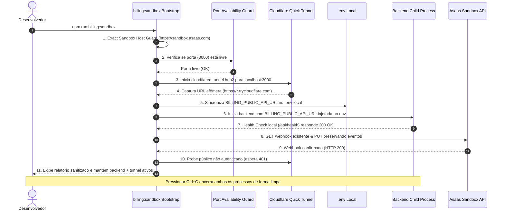

# Billing Sandbox Bootstrap 1.1 (Automação de Homologação Local)

## 1. Visão Geral e Propósito

O comando `npm run billing:sandbox` automatiza o provisionamento e a sincronização do túnel público (**Cloudflare Quick Tunnel**) com o gateway **Asaas Sandbox** e gerencia o ciclo de vida do processo do **Backend**, garantindo injeção atômica da variável `BILLING_PUBLIC_API_URL`.

Como o LouvAIO consome webhooks do Asaas e gera links de checkout hospedado com callbacks de retorno dinâmicos, o backend precisa conhecer sua URL pública atual no instante em que sobe. Como o Quick Tunnel (`*.trycloudflare.com`) gera um hostname efêmero a cada sessão, este script orquestra a detecção de porta, abertura do túnel, captura da URL, inicialização do backend como processo filho, sincronização do webhook do Asaas e execução de probes pré-voo de segurança.

> [!IMPORTANT]
> **O Bootstrap Gerencia o Processo do Backend**: Não inicie o backend separadamente antes do bootstrap. Se a porta (ex: `3000`) já estiver ocupada, o bootstrap aplicará **Fail-Closed** (`BACKEND_ALREADY_RUNNING_RESTART_REQUIRED`) para impedir que o backend execute com URLs desatualizadas.

---

## 2. Fluxo de Execução do Bootstrap (Ordem Canônica 1.1)



---

## 3. Pré-requisitos

1. **Binário `cloudflared`**:
   - Pode estar disponível no `PATH` do sistema, ou
   - Na pasta de usuário padrão (ex: `Downloads/cloudflared.exe` no Windows ou `~/Downloads/cloudflared` no Linux/macOS), ou
   - Configurado explicitamente no `.env` via `CLOUDFLARED_PATH="C:\\caminho\\cloudflared.exe"`.
2. **Ambiente Asaas Sandbox**:
   - `ASAAS_ENVIRONMENT="sandbox"`
   - `ASAAS_API_URL="https://sandbox.asaas.com/api/v3"` (ou `api-sandbox.asaas.com`)
   - `ASAAS_API_KEY` válida do Sandbox.
   - `ASAAS_WEBHOOK_TOKEN` configurado.

---

## 4. Como Executar

No diretório `backend/`:

```bash
npm run billing:sandbox
```

### Exemplo de Saída Sanitizada:

```text
====================================================
  LOUVAIO BILLING SANDBOX BOOTSTRAP 1.1
====================================================

[1/8] Ambiente Sandbox verificado e validado com URL oficial.
[2/8] Porta 3000 verificada e disponível.
[3/8] Binário cloudflared localizado: cloudflared.exe
[4/8] Iniciando Cloudflare Quick Tunnel (protocolo http2)...
[4/8] Quick Tunnel ativo com URL pública capturada.
[5/8] BILLING_PUBLIC_API_URL sincronizada no .env local.
[6/8] Iniciando processo do backend com a URL pública do túnel injetada...
[6/8] Backend iniciado e pronto em http://127.0.0.1:3000.
[7/8] Sincronizando webhook no Asaas Sandbox (preservando eventos existentes)...
[7/8] Webhook Sandbox sincronizado (ID: 0a021d27-57f6-41c4-a880-b85e0855827c, Eventos: 13).
[8/8] Executando testes pré-voo de validação de conectividade...

====================================================
       BILLING SANDBOX BOOTSTRAP 1.1 REPORT
====================================================
ASAAS ENVIRONMENT     : SANDBOX
PUBLIC URL            : https://example.trycloudflare.com
WEBHOOK URL           : MATCH
WEBHOOK AUTH          : configured / matching
WEBHOOK EVENTS PRESERVED : PASS (13 eventos)
PUBLIC ENDPOINT       : PASS (401 on unauthenticated)
BACKEND STATUS        : READY (child process ativo com URL atual)
====================================================

Ambiente de homologação ativo. Pressione Ctrl+C para encerrar o backend e o túnel.
```

---

## 5. Garantias de Segurança (Security Guards)

1. **Exact Sandbox Host Validation (Fail-Closed)**:
   - A validação realiza `new URL(apiUrl)` exigindo protocolo `https:` e hostname estrito pertencente a `ALLOWED_SANDBOX_HOSTNAMES` (`sandbox.asaas.com`, `api-sandbox.asaas.com`). Rejeita estritamente `api.asaas.com`, lookalikes (`sandbox.asaas.com.attacker.com`) e conexões inseguras (`http:`).
2. **Prevenção de Configuração Estagnada (Port Check)**:
   - Impede execução concorrente ou uso de backends pré-existentes que não tenham recebido a URL do túnel atual.
3. **Preservação do Cadastro de Webhooks (Webhook PUT Preservation)**:
   - Consulta o webhook existente no Asaas Sandbox antes de atualizar, mescla eventos existentes com a lista requerida e preserva metadados (`name`, `email`, `apiVersion`, `sendType`), alterando apenas a `url` pública e o `authToken`.
4. **Ciclo de Vida Controlado**:
   - Ao receber `SIGINT` (Ctrl+C) ou `SIGTERM`, encerra simultaneamente o processo filho do backend e do `cloudflared`, evitando processos órfãos na máquina.
5. **Zero Exposição de Segredos**:
   - `ASAAS_API_KEY`, `ASAAS_WEBHOOK_TOKEN` e segredos JWT são mascarados (`[REDACTED]`) em todas as saídas de terminal.
