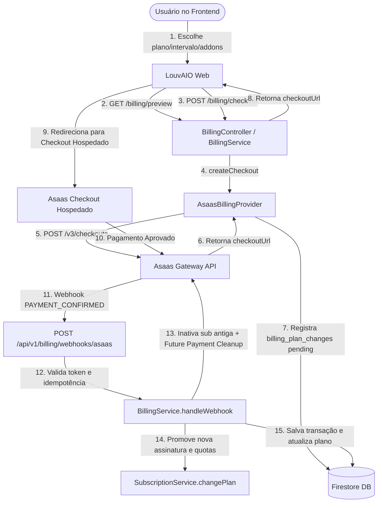

# LouvAIO — Arquitetura de Billing, Checkout e Assinaturas SaaS

Este documento descreve a arquitetura operacional e técnica da integração de pagamentos e assinaturas do **LouvAIO**, utilizando o gateway **Asaas** no padrão SaaS recorrente.

> [!NOTE]
> **Status de Homologação**: A integração está implementada com os fluxos principais homologados em ambiente **Sandbox do Asaas** (GAP-011 revalidado; Política V1 de transições agendadas aprovada via ADR 2026-09-01 com implementação pendente); deploy, credenciais e configurações de produção não devem ser presumidos.

---

## 1. Princípios Arquiteturais e Separação de Autoridade

A integração segue a regra fundamental de separação de autoridade:

- **Gateway de Pagamento (Asaas)**: Autoridade soberana sobre o **estado financeiro** (`payment state`). Gerencia processamento de cartão de crédito, emissão de faturas, retentativas de cobrança e conformidade PCI-DSS. Nenhuma informação confidencial de cartão de crédito (PAN, CVV, data de expiração) transita ou é armazenada nos servidores do LouvAIO.
- **LouvAIO Backend (`SubscriptionService`)**: Autoridade soberana sobre o **direito de uso do produto** (`product entitlement`) e aplicação de quotas operacionais (membros, músicas, limites de ministério).
- **Abstração Desacoplada (`BillingProvider`)**: O domínio da aplicação e as rotas de subscription interagem exclusivamente com a interface `BillingProvider`. Detalhes específicos de payload, endpoints e cabeçalhos do Asaas ficam isolados em `AsaasBillingProvider`.

---

## 2. Catálogo Oficial e Precificação Determinística

A fonte normativa dos planos e limites é `backend/src/config/plans.config.ts`. Todos os valores monetários são representados e calculados em **centavos inteiros (`cents`)** para evitar erros de precisão:

| Plano | Preço Mensal | Preço Anual (10% OFF) | Equiv. Mensal no Anual | Capacidade Base | Add-on de Membros |
| :--- | :--- | :--- | :--- | :--- | :--- |
| **Free** | R$ 0,00 (`0`) | R$ 0,00 (`0`) | R$ 0,00 | 10 membros / 50 músicas | Não permite |
| **Lite** | R$ 14,90 (`1490`) | R$ 160,92 (`16092`) | R$ 13,41 | 20 membros / 100 músicas | Não permite |
| **Lite+** | R$ 24,90 (`2490`) | R$ 268,92 (`26892`) | R$ 22,41 | 30 membros / 150 músicas | Não permite |
| **Essential** | R$ 34,90 (`3490`) | R$ 376,92 (`37692`) | R$ 31,41 | 40 membros / 200 músicas | +10 membros: R$ 9,90/mês (máx 4 blocos = 80 membros) |
| **Pro** | R$ 89,90 (`8990`) | R$ 970,92 (`97092`) | R$ 80,91 | 100 membros / 500 músicas | +10 membros: R$ 6,90/mês (máx 10 blocos = 200 membros) |
| **Premium** | R$ 214,90 (`21490`) | R$ 2.320,92 (`232092`) | R$ 193,41 | 300 membros / 1.500 músicas | Não necessita |

### Cálculo Determinístico do Desconto Anual
$$\text{Preço Anual} = \text{round}(\text{Preço Mensal} \times 12 \times 0.90)$$

---

## 3. Modelo de Dados no Firestore (5 Coleções de Billing)

### 1. `billing_customers`
Armazena o vínculo entre o `ministry_id` e o identificador do cliente no Asaas (`cus_...`):
- `id`: `${ministry_id}_${provider}`
- `ministry_id`: string
- `provider`: `'asaas'`
- `provider_customer_id`: string
- `created_at`, `updated_at`: timestamps ISO

### 2. `billing_subscriptions`
Armazena o estado da assinatura financeira recorrente ativa vigente com o gateway:
- `id`: `${ministry_id}_${provider}`
- `ministry_id`: string
- `provider`: `'asaas'`
- `provider_subscription_id`: string
- `plan_id`: `PlanId`
- `interval`: `'monthly' | 'annual'`
- `member_addon_blocks`: number
- `amount_cents`: number
- `status`: `'pending' | 'active' | 'past_due' | 'canceled'`
- `current_period_start`, `current_period_end`: timestamps ISO
- `cancel_at_period_end`: boolean
- `created_at`, `updated_at`: timestamps ISO

### 3. `billing_plan_changes` (Isolamento de Transições & Supersede)
Armazena intenções de checkout, upgrades, downgrades e trocas de plano pendentes sem sobrescrever a assinatura ativa vigente:
- `id`: `checkout_intent_id`
- `ministry_id`: string
- `provider`: `'asaas'`
- `checkout_intent_id`: string (enviado como `externalReference`)
- `provider_checkout_id`: string | null
- `requested_plan_id`: `PlanId`
- `requested_interval`: `'monthly' | 'annual'`
- `requested_addon_blocks`: number
- `expected_amount_cents`: number
- `checkout_url`: string
- `previous_provider_subscription_id`: string | null
- `new_provider_subscription_id`: string | null
- `status`: `'pending' | 'superseding' | 'completed' | 'expired' | 'canceled' | 'financial_attention_required'`
- `supersede_status`: `'not_applicable' | 'pending' | 'completed' | 'failed' | 'financial_attention_required'`
- `payment_cleanup_status`: `'not_applicable' | 'pending' | 'completed' | 'failed' | 'financial_attention_required'`
- `payment_cleanup_ids`: string[]
- `renewal_cutoff_date`: string | null (YYYY-MM-DD comercial)
- `financial_attention_required`: boolean
- `financial_attention_reason`: string | null
- `retry_locked_until`, `retry_locked_by`: string | null (lease multi-instância)
- `created_at`, `expires_at`, `updated_at`: timestamps ISO

### 4. `billing_transactions`
Histórico de cobranças e faturas processadas:
- `id`: `${provider}_${provider_payment_id}`
- `ministry_id`: string
- `provider`: `'asaas'`
- `provider_payment_id`: string
- `provider_subscription_id`: string | null
- `amount_cents`: number
- `currency`: `'BRL'`
- `status`: `'pending' | 'paid' | 'overdue' | 'refunded' | 'canceled' | 'failed'`
- `due_date`: string (YYYY-MM-DD)
- `paid_at`: timestamp ISO | null
- `payment_method`: `'CREDIT_CARD' | 'PIX' | 'BOLETO'`
- `invoice_url`: link da fatura / comprovante Asaas

### 5. `billing_webhook_events` (Idempotência Atômica)
Garante controle de concorrência e idempotência com lock transacional no Firestore:
- `id`: `${provider}_${provider_event_id}`
- `provider`: `'asaas'`
- `provider_event_id`: string
- `event_type`: string
- `processing_status`: `'processing' | 'processed' | 'failed' | 'ignored'`
- `received_at`, `processed_at`: timestamps ISO
- `payload_hash`: hash SHA-256 do payload

---

## 4. Ciclo de Vida do Webhook e Processamento Assíncrono

### Validação de Autenticidade Fail-Closed
`AsaasBillingProvider.validateWebhookRequest` verifica o header `asaas-access-token` contra `ASAAS_WEBHOOK_TOKEN` usando `crypto.timingSafeEqual`. Em caso de ausência ou divergência, a requisição é rejeitada imediatamente com HTTP 401.

### Idempotência Atômica Transacional
1. Ao receber um evento, `BillingRepository.registerWebhookEvent` executa uma transação Firestore sobre `${provider}_${provider_event_id}`.
2. Se o status for `processed` ou `ignored`, responde com HTTP 200 `{ status: 'ok', processed: false, reason: 'duplicate_event' }`.
3. Se 10 requisições idênticas chegarem simultaneamente, exatamente 1 adquire o status `processing`; as demais retornam resposta idempotente imediata.

### Mapeamento de Eventos e Ações de Domínio

| Evento Asaas | Ação do LouvAIO | Efeito na Assinatura |
| :--- | :--- | :--- |
| `CHECKOUT_PAID` | Atualiza vínculo de checkout | Registra `provider_checkout_id` e `provider_customer_id` na intenção em `billing_plan_changes`. |
| `SUBSCRIPTION_CREATED` / `UPDATED` | Vincula ID da recorrência | Salva `new_provider_subscription_id` na intenção em `billing_plan_changes`. |
| `PAYMENT_CONFIRMED` / `RECEIVED` | Confirmação do pagamento | Valida valor (`Amount Validation`), executa supersede da assinatura anterior (PUT INACTIVE), executa Future Payment Cleanup, promove a nova assinatura para `active` em `billing_subscriptions`, atualiza quotas no `SubscriptionService` e grava a transação paga. |
| `PAYMENT_OVERDUE` | Inadimplência | Atualiza status para `past_due` e inicia carência (`grace`) de 7 dias. Aplica out-of-order sequence guard para não degradar ciclos posteriores já pagos. |
| `SUBSCRIPTION_INACTIVATED` / `DELETED` | Encerramento de assinatura | Atualiza `billing_subscriptions` para `canceled` (ignorado se for evento de assinatura antiga já supersedida). |

---

## 5. Transições de Plano (Paid -> Paid) e Future Payment Cleanup

### Fluxo de Transição Isolada
1. **Intenção**: O checkout gera `billing_plan_changes` com status `pending`. A assinatura ativa vigente (`billing_subscriptions`) **continua intacta e ativa**.
2. **Confirmação**: Quando `PAYMENT_CONFIRMED` chega no webhook, o backend valida o valor pago (`Amount Validation`).
3. **Inativação da Assinatura Anterior**: O provider executa `PUT /v3/subscriptions/{oldSubId}` com `{ status: 'INACTIVE' }` no Asaas.
4. **Future Payment Cleanup (`cleanupFuturePaymentsFromPreviousSubscription`)**:
   - Calcula a data de corte comercial: `renewalCutoffDate = getBillingDate(currentPeriodEnd, config.billingTimezone)` (formato `YYYY-MM-DD`).
   - Consulta cobranças vinculadas à assinatura antiga via `listSubscriptionPayments(oldSubId, { status: 'PENDING' })`.
   - Remove **somente** cobranças que atendam cumulativamente:
     1. pertencem à assinatura antiga esperada (`payment.subscriptionId === oldSubId`);
     2. possuem status estritamente `PENDING`;
     3. possuem `dueDate >= renewalCutoffDate`.
   - Preserva estritamente cobranças `CONFIRMED`, `RECEIVED`, `OVERDUE` e `PENDING` com `dueDate < renewalCutoffDate` (ciclo anterior legítimo).
5. **Mitigação de Race Condition Financeira**:
   - Se o cancelamento no Asaas falhar e a cobrança futura tiver sido capturada/paga (`CONFIRMED`/`RECEIVED`) no intervalo, o backend **NÃO realiza estorno automático** nem deleção cega.
   - Marca `planChange.status = 'financial_attention_required'` e `planChange.financial_attention_reason`, notificando a equipe operacional para validação humana.
6. **Promoção**: Com supersede e cleanup concluídos, a nova assinatura é promovida em `billing_subscriptions` como `active` e os novos entitlements são aplicados no `SubscriptionService`.

---

## 6. Worker de Reconciliação em Background (`BillingReconcilerWorker`)

Para garantir resiliência contra falhas transitórias de rede durante o supersede ou cleanup:

- **Execução**: Instanciado no `server.ts`, roda no startup e em ciclos periódicos (`BILLING_RECONCILIATION_INTERVAL_MINUTES`, padrão 15 min).
- **Lease Multi-Instância**: Utiliza transação Firestore com `claimPlanChangeForRetry` (`retry_locked_until` de 60s e `retry_locked_by: workerId`), evitando que múltiplas réplicas da API processem a mesma transição concorrentemente.
- **Proteção de Testes**: Automaticamente desativado quando `NODE_ENV === 'test'` (`BILLING_RECONCILIATION_ENABLED` false).

---

## 7. Callback Bridge e Tratamento de Timezone

### Ponte Segura de Redirecionamento (Callback Bridge)
- O Asaas não aceita `localhost` como URL de retorno.
- O frontend `WEB_APP_URL` nunca é enviado diretamente ao gateway.
- O backend registra endpoints públicos próprios sob `BILLING_PUBLIC_API_URL`:
  - `successUrl`: `${BILLING_PUBLIC_API_URL}/api/v1/billing/checkout-return/success`
  - `cancelUrl`: `${BILLING_PUBLIC_API_URL}/api/v1/billing/checkout-return/cancel`
  - `expiredUrl`: `${BILLING_PUBLIC_API_URL}/api/v1/billing/checkout-return/expired`
- O controller valida o parâmetro `:status` em lista permitida (`['success', 'cancel', 'expired']`) e executa redirecionamento HTTP 302 seguro para `${WEB_APP_URL}/ministerio/plano?status=:status`.
- **Sem mutação**: A rota de retorno é um GET público somente de redirecionamento. Não altera quotas nem confirma pagamentos.

### Timezone Comercial (`BILLING_TIMEZONE`)
- Padrão: `'America/Sao_Paulo'`.
- Todas as datas de vencimento comercial (`dueDate`, `nextDueDate`, `renewalCutoffDate`) são calculadas via `backend/src/utils/billing-date.ts` usando `Intl.DateTimeFormat` no timezone configurado, evitando erros de virada de dia entre o UTC do servidor e o dia comercial local.

---

## 8. Cancelamento e Preservação Absoluta de Dados

1. **Cancelamento no Fim do Ciclo (`cancel_at_period_end`)**:
   - `BillingService.cancelSubscription` executa PUT `status: 'INACTIVE'` no Asaas, roda o cleanup de cobranças futuras PENDING e marca `cancel_at_period_end = true`.
   - O ministério mantém acesso total ao plano contratado até `current_period_end`.
   - O administrador pode reativar a qualquer momento antes do término (`reactivateSubscription`).
2. **Preservação de Dados**:
   - Nenhum membro, música, escala ou cifra é deletado em downgrades ou cancelamentos.
   - Caso o uso exceda a capacidade do novo plano (ex: 40 membros migrando para Free de 10 membros), o sistema ativa `accessMode = 'grace'` (7 dias) e em seguida `restricted_over_limit`, bloqueando apenas novas inclusões até regularização.

---

## 9. Concessões de Planos Cortesia (`Complimentary Plans`)

1. **Isolamento Total do Gateway**:
   - `subscription_mode = 'complimentary'` concede entitlements diretamente via `SubscriptionService.grantComplimentaryPlan`.
   - **Zero chamadas ao Asaas**: não cria cliente, não gera assinatura, não emite faturas/cobranças fake.
2. **Segurança de Produção**:
   - Em produção (`NODE_ENV === 'production'`), as rotas HTTP `/api/v1/admin/*` são bloqueadas com HTTP 403 Forbidden.
   - Concessões em produção operam exclusivamente via CLI seguro:
     `npx ts-node scripts/grant-complimentary.ts <ministryId> <planId> [grantedBy] [grantReason] [expiresInDays]`

---

## 10. Known Implementation Gaps (Billing)

1. **Same-Plan Interval Change & Transições de Assinatura (GAP-012)**:
   - *Regra desejada*: Transições de ciclo e trocas de plano Paid → Paid devem ser agendadas para `current_period_end` sem cobrança integral sobreposta antecipada (Política V1 — ADR 2026-09-01).
   - *Status atual*: **APPROVED DOMAIN POLICY — IMPLEMENTATION PENDING** (o reconhecimento de ciclo e interface foram validados em Sandbox, mas o fluxo de execução financeira requer reengenharia para agendamento em `current_period_end` e eliminação de cobranças integrais sobrepostas).

---

### Status de Gaps Resolvidos (Billing)

- **Asaas Customer Reuse (GAP-011) — CLOSED / SANDBOX REVALIDATED**:
  - *Invariante consolidado*: 1 Ministry + provider vincula-se a 1 registro canônico em `billing_customers` (`provider_customer_id`), com claim/lease atômico transacional contra concorrência e fallback de recuperação por `externalReference`.
  - *Comportamento homologado*: Checkouts subsequentes da mesma Ministry (incluindo transições Paid -> Paid) reutilizam estritamente o `provider_customer_id` existente sem criar novos clientes no Asaas.
  - *Preservação de histórico*: Customers legados de transações e assinaturas passadas são preservados integralmente sem deleções. Em caso de mismatch inequívoco, a assinatura financeira ativa vigente pode reconciliar o mapping canônico.
