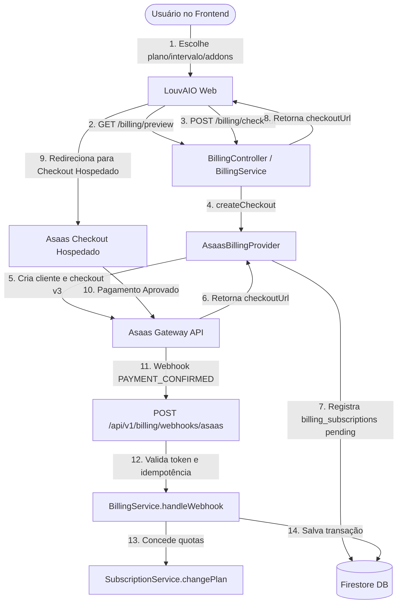

# LouvAIO — Arquitetura de Billing, Checkout e Assinaturas SaaS

Este documento descreve a arquitetura operacional e técnica da integração de pagamentos e assinaturas do **LouvAIO**, utilizando o gateway **Asaas** no padrão SaaS recorrente.

---

## 1. Princípios Arquiteturais e Separação de Autoridade

A integração segue a regra fundamental de separação de autoridade:

- **Gateway de Pagamento (Asaas)**: Autoridade soberana sobre o **estado financeiro** (`payment state`). Gerencia processamento de cartão de crédito, geração de QR Code Pix, emissão de boletos, faturas, retentativas de cobrança e conformidade PCI-DSS. Nenhuma informação confidencial de cartão de crédito (PAN, CVV, data de expiração) transita ou é armazenada nos servidores do LouvAIO.
- **LouvAIO Backend (`SubscriptionService`)**: Autoridade soberana sobre o **direito de uso do produto** (`product entitlement`) e aplicação de quotas operacionais (membros, músicas, limites de ministério).
- **Abstração Desacoplada (`BillingProvider`)**: O domínio da aplicação e as rotas de subscription interagem exclusivamente com a interface `BillingProvider`. Detalhes específicos de payload, endpoints e cabeçalhos do Asaas ficam isolados em `AsaasBillingProvider`, permitindo futura adição ou substituição de provedores (ex: Stripe, Mercado Pago) sem refatoração do domínio.



---

## 2. Catálogo Oficial e Precificação Determinística

Todos os valores monetários são representados e calculados em **centavos inteiros (`cents`)** para evitar erros de precisão de ponto flutuante:

| Plano | Preço Mensal | Preço Anual (10% OFF) | Equiv. Mensal no Anual | Capacidade Base | Add-on de Membros |
| :--- | :--- | :--- | :--- | :--- | :--- |
| **Free** | R$ 0,00 (`0`) | R$ 0,00 (`0`) | R$ 0,00 | 10 membros / 50 músicas | Não permite |
| **Lite** | R$ 14,90 (`1490`) | R$ 160,92 (`16092`) | R$ 13,41 | 20 membros / 100 músicas | Não permite |
| **Lite+** | R$ 24,90 (`2490`) | R$ 268,92 (`26892`) | R$ 22,41 | 30 membros / 150 músicas | Não permite |
| **Essential** | R$ 34,90 (`3490`) | R$ 376,92 (`37692`) | R$ 31,41 | 40 membros / 200 músicas | +10 membros: R$ 9,90/mês (máx 4 blocos = 80 membros) |
| **Pro** | R$ 89,90 (`8990`) | R$ 970,92 (`97092`) | R$ 80,91 | 100 membros / 500 músicas | +10 membros: R$ 6,90/mês (máx 10 blocos = 200 membros) |
| **Premium** | R$ 214,90 (`21490`) | R$ 2.320,92 (`232092`) | R$ 193,41 | 300 membros / 1.500 músicas | Não necessita |

### Cálculo Determinístico do Desconto Anual
O desconto de 10% no ciclo anual é calculado de forma exata por fórmula:
$$\text{Preço Anual} = \text{round}(\text{Preço Mensal} \times 12 \times 0.90)$$
Exemplo Pro: $\text{round}(8990 \times 12 \times 0.90) = \text{round}(97092.0) = 97092\text{ cents}$ (R$ 970,92).
Add-on Pro: $\text{round}(690 \times 12 \times 0.90) = \text{round}(7452.0) = 7452\text{ cents}$ (R$ 74,52/ano por bloco).

---

## 3. Modelo de Dados no Firestore

Para isolamento e persistência das operações de faturamento, foram criadas quatro coleções dedicadas:

### 1. `billing_customers`
Armazena o vínculo entre o `ministry_id` do LouvAIO e o identificador do cliente no Asaas (`cus_...`):
- `id`: `${ministry_id}_${provider}`
- `ministry_id`: string
- `provider`: `'asaas'`
- `provider_customer_id`: string
- `name`, `email`: dados cadastrais
- `created_at`, `updated_at`: timestamps ISO

### 2. `billing_subscriptions`
Armazena o estado do contrato recorrente com o gateway:
- `id`: `${ministry_id}_${provider}`
- `ministry_id`: string
- `provider`: `'asaas'`
- `provider_subscription_id`: string
- `plan_id`: `PlanId`
- `interval`: `'monthly' | 'annual'`
- `addon_blocks`: number
- `status`: `'pending' | 'active' | 'past_due' | 'canceled'`
- `current_period_start`, `current_period_end`: timestamps ISO
- `cancel_at_period_end`: boolean
- `created_at`, `updated_at`: timestamps ISO

### 3. `billing_transactions`
Histórico de cobranças, faturas e pagamentos realizados:
- `id`: `${provider}_${provider_payment_id}`
- `ministry_id`: string
- `provider`: `'asaas'`
- `provider_payment_id`: string
- `amount_cents`: number
- `currency`: `'BRL'`
- `status`: `'pending' | 'paid' | 'overdue' | 'refunded' | 'canceled' | 'failed'`
- `due_date`: string (YYYY-MM-DD)
- `paid_at`: timestamp ISO | null
- `payment_method`: `'CREDIT_CARD' | 'PIX' | 'BOLETO'`
- `invoice_url`: link da fatura / comprovante Asaas

### 4. `billing_webhook_events` (Idempotência)
Garante que eventos duplicados enviados pelo gateway não causem reprocessamento:
- `id`: `${provider}_${provider_event_id}`
- `provider`: `'asaas'`
- `provider_event_id`: string
- `event_type`: string (ex: `PAYMENT_CONFIRMED`)
- `status`: `'pending' | 'processed' | 'failed' | 'ignored'`
- `payload`: JSON do evento recebido
- `processed_at`: timestamp ISO

---

## 4. Ciclo de Vida do Webhook e Processamento Assíncrono

### Validação de Autenticidade
Ao receber requisições em `POST /api/v1/billing/webhooks/asaas`, o `AsaasBillingProvider.validateWebhookRequest` verifica se o cabeçalho `asaas-access-token` coincide exatamente com a chave `ASAAS_WEBHOOK_TOKEN` configurada em variáveis de ambiente.

### Idempotência
1. Ao receber um evento com ID `evt_123`, o sistema consulta a coleção `billing_webhook_events`.
2. Se o documento já existir com status `processed`, o backend responde imediatamente com status `200 OK` (`{ status: 'ok', processed: false, reason: 'Webhook already processed' }`) sem executar qualquer mutação no estado do ministério.
3. Se for novo, registra como `pending`, processa a mutação e atualiza para `processed`.

### Mapeamento de Eventos para Ações de Domínio

| Evento Asaas | Ação do LouvAIO | Efeito na Assinatura |
| :--- | :--- | :--- |
| `PAYMENT_CONFIRMED` / `PAYMENT_RECEIVED` | Ativação ou renovação do plano pago | Atualiza `SubscriptionRecord` para `active`, define novas quotas via `SubscriptionService.changePlan` e `changeMemberAddonBlocks`, estende `current_period_end` em 30 ou 365 dias, registra transação como `paid`. |
| `PAYMENT_OVERDUE` | Inadimplência / Pagamento atrasado | Atualiza `SubscriptionRecord` para `past_due`, ativa carência (`grace`) de 7 dias com `gracePeriodExpiresAt`. O ministério mantém acesso durante a carência; se não regularizado, entra em modo restrito (`restricted_over_limit`). |
| `SUBSCRIPTION_CANCELLED` / `SUBSCRIPTION_DELETED` | Cancelamento definitivo da assinatura | Atualiza `SubscriptionRecord` para `canceled`, altera plano para `free` sem exclusão de dados. |

---

## 5. Cancelamento e Downgrade com Preservação de Dados

1. **Cancelamento no Fim do Ciclo (`cancel_at_period_end`)**:
   - Quando o administrador solicita o cancelamento pelo painel, a assinatura é marcada com `cancel_at_period_end = true`.
   - O ministério continua usufruindo de todas as capacidades do plano pago contratado até a data de expiração de `current_period_end`.
   - O administrador pode clicar em **"Reativar Assinatura"** a qualquer momento antes do término do ciclo, revertendo `cancel_at_period_end = false`.
2. **Preservação Absoluta de Dados**:
   - Nenhum membro, música, escala, repertório ou cifra é deletado quando um plano sofre downgrade ou cancelamento.
   - Caso a quantidade de membros ou músicas do ministério exceda a capacidade do plano de destino (ex: ministério com 40 membros migrando para Free de 10 membros), o sistema ativa o `AccessMode = 'grace'` (7 dias) e em seguida `restricted_over_limit`, bloqueando novas inclusões até que o ministério reduza a utilização ou contrate um novo plano.

---

## 6. Concessões Manuais de Planos Cortesia (`Complimentary Plans`)

Para atender parcerias institucionais, convenções e beta testers sem criar dados falsos no gateway financeiro, o LouvAIO implementa o modo `subscription_mode = 'complimentary'`:

1. **Separação do Gateway**:
   - Concessões manuais **não criam cliente, assinatura, cobrança ou faturas no Asaas**.
   - Não há risco de inadimplência no gateway nem impacto nas métricas financeiras reais.
2. **Entitlements Oficiais**:
   - Concede exatamente a mesma capacidade do plano contratado (ex: Pro de 100 membros e 500 músicas, ou Premium de 300 membros e 1.500 músicas) via `PLANS_CATALOG`.
3. **Autoridade Restrita da Plataforma**:
   - Administradores ou membros de ministérios não podem auto-conceder cortesias.
   - Rotas `/api/v1/admin/ministries/:ministryId/complimentary/grant` e `/revoke` exigem autenticação via cabeçalho `x-platform-admin-secret` (`PLATFORM_ADMIN_SECRET`).
4. **Ciclo de Vida & Expiração**:
   - Suporte a expiração com prazo (`expires_at`) ou vitalícia (`expires_at = null`).
   - Se expirada, `resolveAccessMode` retorna automaticamente para `free` sem exclusão de dados (ativando carência caso a utilização exceda).
   - Se o ministério optar por contratar um plano pago, o checkout converte com segurança `subscription_mode = 'paid'`.

---

## 7. Hardening de Concorrência, Invariantes e Idempotência

1. **Idempotência Atômica Transacional**:
   - `BillingRepository.registerWebhookEvent` utiliza `db.runTransaction` com chave determinística `${provider}_${provider_event_id}`.
   - Se múltiplas requisições do mesmo evento chegarem em paralelo, apenas uma obtém o lock de escrita. As demais encerram com resposta de sucesso idempotente imediatamente.
2. **Proteção contra Double Checkout**:
   - `BillingService.createCheckout` verifica se existe uma sessão pendente recente (< 15 min) para o mesmo plano, intervalo e add-ons antes de chamar a API do Asaas.
   - Evita duplicidade de cobranças caso o usuário clique duas vezes no botão de assinar ou o frontend execute retentativas.
3. **Invariante de 1 Assinatura Ativa por Ministério**:
   - O documento em `billing_subscriptions` é indexado deterministicamente por `${ministryId}_${provider}`.
   - Ao confirmar um upgrade/downgrade, a assinatura anterior no gateway é cancelada para impedir recorrências concorrentes.
4. **Validação de Valor e Moeda (Amount Validation)**:
   - `handleWebhook` compara o valor em centavos recebido no webhook com o valor calculado via `calculatePlanPriceCents(planId, interval, addonBlocks)`.
   - Se houver divergência (ex: pagamento de R$ 14,90 para ativar plano Premium de R$ 214,90), o webhook é rejeitado e registrado como falha de segurança.
5. **Proteção contra Eventos Fora de Ordem**:
   - Eventos atrasados de `PAYMENT_OVERDUE` com data de vencimento anterior ao início do período ativo vigente são descartados com segurança.

---

## 8. Configuração e Variáveis de Ambiente

As configurações são gerenciadas através do `unifiedConfig.ts`:

```env
# Autoridade da Plataforma (Superadmin)
PLATFORM_ADMIN_SECRET="chave-secreta-louvaio-platform-superadmin-2026"

# Gateway de Pagamentos Asaas
ASAAS_API_URL="https://sandbox.asaas.com/api/v3"
ASAAS_API_KEY="$aact_YTU5YTE0M2M6N2Zl... (chave de API do Asaas)"
ASAAS_WEBHOOK_TOKEN="louvaio_asaas_secret_webhook_token_2026"
ASAAS_ENVIRONMENT="sandbox" # ou "production"
```

---

## 9. Segurança e Controle de Acesso (RBAC)

- Todas as rotas de checkout, preview, faturas e cancelamento sob `/api/v1/ministries/:ministryId/billing/*` exigem autenticação válida via token JWT e verificação de papel de administração (`requireMinistryRole('admin')`). Membros comuns do ministério têm acesso apenas a consultas.
- O endpoint de webhook `/api/v1/billing/webhooks/asaas` é protegido por verificação de token em tempo constante (`crypto.timingSafeEqual`).
- As rotas administrativas de concessão de cortesia `/api/v1/admin/ministries/:ministryId/complimentary/*` são protegidas por `requirePlatformAdmin`.

